# Pedagogika a sociální aspekty pedagogiky

### Přehled témat ke státní bakalářské zkoušce
### Učitelství praktického vyučování

<div style='page-break-after: always;'></div>

## Seznam otázek z PDF

Přehled témat ke státní bakalářské zkoušce
Učitelství praktického vyučování

Pedagogika a sociální aspekty pedagogiky

PES 1.

Charakterizujte pedagogiku jako vědu, popište pedagogické disciplíny, uveďte
významné informační zdroje pro studium pedagogiky a učitelskou praxi; vysvětlete
vztah mezi studiem pedagogických věd a výkonem profese učitele.

PES 2.

Vysvětlete pojem výchova v širším a užším smyslu; zaměřte se na roli výchovy při
formování osobnosti člověka, na její vztah k socializaci a ke kultuře; charakterizujte
výchovu jako cestu k sebevýchově.

PES 3.

Vysvětlete pojmy vzdělání a vzdělávání; popište roli školy ve vzdělávání; vysvětlete
pojmy vzdělávací systém a školská soustava; charakterizujte českou školskou soustavu;
objasněte pojem celoživotní učení. Popište mezinárodní klasifikaci stupňů ve vzdělávání
ISCED.

PES 4.

Charakterizujte profesi učitele, typologii učitele a vyučovacích stylů, vlastnosti
a předpoklady pro výkon práce učitele, charakterizujte pedagogickou komunikaci,
zaměřte se na možnosti kariérního vývoje a dalšího profesního vzdělávání
pedagogických pracovníků.

PES 5.

Vysvětlete význam J. A. Komenského pro dnešní pedagogiku a vzdělávání; představte
důležitá díla a hlavní myšlenky jeho pedagogické koncepce; uveďte možné aplikace
myšlenek J. A. Komenského pro současné vzdělávání.

PES 6.

Popište možnosti začlenění tématu trvale udržitelného rozvoje do obsahu výuky;
charakterizujte cíle, formy a metody environmentální výchovy; popište možné strategie
rozvoje vnímavosti žáků k životnímu prostředí v rámci školy.

PES 7.

Popište funkce školy, charakterizujte podpůrné sítě ve školství (úloha výchovných
a kariérových poradců). Zaměřte se na odborné školství, možnosti odborného
vzdělávání v kontextu se vzděláváním v EU.

PES 8.

Popište model procesu výuky, stručně vysvětlete pojmy učitel, žák, obsah výuky,
prostředí a vztahy mezi nimi; charakterizujte obvyklé fáze přípravy a realizace
vyučování; objasněte význam vnějších a vnitřních podmínek na efektivitu vyučování.


---

PES 9.

Vysvětlete pojem didaktická analýza obsahu, popište její fáze; charakterizujte kritéria
kvalitní výuky a efektivního učení, popište didaktické zásady.

PES 10. Vysvětlete pojem třídní management; popište role a úkoly učitele během vyučování;
uveďte možné scénáře vyučovací hodiny, vysvětlete smysl a návaznost jednotlivých fází.

PES 11. Popište fáze a důležitá témata ve vývoji pedagogického myšlení (antika, středověk,
počátek novověku a reformace, osvícenství); vysvětlete vznik tradičního pojetí
vzdělávání v 19. století (Herbart a herbartismus); uveďte souvislosti s dnešním
vzděláváním.

PES 12. Charakterizujte příčiny vzniku reformního pedagogického hnutí; uveďte znaky
alternativních škol, důležité představitele a směry; vysvětlete možnosti uplatnění
alternativních a inovativních prvků v dnešním vzdělávání.

PES 13. Vysvětlete pojem kurikulum; popište didaktickou transformaci obsahu, její fáze
a jednotlivé aktéry; zaměřte se na způsob stanovení kurikula v odborném vzdělávání.

PES 14. Charakterizujte transmisivní koncepci vzdělávání, její výhody a nevýhody; uveďte
příklady vhodných výukových strategií ve frontální výuce (slovní monologické metody,
názorně demonstrační metody, učení se z textu).

PES 15. Charakterizujte teorie vzdělávání zaměřené na psychologické aspekty procesu učení.
Vysvětlete pojem konstruktivimus, popište strategie podporující konstruktivismus ve
výuce.

PES 16. Charakterizujte pojem sebeřízené učení; vysvětlete význam zodpovědnosti žáka za
vlastní učení; popište cyklus sebeřízeného učení; uveďte možné strategie pro podporu
sebeřízení žáka ve výuce.

PES 17. Vysvětlete roli hodnocení a zpětné vazby v procesu učení; popište funkce školního
hodnocení; vysvětlete pojem formativní hodnocení.


---

PES 18. Vysvětlete pojem cíl; popište funkce cílů z hlediska plánování výuky a řízení učení žáka;
charakterizujte Bloomovu taxonomii cílů a na příkladech ilustrujte její použití.

PES 19. Popište historické počátky teorií vzdělávání zaměřených na osobnost žáka (například
J. J. Rousseau, snahy reformního pedagogického hnutí, M. Montessori, A. S. Neil
a antiautoritativní výchova, P. Grey a svobodné školy); uveďte možné výhody
a nevýhody pedocentrického pojetí výuky.

PES 20. Charakterizujte soudobé teorie vzdělávání zaměřené na osobnost žáka (C. Rogers,
A. Maslow, J. Holt aj.); popište principy a strategie nedirektivního přístupu ve výuce
a roli učitele jako poradce a partnera v učení; charakterizujte zdroje autority učitele
a možnosti budování vztahu se žáky.

PES 21. Popište pedagogické teorie vzdělávání zaměřené na sociální prostředí, zaměřte se na
význam školního sociálního prostředí pro učení a na využití vztahu školy a společnosti.
Vysvětlete pojmy sociálně angažovaná a kritická pedagogika, popište její cíle a možnosti
začlenění do výuky.

PES 22. Popište znaky skupinové a kooperativní výuky; vysvětlete pojem spolupráce a pozitivní
vzájemná závislost; charakterizujte význam skupiny v procesu učení; popište vhodné
strategie pro podporu kooperativní práce žáků; uveďte příklady přínosů kooperativní
výuky.

PES 23. Charakterizujte teorie vzdělávání zaměřené na činnost a zkušenost žáka. Vysvětlete
možnosti propojení praktických činností a teoretické výuky.

PES 24. Vysvětlete pojem zkušenostní učení podle D. Kolba; popište cyklus učení, jeho vazbu na
kognitivní styly žáka a možné scénáře přípravy vyučování.

PES 25. Vysvětlete pojem projektová výuka, popište historii a kořeny projektové metody, znaky
projektu, jeho využití ve výuce, možná pozitiva a negativa. Navrhněte příklady témat
vhodných pro projektovou výuku.

PES 26. Charakterizujte výchovu zaměřenou na formování charakteru a metody výchovy
k hodnotám.


---

PES 27. Vysvětlete pojem školní a třídní sociální klima; popište znaky bezpečného školního
prostředí a vhodné postupy, jak je možné jej budovat.

PES 28. Charakterizujte význam a využití diagnostiky v práci učitele (cíle a oblasti pedagogické
diagnostiky, možnosti a rizika využívání psychologické a speciálně pedagogické
diagnostiky / diagnóz v práci učitele). Popište diagnostický proces (fáze, volba metod
a technik sběru diagnostických údajů, zásady diagnostikování, rizika diagnostikování
žáka učitelem).

PES 29. Charakterizujte žáky se speciálními vzdělávacími potřebami a uveďte z praxe příklady
podpůrných opatření, která jsou jim podle aktuální školské legislativy ve vzdělávání na
středních školách poskytována.

PES 30. AKTM: Definujte, co jsou aktivizační metody, a vysvětlete jejich význam v edukačním
procesu. Popište třífázový model učení E-U-R. Charakterizujte 3 libovolné aktivizační
metody a popište jejich aplikaci v praxi (na vybraném tématu), včetně výhod a nevýhod
v edukaci.
SOCPED: Popište cíle a metody sociální pedagogiky, vysvětlete možnosti aplikace
sociálních témat v odborném vzdělávání v rámci vzdělávacích oblastí, průřezových
témat, klíčových kompetencí a v konkrétních předmětech.
PRERICH: Vyjmenujte nejčastější rizikové jevy, charakterizujte efektivní a neefektivní
primární prevenci, její dělení, příklady metod a pracovní náplň školního metodika
prevence.
PEDVOL: Popište systém zájmového vzdělávání, vysvětlete principy a metody
pedagogiky volného času, uveďte příklady programů zájmového vzdělávání pro žáky
středních škol.


---


<div style='page-break-after: always;'></div>

## Zpracované materiály

# PES 1–3: Pedagogika jako věda, výchova, vzdělávání a vzdělávací systém

> **TL;DR / Audio Shrnutí:**
> Pedagogika není jen „nauka o učení" — je to plnohodnotná společenská věda s vlastními disciplínami, metodami výzkumu a bohatou historií sahající až k Sokratovi. Výchova, vzdělávání a socializace jsou tři provázané, ale odlišné procesy, které společně formují člověka od narození až do smrti. Český vzdělávací systém je přitom zasazen do mezinárodního rámce ISCED, který umožňuje srovnávat školské soustavy celého světa. Porozumění těmto základním pilířům je nezbytný předpoklad pro každého, kdo chce učit — protože teprve když rozumíte „proč" a „jak" pedagogiky funguje, můžete kvalitně rozhodovat o „co" a „komu" ve své třídě.

---

## Znění státnicových otázek
- **[VOT]** **PES 1:** Charakteristika pedagogiky – popsat pedagogické disciplíny, uvést významné informační zdroje pro studium pedagogiky a učitelskou praxi, vysvětlit vztah mezi studiem pedagogických věd a výkonem profese učitele.
- **[VOT]** **PES 2:** Vysvětlete pojem výchova v širším a užším smyslu; zaměřte se na roli výchovy při formování osobnosti člověka, na její vztah k socializaci a ke kultuře; charakterizujte výchovu jako cestu k sebevýchově.
- **[VOT]** **PES 3:** Vysvětlete pojmy vzdělání a vzdělávání; popište roli školy ve vzdělávání; vysvětlete pojmy vzdělávací systém a školská soustava; charakterizujte českou školskou soustavu; objasněte pojem celoživotní učení. Popište mezinárodní klasifikaci stupňů ve vzdělávání ISCED.

---

## Klíčové pojmy

- **Pedagogika** — společenská věda o výchově a vzdělávání člověka; zkoumá zákonitosti výchovně-vzdělávacího procesu a formuluje doporučení pro praxi.
- **Výchova** — cílevědomé a záměrné vytváření podmínek pro optimální rozvoj jedince; podmnožina socializace, která je charakterizovaná **řízeností a záměrností**.
- **Vzdělávání** — proces získávání vědomostí, dovedností, návyků, schopností a postojů; je celoživotní a nikdy nekončící.
- **Vzdělání** — dosažená úroveň (výsledek vzdělávání); doložitelná kvalifikací (maturita, diplom).
- **Socializace** — komplexní proces, při němž se biologický tvor stává sociální bytostí; probíhá **neustále** (řízené i neřízené interakce).
- **Sebevýchova** — cílevědomé a dlouhodobé úsilí jedince o formování sebe samého k vytyčenému cíli.
- **ISCED** — International Standard Classification of Education; mezinárodní klasifikace stupňů vzdělávání umožňující srovnání mezi zeměmi.
- **Celoživotní učení** — koncept zahrnující formální, neformální i informální vzdělávání po celý život.
- **Školská soustava** — organizovaný systém škol a vzdělávacích institucí dané země od MŠ po VŠ.

---

## Detailní rozebrání problematiky

### PES 1: Pedagogika jako věda

#### Předmět a postavení pedagogiky
Pedagogika je **společenská (sociální) věda**, která se zabývá **výchovou a vzděláváním** člověka v celé jeho šíři. Název pochází z řeckého *paidagógos* (otrok doprovázející dítě do školy). Dnes je pedagogika chápána jako **věda interdisciplinární** — čerpá z psychologie, sociologie, filozofie, biologie i ekonomie.

Jako věda musí pedagogika splňovat tři základní kritéria:
1. **Má jasně vymezený předmět zkoumání** — výchovně-vzdělávací proces.
2. **Používá vlastní i přejaté vědecké metody** — pozorování, experiment, dotazník, rozhovor, analýza dokumentů, případová studie.
3. **Formuluje zákonitosti a teorie** — didaktické zásady, vývojové teorie učení.

#### Pedagogické disciplíny (podle původního členění)
1. **Obecná pedagogika:** definuje základní pojmy (výchova, vzdělávání), vymezuje předmět pedagogiky a základní teorie.
2. **Dějiny výchovy a vzdělávání:** studium vývoje školy, vzdělávací soustavy, obsahu, metod a významných osobností.
3. **Teorie výchovy:** shromažďuje teorie a východiska pro vysvětlení pedagogické praxe (např. vztah rodinné výchovy a výsledků).
4. **Metodologie pedagogického výzkumu:** popisuje, jak probíhá výzkum, jaké metody zjišťování se používají a jak tvořit závěry.
5. **Obecná didaktika:** teorie vyučování (popisuje učitele, žáka, obsah, metody, formy, hodnocení nezávisle na věku).
6. **Srovnávací (komparativní, mezinárodní) pedagogika:** srovnávání vzdělávacích soustav různých zemí a popis trendů.

#### Informační zdroje pro studium a praxi
Zdroje pro učitelskou praxi (knihovny, učebnice, odborná literatura, tematické plány, konzultace s kolegy) dělíme na **tištěné, elektronické a mikrografické** (mikrofilmy a mikrofiše).

**1. Knihy a brožury:**
- *Knižní monografie* – ověřené informace zpracovávající úzce vymezené téma.
- *Jednorázové sborníky* – soubor textů (např. z konferencí).
- *Encyklopedie, naučné a jazykové slovníky*.
- *Příručky* – názorně zachycují postupy a metody.
- *Učební texty* – sumarizační dokumenty, nevýhodou je občasná stručnost a zastarávání.

**2. Periodické publikace:** *Časopisy*, *Ročenky* (statistické, výroční zprávy) a *Noviny*.

**3. Speciální dokumenty:**
- *Normativní dokumenty* (zákony, vyhlášky).
- *Firemní či interní dokumenty*.
- *Kvalifikační práce* (diplomové, absolventské).
- *Rukopisy, patenty* a *Zapisované informace z ústního zdroje* (přednášky).

**4. Významné instituce a databáze:** Jednotná informační brána (JIB), Národní knihovna, Národní pedagogická knihovna Komenského (NPKK), MŠMT, NÚV, ČŠI, portál RVP.cz.

#### Vztah studia pedagogiky a profese učitele
Studium pedagogických věd poskytuje učiteli **teoretický rámec** pro porozumění procesům, které řídí. Bez teorie je praxe „slepá" (intuitivní, nekonzistentní), bez praxe je teorie „prázdná". Profesní příprava učitele zahrnuje tři složky:
1. **Odbornou** (předmětovou) — co učím
2. **Pedagogicko-psychologickou** — jak a proč učím
3. **Praktickou** (pedagogická praxe) — zkušenost z reálné výuky

---

### PES 2: Výchova, socializace a sebevýchova

#### Výchova v širším a užším smyslu

**Výchova v širším smyslu** zahrnuje veškeré cílevědomé formativní působení na člověka — zahrnuje jak vzdělávání (kognitivní rozvoj), tak výchovu v užším smyslu (formování postojů, hodnot, charakteru).

**Výchova v užším smyslu** se zaměřuje primárně na **formování osobnostních kvalit** — morálních vlastností, postojů, sociálních dovedností a hodnotové orientace.

> **Definice (Průcha):** Výchova je cílevědomé a záměrné vytváření a ovlivňování podmínek umožňujících optimální rozvoj každého jedince v souladu s individuálními dispozicemi a stimulujících jeho vlastní snahu stát se autentickou, vnitřně integrovanou a socializovanou osobností.

#### Výchova a její vztah k socializaci

| Aspekt | Socializace | Výchova |
|--------|-------------|---------|
| **Záměrnost** | Záměrná i nezáměrná | Vždy záměrná a cílevědomá |
| **Rozsah** | Celoživotní, prolíná všechny situace | Podmnožina socializace |
| **Aktéři** | Kdokoli (média, vrstevníci, společnost) | Vychovatel ↔ vychovávaný |
| **Cíl** | Začlenění do společnosti | Formování osobnosti k vytyčeným cílům |
| **Kontrola** | Často nekontrolovaná | Řízená, plánovitá |

Socializace je **přirozený, celoživotní proces** vrůstání jedince do společnosti. Výchova je její **řízený a záměrný úsek**. Prostřednictvím socializace se reprodukují sociální normy, hodnoty, role a komunikační vzorce.

#### Role výchovy při formování osobnosti
Výchova působí na všechny složky osobnosti:
- **Kognitivní** — rozvoj myšlení, vědomostí, poznávacích schopností
- **Afektivní** — formování citů, postojů, hodnotové orientace
- **Konativní (volní)** — rozvoj vůle, sebekázně, vytrvalosti
- **Sociální** — budování sociálních dovedností a kompetencí

#### Výchova a kultura
Výchova je vždy **kulturně podmíněna** — předává kulturní dědictví (jazyk, tradice, normy, hodnoty) z generace na generaci. Zároveň kulturu **spoluvytváří** tím, že připravuje jedince na její obohacování a transformaci.

#### Sebevýchova
Sebevýchova je **vrcholná forma výchovy** — jedinec přebírá odpovědnost za vlastní rozvoj. Předpokládá:
- Schopnost **sebereflexe** (znám své silné i slabé stránky)
- Stanovení **vlastních cílů** rozvoje
- **Vůli a disciplínu** k jejich dosahování
- Využití vlastních i zprostředkovaných zkušeností

Výchova je tedy **cesta k sebevýchově** — od vnější regulace k vnitřní autoregulaci.

---

### PES 3: Vzdělání, vzdělávání, školská soustava a ISCED

#### Vzdělání vs. vzdělávání

| Pojem | Charakteristika |
|-------|-----------------|
| **Vzdělávání** | **Proces** — získávání vědomostí, dovedností, návyků, schopností, postojů |
| **Vzdělání** | **Výsledek** — dosažená úroveň; doložitelná kvalifikací (vysvědčení, diplom) |

Vzdělání není oddělitelné od výchovy — každé kvalitní vzdělávání má i výchovnou dimenzi. Vzdělání je zároveň **záležitostí politickou** (stát stanovuje povinnou školní docházku, obsah vzdělávání, standardy).

#### Role školy
Škola plní v moderní společnosti **několik klíčových funkcí**:
1. **Kvalifikační** — předává vědomosti a dovednosti potřebné pro profesní uplatnění
2. **Socializační** — učí žáky žít ve společnosti, spolupracovat, řešit konflikty
3. **Integrační** — začleňuje jedince do společnosti bez ohledu na původ
4. **Selektivní** — hodnotí a třídí žáky podle výkonu (kontroverzní funkce)
5. **Ochranná (kuratelární)** — poskytuje bezpečné prostředí, chrání před rizikovými vlivy
6. **Personalizační** — podporuje rozvoj individuality každého žáka

#### Vzdělávací systém a školská soustava

**Vzdělávací systém** = soubor všech forem a institucí vzdělávání (školy, kurzy, e-learning, rekvalifikace...).

**Školská soustava** = organizovaná struktura škol a školských zařízení podle zákona.

**Klíčová legislativa ČR:**
- **Zákon č. 561/2004 Sb.** — Školský zákon (předškolní, základní, střední, vyšší odborné a jiné vzdělávání)
- **Zákon č. 563/2004 Sb.** — Zákon o pedagogických pracovnících
- **Zákon č. 111/1998 Sb.** — Zákon o vysokých školách

**Zřizovatelé škol:**
- **Obec/svazek obcí** → MŠ, ZŠ
- **Krajský úřad** → SŠ, gymnázia, konzervatoře
- **MŠMT/stát** → vybrané školy
- **Soukromé osoby, církve** → soukromé a církevní školy

#### Formy vzdělávání
| Forma | Charakteristika |
|-------|-----------------|
| **Denní** | Pravidelná docházka 5× týdně |
| **Večerní** | Obvykle po pracovní době |
| **Dálková** | Samostudium + konzultace 1–2× za 14 dní (200–220 h/rok) |
| **Distanční** | Pomocí ICT technologií |
| **Kombinovaná** | Kombinace výše uvedených forem |

#### Celoživotní učení (Lifelong Learning)

Celoživotní učení je **zastřešující koncept**, který zahrnuje veškeré učení během celého života:

- **Formální vzdělávání** — ve školách a institucích, zakončené certifikátem (vysvědčení, diplom)
- **Neformální vzdělávání** — organizované kurzy, semináře, školení mimo školskou soustavu (bez oficiálního stupně vzdělání)
- **Informální učení** — spontánní, každodenní učení ze zkušenosti, z médií, od druhých lidí

#### ISCED — Mezinárodní klasifikace stupňů vzdělávání

ISCED (International Standard Classification of Education) je klasifikace UNESCO umožňující **mezinárodní srovnávání** vzdělávacích systémů.

| Úroveň | Název | Český ekvivalent |
|---------|-------|-------------------|
| **ISCED 0** | Vzdělávání v raném dětství | MŠ (povinný předškolní rok) |
| **ISCED 1** | Primární vzdělání | 1.–5. ročník ZŠ |
| **ISCED 2** | Nižší sekundární vzdělání | 6.–9. ročník ZŠ / nižší gymnázium |
| **ISCED 3** | Vyšší sekundární vzdělání | SŠ, SOU, gymnázium, lyceum |
| **ISCED 4** | Postsekundární neterciární | Nástavbové studium |
| **ISCED 5** | Krátký cyklus terciárního | VOŠ |
| **ISCED 6** | Bakalářská úroveň | Bc. studium |
| **ISCED 7** | Magisterská úroveň | Mgr./Ing. studium |
| **ISCED 8** | Doktorská úroveň | Ph.D. studium |

**Povinná školní docházka v ČR:** 9 let (od 6 do 15 let, resp. do splnění 9 let docházky). Od 2017 je povinný i **poslední rok předškolního vzdělávání** (ISCED 0).

---

## Vizualizace

### Vztah výchovy, vzdělávání a socializace

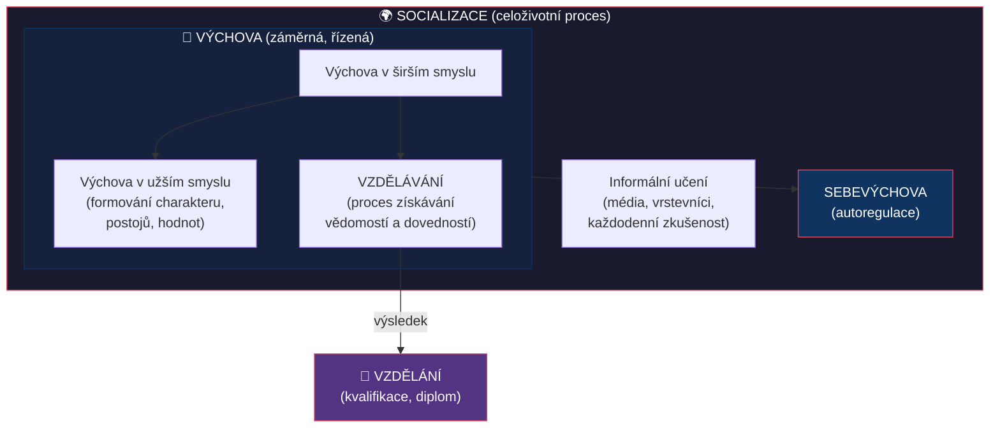

### Struktura ISCED a české školské soustavy

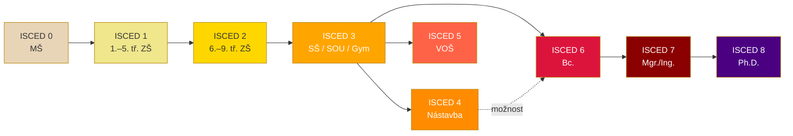

### Pedagogické disciplíny — mapa oboru

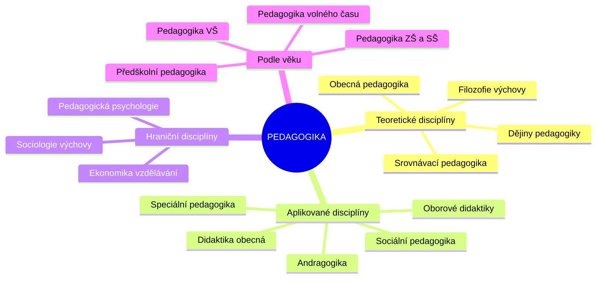

---

## Záludnosti a doplňující otázky

### ❓ 1. Jaký je rozdíl mezi socializací a výchovou? Může probíhat socializace bez výchovy a naopak?
**Odpověď:** Socializace probíhá **neustále** — i bez záměru (dítě se učí sledováním televize, interakcí s vrstevníky). Výchova je vždy **záměrná a řízená** podmnožina socializace. Socializace bez výchovy existuje (informální učení na ulici). Výchova bez socializace neexistuje — protože výchova je jedním z mechanismů socializace.

### ❓ 2. Co je to „obrácená socializace" a proč je dnes aktuální?
**Odpověď:** Obrácená (reverzní) socializace nastává, když **mladší generace ovlivňuje a „učí" starší** — typicky v oblasti technologií (dítě učí rodiče používat smartphone). V kontextu rychlého technologického vývoje a digitalizace je tento fenomén stále častější a mění tradiční dynamiku vychovatel–vychovávaný.

### ❓ 3. Proč nestačí rozlišovat vzdělání jen podle ISCED úrovně? Co dalšího je potřeba zohlednit?
**Odpověď:** ISCED klasifikuje pouze **stupeň** vzdělání, nikoli jeho **kvalitu, obor nebo zaměření**. Dvě osoby s ISCED 6 (Bc.) mohou mít zcela odlišné kompetence. Proto ISCED doplňuje klasifikace **ISCED-F** (Fields of Education — obory vzdělávání). Navíc ISCED nezachycuje **informální a neformální učení**, které může mít pro praxi větší význam než formální kvalifikace.


<div style='page-break-after: always;'></div>

# PES 4–5: Profese učitele a odkaz J. A. Komenského

> **TL;DR / Audio Shrnutí:**
> Učitelství není pouhé zaměstnání — je to profese s vlastním etickým kodexem, kvalifikačními požadavky a třemi základními vyučovacími styly (autoritativní, liberální, demokratický). Každý učitel vstupuje do třídy s jedinečnou kombinací osobnostních předpokladů, od pedagogického taktu přes optimismus až po odbornou připravenost. A nad tím vším stojí odkaz Jana Amose Komenského — muže, který před 400 lety zformuloval principy, které dodnes tvoří páteř moderní didaktiky: názornost, systematičnost, přiměřenost a přesvědčení, že vzdělání patří všem. Jeho myšlenky nejsou historická kuriozita, ale živý návod pro každého, kdo dnes stojí před třídou.

---

## Znění státnicových otázek
- **[DOB, VOT]** **PES 4:** Charakterizujte profesi učitele, typologii učitele a vyučovacích stylů, vlastnosti a předpoklady pro výkon práce učitele, charakterizujte pedagogickou komunikaci, zaměřte se na možnosti kariérního vývoje a dalšího profesního vzdělávání pedagogických pracovníků.
- **[VOT]** **PES 5:** Vysvětlete význam J. A. Komenského pro dnešní pedagogiku a vzdělávání; představte důležitá díla a hlavní myšlenky jeho pedagogické koncepce; uveďte možné aplikace myšlenek J. A. Komenského pro současné vzdělávání.

---

## Klíčové pojmy

- **Profese učitele** — práce vyžadující odborné znalosti, specifickou přípravu, kvalifikační kritéria a etický kodex; učitel je odpovědný za svůj profesní výkon vůči žákům.
- **Vyučovací styl** — převládající způsob interakce učitele s žáky; závisí na osobnostních rysech, zkušenostech a filozofii výchovy.
- **Pedagogický takt** — schopnost respektovat žákovu osobnost při zachování náročnosti a důslednosti.
- **Pedagogická komunikace** — vzájemná výměna informací ve výchovně-vzdělávacím procesu jazykovými i nejazykovými prostředky.
- **Kariérní řád učitele** — systém profesního růstu pedagogických pracovníků (adaptační období → praxe → mentor/metodik).
- **Pansofie** — Komenského koncept „vševědy"; přesvědčení, že veškeré poznání tvoří harmonický celek.
- **Didaktické zásady** — obecné principy vyučování formulované Komenským (názornost, systematičnost, přiměřenost aj.).

---

## Detailní rozebrání problematiky

### PES 4: Profese učitele

#### Učitelství jako profese
Profese se od běžného zaměstnání liší v několika kritériích:
- **Jasně vymezený soubor odborných znalostí a dovedností** založený na vědeckých poznatcích
- **Kvalifikační požadavky** pro vstup (pedagogické vzdělání, zákon 563/2004 Sb.)
- **Etický kodex** — morální odpovědnost vůči žákům, rodičům, společnosti
- **Autonomie v rozhodování** — učitel volí metody, přístupy, hodnotí
- **Celoživotní profesní rozvoj** — povinnost dalšího vzdělávání

#### Typologie učitele — tři vyučovací styly

**1. Autoritativní (dominantní) styl**
- Převažují příkazy, hrozby, tresty; málo respektuje potřeby žáků
- Nepřipouští diskuzi, vyžaduje doslovnou reprodukci
- **Výsledek:** Vysoký výkon jen pod kontrolou; u slabších žáků → submisivita, u silných → agresivita
- **Riziko:** Potlačení tvořivosti a iniciativy žáků

**2. Liberální (nezasahující) styl**
- Řídí málo nebo vůbec; užívá neosobní výzvy („mělo by se...")
- Často z nejistoty nebo snahy vyhnout se chybám autoritativního přístupu
- **Výsledek:** Žáci jsou nejistí, chaotické reakce, nedosahují potenciálu
- **Riziko:** Chybí normy a organizace nezbytná pro formování charakteru

**3. Demokratický (integrační) styl**
- Dostatek kontroly + prostor pro iniciativu, samostatnost a tvořivost
- Sankce uplatňovány vyváženě a spravedlivě; třída má přehled o postupu k cíli
- **Výsledek:** Psychosociálně zralá osobnost žáka; nejlepší pro rozvoj kolektivu
- **Poznámka:** Nejtěžší styl — vyžaduje sebereflexi a neustálé učení se

#### Vlastnosti a předpoklady učitele

| Předpoklad | Popis |
|-----------|-------|
| **Pedagogický takt** | Respektování žáka + klidné a otevřené jednání + náročnost a důslednost |
| **Pedagogický klid** | Soustředěná, klidná práce; odolnost vůči provokacím |
| **Pedagogický optimismus** | Víra v účinnost svého působení a ve schopnosti žáka |
| **Pedagogická připravenost** | Odborné i pedagogické vědomosti + praktická zkušenost |
| **Pedagogické zaujetí** | Citově kladný a aktivní přístup k žákům a vlastní práci |
| **Tvůrčí práce** | Nespokojit se se stávající úrovní; inovovat a zlepšovat |
| **Morální postoj** | Osobnost učitele jako nejsilnější nástroj pozitivního ovlivňování |
| **Přístup k žákům** | Snaha poznat schopnosti žáků, odhalovat jejich potřeby a řešit jejich problémy |
| **Spravedlivý přístup** | Jednotné hodnocení všech žáků; odolnost vůči intervencím |

#### Pedagogická komunikace
- **Verbální** — řeč, kladení otázek, vysvětlování, instrukce
- **Neverbální** — mimika, gesta, proxemika (vzdálenost), haptika (dotek), posturologie (postoj těla)
- **Paralingvistika** — tón hlasu, tempo řeči, pauzy, intonace
- Optimální komunikace plní **pedagogické funkce**: motivuje, informuje, organizuje, hodnotí

#### Kariérní vývoj a další vzdělávání
Systém dalšího vzdělávání pedagogických pracovníků (DVPP):
- **Průběžné vzdělávání** — povinnost po celou dobu pedagogické činnosti
- **Kvalifikační studium** — rozšíření nebo zvýšení kvalifikace (CŽV na VŠ)
- **Funkční studium** — pro vedoucí pracovníky (ředitele, zástupce)
- **Specializační studium** — výchovný poradce, metodik prevence, koordinátor ŠVP, mentor

**Kariérní systém (novelizace 2024+):**
- **Adaptační období** (2 roky) — začínající učitel pod vedením uvádějícího učitele
- **Samostatný učitel** — plně kvalifikovaný pedagog
- **Vyšší kariérní stupně** — mentor, metodik, lektor DVPP

---

### PES 5: Jan Amos Komenský

#### Životní kontext
- **1592–1670**, poslední biskup Jednoty bratrské
- Celý život ovlivněn třicetiletou válkou; exulant (Lešno, Blatný Potok, Amsterdam)
- Přízvisko **„Učitel národů"** (Teacher of Nations)
- Zakladatel **moderní pedagogiky** — jako první systematicky zpracoval teorii vyučování

#### Klíčová díla

| Dílo | Rok | Význam |
|------|-----|--------|
| **Didactica magna** (Velká didaktika) | 1657 | Ucelená teorie vyučování — „umění učit všechny všemu" |
| **Orbis sensualium pictus** | 1658 | První ilustrovaná učebnice na světě — princip názornosti |
| **Janua linguarum reserata** (Brána jazyků otevřená) | 1631 | Revoluční metoda výuky jazyků přes věcný obsah |
| **Informatorium školy mateřské** | 1633 | Průkopnické dílo o předškolní výchově |
| **Schola ludus** (Škola hrou) | 1654 | Dramatizace ve výuce; učení hrou |
| **Obecná porada o nápravě věcí lidských** | nedokončeno | Velkolepý plán celosvětové reformy společnosti skrze vzdělání |

#### Hlavní pedagogické myšlenky

**1. Vzdělání pro všechny (demokratizace)**
- „Všichni mají být vzděláváni ve všem" — bez rozdílu pohlaví, původu, majetku
- Revoluční myšlenka v 17. století; předjímá moderní inkluzivní vzdělávání

**2. Didaktické zásady**
Komenský formuloval zásady, které platí dodnes:
- **Zásada názornosti** — „Nic není v rozumu, co nebylo dříve ve smyslech"; učení skrze přímou zkušenost
- **Zásada systematičnosti a posloupnosti** — od jednoduchého ke složitému, od známého k neznámému
- **Zásada přiměřenosti** — obsah a metody přizpůsobené věku a schopnostem žáka
- **Zásada aktivnosti** — žák se má učit vlastní činností, ne pouhým posloucháním
- **Zásada trvalosti** — opakování, procvičování, propojení teorie s praxí

**3. Koncept školy rozčleněné podle věku**
Komenský navrhl **čtyřstupňový systém:**
- **Škola mateřská** (0–6 let) — v rodině, pod vedením matky
- **Škola obecná** (6–12 let) — čtení, psaní, počítání, náboženství, mravní výchova
- **Škola latinská / gymnázium** (12–18 let) — sedmero svobodných umění, jazyky
- **Akademie** (18–24 let) — univerzitní studium, specializace

**4. Učitel jako „slunce" vzdělávání**
- Učitel má být vzdělaný, trpělivý, spravedlivý
- Má učit s radostí a nadšením — „Škola nemá být mučírnou, ale dílnou lidskosti"

**5. Škola jako „dílna lidskosti" (officina humanitatis)**
- Vzdělání není cíl sám o sobě — je **nástrojem nápravy společnosti**
- Pouze vzděláním se mohou rozvíjet kvality člověka

#### Aplikace myšlenek Komenského v současném vzdělávání

| Komenského princip | Současná aplikace |
|--------------------|-------------------|
| Názornost | Multimediální výuka, simulace, laboratorní pokusy, exkurze |
| Systematičnost | Strukturované kurikulum, spirálové uspořádání učiva |
| Přiměřenost | Diferenciace a individualizace výuky; IVP pro žáky se SVP |
| Aktivnost žáka | Aktivizační metody, projektová výuka, badatelské učení |
| Škola hrou | Gamifikace, didaktické hry, dramatická výchova |
| Vzdělání pro všechny | Inkluzivní vzdělávání, rovný přístup, antidiskriminace |
| Celoživotní vzdělávání | Koncept LLL; Komenský předjímal ideu, že se člověk učí celý život |

---

## Vizualizace

### Tři vyučovací styly — porovnání

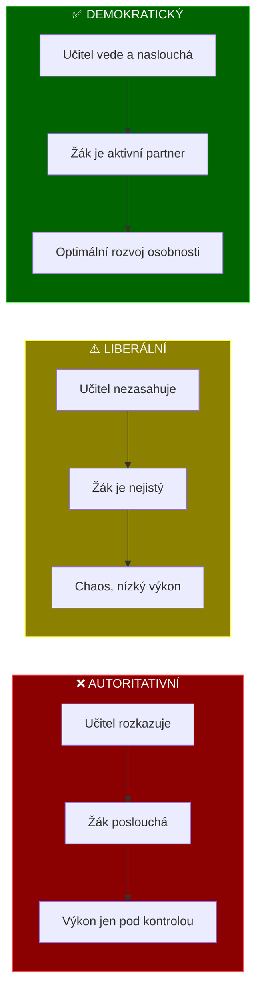

### Komenského vzdělávací systém vs. současný

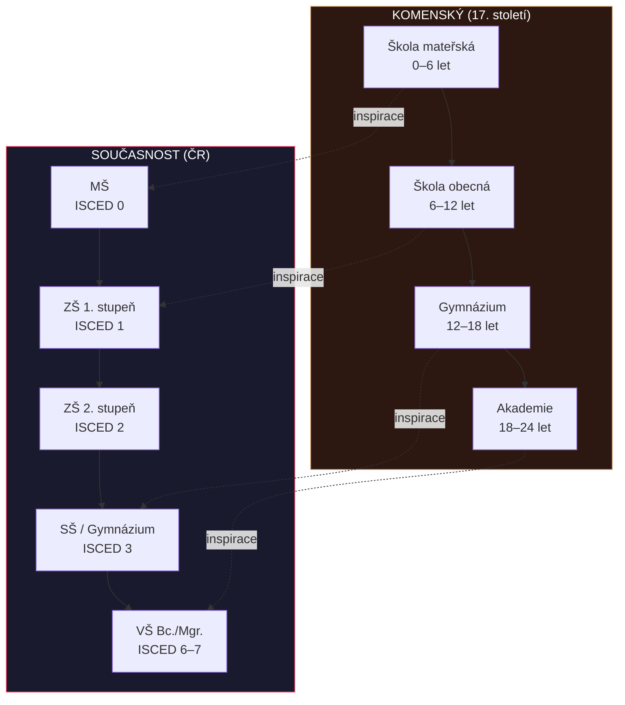

### Didaktické zásady — mindmapa

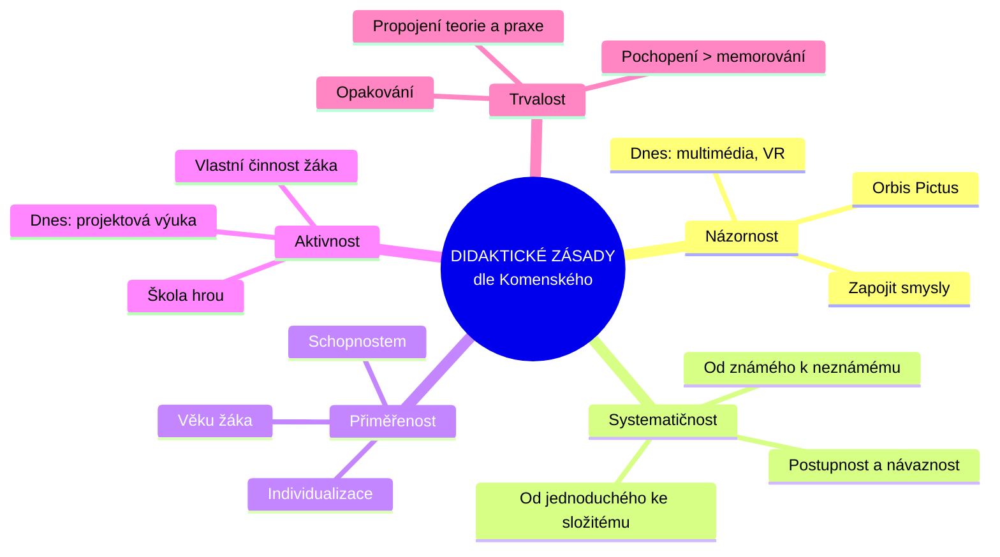

---

## Záludnosti a doplňující otázky

### ❓ 1. Je demokratický styl vždy nejlepší? Existují situace, kdy je vhodný autoritativní přístup?
**Odpověď:** Demokratický styl je obecně nejúčinnější pro rozvoj žáka, ale nejde aplikovat dogmaticky. V **krizových situacích** (BOZP, nebezpečí, akutní kázeňský problém) je autoritativní zásah nezbytný. Také u **velmi malých dětí** nebo v počátečních fázích nácviku složitých dovedností (např. bezpečnost u strojů v OV) je direktivní vedení opodstatněné. Klíčem je **flexibilita** — dobrý učitel umí přepínat mezi styly podle kontextu.

### ❓ 2. Proč je Komenský relevantní i v 21. století? Není jeho odkaz zastaralý?
**Odpověď:** Komenského principy jsou **nadčasové**, protože vycházejí z podstaty lidského poznávání (učení smysly, aktivním zapojením, v logické posloupnosti). Moderní neurověda potvrzuje to, co Komenský intuitivně popsal: multisenzorické učení je efektivnější, motivace zvyšuje retenci, přiměřená náročnost podporuje flow state. Navíc jeho myšlenka vzdělání pro všechny je stále nedokončeným projektem (inkluzivní vzdělávání, digitální propast, rovný přístup).

### ❓ 3. Jaký je rozdíl mezi vyučovacím stylem a vyučovací metodou?
**Odpověď:** **Vyučovací styl** je celkový přístup učitele k interakci se žáky — je relativně stabilní a odráží osobnost učitele (autoritativní/liberální/demokratický). **Vyučovací metoda** je konkrétní postup k dosažení výukového cíle (výklad, diskuze, demonstrace, skupinová práce). Jeden učitel může v rámci svého demokratického stylu používat různé metody. Styl je „jak jsem", metoda je „co dělám v dané hodině".


<div style='page-break-after: always;'></div>

# PES 6–7: Environmentální výchova, funkce školy a odborné školství

> **TL;DR / Audio Shrnutí:**
> Environmentální výchova není jen „třídění odpadu ve škole" — je to systematický přístup k budování ekologické gramotnosti žáků, který prostupuje celým kurikulem jako průřezové téma. Učitel odborného předmětu má přitom unikátní pozici: může žákům ukázat konkrétní dopady jejich budoucí profese na životní prostředí. Škola jako taková plní v moderní společnosti šest klíčových funkcí — od kvalifikační přes socializační až po ochrannou. V odborném školství pak hraje zásadní roli propojení s trhem práce, systém podpůrných poradenských sítí a harmonizace s evropskými standardy (EQF, ECVET, Europass). Pochopení těchto souvislostí je klíčem k tomu, aby učitel nebyl jen „předavač informací", ale aktivní spolutvůrce vzdělávacího ekosystému.

---

## Znění státnicových otázek
- **[DYT, VOT]** **PES 6:** Popište možnosti začlenění tématu trvale udržitelného rozvoje do obsahu výuky; charakterizujte cíle, formy a metody environmentální výchovy; popište možné strategie rozvoje vnímavosti žáků k životnímu prostředí v rámci školy.
- **[VOT]** **PES 7:** Popište funkce školy, charakterizujte podpůrné sítě ve školství (úloha výchovných a kariérových poradců). Zaměřte se na odborné školství, možnosti odborného vzdělávání v kontextu se vzděláváním v EU.

---

## Klíčové pojmy

- **Environmentální výchova (EV)** — průřezové téma RVP zaměřené na rozvoj vnímavosti k životnímu prostředí, pochopení ekologických souvislostí a odpovědného chování.
- **Trvale udržitelný rozvoj (TUR / SDGs)** — rozvoj uspokojující potřeby současnosti bez ohrožení schopnosti budoucích generací uspokojovat své potřeby (def. Brundtlandová, 1987).
- **Průřezové téma** — téma, které se nepřiděluje jednomu předmětu, ale prostupuje celým kurikulem (EV, Mediální výchova, OSVP, Výchova k myšlení v evropských a globálních souvislostech aj.).
- **Výchovný poradce** — pedagog se specializačním studiem, zajišťuje kariérové a výchovné poradenství na škole.
- **Kariérový poradce** — pomáhá žákům s volbou dalšího vzdělávání a profesní orientací.
- **Školní metodik prevence** — koordinuje prevenci rizikového chování na škole.
- **EQF (European Qualifications Framework)** — Evropský rámec kvalifikací; 8 úrovní pro srovnání kvalifikací v EU.
- **ECVET** — Evropský systém kreditů pro odborné vzdělávání a přípravu.
- **Europass** — soubor dokumentů pro transparentní prezentaci kvalifikací v EU.

---

## Detailní rozebrání problematiky

### PES 6: Environmentální výchova a udržitelný rozvoj

#### Začlenění tématu udržitelného rozvoje do výuky

Environmentální výchova je v RVP zakotvena jako **průřezové téma** — nemá vlastní předmět, ale prolíná se všemi vzdělávacími oblastmi. Učitel odborných předmětů má přitom výjimečnou příležitost propojit environmentální tématiku s **konkrétní profesní praxí** žáků.

**Způsoby začlenění:**
1. **Integrace do odborných předmětů** — ekologické aspekty výrobních procesů, úspora materiálu, recyklace odpadů, energetická efektivita
2. **Projektová výuka** — ekologický audit školy/pracoviště, uhlíková stopa výrobku
3. **Exkurze** — čistírny odpadních vod, recyklační centra, ekologické farmy, solární/větrné elektrárny
4. **Školní akce** — Den Země, třídění odpadu, školní zahrada, kompostování
5. **Mezipředmětové vztahy** — propojení přírodovědných, technických a ekonomických předmětů

#### Cíle environmentální výchovy

| Úroveň | Cíl |
|---------|-----|
| **Znalosti** | Pochopení ekologických zákonitostí, příčin a důsledků environmentálních problémů |
| **Postoje** | Utváření odpovědného vztahu k přírodě a životnímu prostředí |
| **Dovednosti** | Schopnost posoudit ekologický dopad činností; kompetence k jednání pro udržitelnost |
| **Hodnoty** | Internalizace principů udržitelného rozvoje jako osobní hodnoty |

#### Formy a metody environmentální výchovy

**Formy:**
- Vyučovací hodina s ekologickým obsahem
- Terénní výuka a pobyt v přírodě
- Projektové dny/týdny
- Spolupráce s ekocentry a NNO (TEREZA, Ekocentrum Koniklec aj.)
- Školní ekotým (Eco-Schools / Ekoškola)

**Metody:**
- **Badatelsky orientovaná výuka** — žáci sami zkoumají environmentální problémy
- **Simulace a modelové situace** — rozhodování o využití přírodních zdrojů
- **Diskuze a debaty** — kontroverzní environmentální témata (jaderná energetika, GMO)
- **Práce s daty** — analýza spotřeby energie, vodní stopy, statistik znečištění
- **Terénní cvičení** — monitoring kvality vody/ovzduší, mapování biodiverzity

#### Strategie rozvoje vnímavosti žáků
1. **Přímý kontakt s přírodou** — nelze budovat vztah k něčemu, co žák nezná
2. **Osobní příklad učitele** — autentické ekologické chování
3. **Propojení s praxí** — „Co mohu já dělat jinak ve své profesi?"
4. **Pozitivní motivace** — ne strašení katastrofami, ale ukazování řešení
5. **Zapojení žáků do rozhodování** — participace na ekologických projektech školy

---

### PES 7: Funkce školy, podpůrné sítě a odborné školství

#### Funkce školy v moderní společnosti

| Funkce | Popis |
|--------|-------|
| **1. Kvalifikační** | Předává vědomosti, dovednosti a kompetence pro profesní uplatnění |
| **2. Socializační** | Učí žáky žít ve společnosti, spolupracovat, dodržovat normy |
| **3. Integrační** | Začleňuje jedince bez ohledu na sociální, etnický či zdravotní původ |
| **4. Selektivní** | Třídí žáky podle výkonu (klasifikace, přijímací řízení) — kontroverzní |
| **5. Ochranná (kuratelární)** | Zajišťuje bezpečné prostředí; chrání před rizikovými vlivy |
| **6. Personalizační** | Rozvíjí individualitu a jedinečný potenciál každého žáka |

#### Podpůrné sítě ve školství — školní poradenské pracoviště (ŠPP)

Na každé škole působí **školní poradenské pracoviště**, které tvoří:

**Výchovný poradce**
- Povinně na každé škole
- Koordinuje péči o žáky se SVP a žáky nadané
- Kariérové poradenství (volba SŠ/VŠ)
- Spolupráce s PPP, SPC a OSPOD
- Vyžaduje specializační studium (250 h)

**Školní metodik prevence**
- Koordinuje Minimální preventivní program školy
- Prevence rizikového chování (šikana, závislosti, kriminalita)
- Spolupráce s centry primární prevence
- Vzdělávání pedagogického sboru v oblasti prevence

**Školní psycholog / Školní speciální pedagog** (nepovinné, ale žádoucí)
- Přímá diagnostická a intervenční práce s žáky
- Individuální i skupinové poradenství
- Podpora učitelů v práci se žáky se SVP

**Externí spolupráce:**
- **PPP** (pedagogicko-psychologická poradna) — diagnostika, doporučení podpůrných opatření
- **SPC** (speciálně pedagogické centrum) — pro žáky s konkrétním typem postižení
- **OSPOD** — orgán sociálně-právní ochrany dětí
- **SVP** (středisko výchovné péče) — pro žáky s poruchami chování

#### Odborné školství v ČR

**Typy středních odborných škol:**
- **SOŠ** — zakončeno maturitní zkouškou (ISCED 3A)
- **SOU** — zakončeno výučním listem (ISCED 3C) nebo maturitou
- **Nástavbové studium** — pro absolventy učebních oborů → maturita (ISCED 4)

**Specifika odborného vzdělávání:**
- Důraz na **praktické vyučování** (odborný výcvik, praxe)
- Propojení s **reálným pracovním prostředím** (firmy, dílny)
- Výuka dle **ŠVP** zpracovaného podle **RVP** pro daný obor
- Klíčové kompetence + odborné kompetence

#### Odborné vzdělávání v kontextu EU

| Nástroj | Funkce |
|---------|--------|
| **EQF** (Evropský rámec kvalifikací) | 8 úrovní kvalifikací pro srovnání napříč EU; české „Národní soustava kvalifikací" (NSK) je na EQF navázána |
| **ECVET** | Kreditní systém pro odborné vzdělávání — umožňuje uznávání výsledků učení získaných v zahraničí |
| **Europass** | Soubor dokumentů (životopis, jazykový pas, dodatek k osvědčení) pro transparentní prezentaci kvalifikací |
| **Erasmus+** | Program EU pro mobility žáků a učitelů; stáže v zahraničí |
| **Kodaňský proces** | Iniciativa EU pro posílení kvality a atraktivity odborného vzdělávání |

**Duální vzdělávání** — model, kde žák tráví část studia ve škole a část v reálném podniku. V ČR pilotně zaváděno, v Německu, Rakousku a Švýcarsku je základem systému.

---

## Vizualizace

### Funkce školy

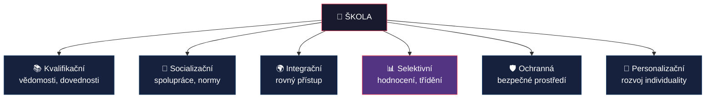

### Školní poradenské pracoviště — struktura

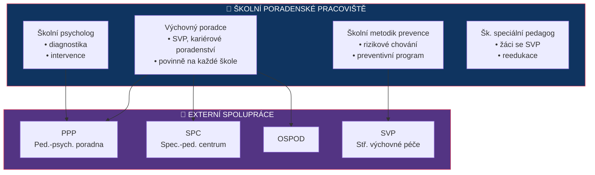

### Environmentální výchova — začlenění do výuky

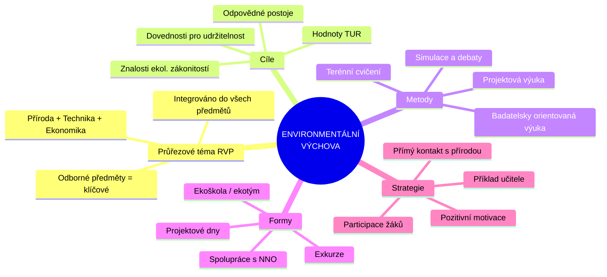

---

## Záludnosti a doplňující otázky

### ❓ 1. Jak může učitel odborného výcviku (např. automechanik, kuchař) začlenit environmentální výchovu do svého předmětu?
**Odpověď:** Automechanik: likvidace provozních kapalin, recyklace autovraku, emisní normy, alternativní pohony. Kuchař: local sourcing, minimalizace food waste, sezónní suroviny, kompostování bioodpadu, energetická efektivita při vaření. Klíčové je, aby EV nebyla „navíc", ale **integrální součást** odborné praxe — žák vidí, že ekologické jednání je znakem profesionála.

### ❓ 2. Co je EQF a proč je důležitý pro absolventy českých škol?
**Odpověď:** EQF (European Qualifications Framework) je referenční rámec s 8 úrovněmi, který umožňuje **srovnání kvalifikací** získaných v různých zemích EU. Český výuční list (ISCED 3C) odpovídá zhruba EQF úrovni 3, maturita EQF 4, Bc. EQF 6. Díky EQF zaměstnavatel v Německu rozumí, co český absolvent umí. Doplňuje ho **Europass** (standardizované dokumenty) a **ECVET** (kreditní systém pro uznávání učení v zahraničí).

### ❓ 3. Jaký je rozdíl mezi výchovným poradcem a kariérovým poradcem?
**Odpověď:** **Výchovný poradce** je pedagogický pracovník školy se specializačním studiem (250 h); řeší jak kariérové poradenství, tak péči o žáky se SVP a výchovné problémy. **Kariérový poradce** je užší role zaměřená specificky na profesní orientaci a volbu dalšího vzdělávání. V praxi výchovný poradce často plní obě role. Na větších školách může být kariérové poradenství odděleno. Od roku 2024 se posiluje koncept **kariérového vzdělávání** jako součásti kurikula (ne jen jednorázového poradenství).


<div style='page-break-after: always;'></div>

# PES 8–10: Model výuky, didaktická analýza a třídní management

> **TL;DR / Audio Shrnutí:**
> Vyučování není náhodný proces — je to systém s jasnými prvky (učitel, žák, obsah, prostředí) a vazbami mezi nimi, který probíhá ve fázích od přípravy přes realizaci po reflexi. Didaktická analýza je klíčová učitelská dovednost: myšlenkový proces, kterým učitel rozkládá učivo na zvládnutelné části, stanovuje cíle, volí metody a hodnotí výsledky. A třídní management? To je umění řídit celou tuto orchestraci v reálném čase — od motivačního úvodu přes udržení pozornosti až po závěrečné shrnutí. Kdo tyto tři pilíře ovládá, ten nejen „učí", ale skutečně řídí proces učení.

---

## Znění státnicových otázek
- **[VOT]** **PES 8:** Popište model procesu výuky, stručně vysvětlete pojmy učitel, žák, obsah výuky, prostředí a vztahy mezi nimi; charakterizujte obvyklé fáze přípravy a realizace vyučování; objasněte význam vnějších a vnitřních podmínek na efektivitu vyučování.
- **[VOT]** **PES 9:** Vysvětlete pojem didaktická analýza obsahu, popište její fáze; charakterizujte kritéria kvalitní výuky a efektivního učení, popište didaktické zásady.
- **[VOT]** **PES 10:** Vysvětlete pojem třídní management; popište role a úkoly učitele během vyučování; uveďte možné scénáře vyučovací hodiny, vysvětlete smysl a návaznost jednotlivých fází.

---

## Klíčové pojmy

- **Model procesu výuky** — zjednodušená reprezentace vyučovacího procesu; zachycuje klíčové prvky (učitel, žák, obsah, prostředí) a vztahy mezi nimi.
- **Didaktický trojúhelník** — základní model: Učitel ↔ Žák ↔ Obsah.
- **Didaktická analýza** — myšlenková činnost učitele umožňující pochopit obsah, rozsah a strukturu učiva a najít jeho výchovnou a vzdělávací hodnotu.
- **Třídní management** — soubor strategií a postupů pro řízení třídy, organizaci výuky, udržení kázně a vytváření produktivního učebního prostředí.
- **Didaktické zásady** — obecné požadavky na vyučování v souladu s výchovně-vzdělávacími cíli.
- **Vnitřní podmínky učení** — motivace, předchozí znalosti, pozornost, paměť, inteligence, styl učení.
- **Vnější podmínky učení** — prostředí, klima třídy, používané metody, učivo, čas.
- **Bloomova taxonomie** — hierarchická klasifikace kognitivních cílů od zapamatování po tvoření.

---

## Detailní rozebrání problematiky

### PES 8: Model procesu výuky

#### Didaktický trojúhelník a jeho rozšíření

Nejjednodušší model výuky tvoří **didaktický trojúhelník**: **Učitel – Žák – Obsah (učivo)**. V reálné praxi se však přidávají další prvky:

**Rozšířený model výuky:**
- **Učitel** — řídí proces; volí cíle, obsah, metody, hodnotí
- **Žák** — aktivní subjekt učení; přichází s vlastními zkušenostmi, motivací, stylem učení
- **Obsah výuky (učivo)** — „co" se učí; určeno kurikulem (RVP → ŠVP)
- **Metody a formy** — „jak" se učí; organizace a postupy
- **Prostředí** — fyzické (třída, dílna) i psychosociální (klima)
- **Cíle** — „proč" se učí; co má žák na konci umět/znát/dokázat

**Vztahy mezi prvky:**
Všechny prvky jsou vzájemně provázané. Změna jednoho ovlivní ostatní: jiný obsah vyžaduje jiné metody; jiné prostředí (dílna vs. třída) vyžaduje jinou organizaci; motivovaný žák reaguje na jiné podněty než nemotivovaný.

#### Fáze přípravy a realizace vyučování

**I. Příprava (pre-aktivní fáze)**
1. **Dlouhodobá příprava** — roční tematický plán, rozložení učiva
2. **Střednědobá příprava** — plán tematického celku
3. **Bezprostřední příprava** — příprava na konkrétní vyučovací jednotku:
   - Stanovení cílů (co se žáci naučí?)
   - Výběr obsahu (základní, rozšiřující, doplňující učivo)
   - Volba metod a forem
   - Příprava pomůcek a materiálů
   - Časový plán hodiny

**II. Realizace (interaktivní fáze)**
- Vlastní průběh vyučovací hodiny
- Řízení komunikace, motivace, udržování pozornosti
- Flexibilní reakce na nečekané situace

**III. Reflexe (post-aktivní fáze)**
- Vyhodnocení: Dosáhl jsem cílů?
- Co fungovalo, co ne?
- Úpravy pro příště

#### Vnitřní a vnější podmínky efektivity vyučování

**Vnitřní podmínky (na straně žáka):**
- **Motivace** — proč se učím, k čemu mi to je?
- **Předchozí znalosti** — na co mohu navázat?
- **Pozornost** — dokážu se soustředit?
- **Paměť** — kolik si zapamatuji?
- **Inteligence** — jak hluboce proniknu do problematiky?
- **Volní vlastnosti** — vytrvalost, sebekázeň
- **Kompetence k učení** — umím se učit?
- **Styl učení** — vizuální, auditivní, kinestetický...

**Vnější podmínky (na straně prostředí):**
- **Prostředí** — fyzické vlastnosti (osvětlení, teplota, hluk) + klima třídy
- **Pedagog** — jeho osobnost, odbornost, používané metody
- **Učivo** — jeho smysluplnost, srozumitelnost, přiměřenost
- **Čas** — kdy se učím, kolik mám času?
- **Motivační pobídky** — incentivy, hodnocení, zpětná vazba

---

### PES 9: Didaktická analýza obsahu

#### Co je didaktická analýza
Didaktická analýza je **myšlenková činnost učitele** (metoda), která mu umožňuje:
- Pochopit **obsah, rozsah a strukturu** učiva
- Najít **výchovnou a vzdělávací hodnotu** učiva
- Propojit **cíle s učivem a dosahovanými kompetencemi**

Provádí se na úrovni celého předmětu, tematického celku nebo jedné vyučovací jednotky.

#### Kroky (fáze) didaktické analýzy

| Krok | Činnost | Otázka |
|------|---------|--------|
| **1. Situační analýza** | Zjištění vstupních znalostí žáků (rozhovor, písemné ověření — neklasifikuje se!) | Co už žáci znají? |
| **2. Analýza a stanovení cílů** | Vyvození vzdělávacích a výchovných cílů (Bloomova taxonomie) | Kam směřuji? |
| **3. Výběr a uspořádání učiva** | Rozlišení učiva na **základní** (povinné), **rozšiřující** a **doplňující** | Co učit a v jakém pořadí? |
| **4. Volba metod** | Výběr vyučovacích metod odpovídajících cílům a obsahu | Jak učit? |
| **5. Volba prostředků** | Výběr materiálních didaktických prostředků (pomůcky, technika, učebnice) | Čím učit? |
| **6. Fixace** | Naplánování aktivit pro upevnění poznatků, dovedností a návyků | Jak procvičit? |
| **7. Hodnocení** | Stanovení způsobu ověření dosažení cílů | Jak zjistím, že se žáci naučili? |
| **8. Časový plán** | Rozložení aktivit do časového rámce hodiny | Kdy co stihnout? |
| **9. Formální zpracování** | Písemná příprava na vyučování | Jak to zapíšu? |

#### Efektivita a kvalita výuky

Efektivita vzdělávání odráží poměr mezi vynaloženým úsilím, časem, prostředky a dosaženými cíli. Pedagogicky efektivní vzdělávání je takové, při němž za minimálního vynaložení prostředků a energie (pedagogů a žáků) lze dosáhnout maximálních výsledků.

**Kritéria pro hodnocení efektivity se dělí na:**
- **Kvantitativní** — množství prostudovaných témat, rozsah vědomostí, čas, úsilí (vše, co lze měřit statisticky).
- **Kvalitativní** — změny ve vědomí účastníků a schopnost praktického uplatnění.
- **Vnitřní** — změny v kognitivním systému studujících, v motivaci a postojích.
- **Vnější** — změny v reálném jednání jednotlivců i skupin.

**Zvyšování efektivnosti školy (7 principů):**
1. **Profesionální vedení školy** (leadership, vize, kreativita, dělba práce).
2. **Sdílení vize** (hrdost na instituci, komunikace).
3. **Vhodné edukativní prostředí** (klima, mezilidské vztahy, povzbuzení ke spolupráci).
4. **Evaluace kvality práce** (kvalitní zpětná vazba zevnitř i zvenčí od absolventů/zaměstnavatelů).
5. **Učící se škola** („Pokud se přestávají učit učitelé, přestávají se učit i jejich žáci“).
6. **Otevřená škola** (horizontální i vertikální komunikace, upřímnost).
7. **Ekonomická efektivita** (kvalitní management zdrojů).

**Profesní standard kvality učitele** popisuje žádoucí stav kompetencí (excelentní způsobilosti) nezbytných pro kvalifikovaný výkon. Tyto kompetence musí být rozvoje schopné, variabilní a flexibilní v měnící se škole.

#### Didaktické zásady

| Zásada | Podstata | Příklad v praxi |
|--------|----------|-----------------|
| **Vědeckosti** | Učivo musí být odborně správné a aktuální | Aktualizace informací o technologiích |
| **Názornosti** | Zapojit více smyslů; ukázat, předvést | Demonstrace na reálném stroji |
| **Uvědomělosti a aktivity** | Žáky to baví → jsou motivovaní a aktivní | Problémové úlohy místo diktování |
| **Systematičnosti a posloupnosti** | Od jednoduchého ke složitému; zpětná vazba | Spirálové uspořádání učiva |
| **Přiměřenosti** | Odpovídající věku, schopnostem, předchozím znalostem | Diferenciace úloh |
| **Trvalosti a důkladnosti** | Porozumět > memorovat; opakování v kontextu | Aplikace teorie v praxi |
| **Propojení teorie s praxí** | Teorie slouží praxi; praxe obohacuje teorii | Odborný výcvik navazující na teorii |

---

### PES 10: Třídní management

#### Co je třídní management
Třídní management je **soubor strategií a dovedností**, které učitel používá k:
- Vytvoření a udržení **produktivního učebního prostředí**
- **Organizaci** času, prostoru a zdrojů
- **Prevenci** a řešení kázeňských problémů
- **Podpoře** pozitivních vztahů a motivace

#### Role a úkoly učitele během vyučování

| Role | Činnost |
|------|---------|
| **Plánovač** | Připravuje obsah, volí metody, stanovuje cíle |
| **Organizátor** | Řídí průběh hodiny, rozděluje úkoly, spravuje čas |
| **Motivátor** | Vzbuzuje zájem, propojuje s praxí, oceňuje snahu |
| **Facilitátor** | Vede diskuze, podporuje aktivitu žáků, moderuje |
| **Diagnostik** | Sleduje pokrok, identifikuje obtíže, dává zpětnou vazbu |
| **Hodnotitel** | Posuzuje výkon, klasifikuje, formativně hodnotí |
| **Vychovatel** | Formuje postoje, řeší konflikty, buduje klima |
| **Poradce** | Pomáhá s učebními i osobními problémy |

#### Scénáře vyučovací hodiny — typické fáze

**Klasická vyučovací hodina (45 min):**

| Fáze | Čas | Obsah |
|------|-----|-------|
| **1. Organizační úvod** | 2–3 min | Třídní kniha, docházka, organizační pokyny |
| **2. Motivace a opakování** | 5–8 min | Propojení s předchozím učivem; motivační otázka/problém |
| **3. Expozice nového učiva** | 15–20 min | Výklad, demonstrace, řízenediskuze |
| **4. Fixace** | 10–15 min | Procvičování, aplikace, samostatná/skupinová práce |
| **5. Diagnostika** | 3–5 min | Ověření pochopení (otázky, kvíz, miniprezentace) |
| **6. Závěr** | 2–3 min | Shrnutí, zadání domácí práce, náhled na příští hodinu |

**Alternativní scénáře:**
- **Obrácená hodina (flipped classroom)** — žáci si nové učivo nastudují doma; ve škole aplikují a procvičují
- **Projektová hodina** — celá hodina věnována práci na projektu
- **Laboratorní/praktická hodina** — experiment, praktická činnost, reflexe
- **Diskuzní hodina** — moderovaná diskuze k problémovému tématu

---

## Vizualizace

### Didaktický trojúhelník — rozšířený model

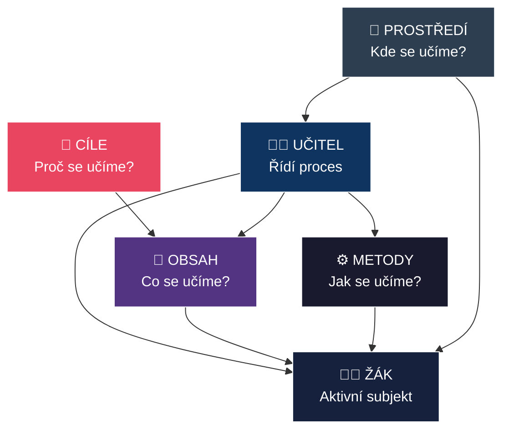

### Kroky didaktické analýzy

```mermaid
graph LR
    SA["1️⃣ Situační<br/>analýza"] --> CILE["2️⃣ Stanovení<br/>cílů"]
    CILE --> UCIVO["3️⃣ Výběr<br/>učiva"]
    UCIVO --> METODY["4️⃣ Volba<br/>metod"]
    METODY --> PROSTREDKY["5️⃣ Volba<br/>prostředků"]
    PROSTREDKY --> FIXACE["6️⃣ Plán<br/>fixace"]
    FIXACE --> HODNOCENI["7️⃣ Způsob<br/>hodnocení"]
    HODNOCENI --> CAS["8️⃣ Časový<br/>plán"]
    CAS --> PRIPRAVA["9️⃣ Písemná<br/>příprava"]

    style SA fill:#1a1a2e,stroke:#e94560,color:#fff
    style CILE fill:#16213e,stroke:#e94560,color:#fff
    style UCIVO fill:#0f3460,stroke:#e94560,color:#fff
    style METODY fill:#533483,stroke:#e94560,color:#fff
    style PROSTREDKY fill:#5b2c6f,stroke:#e94560,color:#fff
    style FIXACE fill:#6c3483,stroke:#e94560,color:#fff
    style HODNOCENI fill:#7d3c98,stroke:#e94560,color:#fff
    style CAS fill:#8e44ad,stroke:#e94560,color:#fff
    style PRIPRAVA fill:#9b59b6,stroke:#e94560,color:#fff
```

### Fáze vyučovací hodiny

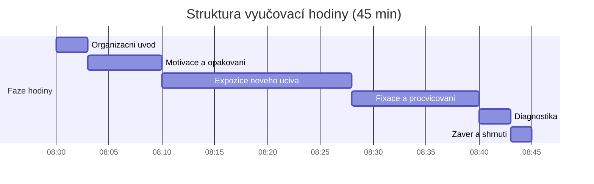

---

## Záludnosti a doplňující otázky

### ❓ 1. Čím se liší didaktická analýza od přípravy na hodinu?
**Odpověď:** Didaktická analýza je **širší myšlenkový proces** — učitel analyzuje učivo jako celek, hledá jeho strukturu, hodnotu, vazby na předchozí znalosti. Příprava na hodinu je **konkrétní výstup** didaktické analýzy — písemný dokument s časovým plánem konkrétní vyučovací jednotky. Didaktická analýza může probíhat na úrovni celého předmětu (roční plán), příprava je vždy na konkrétní hodinu.

### ❓ 2. Jaký je rozdíl mezi vnitřními a vnějšími podmínkami učení? Co může učitel ovlivnit?
**Odpověď:** Vnitřní podmínky (motivace, paměť, pozornost, styl učení) jsou primárně **na straně žáka**. Vnější podmínky (prostředí, klima, metody, čas) jsou primárně **na straně prostředí a učitele**. Učitel přímo ovlivňuje vnější podmínky (volba metod, organizace prostoru, budování klimatu). Vnitřní podmínky ovlivňuje **nepřímo** — vhodnou motivací, aktivizací, formativní zpětnou vazbou a vytvořením bezpečného prostředí.

### ❓ 3. Proč je důležitá situační analýza (1. krok didaktické analýzy) a proč se neklasifikuje?
**Odpověď:** Situační analýza zjišťuje **vstupní úroveň žáků** — co už vědí z předchozího vzdělávání, z jiných předmětů, z praxe. Neklasifikuje se, protože její účel je **diagnostický, nikoli hodnotící** — učiteli pomáhá přizpůsobit výuku reálným potřebám. Kdyby se klasifikovala, žáci by se snažili „uhodnout správnou odpověď" místo upřímného sdílení toho, co vědí a nevědí. Měla by být bezpečným prostorem pro identifikaci mezer.


<div style='page-break-after: always;'></div>

# PES 11–13: Dějiny pedagogiky, reformní hnutí a kurikulum

> **TL;DR / Audio Shrnutí:**
> Dějiny pedagogiky nejsou seznam jmen a dat — jsou to příběhy o tom, jak lidstvo postupně objevovalo, co to vlastně znamená „učit" a „vychovávat". Od Sokratovy maieutiky přes středověké klášterní školy a herbartovský formalismus až po reformní pedagogiku 20. století, která se vzbouřila proti „škole poslouchání" a dala vzniknout Montessori, Waldorfu i daltonským školám. A nad tím vším stojí klíčový pojem moderní didaktiky — **kurikulum**: co učit, proč to učit a jak to transformovat z vědeckého poznání do zvládnutelné podoby pro žáka. Pochopení tohoto historického oblouku vám umožní vidět dnešní vzdělávání v kontextu a rozpoznat, které „nové" myšlenky jsou ve skutečnosti staré staletí.

---

## Znění státnicových otázek
- **[VOT]** **PES 11:** Popište fáze a důležitá témata ve vývoji pedagogického myšlení (antika, středověk, počátek novověku a reformace, osvícenství); vysvětlete vznik tradičního pojetí vzdělávání v 19. století (Herbart a herbartismus); uveďte souvislosti s dnešním vzděláváním.
- **[VOT]** **PES 12:** Charakterizujte příčiny vzniku reformního pedagogického hnutí; uveďte znaky alternativních škol, důležité představitele a směry; vysvětlete možnosti uplatnění alternativních a inovativních prvků v dnešním vzdělávání.
- **[VOT]** **PES 13:** Vysvětlete pojem kurikulum; popište didaktickou transformaci obsahu, její fáze a jednotlivé aktéry; zaměřte se na způsob stanovení kurikula v odborném vzdělávání.

---

## Klíčové pojmy

- **Maieutika** — Sokratova metoda „porodního umění"; učitel kladením otázek pomáhá žákovi „porodit" vlastní poznání.
- **Scholastika** — středověká metoda vzdělávání; důraz na logiku, memorování, autoritativní výklad textu.
- **Herbartismus** — směr 19. století odvozený z díla J. F. Herbarta; formální stupně vyučovací (jasnost → asociace → systém → metoda); základ „tradiční školy".
- **Reformní pedagogika** — hnutí konce 19. a začátku 20. století kritizující herbartismus; důraz na aktivitu žáka, jeho zájmy a zkušenost.
- **Alternativní škola** — škola pracující podle odlišných pedagogických koncepcí (Montessori, Waldorf, Dalton, Jenský plán aj.).
- **Kurikulum** — obsah vzdělávání v širším smyslu: co se učí, proč, jak, v jakém pořadí a s jakými výsledky.
- **Didaktická transformace** — proces přeměny vědeckého poznání (kurikulum zamýšlené) do podoby učiva zvládnutelného žákem (kurikulum realizované).
- **RVP** — Rámcový vzdělávací program; státní úroveň kurikula.
- **ŠVP** — Školní vzdělávací program; školní úroveň kurikula.

---

## Detailní rozebrání problematiky

### PES 11: Vývoj pedagogického myšlení

#### Antika (5. stol. př. n. l. – 5. stol. n. l.)

**Řecko:**
- **Sokrates (469–399 př. n. l.)** — maieutika (kladení otázek); „Vím, že nic nevím"; učitel jako průvodce, ne přednášející
- **Platón (427–347 př. n. l.)** — ideální stát vyžaduje ideální výchovu; škola Akadémie; vzdělání jako cesta k dobru a pravdě
- **Aristoteles (384–322 př. n. l.)** — empirické poznání; výchova má rozvíjet rozum, mravnost i tělo; peripatetická škola (učení za chůze)

**Dva modely výchovy:**
- **Spartský** — kolektivní, vojenský, fyzická zdatnost a disciplína
- **Athénský** — harmonický rozvoj těla i ducha; gymnastika + múzická výchova

**Řím:**
- **Quintilianus (35–100 n. l.)** — Institutio Oratoria; první systematická metodika; proti tělesným trestům; dobrý učitel = dobrý člověk

**Souvislost s dneškem:** Sokratova maieutika je předchůdcem **dialogických a heuristických metod**. Aristotelův důraz na zkušenost inspiroval **empirismus a badatelské učení**.

#### Středověk (5.–15. století)

- **Klášterní a katedrální školy** — trivium (gramatika, rétorika, dialektika) + quadrivium (aritmetika, geometrie, astronomie, hudba)
- **Scholastika** — dominantní metoda; učení z textů autorit (Bible, Aristoteles); disputace
- **Univerzity** (od 12. stol.) — Boloňa (1088), Paříž, Oxford, Praha (1348)
- **Důraz na memorování**, latinský jazyk, poslušnost, tělesné tresty

**Souvislost s dneškem:** Středověký model přežíval staletí a jeho pozůstatky (frontální výuka, autorita textu, memorování) jsou kritizovány dodnes.

#### Počátek novověku a reformace (15.–17. století)

- **Humanismus** — návrat k antickým ideálům; rozvoj individuality; Erasmus Rotterdamský
- **Reformace** — Luther požadoval školní docházku pro všechny; vzdělání jako cesta ke čtení Bible
- **J. A. Komenský (1592–1670)** — viz PES 5; systematizoval didaktiku; demokratizace vzdělávání

#### Osvícenství (17.–18. století)

- **John Locke (1632–1704)** — „tabula rasa" (čistá deska); dítě se rodí bez vrozených idejí; výchova formuje vše
- **J. J. Rousseau (1712–1778)** — „Émile" (1762); přirozená výchova; dítě je přirozeně dobré, společnost ho kazí; respekt k přirozenému vývoji
- **J. H. Pestalozzi (1746–1827)** — výchova srdce, hlavy a ruky; vzdělávání chudých; důraz na názornost

#### Herbart a herbartismus (19. století)

**Johann Friedrich Herbart (1776–1841):**
- Zakladatel pedagogiky jako **vědecké disciplíny**
- Pedagogika se opírá o **etiku** (cíle výchovy) a **psychologii** (prostředky)
- Formuloval **formální stupně vyučovací**: jasnost → asociace → systém → metoda

**Herbartismus** (Herbart-Zillerova škola):
- Přeměnili Herbartovy myšlenky v **rigidní systém**
- Každá hodina musí projít 5 formálními stupni
- Důraz na **systematičnost, učitelovu autoritu, disciplínu, memorování**
- Žák = pasivní příjemce; frontální výuka jako jediná správná forma
- **Vzniká „tradiční pojetí" vzdělávání**, které se stalo terčem kritiky reformistů

**Souvislost s dneškem:** Herbartismus vytvořil model školy, který dodnes částečně přežívá (frontální výuka, důraz na reprodukci znalostí, učitel jako hlavní autorita).

---

### PES 12: Reformní pedagogické hnutí a alternativní školy

#### Příčiny vzniku reformního hnutí (konec 19. / začátek 20. století)

1. **Kritika herbartismu** — mechanické formální stupně, pasivita žáka, odtržení od reality
2. **Nové poznatky psychologie** — dětská psychologie (G. S. Hall), pragmatismus (W. James)
3. **Společenské změny** — industrializace, urbanizace, demokratizace; potřeba jiného typu vzdělání
4. **Pedocentrismus** — „od dítěte k učivu" místo „od učiva k dítěti"

#### Společné znaky reformní pedagogiky
- **Aktivita žáka** — „learning by doing"
- **Respekt k individuálním potřebám** a vývojovým stádiím
- **Kritika frontální výuky** jako jediné formy
- **Propojení školy se životem** — praktičnost, zkušenost
- **Změna role učitele** — z autority na průvodce

#### Hlavní představitelé a směry

| Směr / Škola | Zakladatel | Klíčové principy |
|---|---|---|
| **Pragmatická pedagogika** | John Dewey (1859–1952) | „Learning by doing"; škola jako laboratoř demokracie; projektová metoda |
| **Montessori pedagogika** | Maria Montessori (1870–1952) | Připravené prostředí; senzitivní období; svobodná volba činnosti; „Pomoz mi, abych to dokázal sám" |
| **Waldorfská pedagogika** | Rudolf Steiner (1861–1925) | Antroposofie; epochové vyučování; umělecký rozvoj; bez známek a učebnic |
| **Daltonský plán** | Helen Parkhurstová (1886–1973) | Individualizované učení; úkolové listy; svoboda a zodpovědnost žáka |
| **Jenský plán** | Peter Petersen (1884–1952) | Věkově smíšené skupiny; cyklus: rozhovor–práce–hra–slavnost |
| **Freinetova pedagogika** | Célestin Freinet (1896–1966) | Školní tiskárna; volné texty; kooperace; propojení školy a komunity |
| **Experimentální školy** | A. S. Neill (1883–1973) | Summerhill; úplná svoboda dítěte; antiautoritativní výchova |
| **Kritická pedagogika** | Paulo Freire (1921–1997) | Vzdělávání jako nástroj osvobození (Pedagogika utlačovaných); dialogická metoda; propojení s reálným světem |

#### Uplatnění alternativních prvků v dnešním vzdělávání

| Alternativní prvek | Uplatnění v běžné škole |
|---|---|
| Montessori pomůcky | Manipulační materiály v MŠ a na 1. stupni ZŠ |
| Projektová metoda (Dewey) | Projektové dny/týdny; mezipředmětové projekty |
| Epochové vyučování (Waldorf) | Blokové vyučování; integrovaná tématická výuka |
| Individualizace (Dalton) | IVP pro žáky se SVP; diferencované úkoly |
| Kooperace (Freinet) | Skupinová a kooperativní výuka |
| Svobodná volba | Volitelné předměty; výběr témat projektů |

---

### PES 13: Kurikulum a didaktická transformace

#### Pojem kurikulum
**Kurikulum** (z lat. *currere* = běžet) je komplexní pojem zahrnující:
- **Co** se učí (obsah vzdělávání)
- **Proč** se to učí (cíle, kompetence)
- **Jak** se to učí (metody, formy)
- **Kdy** se to učí (pořadí, návaznost)
- **S jakými výsledky** (výstupy, standardy)

#### Úrovně kurikula

| Úroveň | Název | Charakteristika |
|---------|-------|-----------------|
| **Zamýšlené** | Ideální kurikulum | Co si tvůrci představují (politická vize) |
| **Projektované** | Formální kurikulum | Dokumenty: RVP, ŠVP, učebnice |
| **Realizované** | Implementované | Co učitel skutečně učí v hodině |
| **Dosažené** | Výsledky žáků | Co se žáci reálně naučili |
| **Skryté** | Hidden curriculum | Neformální pravidla, kultura školy, implicitní normy |

#### Didaktická transformace obsahu

Didaktická transformace = proces, kterým se **vědecké poznání** mění v **učivo** zvládnutelné žákem.

**Fáze:**
1. **Vědecké poznatky** (akademické disciplíny, výzkum)
2. **Kurikulární dokumenty** (RVP — rámcová úroveň)
3. **ŠVP** (školní úroveň — učitel/škola přizpůsobuje)
4. **Učivo v hodině** (realizovaná transformace — konkrétní výklad, úlohy)
5. **Osvojené poznatky žáka** (dosažené kurikulum)

**Aktéři:**
- **Stát / MŠMT / NPI** → RVP (rámcový vzdělávací program)
- **Škola / ředitel / předmětová komise** → ŠVP (školní vzdělávací program)
- **Učitel** → příprava na hodinu, výběr metod, didaktická analýza
- **Autoři učebnic** → zprostředkování obsahu

#### Kurikulum v odborném vzdělávání

**Specifika:**
- RVP pro obory vzdělávání (např. RVP 23-51-H/01 Strojní mechanik)
- Dvě složky: **všeobecné vzdělávání** + **odborné vzdělávání** (teorie + praxe)
- **Profil absolventa** — popis klíčových a odborných kompetencí
- **Rámcové rozvržení učiva** — minimální počty hodin pro oblasti
- **Škola vytváří ŠVP** podle místních podmínek a potřeb trhu práce

**Struktura RVP:**
- Profil absolventa
- Klíčové kompetence (komunikativní, personální, sociální, k učení, k řešení problémů, matematické, digitální, pracovní)
- Odborné kompetence
- Rámcové rozvržení obsahu vzdělávání
- Průřezová témata

---

## Vizualizace

### Vývoj pedagogického myšlení — časová osa

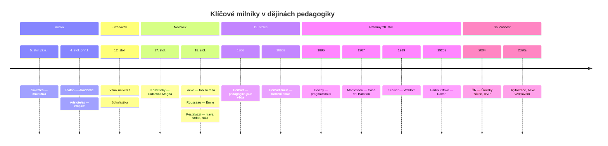

### Didaktická transformace obsahu

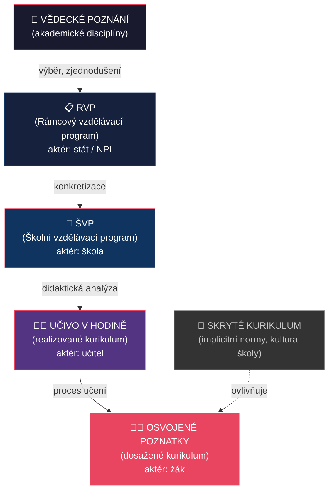

### Reformní pedagogika — mapa směrů

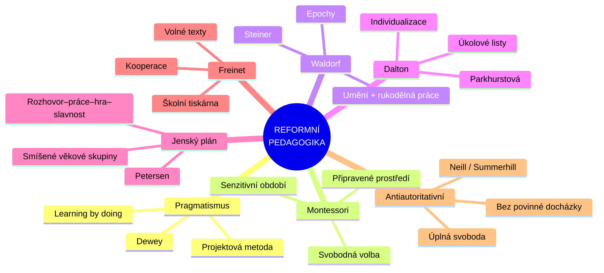

---

## Záludnosti a doplňující otázky

### ❓ 1. Co je to „herbartismus" a jak se liší od Herbarta samotného?
**Odpověď:** Herbart formuloval pedagogiku jako **vědeckou disciplínu** opřenou o etiku a psychologii. Jeho následovníci (Ziller, Rein) z toho udělali **rigidní systém** — formální stupně se staly dogmatem, které se muselo mechanicky opakovat v každé hodině. Herbart sám byl flexibilnější, než jeho „-ismus" naznačuje. Herbartismus = **zjednodušení a ztuhnutí** Herbartových myšlenek.

### ❓ 2. Jaký je rozdíl mezi RVP a ŠVP? Kdo za co zodpovídá?
**Odpověď:** **RVP** = celostátní rámec stanovený státem (NPI/MŠMT) — definuje minimum: kompetence, vzdělávací oblasti, průřezová témata, profil absolventa. **ŠVP** = konkrétní program vytvořený školou na základě RVP — přizpůsobuje obsah místním podmínkám, potřebám žáků a trhu práce. Za RVP zodpovídá stát, za ŠVP ředitel školy. Učitel pak ŠVP dále transformuje do konkrétních hodin.

### ❓ 3. Může se „skryté kurikulum" dostat do rozporu s oficiálním? Uveďte příklad.
**Odpověď:** Ano, a děje se to běžně. Příklad: Škola oficiálně deklaruje v ŠVP rozvoj kritického myšlení a demokratických hodnot (formální kurikulum). Ale v praxi učitelé vyžadují pouze reprodukci poznatků, netoleruji diskuzi a rozhodují autoritativně (skryté kurikulum). Žáci se naučí, že „správná odpověď" je důležitější než vlastní názor — což je přesný opak deklarovaného cíle.


<div style='page-break-after: always;'></div>

# PES 14–16: Transmisivní a konstruktivistické pojetí výuky, sebeřízené učení

> **TL;DR / Audio Shrnutí:**
> Představte si vyučování jako předávání balíčku — to je klasická **transmisivní výuka**. Učitel ví, žák neví, a informace putuje jedním směrem. Je to rychlé, efektivní pro velké skupiny, ale často to vede k rychlému zapomínání. Na druhé straně stojí **konstruktivismus**, který říká, že vědomosti nelze prostě předat jako balíček — každý žák si je musí „vystavět“ sám ve své hlavě na základě svých předchozích zkušeností. Učitel zde není předavač, ale spíše architekt, který připravuje prostředí pro stavbu. A vrcholem tohoto přístupu je **sebeřízené učení**, kdy žák přebírá volant: sám si určuje cíle, plánuje strategii, učí se a nakonec hodnotí svůj pokrok. Tyto tři přístupy nejsou nepřátelé; mistrný učitel ví, kdy má žákům něco prostě vysvětlit (transmise), a kdy je má nechat badatelsky objevovat (konstruktivismus).

---

## Znění státnicových otázek
- **[VOT]** **PES 14:** Charakterizujte transmisivní koncepci vzdělávání, její výhody a nevýhody; uveďte příklady vhodných výukových strategií ve frontální výuce (slovní monologické metody, názorně demonstrační metody, učení se z textu).
- **[VOT]** **PES 15:** Charakterizujte teorie vzdělávání zaměřené na psychologické aspekty procesu učení. Vysvětlete pojem konstruktivismus, popište strategie podporující konstruktivismus ve výuce.
- **[VOT]** **PES 16:** Charakterizujte pojem sebeřízené učení; vysvětlete význam zodpovědnosti žáka za vlastní učení; popište cyklus sebeřízeného učení; uveďte možné strategie pro podporu sebeřízení žáka ve výuce.

---

## Klíčové pojmy

- **Transmisivní výuka** — odvozeno od lat. *transmissio* (přenos); tradiční model výuky založený na jednosměrném předávání hotových poznatků od učitele k žákovi.
- **Frontální výuka** — organizační forma typická pro transmisivní pojetí; učitel pracuje s celou třídou hromadně.
- **Konstruktivismus** — psychologický a pedagogický směr tvrdící, že poznání nelze mechanicky přenést, ale učící se subjekt si ho musí sám aktivně „zkonstruovat“ na základě dosavadních zkušeností.
- **Prekoncepty** — dětská (často naivní nebo chybná) pojetí a představy o tom, jak funguje svět, se kterými žák vstupuje do výuky.
- **Kognitivní konflikt** — situace, kdy nová informace nabourá žákův dosavadní prekoncept (např. těžké a lehké těleso padají ve vakuu stejně rychle), což vyvolá potřebu rekonstrukce poznání.
- **Sebeřízené učení (Self-regulated learning)** — proces, při kterém je žák aktivním a zodpovědným tvůrcem svého učení (v rovině motivační, kognitivní i behaviorální).
- **Metakognice** — „myšlení o vlastním myšlení“; schopnost sledovat a regulovat vlastní proces učení (vím, jak se učí).

---

## Detailní rozebrání problematiky

### PES 14: Transmisivní koncepce vzdělávání

#### Charakteristika transmisivního (tradičního) pojetí
Vychází z herbartismu (19. století). Vychází z předpokladu, že lidská mysl je nádoba (nebo *tabula rasa*), kterou je třeba naplnit informacemi.
- **Role učitele:** Dominantní expert, „majitel pravdy“, primární zdroj informací. Řídí celý proces.
- **Role žáka:** Pasivní příjemce, posluchač. Očekává se od něj pozornost, memorování a přesná reprodukce.
- **Obsah:** Kladen důraz na faktografii, objem učiva a logickou strukturu z pohledu vědy, ne z pohledu dítěte.
- **Hlavní forma:** Frontální hromadná výuka.

#### Výhody a nevýhody

| Výhody | Nevýhody |
|--------|----------|
| **Časová a ekonomická efektivita** — předání maxima informací velké skupině v krátkém čase. | **Pasivita žáků** — vede k nudě a ztrátě vnitřní motivace. |
| **Systematičnost** — jasná struktura, logická návaznost, zamezení chaosu. | **Povrchní učení** — důraz na memorování bez hlubokého porozumění (krátkodobá paměť). |
| **Snadná kontrola a hodnocení** — jasně definované a měřitelné výstupy. | **Nerespektování individuality** — všichni dělají totéž ve stejném tempu. |
| **Pocit bezpečí pro učitele** — má plnou kontrolu nad hodinou a obsahem. | **Potlačení kritického myšlení** — neučí žáky řešit problémy, jen reprodukovat řešení. |

#### Výukové strategie pro frontální / transmisivní výuku
I transmisivní výuka může být efektivní, pokud je vedena kvalitně.

1. **Slovní monologické metody**
   - **Výklad:** Logické, systematické vysvětlení složitějšího jevu. Musí mít jasnou strukturu, záchytné body a intonační dynamiku.
   - **Vyprávění:** Emocionálně zabarvené, příběhové předání informací (dějepis, literatura).
2. **Názorně demonstrační metody**
   - Pozorování předváděného jevu (pokus z chemie, ukázka pracovního postupu v dílně).
   - Práce s modely, schématy, videoukázkami. Zásada: „Slyším a zapomenu, vidím a pamatuji si.“
3. **Učení se z textu**
   - Práce s učebnicí nebo pracovním listem pod přímým vedením učitele (společné čtení, podtrhávání klíčových slov).

---

### PES 15: Teorie vzdělávání a konstruktivismus

#### Teorie vzdělávání zaměřené na psychologické aspekty
Učení a vyučování nelze pochopit bez znalosti psychologických aspektů (pozornost, vnímání, paměť, myšlení). V průběhu vývoje vzniklo několik hlavních teorií (koncepcí) vzdělávání:

1. **Kognitivní teorie**
   - Zaměřují se na rozvoj kognitivních vlastností žáka a procesy učení. Kladou důraz na prekoncepty, spontánní reprezentace a kognitivní konflikty.
   - *Představitelé:* J. Piaget, G. Bachelard, A. Giordan.
2. **Technologické (systémové) teorie**
   - Zdůrazňují zdokonalení předávání poznatků pomocí technologií, médií a konstrukce poznání. Zaměřují se na komunikaci a interakci člověk-počítač.
   - *Představitelé:* B. F. Skinner, J. Carroll.
3. **Sociokognitivní teorie**
   - Kladou důraz na roli sociální interakce, kultury a sociálního prostředí v mechanismech učení. L. S. Vygotskij (učení táhne vývoj) vs. J. Piaget (mentální vývoj předchází učení).
   - *Představitelé:* L. S. Vygotskij, A. Bandura, J. Bruner.
4. **Sociální teorie**
   - Vzdělání má umožnit řešení sociálních, kulturních a environmentálních problémů (nerovnosti, elitářství, moc, osvobození).
   - *Představitelé:* J. Dewey, P. Freire, P. Bourdieu.
5. **Akademické (klasické) teorie**
   - Soustřeďují se na předávání obecných poznatků (tradicionalisté vs. generalisté), předměty, logiku a kritické myšlení. Staví se proti přílišné specializaci.

#### Podstata konstruktivismu
Zatímco transmisivní škola klade důraz na učivo a učitele, psychologické teorie učení (J. Piaget, L. Vygotskij) obrátily pozornost k **vnitřním procesům v mysli žáka**.

**Konstruktivismus** tvrdí, že poznání nevzniká pasivním příjmem zvenčí, ale **aktivní mentální konstrukcí**.
- Každý žák přichází do školy s určitými **prekoncepty** (osobními teoriemi o světě).
- Nová informace je filtrována přes tyto prekoncepty.
- Učení je proces asimilace (zařazení nové informace do existujících struktur) a akomodace (změna mentálních struktur pod tlakem nové informace — kognitivní konflikt).

#### Dvě větve konstruktivismu
1. **Kognitivní (Piaget):** Důraz na individuální zrání mysli a řešení logických rozporů (kognitivní konflikt) uvnitř jednotlivce.
2. **Sociální (Vygotskij):** Poznání se konstruuje primárně v sociální interakci (skupinová práce, diskuze). Klíčový koncept: **Zóna nejbližšího vývoje** (to, co dítě dnes dokáže s pomocí dospělého/vrstevníka, dokáže zítra samo).

#### Změna rolí
- **Učitel:** Průvodce (facilitátor), tvůrce podnětného prostředí. Neříká hotové pravdy, ale klade otázky a předkládá problémy.
- **Žák:** Aktivní badatel, spolutvůrce vlastního poznání. Nese zodpovědnost za své učení.

#### Strategie podporující konstruktivismus ve výuce
- **Zjišťování prekonceptů:** Brainstorming, myšlenkové mapy na začátku tématu (Co už víte o gravitaci?).
- **E-U-R (Evokace – Uvědomění si významu – Reflexe):** Model kritického myšlení, který kopíruje konstruktivistický proces.
- **Badatelsky orientovaná výuka (Inquiry-based learning):** Žáci dostanou problém, formulují hypotézy, zkoumají a dělají závěry.
- **Projektová výuka:** Řešení reálného problému v širším kontextu.
- **Skupinová diskuze a vrstevnické učení:** Nutí žáky verbalizovat své myšlenky a konfrontovat je s názory jiných.

---

### PES 16: Sebeřízené učení (Self-regulated learning)

#### Co je sebeřízené učení
Sebeřízení je schopnost žáka převzít iniciativu a zodpovědnost za vlastní proces učení. Sebeřízený žák nečeká, až mu učitel „nalije“ vědomosti do hlavy — ví, co se chce naučit, jak se to naučí, a dokáže sám sebe zhodnotit. Je to **klíčová kompetence pro celoživotní učení**.

**Význam zodpovědnosti:** Pokud je veškerá zodpovědnost za výsledek delegována na učitele, žák je v pozici konzumenta. Jakmile ji převezme, stává se tvůrcem. Zvyšuje se vnitřní motivace a vytrvalost (rezilience) při překonávání překážek.

#### Cyklus sebeřízeného učení (dle Zimmermana)

Sebeřízení probíhá ve třech cyklických fázích:

1. **Fáze přípravná (Plánování)**
   - Žák analyzuje úkol (Co se ode mě žádá?)
   - Stanovuje si osobní cíle (Chci to umět na jedničku, nebo mi stačí základ?)
   - Plánuje strategii a čas (Udělám si výpisky, vyhradím si na to 2 hodiny v pátek)
   - *Klíčová je zde self-efficacy (víra ve vlastní schopnosti) a vnitřní motivace.*
2. **Fáze výkonová (Realizace a monitorování)**
   - Žák se reálně učí (využívá zvolené strategie: čtení, podtrhávání, mnemotechniky)
   - Současně **monitoruje sám sebe** (Rozumím tomu? Nedívám se moc do mobilu? Jsem unavený?)
   - Mění strategii, pokud nefunguje.
3. **Fáze reflexe (Sebehodnocení)**
   - Zhodnocení výsledku: Dosáhl jsem cíle?
   - Atribuce: Proč jsem (ne)uspěl? (Špatně jsem si to naplánoval vs. byl to nespravedlivý test).
   - Úprava pro příště: Co udělám příště jinak? (Zkušenost se přenáší do fáze 1 dalšího cyklu).

#### Strategie učitele pro podporu sebeřízení žáků

Učitel by měl sebeřízení žáků systematicky „lešenovat“ (scaffolding):
- **Otevřené cíle a volba:** Dát žákům na výběr z různých úkolů nebo forem zpracování (např. napiš esej NEBO natoč video).
- **Trénink strategií učení:** Učit žáky, *jak* se učit (myšlenkové mapy, technika Pomodoro, Cornellův systém poznámek).
- **Práce s portfoliem:** Žák si zakládá své práce a vidí vlastní progres.
- **Sebehodnocení a vrstevnické hodnocení:** Vést žáky k tomu, aby sami posoudili svůj výkon pomocí předem daných kritérií (rubrik) dříve, než je oznámkuje učitel.
- **Formativní zpětná vazba:** Zaměřovat se na proces a úsilí žáka, ne jen na výsledek („Líbí se mi, jak sis rozvrhl čas na tento velký projekt.“).

---

## Vizualizace

### Transmisivní vs. Konstruktivistické pojetí

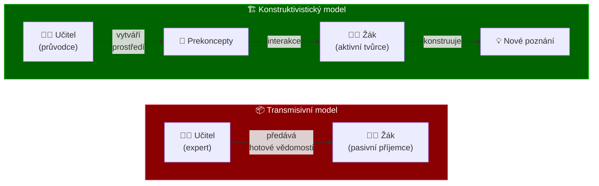

### Zóna nejbližšího vývoje (Vygotskij)

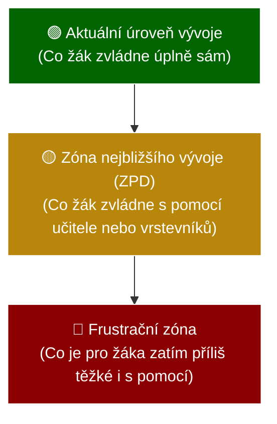

### Cyklus sebeřízeného učení

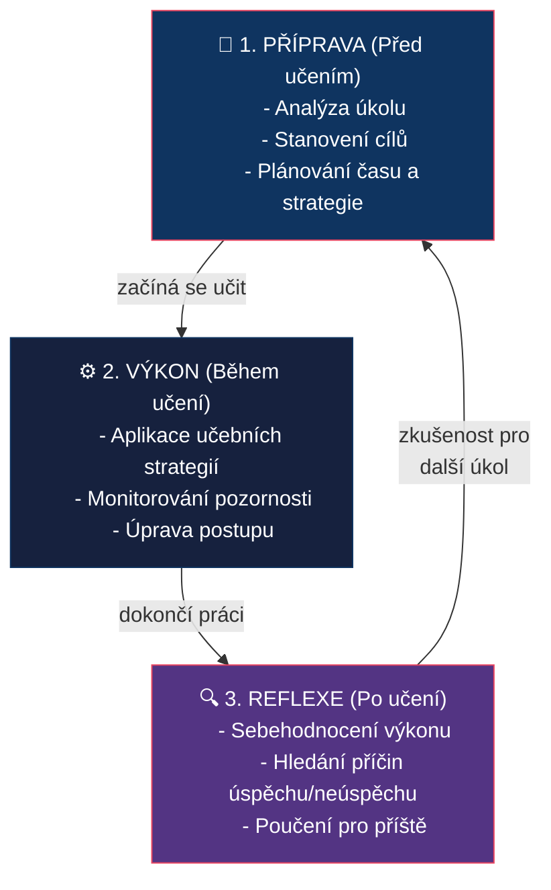

---

## Záludnosti a doplňující otázky

### ❓ 1. Znamená konstruktivismus, že učitel už nesmí nic vysvětlovat a frontální výuka je „zlo“?
**Odpověď:** Vůbec ne. Jde o extrém, před kterým varují i moderní pedagogové. Frontální, transmisivní výuka je vysoce efektivní pro **základní obeznámení s fakty**, bezpečnostní školení, zavedení nových pojmů nebo silný motivační výklad. Konstruktivismus a badatelské učení jsou časově velmi náročné. Klíčem je **vyváženost a střídání metod** podle toho, jaký cíl zrovna učitel sleduje.

### ❓ 2. Co se stane, když konstruktivistický přístup aplikujeme na žáka, který nemá žádné vstupní znalosti (prekoncepty)?
**Odpověď:** Dojde k tzv. **kognitivnímu přetížení** (cognitive overload). Pokud má žák samostatně objevovat zákonitosti v prostředí, o kterém nic neví, cítí zmatek a frustraci. Pro začátečníky je proto vhodnější direktivnější (transmisivní) vedení. Až po získání solidního faktického základu by měl učitel postupně přecházet ke konstruktivistickým metodám a řešení problémů (tento koncept se opírá o *Teorii kognitivní zátěže*).

### ❓ 3. Lze po žácích na SŠ/SOU automaticky požadovat sebeřízené učení?
**Odpověď:** Zcela určitě ne. Schopnost sebeřízení (metakognice) se **vyvíjí a musí se trénovat**. Mnoho středoškoláků z tradičních základek přijde v „čekacím módu“ — čekají na instrukci a tahák k testu. Učitel musí sebeřízení podporovat postupně metodou „lešení“ (scaffolding): zpočátku dát strukturovaný plán a jasná kritéria hodnocení, učit je sebehodnotícím rubrikám, a teprve postupně přenášet zodpovědnost a uvolňovat kontrolu.


<div style='page-break-after: always;'></div>

# PES 17–18: Výukové cíle, Bloomova taxonomie a školní hodnocení

> **TL;DR / Audio Shrnutí:**
> Představte si výuku jako cestu z bodu A do bodu B. Výukový **cíl** je ten bod B — jasná představa o tom, co má žák na konci hodiny umět, znát nebo dokázat. Aby cíl nebyl jen prázdnou frází, pomáhá nám **Bloomova taxonomie**, která kognitivní cíle řadí od nejjednoduššího zapamatování až po tvoření vlastních řešení. A jak poznáme, že jsme do bodu B dorazili? K tomu slouží **hodnocení a zpětná vazba**. Moderní pedagogika ustupuje od pouhého známkování (sumativní hodnocení) a klade důraz na **formativní hodnocení** — zpětnou vazbu, která žáka neškatulkuje, ale dává mu jasný návod: co dělám dobře, kde dělám chybu a jak se mohu zlepšit.

---

## Znění státnicových otázek
- **[VOT]** **PES 17:** Charakterizujte behaviorální teorie vzdělávání a zaměřte se na roli zpětné vazby v procesu učení; popište funkce školního hodnocení; vysvětlete pojem formativní hodnocení.
- **[VOT]** **PES 18:** Vysvětlete pojem cíl; popište funkce cílů z hlediska plánování výuky a řízení učení žáka; charakterizujte Bloomovu taxonomii cílů a na příkladech ilustrujte její použití.

---

## Klíčové pojmy

- **Výukový cíl** — ideální, předpokládaný a zamýšlený výsledek vyučovacího procesu (co si má žák osvojit, co má umět).
- **Bloomova taxonomie** — hierarchické uspořádání vzdělávacích cílů v kognitivní (poznávací) oblasti od nejnižší náročnosti po nejvyšší (Zapamatovat → Porozumět → Aplikovat → Analyzovat → Hodnotit → Tvořit).
- **Sumativní hodnocení** — hodnocení výsledku učení (tzv. hodnocení *učení*); často vyjádřeno známkou nebo procenty na konci tematického celku. Má sumarizační a selektivní funkci.
- **Formativní hodnocení** — průběžná zpětná vazba (tzv. hodnocení *pro učení*); poskytuje žákovi i učiteli informace o tom, co už umí a jak má postupovat dál.
- **Zpětná vazba (Feedback)** — informace o výkonu nebo porozumění poskytnutá žákovi (případně učiteli), která slouží k úpravě dalšího postupu.
- **Autentické hodnocení** — hodnocení založené na řešení reálných životních/profesních situací (např. obhajoba projektu, diagnostika reálné závady), nikoli jen izolovaných školních testů.

---

## Detailní rozebrání problematiky

### PES 18: Výukové cíle a Bloomova taxonomie

*(Pozn.: Začínáme otázkou 18, protože logicky cíl předchází hodnocení.)*

#### Pojem výukový cíl a jeho funkce
**Cíl** odpovídá na otázku: *„Co se žáci naučí?“* (Ne co bude dělat učitel!) 
Kvalitně formulovaný cíl začíná aktivním slovesem popisujícím výkon žáka (vyjmenuje, sestrojí, porovná). Nejasné cíle (např. „seznámit žáky s historií“, „uvědomit si význam“) nelze objektivně změřit.

**Funkce cílů:**
- **Pro učitele (plánování):** Určují výběr učiva (obsah), volbu výukových metod a prostředků (jak to naučit) a způsob hodnocení (jak to změřit).
- **Pro žáka (řízení učení):** Dávají učení smysl, orientují pozornost žáka na to podstatné a zvyšují motivaci (vím, kam jdu).

**Cíle se dělí do 3 oblastí:**
1. **Kognitivní (vzdělávací)** — znalosti a intelektuální dovednosti (rozum).
2. **Afektivní (výchovné)** — postoje, hodnoty, emoce (srdce).
3. **Psychomotorické (výcvikové)** — tělesné a manuální dovednosti (ruce).

#### Bloomova taxonomie kognitivních cílů
B. S. Bloom (1956, revidováno 2001) vytvořil pyramidu kognitivní náročnosti. Slouží k tomu, aby učitelé nezůstávali jen u pouhého memorování (1. úroveň), ale vedli žáky k hlubšímu porozumění.

| Úroveň | Charakteristika výkonu | Typická aktivní slovesa (žák...) |
|--------|--------------------------|----------------------------------|
| **1. Zapamatovat** | Žák vybaví termíny, fakta a definice z paměti. Bez nutnosti porozumění. | *vyjmenuje, definuje, popíše, přiřadí, zopakuje* |
| **2. Porozumět** | Žák chápe smysl informací; umí to vysvětlit vlastními slovy. | *vysvětlí, objasní, shrne, demonstruje na příkladu* |
| **3. Aplikovat** | Žák použije znalost v nové nebo konkrétní situaci (řešení problému). | *vypočítá, navrhne postup, použije pravidlo, sestrojí* |
| **4. Analyzovat** | Žák rozloží celek na části a chápe vztahy mezi nimi (hledá příčiny). | *rozebere, srovná, určí příčiny, rozliší podstatné* |
| **5. Hodnotit** | Žák posoudí hodnotu/správnost na základě daných kritérií, obhájí názor. | *obhájí, posoudí, zkritizuje, zdůvodní, argumentuje* |
| **6. Tvořit** | Žák spojí prvky do nového celku (syntéza); vymyslí originální řešení. | *vytvoří (projekt), navrhne (design), zkonstruuje* |

*Příklad aplikace z automechaniky (Téma: Brzdový systém):*
1. **Zapamatovat:** Vyjmenuje hlavní části kotoučové brzdy.
2. **Porozumět:** Vysvětlí vlastními slovy princip hydraulického přenosu síly.
3. **Aplikovat:** Vymění brzdové destičky podle dílenského manuálu.
4. **Analyzovat:** Zjistí příčinu pískání brzd na základě indicií zákazníka.
5. **Hodnotit:** Posoudí, zda je míra opotřebení kotoučů ještě v rámci bezpečné normy.
6. **Tvořit:** Navrhne úpravu brzdového systému pro závodní účely.

---

### PES 17: Hodnocení, zpětná vazba a behaviorální teorie

#### Behaviorální teorie učení a role zpětné vazby
**Behaviorální teorie** (představitelé B. F. Skinner, I. P. Pavlov, J. B. Watson) se zaměřují výhradně na **vnější, pozorovatelné chování** a výkon žáků. Procesy uvnitř mysli (tzv. "černá skříňka") tyto teorie nezkoumají. Učení definují jako **změnu chování** na základě vnějších podnětů.

V tomto modelu hraje **zpětná vazba (posílení)** naprosto klíčovou roli:
- **Kladné posílení** (odměna, pochvala, dobrá známka) — zvyšuje pravděpodobnost, že žák správné chování zopakuje.
- **Záporné posílení** (odstranění nepříjemného podnětu po správné reakci).
- **Trest** (špatná známka, poznámka) — slouží k potlačení nežádoucího chování.

Zpětná vazba v behaviorálním pojetí okamžitě informuje žáka, co je správné a co chybné, a silně ho motivuje (či podmiňuje) k učení nových věcí a upevnění návyků (tzv. operantní podmiňování).

#### Funkce školního hodnocení
Hodnocení je nedílnou součástí výuky. Jeho funkce jsou:
1. **Informativní** — co žák umí a co ne (pro žáka i rodiče).
2. **Motivační** — pochvala posiluje chování, spravedlivá známka stimuluje k výkonu.
3. **Regulativní** — učitel zjišťuje efektivitu své výuky a mění postup (Zpomalím? Zopakuji?).
4. **Selektivní (třídící)** — rozhoduje o přijetí na SŠ/VŠ (často kritizovaná funkce).
5. **Výchovná** — vede k zodpovědnosti, sebereflexi a vytrvalosti.

#### Sumativní vs. Formativní hodnocení

| Kritérium | Sumativní hodnocení | Formativní hodnocení |
|-----------|---------------------|----------------------|
| **Cíl** | Vyhodnotit a klasifikovat (známka) | Zlepšit a podpořit učení (rada) |
| **Kdy probíhá** | Na konci procesu (písemka, vysvědčení) | Průběžně během učení |
| **Otázka** | „Co se naučil a jaká je jeho úroveň?“ | „Co umí, kam směřuje a jak tam dojít?“ |
| **Role žáka** | Pasivní objekt hodnocení | Aktivní subjekt (zapojen do sebehodnocení) |
| **Atmosféra** | Soutěživá, zaměřená na výkon | Bezpečná, chyba je vítaná součást procesu |
| **Příměr** | Degustátor (hodnotí hotovou polévku) | Kuchař (ochutnává a dochucuje polévku během vaření) |

#### Formativní hodnocení (Assessment for Learning)
Formativní hodnocení není jen „hodnocení bez známek“, je to ucelený pedagogický přístup. **Pilíře formativního hodnocení:**
1. **Ujasnění cílů:** Žák ví, kam směřuje a jak vypadá dobrý výsledek (zná kritéria).
2. **Tvorba důkazů o učení:** Učitel v hodině neustále monitoruje pochopení (mini-kvízy, práce s mazacími tabulkami, položení otázky celé třídě před vyvoláním jedince).
3. **Poskytování efektivní zpětné vazby:** Zpětná vazba musí být popisná, nikoli posuzující. Neříká „jsi šikovný / toto je špatně“, ale „výpočet je správně, ale zapomněl jsi jednotky – doplň je“.
4. **Aktivizace žáků jako zdroje učení pro sebe navzájem:** Vrstevnické učení a hodnocení.
5. **Aktivizace žáka jako vlastníka svého učení:** Systematické vedení k sebehodnocení.

#### Zpětná vazba (Feedback)
Kvalitní zpětná vazba je motorem učení. Podle Hattieho (viditelné učení) patří k faktorům s nejvyšším vlivem na úspěch žáka.
- **Musí být včasná** (hned po výkonu, ne za měsíc).
- **Musí být konkrétní** a zaměřená na úkol/proces, ne na osobnost žáka (chválit úsilí, ne inteligenci — *Growth mindset*).
- Podle *D. Wiliama* má odpovídat na 3 otázky: **Kde jsem? Kam jdu? Jak se tam dostanu?**

---

## Vizualizace

### Bloomova taxonomie (Revidovaná, kognitivní doména)

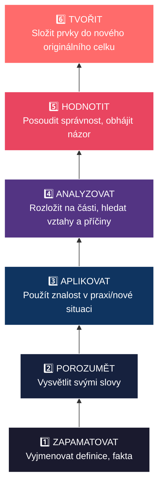

### Provázanost Cíle, Metody a Hodnocení

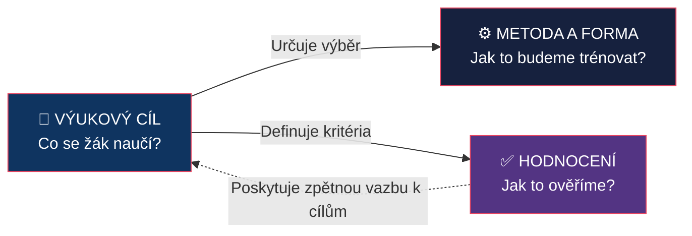

### Formativní vs. Sumativní hodnocení v čase

```mermaid
gantt
    title Proces učení v průběhu měsíce
    dateFormat YYYY-MM-DD
    axisFormat %d.

    section Tema Motor
    Formativni - Mini-kviz :milestone, m1, 2024-01-02, 0d
    Formativni - Zpetna vazba na rozborku :milestone, m2, 2024-01-10, 0d
    Formativni - Vrstevnicke hodnoceni :milestone, m3, 2024-01-20, 0d
    Sumativni - Pisemny test na znamku :milestone, m4, 2024-01-28, 0d
```

---

## Záludnosti a doplňující otázky

### ❓ 1. Dá se cíl „Žák pochopí princip funkce spalovacího motoru“ považovat za správně formulovaný?
**Odpověď:** Z didaktického hlediska **ne**. Sloveso „pochopí“ (nebo „porozumí“, „uvědomí si“, „seznámí se“) nelze objektivně změřit a zkontrolovat. Jak učitel v hlavě žáka uvidí, že to pochopil? Správně formulovaný cíl musí obsahovat **aktivní, měřitelné sloveso** z Bloomovy taxonomie: *„Žák vysvětlí vlastními slovy princip funkce spalovacího motoru“* nebo *„Žák na schématu popíše 4 doby motoru“*.

### ❓ 2. Může sumativní hodnocení plnit formativní funkci?
**Odpověď:** **Ano, ale je to obtížnější.** Příkladem je maturita nanečisto nebo pololetní testová písemka, kterou sice učitel oznámkuje (sumativní – hodnotí probraný celek), ale následně celou hodinu stráví s žáky podrobným rozborem chyb a vysvětlením, jak se v daných oblastech zlepšit pro příště. Tím se i závěrečný (sumativní) test stává formativním (informačním) nástrojem pro další postup. Záleží vždy na tom, **jak s informací naložíme**.

### ❓ 3. Co je to tzv. chyba v dedukci hodnocení (haló efekt)?
**Odpověď:** Je to jedno z rizik hodnocení, kterému se musí učitel vyhýbat. *Haló efekt* nastává, když učitel hodnotí konkrétní výkon žáka na základě celkového dojmu nebo jedné výrazné vlastnosti. Například jedničkář s pečlivou úpravou sešitu dostane v písemce za chybu jen „mínus“, zatímco zlobivý žák dostane za totožnou chybu zhoršenou známku. Je to porušení zásady spravedlnosti a objektivity, často se mu předchází striktním zavedením a dodržováním jasných hodnoticích kritérií (rubrik).


<div style='page-break-after: always;'></div>

# PES 19–21: Pedocentrismus, humanistické a sociální teorie vzdělávání

> **TL;DR / Audio Shrnutí:**
> Po staletích, kdy bylo dítě vnímáno jen jako zmenšený dospělý, kterého je třeba disciplínou natvarovat do správné podoby, přišel obrat: **pedocentrismus**. Středobodem vzdělávání se stalo dítě, jeho potřeby, přirozený vývoj a zájmy. Od Rousseauova návratu k přírodě přes Summerhill A. S. Neilla až po humanistickou psychologii Rogerse a Maslowa — tito všichni razí myšlenku, že učitel nemá žáka řídit, ale **provázet**. Není to však jen o jednotlivci. Sociální a kritická pedagogika (např. John Dewey nebo Paulo Freire) upozorňují, že škola nežije ve vakuu. Vzdělávání je vždy politický akt, který může společnost buď slepě reprodukovat, nebo ji měnit k lepšímu. Učitel se tak stává partnerem v seberozvoji žáka i hybatelem sociálních změn.

---

## Znění státnicových otázek
- **[VOT]** **PES 19:** Popište historické počátky teorií vzdělávání zaměřených na osobnost žáka (například J. J. Rousseau, snahy reformního pedagogického hnutí, M. Montessori, A. S. Neill a antiautoritativní výchova, P. Grey a svobodné školy); uveďte možné výhody a nevýhody pedocentrického pojetí výuky.
- **[VOT]** **PES 20:** Charakterizujte soudobé teorie vzdělávání zaměřené na osobnost žáka (C. Rogers, A. Maslow, J. Holt aj.); popište principy a strategie nedirektivního přístupu ve výuce a roli učitele jako poradce a partnera v učení; charakterizujte zdroje autority učitele a možnosti budování vztahu se žáky.
- **[VOT]** **PES 21:** Popište pedagogické teorie vzdělávání zaměřené na sociální prostředí, zaměřte se na význam školního sociálního prostředí pro učení a na využití vztahu školy a společnosti. Vysvětlete pojmy sociálně angažovaná a kritická pedagogika, popište její cíle a možnosti začlenění do výuky.

---

## Klíčové pojmy

- **Pedocentrismus** — pedagogický přístup kladoucí do středu vzdělávacího procesu dítě, jeho přirozenost, potřeby a zájmy (opakem je *magistrocentrismus*).
- **Antiautoritativní výchova** — výchova zříkající se vnějších trestů, zákazů a příkazů; důraz na naprostou svobodu dítěte (A. S. Neill).
- **Humanistická psychologie/pedagogika** — směr zdůrazňující svobodu volby, seberealizaci, empatii a bezpodmínečné přijetí jedince (Maslow, Rogers).
- **Nedirektivní přístup** — styl výuky, kde učitel žákovi neříká, *co* a *jak* má dělat, ale pomáhá mu, aby k řešení došel sám.
- **Kritická pedagogika** — směr zkoumající, jak škola reprodukuje společenské nerovnosti (třídní, genderové, rasové); jejím cílem je emancipace utlačovaných.
- **Unschooling (odškolnění)** — radikální hnutí odmítající institucionální vzdělávání (J. Holt, I. Illich); dítě se učí přirozeně životem.

---

## Detailní rozebrání problematiky

### PES 19: Historické kořeny pedocentrismu

Dokonale strukturovaná herbartovská škola 19. století sice dokázala efektivně naučit masy číst a psát, ale za cenu potlačení individuality. Proti tomu se zvedla vlna pedocentrismu.

#### Klíčové postavy a proudy

1. **Jean-Jacques Rousseau (18. stol.)**
   - Kniha *Émile čili o výchově*. Dítě se rodí přirozeně dobré, společnost ho kazí.
   - Výchova má být **přirozená**, negativní (chránit dítě před škodlivými vlivy společnosti) a řídit se jeho přirozeným vývojem.
2. **Reformní hnutí a Maria Montessori (poč. 20. stol.)**
   - Vycházela z lékařské praxe. Vytvořila koncept **připraveného prostředí**, kde dítě samo volí aktivitu.
   - Respektovala tzv. *senzitivní období* (okna příležitosti pro učení konkrétních dovedností).
3. **Alexander Sutherland Neill a Summerhill (1921)**
   - Extrémní antiautoritativní přístup. Škola jako demokratická komunita (děti a dospělí mají rovnocenný hlas).
   - Žádná povinná výuka, důraz na **emocionální zdraví a štěstí** dítěte. „Raději ať je ze školy šťastný metař než neurotický premiér.“
4. **Peter Gray a svobodné školy (současnost)**
   - Psycholog zkoumající význam svobodné dětské hry.
   - Škola typu *Sudbury Valley*: neexistují osnovy, třídy ani testy. Děti se učí naprosto organicky tím, co je zrovna zajímá.

#### Výhody a nevýhody pedocentrismu

| Výhody | Nevýhody a rizika |
|--------|-------------------|
| Vysoká vnitřní motivace žáků. | Riziko chaotičnosti a ztráty systematičnosti v poznání. |
| Rozvoj kritického myšlení, kreativity a samostatnosti. | Náročné na přípravu učitele a vybavení prostředí. |
| Nižší úroveň stresu a úzkosti u dětí. | Slabá připravenost na soutěživé prostředí reálného trhu práce. |
| Zdravý psychosociální vývoj a pozitivní vztah k učení. | Může vést k egocentrismu („svět se točí kolem mě“). |

---

### PES 20: Humanistické teorie a soudobé zaměření na žáka

V polovině 20. století reagovala psychologie na chladný behaviorismus (cukr a bič) a temnou psychoanalýzu (pudy) vznikem **humanistické psychologie**. Její aplikace do pedagogiky přinesla zásadní změny.

#### Hlavní představitelé
- **Abraham Maslow:** Hierarchie potřeb (pyramida). Zjistil klíčovou věc pro pedagogiku: *Pokud dítě nemá uspokojené nižší potřeby (bezpečí, sounáležitost, najíst se), nemůže se učit a seberealizovat.*
- **Carl Rogers:** Zakladatel nedirektivního přístupu (tzv. psychoterapie/výuka zaměřená na klienta/žáka).
- **John Holt:** Odpůrce klasických škol, zakladatel unschoolingu. Tvrdil, že škola děti učí hlavně strachu ze selhání.

#### Nedirektivní přístup (Rogers) a role učitele
Podle Rogerse se člověk nedá nic přímo „naučit“ – lze mu jen usnadnit, aby to objevil sám. Role učitele se mění na **facilitátora** (usnadňovatele) učení.
Rogers definoval **3 podmínky efektivního učení**:
1. **Kongruence (autenticita):** Učitel je sám sebou, nehraje roli experta schovaného za maskou autority.
2. **Bezpodmínečné pozitivní přijetí:** Učitel žáka respektuje a přijímá, bez ohledu na jeho výkon nebo názor.
3. **Empatie:** Schopnost vidět svět očima žáka.

#### Zdroje autority učitele
V nedirektivním přístupu učitel neztrácí autoritu, ale mění se její zdroj:
- ❌ **Formální (poziční) autorita:** „Poslouchej mě, protože jsem tvůj učitel.“ (Tradiční škola).
- ✅ **Neformální autorita:** Autorita založená na odbornosti (učitel to skvěle umí), pedagogickém taktu (je spravedlivý), charismatu a autentičnosti. Získává se budováním vztahu, ne vynucováním.

---

### PES 21: Teorie zaměřené na sociální prostředí a kritická pedagogika

Žák nežije ve vzduchoprázdnu. Jeho rozvoj je formován sociálním prostředím (třídou, školou, komunitou, státem). Sociálně orientované teorie přesouvají fokus z psychiky jednotlivce na vztahy a společnost.

#### Vztah školy a společnosti (John Dewey)
Dewey tvrdil, že „škola není příprava na život, škola je život sám“. 
- Založil pragmatickou pedagogiku (*learning by doing*).
- Škola by měla být zmenšenou verzí ideální **demokratické společnosti**.
- Žáci se učí spolupracovat a řešit reálné problémy komunity (zárodek dnešní projektové výuky a service-learningu).

#### Sociálně angažovaná a Kritická pedagogika

Kritická pedagogika vznikla ve 2. polovině 20. století (tzv. frankfurtská škola, neomarxismus). Ptá se: *„Komu současný systém vzdělávání slouží?“*

- **Základní myšlenka:** Vzdělávání není nikdy neutrální. Vždy je to politický akt. Škola často funguje jako nástroj pro reprodukci stávající moci a nerovností (děti dělníků se ve škole učí poslouchat příkazy a stávají se dělníky; děti elit se učí kriticky myslet a stávají se manažery).
- **Paulo Freire:** Brazilský pedagog (kniha *Pedagogika utlačovaných*). Tvrdil, že klasická výuka je **bankovní systém vzdělávání** (učitel „vkládá“ informace do prázdných žáků). Namísto toho navrhl **problémovou výuku**, která vede k *uvědomění* (conscientização) — žáci chápou příčiny svého útlaku a učí se, jak společnost změnit.
- **Cíl kritické pedagogiky:** Emancipace žáka. Vychovat z něj aktivního, kriticky myslícího občana, který dokáže zpochybnit status quo a bojovat za sociální spravedlnost.

**Začlenění do výuky:**
- Rozbor mediálních manipulací a dezinformací.
- Diskuze nad kontroverzními tématy (ekologie, lidská práva, sociální nerovnost).
- Zpochybňování „jediné správné pravdy“ v učebnicích dějepisu.

---

## Vizualizace

### Vývoj role dítěte a učitele (Transmise vs. Pedocentrismus vs. Nedirektiva)

```mermaid
graph TD
    subgraph TRAD["🏛️ Tradiční škola<br>(Magistrocentrismus)"]
        U1["Učitel<br>(Diktátor)"] -->|"Řídí a nařizuje"| Z1["Žák<br>(Submisivní)"]
    end

    subgraph PEDO["🌱 Pedocentrismus<br>(Rousseau, Montessori)"]
        Z2["Žák<br>(Středobod)"] -.->|"Zkoumá svět"| SVET["Okolní svět"]
        U2["Učitel<br>(Pozorovatel)"] -.->|"Chrání a připravuje"| Z2
    end

    subgraph HUM["🤝 Humanistická ped.<br>(Rogers)"]
        U3["Učitel<br>(Facilitátor / Partner)"] <==>|"Bezpodmínečné přijetí<br>a empatie"| Z3["Žák<br>(Tvůrce)"]
    end

    style TRAD fill:#8b0000,stroke:#fff,color:#fff
    style PEDO fill:#006400,stroke:#fff,color:#fff
    style HUM fill:#0f3460,stroke:#fff,color:#fff
```

### Maslowova hierarchie potřeb (Aplikace na žáka)

```mermaid
graph BT
    L1["1. FYZIOLOGICKÉ<br>(Mám hlad? Jsem unavený? Je tu zima?)"]
    L2["2. BEZPEČÍ<br>(Bojím se posměchu? Bojím se pětky?)"]
    L3["3. SOUNÁLEŽITOST A LÁSKA<br>(Přijímá mě třída? Mám tu kamarády?)"]
    L4["4. UZNÁNÍ A ÚCTA<br>(Oceňuje někdo můj pokrok?)"]
    L5["5. SEBEREALIZACE<br>(🔥 Teprve tady dochází k hlubokému a kreativnímu učení)"]

    L1 --> L2 --> L3 --> L4 --> L5
    
    style L1 fill:#1a1a2e,stroke:#fff,color:#fff
    style L2 fill:#16213e,stroke:#fff,color:#fff
    style L3 fill:#0f3460,stroke:#fff,color:#fff
    style L4 fill:#533483,stroke:#fff,color:#fff
    style L5 fill:#e94560,stroke:#fff,color:#fff
```

### Bankovní vzdělávání (Freire) vs. Kritická pedagogika

```mermaid
graph LR
    subgraph BANK["Bankovní pojetí (Útlak)"]
        direction LR
        U1["Učitel"] -->|"Vkládá vědomosti"| Z1["Žák (Trezor)"]
        Z1 -->|"Reprodukuje"| S1["Stávající systém"]
    end

    subgraph KRIT["Problémové pojetí (Emancipace)"]
        direction LR
        U2["Učitel"] <==>|"Dialog"| Z2["Žák"]
        Z2 -->|"Zpochybňuje"| S2["Stávající systém"]
        S2 -.->|"Změna k lepšímu"| KRIT
    end
    
    style BANK fill:#2c3e50,stroke:#fff,color:#fff
    style KRIT fill:#e67e22,stroke:#fff,color:#fff
```

---

## Záludnosti a doplňující otázky

### ❓ 1. Dá se humanistický (Rogersův) přístup uplatnit, když vím, že žák udělá v dílně na soustruhu katastrofální chybu, pokud mu přímo neřeknu, co má dělat?
**Odpověď:** Zde narážíme na limit čistého nedirektivního přístupu v oblastech, kde hrozí fyzické nebezpečí nebo trvalé škody (BOZP). Humanistická pedagogika nepopírá zodpovědnost učitele. V takové chvíli musí učitel zasáhnout direktivně. Nedirektivní přístup je ideální pro řešení problémů, diskuzi, design nebo seberozvoj. Odborný učitel proto musí umět plynule přepínat mezi expertním vedením (jak ovládat soustruh) a facilitací (jaký výrobek na soustruhu navrhneš a vymyslíš).

### ❓ 2. Kritická pedagogika tvrdí, že škola reprodukuje nerovnosti. Jak to dělá, když máme všichni stejný systém bezplatného veřejného školství?
**Odpověď:** Přes tzv. **skryté kurikulum** a jazykový/kulturní kód. Škola je postavena na hodnotách střední a vyšší třídy (znalost „vysoké“ kultury, formální projev, způsob argumentace). Děti ze sociálně slabých rodin přicházejí do školy s jiným kódem a škola jejich způsobům vyjadřování nerozumí (a hodnotí je jako horší). Navíc děti elit mají kapacity na doučování, přípravky k přijímačkám atd., takže bezplatné školství de facto prohlubuje propast mezi těmi, kdo si mohou zaplatit podporu, a těmi, kdo ne.

### ❓ 3. Je možné aplikovat úplnou svobodu a pedocentrismus (typu Summerhill) v klasickém českém školství?
**Odpověď:** Ne, protože to naráží na legislativní a strukturální překážky. Český vzdělávací systém ukládá povinnou školní docházku a definuje výstupy přes Rámcový vzdělávací program (RVP), což implikuje povinnost určitý obsah probrat a ověřit. Zcela svobodná škola (unschooling/Summerhill), kde se žák sám rozhodne, zda půjde vůbec do třídy, je u nás zatím možná pouze v režimu domácího vzdělávání, a i tam musí dítě procházet periodickým přezkoušením ve spádové škole. Lze však z těchto směrů přebírat prvky – např. svobodu volby úkolu, sebehodnocení a podíl na tvorbě třídních pravidel.


<div style='page-break-after: always;'></div>

# PES 22–25: Kooperativní výuka, zkušenostní učení a projektová výuka

> **TL;DR / Audio Shrnutí:**
> Zkušenost je nejlepší učitel. Místo abychom žákům o světě jen vyprávěli, necháme je, aby si ho sami „osahali“. Na tomto principu stojí **zkušenostní učení** (typicky Kolbův cyklus), kde se poznání nerodí z výkladu, ale z konkrétního zážitku, jeho reflexe a vyvození pravidel pro příště. A jak zajistit, aby to žáci dělali efektivně? Přes **kooperativní a projektovou výuku**. Kooperace neznamená, že pět žáků sedí u jednoho stolu a jeden to odpracuje za všechny. Znamená to sdílenou zodpovědnost a pozitivní vzájemnou závislost. Když tyto metody spojíme, vznikají komplexní **projekty**, které žáky připravují na reálný život — učí je nejen odborné dovednosti, ale i komunikaci, řešení problémů a time management.

---

## Znění státnicových otázek
- **[VOT]** **PES 22:** Charakterizujte specifika skupinové výuky a kooperativního učení; vysvětlete pojem kooperace v pedagogickém kontextu; popište význam kooperace a skupinové práce pro učení a přípravu žáka na život a profesi; uveďte možné úskalí zavedení skupinové práce do výuky; vysvětlete principy sestavování skupin.
- **[VOT]** **PES 23:** Popište pedagogické teorie vzdělávání zaměřené na činnost a zkušenost. Charakterizujte pojem zkušenost v procesu učení (např. D. Kolb, J. Dewey); popište strategie výuky zaměřené na řešení problémů, objevování, činnost a zkušenost.
- **[VOT]** **PES 24:** Vysvětlete principy zkušenostního učení a zážitkové pedagogiky na základě Kolbova cyklu; popište jednotlivé fáze a význam sebereflexe, uveďte možnosti aplikace v praktickém i teoretickém vyučování.
- **[VOT]** **PES 25:** Vysvětlete principy projektové výuky, popište fáze a druhy projektů; uveďte možnosti, rizika a přínosy jejího začlenění do výuky.

---

## Klíčové pojmy

- **Skupinová výuka** — organizační forma výuky; žáci pracují ve skupinkách (nejčastěji 3–5 členů).
- **Kooperativní učení** — vyšší forma skupinové práce, která je záměrně strukturovaná tak, že úspěch jednotlivce je podmíněn úspěchem celé skupiny (*pozitivní vzájemná závislost*).
- **Zkušenostní učení (Experiential learning)** — proces učení probíhající skrze přímou osobní zkušenost a její následnou vědomou reflexi (Kolb, Dewey).
- **Zážitková pedagogika** — specifický přístup učení zacílený na celostní rozvoj osobnosti (rozum, emoce, tělo) skrze silný, často nestandardní zážitek (typicky outdoorové kurzy, lanová centra, simulace).
- **Projektová výuka** — komplexní metoda, při které žáci řeší reálný problém. Výsledkem je konkrétní produkt (výkres, funkční model, návrh kampaně).
- **Pozitivní interdependence (vzájemná závislost)** — klíčový princip kooperace: "Toneme nebo plaveme společně."

---

## Detailní rozebrání problematiky

### PES 23 a 24: Zkušenostní učení a Kolbův cyklus

*(Pozn.: Otázky 23 a 24 spolu těsně souvisí, proto je řešíme společně.)*

Tradiční škola postupuje deduktivně (od teorie k praxi): učitel vysvětlí vzorec a žáci počítají příklady. Teorie zaměřené na činnost (John Dewey – pragmatická pedagogika) postupují induktivně (od praxe k teorii): žák něco zažije/udělá a z toho vyvodí teoretické pravidlo.

#### David Kolb a cyklus zkušenostního učení
Kolb (1984) popsal, že skutečné učení není jednorázový akt, ale cyklus čtyř na sebe navazujících kroků. Pokud jeden krok vynecháme, poznání je povrchní a neukotví se.

**4 fáze Kolbova cyklu:**
1. **Konkrétní zkušenost (Zážitek):** Žák něco reálně prožije nebo zkusí udělat (např. v dílně zkusí svařit dva plechy k sobě, ale svár praskne). Nejde o čtení z knihy, ale o osobní zapojení.
2. **Reflektivní pozorování (Reflexe):** Žák (sám nebo s učitelem) přemýšlí o tom, co se stalo. *„Proč to prasklo? Co jsem dělal jinak než mistr?“* Toto je nejdůležitější fáze! Zážitek bez reflexe není učení.
3. **Abstraktní konceptualizace (Teorie/Pochopení):** Žák vyvodí obecné pravidlo, nebo si přečte teorii, která jeho zážitek vysvětluje. *„Ahá, měl jsem špatně nastavený proud na svářečce, takže plech se neprovařil do hloubky.“*
4. **Aktivní experimentování (Nová zkouška):** Žák aplikuje nově objevené pravidlo do praxe v nové situaci. Nastaví správný proud a zkusí svařovat znovu. (A tím vzniká nová *Konkrétní zkušenost* a cyklus se opakuje).

**Aplikace v praxi:**
- **Praktické vyučování:** Učeň nerozebírá motor podle návodu na tabuli. Dostane nářadí a zkusí to rozebrat (Zkušenost). Narazí na problém (Reflexe). Mistr mu vysvětlí fyzikální princip pnutí a poradí techniku (Teorie). Učeň to zkusí znovu (Experiment).
- **Teoretické vyučování:** Simulační hry. Žáci hrají „burzu cenných papírů“ (Zkušenost). Pak reflektují, proč prodělali (Reflexe). Učitel na tom vysvětlí zákon nabídky a poptávky (Teorie).

---

### PES 22: Skupinová výuka a Kooperativní učení

Zatímco ve *skupinové práci* mohou žáci jen sedět u jednoho stolu a každý si dělá své (nebo jeden pracuje a zbytek se veze – tzv. *ringelfí* neboli sociální zahálení), v **kooperativní výuce** musí spolupracovat, aby úkol vůbec šel splnit.

#### 5 znaků skutečného kooperativního učení
1. **Pozitivní vzájemná závislost:** Cíl, zdroje nebo role jsou rozděleny tak, že bez pomoci ostatních nemůže jednotlivec uspět.
2. **Osobní odpovědnost:** Skupina má sice společný výsledek, ale učitel může kdykoli přezkoušet kteréhokoli člena skupiny z čehokoli. Nikdo se neschová.
3. **Podpora interakce tváří v tvář:** Fyzické uspořádání prostoru (žáci na sebe musí vidět).
4. **Nácvik interpersonálních dovedností:** Žáci se neučí jen matematiku, ale i to, jak řešit konflikt, jak si naslouchat a jak dělat kompromisy.
5. **Skupinová reflexe:** Na konci úkolu skupina zhodnotí nejen to, co vytvořila (obsah), ale i to, *jak dobře u toho spolupracovala* (proces).

#### Úskalí a pravidla sestavování skupin
- **Úskalí:** Ztráta kontroly (hluk ve třídě), pocit křivdy u nadaných žáků („musím to dělat za ty pomalejší“), dominance jednoho žáka.
- **Principy sestavování:**
  - *Velikost:* Ideální jsou 3–4 žáci. Ve dvojici chybí variabilita nápadů, nad 5 žáků se už obtížně organizuje práce.
  - *Složení:* **Heterogenní skupiny** (namíchané silní, průměrní, slabší) jsou pro učení nejlepší. Silnější se učí tím, že látku vysvětlují (nejvyšší patro Bloomovy taxonomie), slabší mají výhodu vrstevnického jazyka.
  - *Role:* Každý by měl mít roli (např. organizátor, zapisovatel, hlídač času, mluvčí), které se střídají.

---

### PES 25: Projektová výuka

Zatímco kooperace je organizační forma, **projekt je metoda**. Je to nejvyšší forma výuky zaměřené na zkušenost. Žáci při ní propojí znalosti z mnoha předmětů (matematika, fyzika, čeština, občanka), aby vyřešili jeden velký problém.

#### Principy projektové výuky
- **Reálnost a užitečnost:** Neřeší se abstraktní cvičení z učebnice, ale problém ze života. Výsledkem je **konkrétní produkt** (např. návrh úspornějšího osvětlení pro naši dílnu).
- **Zodpovědnost a sebeřízení:** Učitel nevydává přesné povely. Třída / skupina si sama musí rozplánovat čas, rozdělit úkoly a najít zdroje (PES 16 - sebeřízení).
- **Mezipředmětovost:** Přirozeně maže hranice mezi předměty.

#### Fáze projektu
1. **Volba tématu (Iniciace):** Musí vycházet ze zájmu žáků (např. Vedení školy chce zrušit bufet – pojďme vytvořit projekt zdravého školního bistra).
2. **Plánování:** Jak budeme postupovat? Jaké potřebujeme zdroje a materiál? Kdo udělá co? (Zde je role učitele jako konzultanta stěžejní).
3. **Realizace:** Samotná práce – měření, vyhledávání na internetu, kreslení návrhů, konstrukce, psaní textů.
4. **Prezentace (Zveřejnění):** Každý projekt musí být představen publiku (ostatním třídám, řediteli, rodičům). To mu dává smysl a váhu.
5. **Hodnocení (Reflexe):** Nehodnotí se jen kvalita konečného produktu, ale celý proces. Jak jsme spolupracovali? Co jsme se u toho naučili? (Často probíhá formou vrstevnického hodnocení).

#### Druhy projektů
- *Podle délky:* Krátkodobé (půldenní), střednědobé (týdenní projektové dny), dlouhodobé (celoroční absolventská práce).
- *Podle rozsahu:* Jednopředmětové, mezipředmětové.
- *Podle zadavatele:* Žákovské (vymysleli si sami), učitelské (zadal učitel).

---

## Vizualizace

### Kolbův cyklus zkušenostního učení

```mermaid
graph TD
    KZ(("1. KONKRÉTNÍ<br>ZKUŠENOST<br>(Zážitek, Doing)"))
    RP(("2. REFLEKTIVNÍ<br>POZOROVÁNÍ<br>(Ohlédnutí, Reviewing)"))
    AK(("3. ABSTRAKTNÍ<br>KONCEPTUALIZACE<br>(Teorie, Concluding)"))
    AE(("4. AKTIVNÍ<br>EXPERIMENTOVÁNÍ<br>(Testování, Planning)"))

    KZ -->|"Co se stalo?"| RP
    RP -->|"Proč se to stalo?"| AK
    AK -->|"Co udělám příště?"| AE
    AE -->|"Nová zkouška v praxi"| KZ

    style KZ fill:#e94560,stroke:#fff,color:#fff
    style RP fill:#533483,stroke:#fff,color:#fff
    style AK fill:#0f3460,stroke:#fff,color:#fff
    style AE fill:#16213e,stroke:#fff,color:#fff
```

### Kooperativní učení: Heterogenní sestavení

```mermaid
graph TD
    subgraph SKUPINA ["Ideální struktura kooperativní skupiny (4 žáci)"]
        A["🧠 Žák A<br>(Vysoký prospěch / Silný tahoun)"]
        B["💬 Žák B<br>(Průměrný / Dobrý organizátor)"]
        C["🤝 Žák C<br>(Průměrný / Kreativní)"]
        D["🔧 Žák D<br>(Slabší v teorii / Manuálně či sociálně zručný)"]
        
        A <==>|"Vysvětluje látku"| D
        B <==>|"Organizuje"| C
        C <==>|"Kreslí/vymýšlí"| A
        D <==>|"Praktické řešení"| B
    end
    
    style SKUPINA fill:#1a1a2e,stroke:#e94560,color:#fff
    style A fill:#006400,stroke:#fff,color:#fff
    style B fill:#b8860b,stroke:#fff,color:#fff
    style C fill:#b8860b,stroke:#fff,color:#fff
    style D fill:#8b0000,stroke:#fff,color:#fff
```

---

## Záludnosti a doplňující otázky

### ❓ 1. Dá se do Kolbova cyklu „nastoupit“ i jinak než zkušeností?
**Odpověď:** Ano, Kolbův cyklus je nepřetržitý a **dá se do něj vstoupit v kterékoli fázi**. Tradiční frontální škola do něj nastupuje ve fázi *Abstraktní konceptualizace* (učitel vyloží teorii) → pak žáci počítají příklady (Aktivní experimentování) → zažijí u toho úspěch/chybu (Zkušenost) → zjistí, proč chybovali (Reflexe). Problém tradiční školy je, že často skončí u bodu 3 a nenechá žáky nabýt vlastní zkušenost.

### ❓ 2. Proč je tak obrovský rozdíl mezi skupinovou prací a kooperativním učením?
**Odpověď:** Protože bez *pozitivní vzájemné závislosti* se vždy stane to, že nejchytřejší/nejaktivnější žák udělá celou práci, aby zajistil skupině jedničku, zatímco ostatní ho jen sledují. Kooperativní učení nutí učitele strukturovat úkol tak (např. každý žák dostane jen čtvrtinu textu s indiciemi a musí si je navzájem posdílet), že bez zapojení slabšího člena skupina prostě nedosáhne výsledku.

### ❓ 3. Projektová výuka zabírá strašně moc času a osnovy (ŠVP) jsou plné. Jak to skloubit?
**Odpověď:** Toto je nejčastější obava učitelů. Projektová výuka není o tom zastavit výuku a „odskočit si k projektu“. Projekt **je výuka sama o sobě**. Během dobře naplánovaného projektu (např. „Měření emisí a návrh filtrů pro místní továrnu“) si žáci zcela organicky projdou učivem chemie, fyziky, matematiky a občanské výchovy. Namísto izolovaného zkoušení v jednotlivých předmětech probere učitel dané tematické celky integrovaně skrze řešení projektu. Zásadní je ale špičkové plánování (Fáze 2).


<div style='page-break-after: always;'></div>

# PES 26–30: Výchova k hodnotám, klima, diagnostika, SVP a aktivizace

> **TL;DR / Audio Shrnutí:**
> Škola není jen továrna na vědomosti, ale prostor pro formování člověka. Učitel zde nestojí jen jako předavač faktů, ale jako diagnostik a manažer sociálního klimatu. Musí umět „číst“ svou třídu pomocí **pedagogické diagnostiky** (od pozorování po tvorbu testů), aby věděl, co žáci potřebují. Obzvlášť velkou výzvu představují **žáci se speciálními vzdělávacími potřebami (SVP)**, pro které zákon definuje 5 stupňů podpůrných opatření (od prodloužení času po asistenta pedagoga). To vše se odehrává v určitém **třídním klimatu** — pokud není bezpečné, učení se zastaví. Aby učitel žáky zaujal a vedl je k aktivní **výchově k hodnotám a charakteru**, opouští frontální výklad a zapojuje **aktivizační metody** založené na třífázovém modelu učení (Evokace – Uvědomění – Reflexe).

---

## Znění státnicových otázek
- **[VOT]** **PES 26:** Charakterizujte výchovu zaměřenou na formování charakteru a metody výchovy k hodnotám.
- **[DOB, VOT]** **PES 27:** Vysvětlete pojem školní a třídní sociální klima; popište znaky bezpečného školního prostředí a vhodné postupy, jak je možné jej budovat.
- **[DYT, VOT]** **PES 28:** Charakterizujte význam a využití diagnostiky v práci učitele (cíle a oblasti); popište diagnostický proces (fáze, metody), zásady a rizika diagnostikování.
- **[VOT]** **PES 29:** Charakterizujte žáky se speciálními vzdělávacími potřebami (SVP) a uveďte příklady podpůrných opatření (dle aktuální legislativy pro SŠ).
- **[VOT]** **PES 30 (AKTM):** Definujte aktivizační metody a jejich význam. Popište třífázový model E-U-R. Charakterizujte 3 metody a jejich aplikaci v praxi. *(Pozn.: Lze volit z okruhů AKTM, SOCPED, PRERICH, PEDVOL. Pro potřeby tohoto bloku a logickou návaznost rozebíráme AKTM).*

---

## Klíčové pojmy

- **Výchova k hodnotám** — proces formování morálních postojů, charakteru a svědomí; nelze ji nařídit, žák si hodnoty musí zvnitřnit (internalizovat).
- **Sociální klima třídy** — dlouhodobé emocionální ladění a kvalita mezilidských vztahů ve třídě (na rozdíl od *atmosféry*, která je krátkodobá).
- **Pedagogická diagnostika** — systematický proces, kdy učitel zjišťuje stav žáka (vědomosti, dovednosti, předpoklady, klima), aby mohl optimalizovat další výuku.
- **Speciální vzdělávací potřeby (SVP)** — stav, kdy žák k naplnění svých vzdělávacích možností potřebuje poskytnutí *podpůrných opatření* (např. kvůli zdravotnímu postižení, znevýhodnění nebo mimořádnému nadání).
- **Podpůrná opatření (PO)** — úpravy ve vzdělávání (metody, hodnocení, pomůcky, asistent) rozdělené do 5 stupňů (dle vyhlášky č. 27/2016 Sb.).
- **E-U-R (Evokace - Uvědomění si významu - Reflexe)** — konstruktivistický model kritického myšlení kopírující přirozený proces učení.
- **Aktivizační metody** — postupy, které mění žáka z pasivního příjemce na aktivního tvůrce poznání (diskuse, heuristika, hry, řešení problémů).

---

## Detailní rozebrání problematiky

### PES 26: Výchova k hodnotám a formování charakteru

Hodnoty (co je dobré, správné, spravedlivé) nelze žákům nadiktovat jako vzorec z fyziky. Hodnoty se předávají **nápodobou a prožitkem**. 
Podle psychologa L. Kohlberga prochází člověk fázemi morálního vývoje (od poslušnosti ze strachu z trestu, přes konformitu se skupinou, až po autonomní vnitřní morálku).

**Metody výchovy k hodnotám:**
1. **Osobní příklad učitele:** Nejmocnější nástroj. Učitel, který požaduje spravedlnost, ale sám je nespravedlivý, hodnoty deformuje.
2. **Práce s morálním dilematem:** Žákům je předložen nedokončený příběh (např. Heinzovo dilema: *Může muž ukrást lék pro umírající ženu, když na něj nemá peníze?*) a třída diskutuje o řešení. Učí se argumentovat a respektovat jiný názor.
3. **Příběhy a vzory:** Analýza literárních nebo historických postav, diskuze nad filmem.
4. **Charitativní akce a dobrovolnictví (Service-learning):** Žáci jdou například pomáhat do domova seniorů. Zážitek (PES 24) buduje hodnotu silněji než výklad.

---

### PES 27: Školní a třídní sociální klima

Klima je pro učení jako půda pro rostlinu. V toxickém klimatu (strach z výsměchu, šikana, obrovská soutěživost) je kognitivní kapacita mozku paralyzována stresem a učení se zastaví (viz Maslowova pyramida, PES 20).

**Znaky bezpečného klimatu:**
- Důvěra a otevřená komunikace.
- Chyba je chápána jako příležitost k učení, ne jako důvod k trestu.
- Pocit sounáležitosti (každý má ve třídě své místo).

**Jak budovat pozitivní klima:**
- **Pravidla třídy:** Žáci by se měli podílet na jejich tvorbě (budou je pak lépe dodržovat).
- **Rituály:** Třídnické hodiny, komunitní kruhy, ranní pozdravy.
- **Kooperativní výuka (PES 22):** Žáci se učí spolupracovat a vážit si odlišností.
- **Včasná diagnostika:** Zjišťování vztahů ve třídě (sociometrie), aby se předešlo vyčlenění jednotlivců.

---

### PES 28: Pedagogická diagnostika

Aby mohl učitel efektivně učit a budovat klima, musí vědět, koho má před sebou. K tomu slouží diagnostika. Cílem **není nálepkovat** (diagnózu dysleksie stanoví výhradně pedagogicko-psychologická poradna - PPP), ale zjistit stav a navrhnout zlepšení.

**Diagnostický proces (fáze):**
1. *Stanovení cíle* (Co chci zjistit? Např. proč je žák X náhle agresivní).
2. *Volba metod* (Budu ho pozorovat? Promluvím s ním?).
3. *Sběr dat a analýza* (Záznamy z hodin).
4. *Interpretace a návrh opatření* (Promluvím s rodiči, upravím mu zasedací pořádek).

**Metody pedagogické diagnostiky:**
- **Pozorování:** Nejčastější metoda. Musí být systematické (víme, na co se zaměřujeme).
- **Rozhovor:** Nejpřirozenější cesta. S žákem, s rodiči, s výchovným poradcem.
- **Analýza žákovských prací:** Rozbor chyb v sešitech, výkresech (nejen výsledek, ale *jak* to udělal).
- **Dotazníky a ankety:** Rychlý sběr dat (např. dotazník na třídní klima B-4).
- **Sociometrie:** Metoda měřící vztahy ve třídě (Kdo se s kým kamarádí? Kdo je izolován?).

*Rizika učitelské diagnostiky:* Haló efekt (hodnotím vše na základě jedné vlastnosti), předsudky, neobjektivnost, překračování kompetencí (učitel nesmí stanovovat medicínské diagnózy jako ADHD).

---

### PES 29: Žáci se speciálními vzdělávacími potřebami (SVP)

Podle školského zákona (a tzv. inkluzivní vyhlášky č. 27/2016 Sb.) má každý žák právo na vzdělávání, které respektuje jeho možnosti. Pokud běžné metody nestačí, přicházejí na řadu **Podpůrná opatření (PO)**.

**Kdo jsou žáci se SVP?**
- Žáci se zdravotním postižením (zrakové, sluchové, tělesné, mentální).
- Žáci se zdravotním znevýhodněním (alergie, oslabení) nebo specifickými poruchami učení a chování (SPU - dyslexie, dysgrafie / SPCH - ADHD).
- Žáci ze sociálně znevýhodněného prostředí (odlišný mateřský jazyk, chudoba).
- *Pozor:* I mimořádně **nadaní žáci** mají SVP!

**Stupně podpůrných opatření (1. – 5. stupeň):**
- **1. stupeň:** Poskytuje škola/učitel sám (bez poradny). Mírné úpravy metod (posadím žáka blíž, dám mu více času, plán pedagogické podpory - PLPP).
- **2. až 5. stupeň:** Poskytuje se výhradně na základě doporučení PPP nebo SPC (Speciálně pedagogického centra). Financuje stát.
  - *Příklady opatření:* Individuální vzdělávací plán (IVP), úprava maturitní zkoušky (delší čas), kompenzační pomůcky (speciální klávesnice, lupa), pedagogická intervence (doučování).
  - V nejvyšších stupních: **Asistent pedagoga** (pomáhá učiteli s organizací výuky), tlumočník znakového jazyka.

---

### PES 30: Aktivizační metody a E-U-R

Klasický frontální výklad po 15 minutách ztrácí pozornost. **Aktivizační metody** vyžadují, aby žák myslel, tvořil a obhajoval. Aby tyto metody nebyly jen zmatenou hrou, vkládáme je do modelu **E-U-R (konstruktivismus)**:

1. **E = Evokace:** Aktivace dosavadních znalostí (prekonceptů). *Co už o tématu víme? Co si myslíme, že se stane?* Cíl: probudit zájem.
2. **U = Uvědomění si významu:** Žák získává nové informace (čte text, zkoumá v dílně, sleduje pokus) a konfrontuje je se svými předchozími představami.
3. **R = Reflexe:** Zhodnocení. *Co nového jsem se naučil? Kde jsem měl chybu? Jak to využiji?* Znalost se trvale upevňuje.

**Příklady 3 aktivizačních metod v praxi (Odborný výcvik / Praxe):**
1. **Brainstorming (Burza nápadů):**
   - *Fáze E-U-R:* Evokace.
   - *Aplikace:* „Jaké znáte způsoby spojování materiálů?“ Žáci chrlí nápady na tabuli. 
   - *Pravidlo:* Zákaz kritiky během vymýšlení.
2. **T-graf (Analýza výhod a nevýhod):**
   - *Fáze E-U-R:* Uvědomění / Reflexe.
   - *Aplikace:* Žáci do dvou sloupců píšou argumenty PRO a PROTI (např. využití elektromobilů vs. spalovacích motorů). Učí to kritickému myšlení a strukturování argumentů.
3. **Případová studie (Case study):**
   - *Fáze E-U-R:* Uvědomění.
   - *Aplikace:* Žáci dostanou popis reálné havárie v továrně. Ve skupinách musí zanalyzovat technickou dokumentaci a navrhnout, kde se stala chyba a jak jí příště zabránit.
   - *Výhoda:* Obrovská propojenost s reálným životem. *Nevýhoda:* Náročné na přípravu kvalitního případu učitelem.

---

## Vizualizace

### Systém Podpůrných opatření (PO)

```mermaid
graph TD
    subgraph S1 ["1. stupeň PO (V kompetenci školy)"]
        A["Učitel zaznamená problém"] --> B["Plán pedagogické podpory (PLPP)"]
        B --> C["Úprava metod a hodnocení<br>(bez financí navíc)"]
    end
    
    subgraph S25 ["2. – 5. stupeň PO (Vyžaduje doporučení poradny)"]
        C -.->|"Pokud 1. stupeň nestačí"| D["Vyšetření v PPP / SPC"]
        D --> E["Individuální vzdělávací plán (IVP)"]
        E --> F["Finance od státu<br>(Pomůcky, Asistent pedagoga)"]
    end
    
    style S1 fill:#1a1a2e,stroke:#fff,color:#fff
    style S25 fill:#533483,stroke:#fff,color:#fff
```

### Třífázový model učení (E-U-R)

```mermaid
graph LR
    E((("🧠 EVOKACE<br>Co už vím?<br>(Aktivace)"))]
    U((("📖 UVĚDOMĚNÍ<br>Co nového zjišťuji?<br>(Konfrontace)"))]
    R((("💡 REFLEXE<br>Co jsem se naučil?<br>(Ukotvení)"))]

    E -->|"Zájem a prekoncepty"| U
    U -->|"Získání informace"| R
    R -.->|"Nová evokace pro další téma"| E

    style E fill:#e94560,color:#fff
    style U fill:#0f3460,color:#fff
    style R fill:#006400,color:#fff
```

---

## Záludnosti a doplňující otázky

### ❓ 1. Může učitel sám předepsat žákovi s ADHD individuální vzdělávací plán (IVP) a zkrátit mu testy?
**Odpověď:** Ne, vypracování IVP (podpůrné opatření 2. a vyššího stupně) je právní úkon vázaný na posudek školského poradenského zařízení (PPP nebo SPC) a písemný souhlas rodičů. Učitel však může (a měl by) na úrovni 1. stupně PO sám zohlednit žákovy potřeby v rámci běžné diferenciace výuky (např. rozdělit dlouhý test na dvě kratší části), ideálně formou PLPP.

### ❓ 2. Proč je v metodě E-U-R fáze „Evokace“ tak důležitá? Nestačí rovnou začít učit (Uvědomění)?
**Odpověď:** Mozek nefunguje jako prázdný harddisk, na který prostě zapíšete soubor. Mozek se učí tak, že nové informace „zahákuje“ za ty staré. Pokud žákům nedáte čas, aby si uvědomili, co o tématu už ví (nebo si myslí, že ví), nová informace po nich steče a druhý den ji zapomenou. Evokace připravuje tyto „háčky“ v paměti.

### ❓ 3. Kdo je asistent pedagoga? Je to osobní sluha žáka se SVP?
**Odpověď:** V žádném případě. Asistent pedagoga **je k ruce pedagogovi** (ne konkrétnímu dítěti, byť tam byl kvůli němu přidělen). Jeho úkolem je pomáhat s organizací třídy tak, aby se učitel mohl věnovat dítěti se SVP (nebo naopak, asistent pracuje se zbytkem třídy, zatímco učitel něco individuálně dovysvětluje žákovi se SVP). Asistent je pedagogický pracovník a učitel ho plně řídí.


<div style='page-break-after: always;'></div>

