# Oborová didaktika a praxe

### Přehled témat ke státní bakalářské zkoušce
### Učitelství praktického vyučování

## Seznam otázek z PDF

Přehled témat ke státní bakalářské zkoušce
Učitelství praktického vyučování

Oborová didaktika a praxe

ODIP 1.

Didaktika odborných předmětů. Pojednejte o předmětu, úkolech, metodách
zkoumání, vztahu didaktiky odborných předmětů k ostatním vědním disciplínám a její
struktuře. Vysvětlete, jaké části obsahuje didaktický trojúhelník.

ODIP 2.

Základní kurikulární dokumenty. Vyjmenujte základní učební dokumenty a vysvětlete
jejich význam a závaznost pro práci učitele odborných předmětů. Posuďte obory
vzdělání na středních odborných školách související s vaším zaměřením, jejich pojetí
srovnejte s potřebami praxe. Vaše posouzení zdůvodněte.

ODIP 3.

Učební osnovy a zásady jejich tvorby. Uveďte zásady tvorby učebních osnov předmětu
s respektováním požadavků rámcových vzdělávacích programů, které charakterizují
výsledky vzdělávání jako získávané kompetence žáků. Vysvětlete na praktických
příkladech u zvoleného předmětu.

ODIP 4.

Osobnost učitele odborných předmětů. Definujte požadavky, které musí splňovat
učitelé odborných předmětů na SOŠ a SOU. Konkretizujte kompetence středoškolského
učitele na příkladech.

ODIP 5.

Aktuální model maturitní zkoušky. Vysvětlete konstrukci stávajícího modelu maturitní
zkoušky a zvláštnosti této zkoušky v odborném předmětu na SOŠ. Popište možnosti
ukončení vzdělávání na SOU.

ODIP 6.

Koncepce výchovy a vzdělávání v odborných předmětech. Charakterizujte výchovněvzdělávací cíle odborného předmětu vašeho zaměření, rozeberte jejich koncepci
z hlediska šíře, struktury, vlastností i obsahu, doložte praktickými příklady, posuďte
obsah vzdělávání v odborném předmětu vašeho zaměření, vymezte rozsah a strukturu
učiva s akcentem na základní učivo.

ODIP 7.

Formy výuky odborných předmětů. Popište formy výuky, které lze použít v odborných
předmětech vašeho zaměření, analyzujte jejich účinnost jak z hlediska organizace
vyučování, tak se zřetelem k jednotlivci a ke skupině. Analyzujte strukturu různých typů
teoretických vyučovacích jednotek, které je vhodné použít při výuce odborných
předmětů vašeho zaměření, charakterizujte typy používané nejčastěji.

---

ODIP 8.

Exkurze – příprava, organizace, vyhodnocení. Navrhněte, která témata v odborných
předmětech vašeho zaměření na SOŠ nebo SOU je vhodné doplnit exkurzí. Uveďte
zásady přípravy, vlastní organizace a vyhodnocení exkurze.

ODIP 9.

Vyučovací metody v odborných předmětech – expoziční. Posuďte didaktickou
účinnost monologických a dialogických metod používaných ve výuce odborných
předmětů na středních školách či učilištích s využitím konkrétních příkladů. Navrhněte
aktivizační metody výuky pro expoziční část vyučovací jednotky, ukažte možnosti
praktické aplikace. Uveďte, jaké možnosti má vyučující odborných předmětů při využití
metody samostatné práce, zaměřte se i na programované vyučování a učení.

ODIP 10. Vyučovací metody v odborných předmětech – fixační a diagnostické. Uveďte, jaké
postupy může pedagog využít pro fixaci poznatků v odborném předmětu. Popište
možnosti diagnostiky vědomostí žáků v odborných předmětech. Specifikujte zásady pro
klasifikaci jejich výkonu. Diferencujte testy z hlediska diagnostiky a způsobů
interpretace. Vysvětlete hlavní vlastnosti testů.

ODIP 11. Materiální didaktické prostředky v odborných předmětech. Vysvětlete funkci
materiálních didaktických prostředků a jejich vliv na zvyšování účinnosti výuky
odborných předmětů vašeho zaměření, uveďte na příkladech. Zaměřte se na význam
textových učebních pomůcek pro výuku odborných předmětů zvláště po metodické
stránce, uveďte možnosti jejich využití ve vyučovacím procesu.

ODIP 12. Didaktická analýza a její kroky. Popište jednotlivé kroky didaktické analýzy
a konkretizujte je u vámi vybraného tematického celku. Stanovte výchovně vzdělávací
cíle a metodický postup výuky na SOŠ nebo SOU. Vyberte vhodnou formu výuky,
metody a didaktické prostředky pro konkrétní vyučovací jednotku. Uveďte faktory,
které ovlivňují učitele ve výuce, a vysvětlete, jaký mezi nimi panuje vztah.

ODIP 13. Mezipředmětové vztahy a didaktické zásady. Objasněte mezipředmětové vztahy,
jejich podstatu a význam ve výuce odborných předmětů. Konkretizujte vztahy mezi
předměty vašeho zaměření a ostatními předměty učebního plánu na SOŠ nebo SOU.
Aplikujte didaktické zásady ve zvoleném tématu v rámci odborného předmětu.

ODIP 14. Příprava na vyučovací jednotku v odborných předmětech. Analyzujte a konkretizujte
obsahové i formální náležitosti přípravy na vyučovací jednotku učitele v odborných
předmětech na střední odborné škole. Přizpůsobte volbu materiálních i nemateriálních
prostředků vybranému tématu. Zdůrazněte možnosti výchovného působení tohoto
tématu.

ODIP 15. Hospitační činnost v odborných předmětech. Popište hospitační činnost v odborných
předmětech jako evaluační nástroj, vysvětlete cíle, způsoby realizace, subjekty
hospitační činnosti, způsoby a kritéria hodnocení a možné výstupy. Uveďte, jaké
náležitosti obsahuje hospitační záznam.

---

ODIP 16. Osobnost učitele praktického vyučování. Pojednejte o osobnosti učitele praktického
vyučování a jeho vlivu na žáky. Od jakých atributů se odvíjí osobnost učitele?
Konkretizujte na vlastní osobě. Popište na konkrétní praktické vyučovací jednotce
plánovací, řídicí a kontrolní a rozhodovací činnost učitele praxe (odborného výcviku).
Zdůvodněte také jeho mimoškolní činnost a zvyšování kvalifikace.

ODIP 17. Formy spolupráce mezi učiteli praktického vyučování. Zhodnoťte formy a zásady
spolupráce mezi učiteli praktického vyučování a ostatními pedagogickými pracovníky.
Uveďte příklady na vaší střední odborné škole. Objasněte mezipředmětové
a vnitropředmětové vztahy, jejich význam v praktickém vyučování. Uveďte konkrétní
příklady z vybraného oboru vzdělání. Objasněte vztahy mezi předmětem praxe
(odborný výcvik) a hlavním odborným předmětem na vaší střední škole. Charakterizujte
práci předmětové (metodické) komise.

ODIP 18. Dovednostní cíle praktického vyučování. Charakterizujte dovednostní cíle praktického
vyučování. Stanovte a formulujte tyto cíle pro vámi zvolené téma v konkrétní praktické
vyučovací jednotce. Charakterizujte výchovné cíle praktického vyučování. Posuďte
význam výchovných cílů. Stanovte tyto cíle pro vámi zvolené téma v konkrétní praktické
vyučovací jednotce.

ODIP 19. Postup při vytváření praktických dovedností a návyků. Vysvětlete, co jsou dovednosti
a návyky osvojené v praktickém vyučování a jak se rozdělují. Odpověď doplňte
o příklady z vybraného oboru vzdělání.

ODIP 20. Základní pojmy didaktiky praktického vyučování. Vysvětlete základní pojmy
v praktickém vyučování: pracovní postup, pracovní operace, pracovní úkon.
Konkretizujte je na vámi zvoleném tématu z vašeho oboru vzdělání.

ODIP 21. Organizační formy praxe. Uveďte, jaké znáte organizační formy praxe, vysvětlete, jaký
typ dovedností si osvojují žáci jednotlivých ročníků. Uveďte rozsah jednotlivých
organizačních forem praxe na vaší střední škole.

ODIP 22. Vyučovací metody v praktickém vyučování. Zhodnoťte vyučovací metody v praktickém
vyučování, posuďte jejich využívání na vaší střední škole a charakterizujte jednotlivé
prvky metodického postupu při osvojování dovedností a návyků.

ODIP 23. Varianty praktických vyučovacích jednotek. Uveďte možné varianty praktických
vyučovacích jednotek. Pro které praktické vyučovací jednotky jsou uvedené varianty
vhodné?

---

ODIP 24. Typy učebních dnů. Jakých typů učebních dnů (praktických vyučovacích jednotek) je
možné využít v praktickém vyučování a kdy byste je zařadili do výuky předmětu praxe
(odborný výcvik)?

ODIP 25. Základní články struktury všeobecného učebního dne. Vyjmenujte a vysvětlete
základní články struktury učebního dne všeobecného (kombinovaného). Uveďte, jaké
jsou požadavky na učební den.

ODIP 26. Metody prověřování praktických dovedností. Objasněte význam metod prověřování
praktických dovedností, vysvětlete způsoby prověřování dovedností v konkrétním
tématu. Uveďte kritéria klasifikace, která se využívají v praktickém vyučování. Pokuste
se vymezit klasifikační stupně ve zvoleném tématu z praktického vyučování.

ODIP 27. Metody zkoušení a hodnocení v praktickém vyučování. Objasněte význam metody
hodnocení v praktickém vyučování a uveďte jednotlivé formy zkoušení, konkretizujte
na praktickém vyučování na vaší střední škole. Vysvětlete využití ukazatelů hodnocení
praktického vyučování a zdůvodněte důležitost jednotlivých ukazatelů.

ODIP 28. Materiální příprava na praktickou vyučovací jednotku. Vysvětlete význam materiální
přípravy na praktickou vyučovací jednotku a uveďte materiální a organizační
zabezpečení praktické vyučovací jednotky na vaší střední škole.

ODIP 29. Příprava učitele na praktickou vyučovací jednotku. Popište konkrétní přípravu učitele
odborného výcviku a praxe. Zaměřte se na pedagogické dokumenty, které vyjmenujte
a jejich náležitosti popište.

ODIP 30. Hospitační činnost v praktickém vyučování. Popište hospitační činnost na pracovišti
odborného výcviku a v předmětech odborné praxe, zaměřte se zejména na možné
rizikové situace na pracovištích odborného výcviku.

---

## Zpracované materiály

# ODIP 1–5: Oborová didaktika, kurikulum, učitel a zkoušky na SOŠ/SOU

> **TL;DR / Audio Shrnutí:**
> Oborová didaktika je mostem mezi čistou vědou (např. strojírenstvím) a tím, jak ji srozumitelně předat žákovi. Základním modelem tohoto procesu je **didaktický trojúhelník** (Učitel – Žák – Učivo). Pro odborné školy je přitom zcela klíčové propojení s praxí. To se odráží ve struktuře **kurikulárních dokumentů** (státní RVP nastavuje laťku, školní ŠVP s osnovami určují, jak se k ní dostaneme). Odborný učitel ale není jen úředník plnící osnovy. Je to specifická **osobnost**, která musí skloubit hluboké odborné mistrovství z praxe s pedagogickým taktem. Celý tento proces vzdělávání na středních školách pak vrcholí zkouškou dospělosti — **maturitou** (společná a profilová část) nebo **závěrečnou zkouškou** na učilišti, kde žák musí prokázat, že obstojí na trhu práce.

---

## Znění státnicových otázek
- **ODIP 1:** Didaktika odborných předmětů. Pojednejte o předmětu, úkolech, metodách zkoumání, vztahu k ostatním vědním disciplínám a její struktuře. Vysvětlete, jaké části obsahuje didaktický trojúhelník.
- **ODIP 2:** Základní kurikulární dokumenty. Vyjmenujte základní učební dokumenty a vysvětlete jejich význam a závaznost. Posuďte obory vzdělání související s vaším zaměřením, jejich pojetí srovnejte s potřebami praxe.
- **ODIP 3:** Učební osnovy a zásady jejich tvorby. Uveďte zásady tvorby učebních osnov s respektováním požadavků RVP (kompetence žáků). Vysvětlete na praktických příkladech u zvoleného předmětu.
- **ODIP 4:** Osobnost učitele odborných předmětů. Definujte požadavky na učitele SOŠ a SOU. Konkretizujte kompetence učitele na příkladech.
- **ODIP 5:** Aktuální model maturitní zkoušky. Vysvětlete konstrukci stávajícího modelu a zvláštnosti v odborném předmětu. Popište možnosti ukončení vzdělávání na SOU.

---

## Klíčové pojmy

- **Oborová didaktika** — teorie vzdělávání a vyučování v určitém oboru (např. didaktika odborných předmětů strojírenských). Transformuje vědecký systém oboru do školského systému (didaktická transformace).
- **Didaktický trojúhelník** — základní model znázorňující vztah mezi Učitelem, Žákem a Učivem v konkrétním prostředí.
- **Kurikulum** — veškerý obsah, proces a prostředí, ve kterém probíhá učení.
- **RVP (Rámcový vzdělávací program)** — státní, závazný dokument určující obecné cíle (kompetence) a minimální výstupy pro daný obor.
- **ŠVP (Školní vzdělávací program)** — školní dokument vytvořený na základě RVP, který obsahuje konkrétní **učební osnovy** (co a v jakém ročníku se učí).
- **Klíčové kompetence** — soubor vědomostí, dovedností a postojů, které přesahují konkrétní předmět (např. kompetence k řešení problémů, komunikativní, pracovní).
- **Profilová (školní) část maturity** — odborná část maturitní zkoušky, kterou si plně řídí a tvoří sama škola.

---

## Detailní rozebrání problematiky

### ODIP 1: Didaktika odborných předmětů a Didaktický trojúhelník

**Předmět a úkoly:** 
Oborová didaktika zkoumá proces výuky ve specifickém odborném předmětu. Řeší, **PROČ** se předmět vyučuje (cíle), **CO** se v něm učí (výběr učiva z obrovského balíku vědy) a **JAK** se to učí (metody, pomůcky).
- *Vztah k jiným vědám:* Úzce spolupracuje s obecnou didaktikou, psychologií (jak žák vnímá), a samozřejmě s **mateřským vědním oborem** (např. strojírenství, ekonomika).

**Didaktický trojúhelník:**
Jde o dynamický systém tří prvků, které se navzájem ovlivňují:
1. **Žák (Ten, kdo se učí):** S jeho prekoncepty, motivací a schopnostmi.
2. **Učitel (Ten, kdo učí):** S jeho odborností, pedagogickým taktem a stylem.
3. **Učivo (To, co se učí):** Transformovaný vědecký poznatek (musí být didakticky zjednodušen).
*Dnes se často přidává čtvrtý prvek – **Prostředí** (vzniká Didaktický čtyřstěn), protože výuka v moderní laboratoři probíhá jinak než v zastaralé učebně.*

---

### ODIP 2 a 3: Kurikulární dokumenty a Tvorba osnov

*(Pozn.: Otázky 2 a 3 tvoří logický celek řízení obsahu vzdělávání).*

V České republice platí **dvouúrovňový model kurikula**: Státní úroveň (NÚV / MŠMT) a Školní úroveň (ředitel a učitelé).

1. **RVP (Rámcový vzdělávací program) — Státní úroveň**
   - Vydává stát pro každý obor (např. RVP pro obor 23-41-M/01 Strojírenství).
   - Je **právně závazný**.
   - Neříká, v jakém ročníku se má učit dané téma. Definuje **výsledky vzdělávání** (co má žák umět na konci studia) a klíčové + odborné **kompetence**.

2. **ŠVP (Školní vzdělávací program) — Školní úroveň**
   - Vytváří si ho škola sama (tzv. "ušije si ho na míru"). Musí stoprocentně naplnit požadavky RVP.
   - Součástí ŠVP je **učební plán** (kolik hodin týdně má jaký předmět) a **učební osnovy**.
   - Zde probíhá profilace: škola v Mladé Boleslavi zaměří osnovy více na automotive, škola v Ostravě na těžký průmysl.

**Zásady tvorby učebních osnov (ODIP 3):**
Učební osnova rozpracovává RVP do konkrétního předmětu a ročníku. Při její tvorbě učitelé musí respektovat:
- **Návaznost:** Zajištění mezipředmětových vztahů (aby žáci nepočítali v odborném předmětu výkony, když ještě nebrali vzorce ve fyzice).
- **Zásadu přiměřenosti:** Učivo musí odpovídat věku a chápání žáků.
- **Zaměření na kompetence:** Osnova by neměla být jen "seznam kapitol knihy", ale měla by obsahovat výkonové standardy (např. místo tématu "Soustruh" napsat výkon žáka: "Žák obsluhuje hrotový soustruh podle výkresu").

---

### ODIP 4: Osobnost učitele odborných předmětů

Učitel odborných předmětů (či mistr odborného výcviku) má těžší roli než učitel všeobecně vzdělávacího předmětu. Musí být **dvojitým expertem**: ve svém řemesle/oboru i v pedagogice.

**Základní požadavky a kompetence:**
1. **Odborná a předmětová kompetence:** Musí mít hlubokou znalost svého oboru, ale navíc musí **sledovat aktuální vývoj praxe a technologií**. (Pokud učí IT podle osnov z roku 2010, je pro žáky k ničemu).
2. **Pedagogicko-psychologická kompetence:** Umí učivo zjednodušit (didaktická transformace), umí řešit konflikty, motivovat a budovat bezpečné klima.
3. **Organizační kompetence:** Zvlášť v odborném výcviku (dílnách) řídí složité procesy, zajišťuje materiál a primárně **bezpečnost práce (BOZP)**.
4. **Komunikativní kompetence:** Reprezentuje školu u zaměstnavatelů (při zajišťování praxí firem), komunikuje s rodiči a odbornou veřejností.

*Příklad z praxe:* Mistr odborného výcviku automechaniků sice dokonale umí rozebrat převodovku (odborná kompetence), ale pokud u toho žákům nadává, nenechá je to zkusit rukama a nedokáže logicky vysvětlit posloupnost kroků (selhání pedagogické kompetence), nemůže být dobrým učitelem.

---

### ODIP 5: Maturitní a závěrečné zkoušky

#### Maturitní zkouška (Zákon č. 561/2004 Sb. - Školský zákon)
Skládá se ze dvou částí (aby byla zkouška platná, musí žák složit obě):
1. **Společná (státní) část:**
   - Organizuje CERMAT. Cílem je objektivní srovnání napříč republikou.
   - Povinně: **Český jazyk a literatura**.
   - Volitelně: **Cizí jazyk** NEBO **Matematika**.
   - Forma: Didaktické testy (často se k nim u jazyků přidávají školní ústní a písemné části, ty už ale patří do gesce ředitele).

2. **Profilová (školní) část:**
   - Plně v kompetenci ředitele školy (vychází z ŠVP).
   - Obsahuje typicky **2 až 3 povinné zkoušky z odborných předmětů**.
   - **Formy zkoušek:** Ústní zkouška (losování otázek), Písemná práce, nebo nejdůležitější pro SOŠ: **Praktická zkouška** (obhajoba maturitní práce / řešení souvislého praktického úkolu v laboratoři či softwaru). Zde žák prokazuje reálné dovednosti.

#### Závěrečné zkoušky (obory s výučním listem - SOU)
Jednotné zadání závěrečných zkoušek (NZZ). Skládá se ze tří částí:
1. **Písemná zkouška:** Ověření odborných teoretických znalostí.
2. **Praktická zkouška:** Těžiště výučního listu! Žák samostatně zhotovuje výrobek nebo poskytuje službu v reálném (nebo věrně simulovaném) prostředí za dodržení časového limitu a BOZP.
3. **Ústní zkouška:** Žák odpovídá na vylosovanou otázku ze světa práce (včetně otázek na ekonomiku a právní minimum).

---

## Vizualizace

### Didaktický trojúhelník (v kontextu SOŠ)

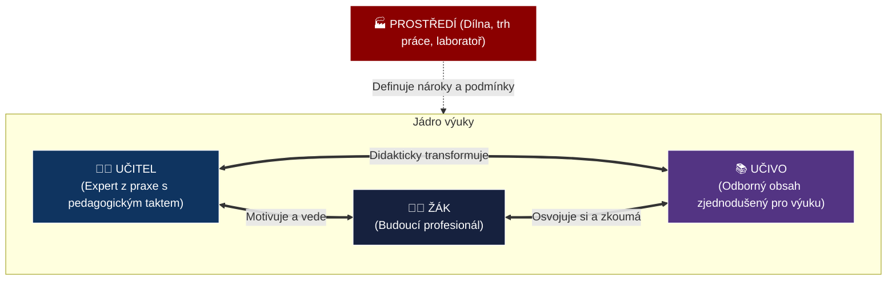

### Kurikulární dokumenty: Od státu k učiteli

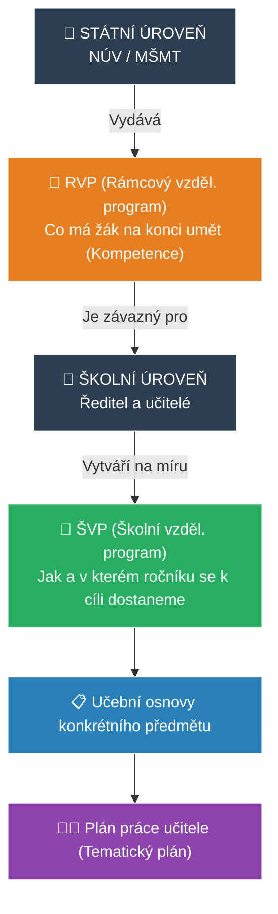

---

## Záludnosti a doplňující otázky

### ❓ 1. Co dělat, když se RVP rozejde s aktuální praxí (např. v RVP je povinnost učit staré normy)?
**Odpověď:** RVP je poměrně rigidní dokument (trvá roky, než se inovuje). Učitel ale v rámci ŠVP **může nad rámec RVP inovovat**. Učitel učí to, co vyžaduje RVP v minimální míře (aby žák uspěl u jednotných zkoušek), ale v profilaci školy modernizuje výuku a zařazuje nejnovější technologie. RVP nediktuje, že se *nesmí* učit nic nového, udává pouze společné minimum.

### ❓ 2. Co je největším úskalím tvorby ŠVP na středních odborných školách?
**Odpověď:** **Mezipředmětová roztříštěnost.** Každý učitel je expert na svůj předmět a má tendenci si "urvat" co nejvíce hodin pro sebe, často bez toho, aby komunikoval s kolegy. Stává se tak, že žáci v odborném kreslení kreslí hřídel, ale v technologii obrábění se učí o frézování rovinných ploch. ŠVP musí vznikat týmovou spoluprací (tzv. předmětové komise), aby se učivo prolnulo horizontálně (v témže ročníku) i vertikálně (napříč ročníky).

### ❓ 3. Proč je profilová (praktická) maturitní zkouška pro žáka SOŠ důležitější než státní část?
**Odpověď:** Státní část slouží spíše k ověření gramotnosti a obecné připravenosti (často kvůli prostupnosti na VŠ). Z pohledu trhu práce a zaměstnavatele je ale naprosto irelevantní, kolik bodů má instalatér/IT technik z literárního rozboru Babičky. Zaměstnavatele zajímá, zda absolvent umí odvést odbornou práci. Praktická zkouška simuluje reálný úkol, prokazuje profesní samostatnost, aplikaci BOZP a řešení problémů v reálném čase.

# ODIP 6–10: Metody teoretické výuky, formy a exkurze

> **TL;DR / Audio Shrnutí:**
> Učit odborný předmět neznamená jen přečíst učebnici. Musíme si ujasnit **cíle a obsah** (co přesně budoucí profesionál potřebuje vědět a co už je zbytečná vata). K tomu volíme vhodné **organizační formy** — od klasické hodiny ve třídě až po **exkurzi**, která obrovsky rozšiřuje obzory, pokud je ovšem dokonale připravená (od cílů přes BOZP až po závěrečnou reflexi). Samotné učení pak řídíme pomocí **metod**: ty expoziční (výklad, dialog) slouží k předání nového učiva, fixační (opakování, drill) zajišťují, aby ho žák do druhého dne nezapomněl, a diagnostické (testy, zkoušení) nám oběma ukážou, jak jsme v tom byli úspěšní. Každá metoda má svůj čas a místo; mistrovství učitele spočívá v jejich správném střídání.

---

## Znění státnicových otázek
- **ODIP 6:** Koncepce výchovy a vzdělávání v odborných předmětech. Charakterizujte výchovně-vzdělávací cíle, rozeberte jejich koncepci, doložte příklady. Posuďte obsah vzdělávání a vymezte rozsah učiva s akcentem na základní učivo.
- **ODIP 7:** Formy výuky odborných předmětů. Popište formy výuky, analyzujte jejich účinnost. Analyzujte strukturu různých typů teoretických vyučovacích jednotek.
- **ODIP 8:** Exkurze – příprava, organizace, vyhodnocení. Navrhněte témata. Uveďte zásady přípravy, organizace a vyhodnocení.
- **ODIP 9:** Vyučovací metody – expoziční. Posuďte účinnost monologických a dialogických metod. Navrhněte aktivizační metody, ukažte aplikaci. Metoda samostatné práce.
- **ODIP 10:** Vyučovací metody – fixační a diagnostické. Postupy pro fixaci poznatků. Diagnostika vědomostí, zásady klasifikace. Diferenciace testů a jejich hlavní vlastnosti.

---

## Klíčové pojmy

- **Základní (kmenové) učivo** — nezbytné minimum poznatků a dovedností, bez kterých nelze obor vykonávat (odlišuje se od rozšiřujícího učiva).
- **Organizační forma výuky** — vnější uspořádání podmínek výuky (prostředí, čas, způsob uspořádání žáků). Nejčastější formou je *vyučovací hodina (45 min)*.
- **Exkurze** — specifická organizační forma výuky probíhající v reálném (často pracovním) prostředí mimo školu.
- **Expoziční metody** — metody sloužící k prvotnímu předání nového učiva (např. výklad, přednáška, demonstrace).
- **Fixační metody** — metody sloužící k upevnění a prohloubení učiva (např. opakování, dril, řešení typových úloh).
- **Diagnostické metody** — metody sloužící ke zjištění míry osvojení učiva (zkoušení, testy).
- **Didaktický test** — objektivní nástroj měření výsledků výuky splňující požadavky na validitu a reliabilitu.

---

## Detailní rozebrání problematiky

### ODIP 6: Cíle a Obsah vzdělávání v odborných předmětech

Výuka odborných předmětů nemůže být "všechno o všem". Informací v technice nebo ekonomice přibývá exponenciálně.
Učitel proto musí obsah **didakticky redukovat** a stanovit:
1. **Základní učivo:** To, co musí znát naprosto každý žák, aby prošel. (Např. automechanik *musí* umět popsat 4 doby motoru).
2. **Rozšiřující učivo:** Pro nadané žáky nebo pro hlubší pochopení kontextu. (Např. detailní princip variabilního časování ventilů).

Cíle se dělí do tří sfér (viz PES 18): Kognitivní (znalosti), Psychomotorické (dovednosti) a Afektivní (postoje - např. výchova k bezpečnosti a přesnosti). Cíl odborného předmětu by měl vždy směřovat k **reálné profesní kompetenci**, nikoli jen k odříkání teorie.

---

### ODIP 7: Organizační formy výuky

Forma řeší "V jakém vnějším rámci se učíme?".
1. **Podle místa:** Třída, laboratoř, školní dílna, reálné pracoviště (exkurze, praxe).
2. **Podle uspořádání žáků:**
   - *Hromadná (frontální):* Učitel mluví ke všem. Rychlé, levné, ale pasivní.
   - *Skupinová (kooperativní):* Žáci řeší úkol společně. Dobré pro složitější problémy.
   - *Individuální:* Žák pracuje vlastním tempem na svém zadání.
3. **Podle fází (Struktura vyučovací hodiny):**
   - *Základní (kombinovaná) hodina:* Nejčastější. Má fázi organizační, opakovací (diagnostickou), expoziční (nové učivo), fixační (procvičení) a závěrečnou (zadání DÚ).
   - *Specializované hodiny:* Čistě opakovací (před testem), čistě zkušební, čistě expoziční (úvod do velkého tématu).

---

### ODIP 8: Exkurze (Příprava, organizace, vyhodnocení)

Exkurze není „výlet, aby se neučilo“. Je to náročná organizační forma, která propojuje teorii s realitou podniku.

**3 nezbytné fáze exkurze:**
1. **Příprava (Nejdůležitější!):**
   - *Pedagogická:* Stanovení cílů. Učitel se tam musí jet podívat předem! Připraví pro žáky úkoly (pracovní list).
   - *Organizační:* Doprava, finance, zgrupování žáků, souhlasy rodičů.
   - *Bezpečnostní:* Školení BOZP, zjištění nutnosti OOPP (přilby, reflexní vesty do výroby).
2. **Realizace:**
   - Přesun a poučení na místě. Samotná prohlídka. Žáci plní zadané úkoly (neposlouchají jen pasivně průvodce). Učitel hlídá kázeň a doplňuje průvodce o souvislosti s probraným učivem.
3. **Vyhodnocení (Reflexe):**
   - V nejbližší vyučovací hodině po návratu! (Zážitek rychle bledne).
   - Zhodnocení pracovních listů, diskuze nad tím, co žáky překvapilo, propojení s teorií na tabuli.

*Vhodná témata:* Pásová výroba (Škoda Auto), Logistické centrum (Amazon), Čistička odpadních vod – věci, které nelze ukázat ve třídě.

---

### ODIP 9: Expoziční metody (Předávání nového)

Expoziční metody slouží k seznámení se s novou látkou. Z hlediska aktivity je dělíme na:
1. **Monologické (Transmisivní):**
   - *Výklad, přednáška, popis.* 
   - Účinnost: Velmi vysoká pro rychlé předání faktů, ale žáci udrží pozornost max. 15 minut. Musí být proloženo vizualizací (prezentace, nákres).
2. **Dialogické (Interaktivní):**
   - *Rozhovor (Heuristická metoda):* Učitel pokládá návodné otázky a žáci logicky dospějí k novému poznatku sami. (Např. "Proč myslíte, že se kolejnice v létě kroutí? Co dělá kov v teple?")
   - Účinnost: Pomalejší proces, ale znalost je hlubší a trvalejší.
3. **Samostatná práce:**
   - Práce s textem, manuálem nebo internetem. Učí žáka vyhledávat informace, což je v dnešní době klíčová kompetence (manuály se mění každý rok).

*Aktivizace:* Během výkladu učitel použije „Brainstorming“ nebo „Sněhovou kouli“ (žáci nejdřív přemýšlí sami, pak ve dvojici, pak ve čtveřici), aby je udržel v pozoru.

---

### ODIP 10: Fixační a diagnostické metody

Když učivo odvykládáme (expozice), za hodinu žák zapomene 50 % informací (Ebbinghausova křivka zapomínání). Proto musí přijít **fixace**.

**Fixační postupy:**
- Ústní opakování (shrnutí toho nejdůležitějšího na konci hodiny).
- Řešení typových úloh (výpočty, rýsování).
- Praktické cvičení (manuální dril).

**Diagnostické metody (Hodnocení vědomostí):**
Zjišťujeme, zda žák dosáhl cíle.
- *Ústní zkoušení:* Hluboký vhled do myšlení žáka, možnost doplňujících otázek. Nevýhoda: neobjektivní (haló efekt, tréma), časově extrémně náročné (vyzkouším 3 žáky za hodinu).
- *Písemné zkoušení:* Objektivnější, prověří všechny žáky naráz. Nevýhoda: nevidím, *jak* žák k výsledku došel, jen výsledek.
- **Didaktické testy:** Nástroj k hromadnému a přesnému zjištění vědomostí.
  - *Standardizované (Cermat):* Pečlivě ověřené na vzorku tisíců žáků.
  - *Nestandardizované (Učitelské):* Vytváří si je učitel sám pro svou třídu.

**Hlavní vlastnosti dobrého testu:**
- **Validita (Platnost):** Měří test to, co opravdu měřit má? (Pokud dám do testu z autoopravárenství složité souvětí, kterým žák neporozumí, měřím jeho čtenářskou gramotnost, ne znalost aut).
- **Reliabilita (Spolehlivost):** Pokud test zadám stejné skupině znovu, měly by vyjít podobné výsledky. (Test nesmí být postaven na náhodném tipování).
- **Praktičnost:** Je snadné ho zadat i vyhodnotit (např. zaškrtávací a-b-c-d vs. volné eseje).

---

## Vizualizace

### Ebbinghausova křivka zapomínání a význam FIXACE

### Struktura kombinované vyučovací hodiny (45 min)

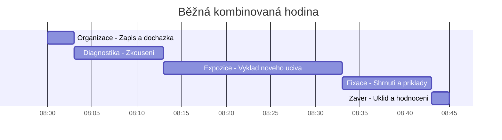

---

## Záludnosti a doplňující otázky

### ❓ 1. Proč je metoda „samostatné práce s textem“ u dnešních žáků často neúspěšná?
**Odpověď:** Narůstá problém se čtenářskou gramotností. Žáci umí text přečíst (dekódovat písmena), ale nedokážou z něj vytáhnout hlavní myšlenku nebo ignorovat nepodstatné detaily. Pokud učitel zadá "přečtěte si strany 10–15 a udělejte výpisky", často žáci opíší první dvě věty z každého odstavce. Samostatná práce s textem se musí *učit* (např. pomocí strukturovaných pracovních listů nebo metody podtrhávání klíčových slov).

### ❓ 2. Jak zabráním tomu, aby si žáci z exkurze udělali „volný den“ a nic si neodnesli?
**Odpověď:** Zlatým pravidlem exkurze je **pracovní list**. Žáci musí mít už při nástupu do autobusu v ruce konkrétní úkoly, které mají v továrně zjistit (např. "Zjistěte 3 způsoby povrchové úpravy karoserie", "Zeptejte se mistra, jak řeší recyklaci oleje"). Pracovní list musí být hodnocen (byť třeba jen formativně / plusem za aktivitu). Druhou pojistkou je provedení okamžité reflexe další hodinu.

### ❓ 3. Je vždy validnější test, který je tzv. "multiple choice" (výběr z možností A-B-C-D)?
**Odpověď:** Ne vždy. Uzavřené testy jsou vysoce reliabilní (objektivní hodnocení – i stroj ho opraví bez chyby), ale mají nižší validitu pro zjištění *hloubky* porozumění. Lze v nich dobře testovat 1. patro Bloomovy taxonomie (zapamatování). Pokud ale chci změřit, zda žák dokáže analyzovat problém a navrhnout řešení (vysoká patra Blooma), je "A-B-C-D" test nevalidní. K tomu potřebuji úkoly s otevřenou (tvořenou) odpovědí.

# ODIP 11–15: Didaktická příprava, prostředky a hospitace

> **TL;DR / Audio Shrnutí:**
> Dobrý učitel neimprovizuje. Za každou úspěšnou vyučovací hodinou se skrývá precizní **didaktická analýza**, kdy učitel učivo nejprve "rozešije" na základní pojmy, určí si vzdělávací cíle a prováže je s tím, co už žáci znají z jiných oborů (**mezipředmětové vztahy**). Teprve pak usedne k psaní **písemné přípravy**, do které naplánuje, jaké metody a **didaktické prostředky** (od učebnice přes modely až po stroje) použije. Vše musí podléhat didaktickým zásadám (např. od jednoduššího ke složitějšímu). A jak ředitel nebo kolega pozná, že je tato příprava kvalitní? Skrze **hospitaci** — kontrolní a poradenskou návštěvu přímo v hodině, jejímž cílem není učitele "potopit", ale pomoci mu zkvalitnit výuku.

---

## Znění státnicových otázek
- **ODIP 11:** Materiální didaktické prostředky. Vysvětlete funkci a vliv na zvyšování účinnosti výuky. Zaměřte se na význam textových pomůcek (učebnic) po metodické stránce a jejich využití.
- **ODIP 12:** Didaktická analýza a její kroky. Popište jednotlivé kroky, konkretizujte u vybraného celku. Stanovte cíle, formu, metody a prostředky. Uveďte faktory ovlivňující učitele.
- **ODIP 13:** Mezipředmětové vztahy a didaktické zásady. Objasněte podstatu a význam mezipředmětových vztahů (MPV) ve výuce. Aplikujte didaktické zásady.
- **ODIP 14:** Příprava na vyučovací jednotku. Analyzujte obsahové a formální náležitosti přípravy. Přizpůsobte volbu prostředků. Zdůrazněte možnosti výchovného působení.
- **ODIP 15:** Hospitační činnost v odborných předmětech. Popište hospitaci jako evaluační nástroj, její cíle, způsoby realizace, subjekty, kritéria hodnocení a náležitosti hospitačního záznamu.

---

## Klíčové pojmy

- **Didaktická analýza učiva** — myšlenkový proces učitele (prováděný před výukou), při kterém rozkládá učivo na základní pojmy, hledá souvislosti a transformuje je pro pochopení žákem.
- **Didaktické prostředky** — všechny materiální (pomůcky, stroje, učebny) i nemateriální (metody, formy) nástroje, kterými učitel dosahuje výukových cílů.
- **Učební pomůcky** — nosiče informací (modely, přístroje, učebnice), které usnadňují pochopení probírané látky díky názornosti.
- **Mezipředmětové vztahy (MPV)** — propojování poznatků a dovedností z různých předmětů za účelem vytvoření komplexního obrazu u žáka (odstranění tzv. "škatulkování" znalostí).
- **Didaktické zásady** — obecná pravidla a požadavky, která by měla platit v každé výuce (např. zásada názornosti, přiměřenosti, postupnosti). Komenského vynález.
- **Hospitace** — přímé pozorování a hodnocení výchovně-vzdělávacího procesu ve vyučovací hodině (zpravidla provádí ředitel, zástupce nebo jiný učitel).

---

## Detailní rozebrání problematiky

### ODIP 12 a 14: Didaktická analýza a Příprava na hodinu

*(Pozn.: Tyto dvě otázky na sebe bezprostředně navazují. Analýza je myšlenkový proces, příprava je jeho papírový výstup.)*

**Didaktická analýza (Kroky):**
1. **Pojmová analýza:** Učitel si vezme téma (např. *Elektrický obvod*) a vypíše si všechny odborné pojmy (zdroj, spotřebič, napětí, proud, odpor).
2. **Výběr základního a rozšiřujícího učiva:** Rozhodne, co musí umět každý žák (Ohmův zákon) a co je jen pro nadané (Kirchhoffovy zákony).
3. **Analýza vztahů (MPV):** Kde se s tím žáci už setkali? (Např. ve fyzice probírali napětí).
4. **Stanovení výukových cílů:** Musí být měřitelné (viz Bloomova taxonomie v PES 18). Tedy: *„Žák podle schématu správně zapojí jednoduchý elektrický obvod.“*
5. **Volba metod a forem:** Jak se k cíli dostaneme? Bude to výklad s ukázkou na tabuli, nebo samostatná práce s elektronikou v laboratoři?
6. **Volba prostředků:** Co k tomu potřebuji (kabely, žárovky, multimetr).

**Příprava na vyučovací jednotku:**
Mladý učitel by si měl psát **podrobnou písemnou přípravu**. Zkušený učitel má často "bleskovou" přípravu, ale nikdy nejde do třídy s prázdnou hlavou.

*Náležitosti přípravy (co musí obsahovat):*
- **Hlavička:** Třída, předmět, datum, téma hodiny.
- **Cíl hodiny:** Co se žáci naučí.
- **Fáze hodiny (Časový snímek):** 
  - 5 min: zápis, opakování. 
  - 20 min: výklad nového učiva (expozice). 
  - 15 min: samostatné procvičování (fixace). 
  - 5 min: shrnutí a DÚ.
- **Výchovné působení:** U odborných předmětů to je vždy *výchova k BOZP* a *přesnosti / zodpovědnosti za práci*.

---

### ODIP 11: Materiální didaktické prostředky

Učit odborný předmět (např. programování CNC strojů nebo anatomii pro kadeřnice) bez pomůcek je jako učit plavat na suchu. Materiální prostředky rozdělujeme na:
- **Žákovské pomůcky:** Sešity, rýsovací potřeby, pracovní oděv.
- **Učitelské pomůcky:** Modely (řez motorem), skutečné předměty (vadná součástka pro ukázku trhliny), audiovizuální technika.
- **Zařízení školy:** Tabule, projektor, speciálně vybavená laboratoř, cvičná kuchyně.

**Vliv na účinnost výuky:**
Zapojují více smyslů. Pokud žák pouze slyší definici (10 % zapamatování), ale pokud vidí reálný vadný píst, může si ho osahat a porovnat se zdravým kusem, zapamatování stoupá k 80 %. Jde o uplatnění **Zásady názornosti**.

**Textové učební pomůcky (Učebnice):**
- Pro učitele je to zdroj pro přípravu (ale neměl by to být jediný zdroj!).
- Pro žáka to je opora pro fixaci a opakování. 
- *Metodické využití:* Žáci neumí z učebnic automaticky studovat. Učitel by s nimi měl text aktivně rozebrat (hledat klíčová slova, klást k textu otázky - tzv. činnostní čtení). V moderní době textovou pomůckou není jen kniha, ale i e-learningové materiály a technické normy (tabulky).

---

### ODIP 13: Mezipředmětové vztahy a Didaktické zásady

**Mezipředmětové vztahy (MPV):**
Zabraňují "atomizaci" vědomostí (stavu, kdy žák umí matematiku v hodině matematiky, ale neumí ji aplikovat v dílně, aby spočítal spotřebu materiálu).
- *Horizontální MPV:* Vztahy mezi předměty v témže ročníku (např. ve stejnou dobu se probírají kovy v chemii a obrábění kovů v odborném výcviku).
- *Vertikální MPV:* Návaznost na učivo z nižších ročníků (na fyziku ze ZŠ navazuje na SŠ statika a mechanika).

**Didaktické zásady:**
Základní "zákony" učitelství, zformulované z velké části J. A. Komenským:
1. **Zásada názornosti:** Učit primárně přes smysly (ukázat, osahat).
2. **Zásada přiměřenosti:** Obsah a tempo musí odpovídat věku a úrovni žáků.
3. **Zásada posloupnosti a systematičnosti:** Postupovat od známého k neznámému, od jednoduchého ke složitému, od konkrétního k abstraktnímu.
4. **Zásada uvědomělosti a aktivity:** Žák musí vědět, *proč* se to učí, a sám při učení vyvíjet činnost (ne jen pasivně sedět).
5. **Zásada trvalosti:** Nutnost neustálého opakování (fixace) a propojování s praxí.

---

### ODIP 15: Hospitační činnost

Hospitace je pozorování výuky (typicky ze zadní lavice). Slouží k evaluaci (vyhodnocení kvality), nikoli k "nachytání" učitele při chybě.

**Cíle a subjekty:**
- *Kontrolní (Ředitel/zástupce):* Splňuje učitel ŠVP? Dodržuje BOZP? Je objektivní při klasifikaci?
- *Metodicko-poradenská (Uvádějící učitel nebo kolega):* Pomoc začínajícímu kolegovi, sdílení dobré praxe.

**Fáze hospitace:**
1. **Příprava:** Hospitující si zjistí, co se bude probírat (často proběhne krátký rozhovor s učitelem před hodinou). Hospitace nikdy nebývá "tajná".
2. **Pozorování v hodině:** Hospitující nevyrušuje! Nedělá zápisy na tabuli za učitele, do průběhu nezasahuje. Pozoruje interakci a zapisuje si časy (tzv. snímek hodiny).
3. **Rozbor (Pohospitační pohovor):** Klíčová část. Odehrává se v klidu po vyučování. **Nejprve hodnotí sám sebe učitel** (sebereflexe: "Dneska se mi nepovedlo to zkoušení..."). Teprve pak dává zpětnou vazbu hospitující.

**Hospitační záznam:**
Je to oficiální (často digitalizovaný) dokument uložený u vedení školy. Obsahuje datum, jméno učitele, téma hodiny a hodnocení kritérií (přiměřenost výkladu, aktivizace žáků, kázeň, pomůcky). Končí písemným závěrem (doporučením) a podpisy obou stran.

---

## Vizualizace

### Proces Didaktické analýzy učiva

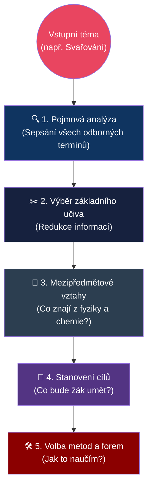

### Typický průběh hospitace (Evaluační cyklus)

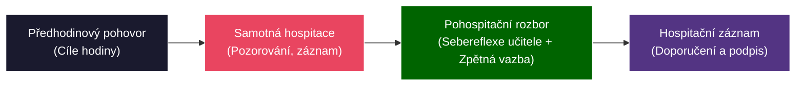

---

## Záludnosti a doplňující otázky

### ❓ 1. Dá se dodržet "Zásada posloupnosti a systematičnosti" v praxi, když mi mistr pošle žáka, ať k autu hned přimontuje kolo, a on ještě nezná teorii momentů sil?
**Odpověď:** Zásada posloupnosti "od teorie k praxi" není posvátná kráva. Někdy (zejména v oborovém výcviku) je efektivnější postupovat induktivně (viz Kolbův cyklus, PES 24): nechat žáka udělat konkrétní úkon a *následně* na tom vystavět teorii. Podstatou systematičnosti je, aby v poznání žáka nakonec nezůstala bílá místa. Není dogma, čím se musí začít.

### ❓ 2. Pokud se jako učitel před hospitujícím ředitelem v hodině zaseknu a udělám odbornou chybu, znamená to automaticky špatné hodnocení z hospitace?
**Odpověď:** Ne, pokud chybu učitel sám odhalí a správně zareaguje! Zkušený hospitující nečeká divadlo bez chybičky, ale sleduje reakci učitele. Přiznat před žáky "Aha, teď jsem to na tabuli napsal špatně, vidíte někdo kde?" je projevem pedagogického taktu a neformální autority (nepředstírá vševědoucnost). Hlavní průšvih je chybu zatlouct nebo svést na žáky.

### ❓ 3. Má smysl dělat písemnou přípravu i pro staršího učitele, který učí totéž už 10 let?
**Odpověď:** Rozhodně. Nemusí jít o přípravu na tři stránky (stačí mu 5 odrážek na papírku), ale učitel musí reagovat na konkrétní třídu. Letošní třída je "slabší" než loňská, takže v přípravě musí zařadit více fixačních metod a zpomalit tempo. Pokud učitel použije přesnou kopii přípravy z roku 2014, výuka nedopadne dobře.

# ODIP 16–20: Praxe, dovednosti a učitel odborného výcviku

> **TL;DR / Audio Shrnutí:**
> Učitel praktického vyučování (mistr) nemá před sebou tabuli, ale reálný stroj, pacienta nebo rozvaděč. Je pro žáky přímým **profesním vzorem**. Učí je, že práce se neskládá z chaotických pohybů, ale z logicky seřazených **pracovních úkonů, operací a postupů**. Aby si žáci vytvořili správné a bezpečné **návyky**, nestačí jim to jen říct – musí si projít fázemi od nácviku naslepo až po automatizaci. K tomu si mistr definuje jasné **dovednostní cíle** (např. *dokázat svařit koutový svar*) i **výchovné cíle** (např. *uklidit si po sobě dílnu*). Tento učitel ale není na škole sám; musí intenzivně **spolupracovat** s učiteli teoretických předmětů (předmětová komise), aby žáci v dílnách nedělali věci, jejichž teorii ještě v lavicích neprobrali.

---

## Znění státnicových otázek
- **ODIP 16:** Osobnost učitele praktického vyučování. Vliv na žáky, atributy. Činnost plánovací, řídicí, kontrolní. Mimoškolní činnost a zvyšování kvalifikace.
- **ODIP 17:** Formy spolupráce mezi učiteli praktického vyučování a ostatními. Mezipředmětové a vnitropředmětové vztahy v praxi. Vztah praxe a teorie. Předmětová (metodická) komise.
- **ODIP 18:** Dovednostní cíle praktického vyučování. Stanovení cílů pro konkrétní jednotku. Výchovné cíle a jejich význam.
- **ODIP 19:** Postup při vytváření praktických dovedností a návyků. Vysvětlete pojmy dovednost a návyk, jejich rozdělení a postup osvojování.
- **ODIP 20:** Základní pojmy didaktiky praktického vyučování: pracovní postup, pracovní operace, pracovní úkon. Konkretizace u vybraného tématu.

---

## Klíčové pojmy

- **Dovednost** — schopnost žáka úspěšně vykonávat určitou činnost (např. dovednost řídit auto, dovednost zapojit obvod). Dovednost se skládá z osvojených vědomostí a návyků.
- **Návyk** — zautomatizovaná složka dovednosti (např. šlápnutí na spojku při řazení). Nevyžaduje už plnou vědomou pozornost.
- **Pracovní úkon** — nejmenší, dále nedělitelná část práce (např. uchopení šroubováku).
- **Pracovní operace** — ucelený soubor úkonů s jasným dílčím výsledkem (např. zašroubování vrutu).
- **Pracovní postup** — logický a chronologický sled pracovních operací vedoucí ke vzniku hotového výrobku (např. výroba stoličky).
- **Předmětová komise** — tým učitelů příbuzných předmětů (např. komise elektro), kteří společně tvoří plány a slaďují teorii s praxí.

---

## Detailní rozebrání problematiky

### ODIP 20: Struktura práce (Úkon, operace, postup)

Při výuce praxe (odborného výcviku) nelze žákovi říct "vyrob to". Práce se musí didakticky rozložit:
1. **Pracovní postup (Nejsložitější):** Celý návod od začátku do konce. 
   - *Příklad:* Výroba prodlužovacího kabelu.
2. **Pracovní operace (Střední úroveň):** Skládá postup. Musí mít technologický smysl.
   - *Příklad:* Odizolování kabelu; Nalisování dutinek; Zapojení do vidlice. Učitel často v 1. ročníku učí a známkuje jen jednotlivé operace, ne celé postupy.
3. **Pracovní úkon (Základní jednotka):** Většinou jde o motorický pohyb ruky nebo těla.
   - *Příklad:* Stisk rukojeti lisovacích kleští. 

---

### ODIP 18 a 19: Cíle a vytváření dovedností a návyků

**Cíle praktického vyučování:**
Zatímco teorie má cíle převážně kognitivní (znalosti), praxe se soustředí na:
1. **Dovednostní (Psychomotorické) cíle:** Týkají se těla a pohybu. (Např. *Žák správně drží pilník a oddělí materiál s přesností na 1 mm.*).
2. **Výchovné (Afektivní) cíle:** V praxi jsou kriticky důležité! (Např. *Žák dodržuje BOZP, nosí ochranné brýle a po práci uklidí pracoviště.*). Zručnost bez zodpovědnosti vede k pracovním úrazům a ekonomickým škodám.

**Rozdíl mezi dovedností a návykem:**
- *Dovednost* je vědomá (vím, co dělám a proč). Dělíme je na intelektové (čtení výkresu), senzomotorické (řezání materiálu) a komunikační (jednání se zákazníkem).
- *Návyk* je automatismus vzniklý opakovaným drilem. Výborný je návyk bezpečné práce (automaticky si beru brýle), špatný je zlozvyk (držím myš tak, že mě bolí zápěstí).

**Postup vytváření senzomotorických dovedností (Jak to naučit):**
1. **Seznámení a motivace:** Žák musí vědět, co jdeme dělat a proč (ukázka hotového výrobku).
2. **Instruktáž (Ukázka učitele):** Učitel činnost předvede v reálném čase, pak zpomaleně s výkladem. (Viz ODIP 22).
3. **Imitace (Pokus žáka):** Žák se snaží učitele napodobit. Učitel hned koriguje chyby! Zde se fixují zlozvyky, nesmí se to podcenit.
4. **Cvičení a dril (Automatizace):** Žák činnost opakuje tak dlouho, dokud z ní nevznikne návyk. Činnost se zrychluje a zpřesňuje.
5. **Aplikace:** Žák dovednost využije v novém, složitějším komplexním úkolu.

---

### ODIP 16: Osobnost učitele praktického vyučování

Učitel odborného výcviku (UOV / mistr) je s žáky často až 6 hodin v kuse v jednom dni. Má na ně obrovský výchovný vliv. Ztělesňuje pro ně vztah k řemeslu.

**Atributy a činnosti:**
- **Plánovací činnost:** Připravuje harmonogram prací, rozděluje žáky na pracoviště, zajišťuje materiál (objednávky u dodavatelů, protože jinak žáci nemají z čeho vyrábět).
- **Řídicí činnost:** Přímo vede provoz na dílně. Má zodpovědnost za BOZP a dodržování technologické kázně. Je to manažer mikropodniku (dílny).
- **Kontrolní a rozhodovací:** Hodnotí výrobky žáků (např. pomocí posuvného měřítka, kde se nedá subjektivně uhádat, že to je "dobře", když to nesedí). Rozhoduje o vyřazení zmetku.
- **Mimoškolní činnost a kvalifikace:** Obory se vyvíjí brutální rychlostí (např. IT, elektro, auto). Pokud mistr nespolupracuje s firmami a nejezdí na školení dodavatelů, za 3 roky učí muzejní historii.

---

### ODIP 17: Formy spolupráce a Mezipředmětové vztahy

Toxickým neduhem mnoha škol je boj mezi učiteli teorie ("Ti dole v dílnách žáky nic nenaučí") a mistry praxe ("Ti nahoře v teorii je učí zbytečnosti"). 

**Předmětová (Metodická) komise:**
Klíčový orgán školy. Sdružuje učitele teorie a praxe daného oboru. Úkoly komise:
- Sjednocovat požadavky na žáky.
- Provazovat (koordinovat) výuku: Zamezit tomu, aby žáci v dílnách svařovali metodou TIG, zatímco v teorii ještě ani neprobrali elektrický oblouk.
- Shodnout se na nákupu nového vybavení.

**Typy vztahů:**
- **Mezipředmětové vztahy (MPV):** Vztah praxe a ostatních předmětů. (Např. žák u CNC stroje musí aplikovat znalosti z Matematiky a ze strojírenské Technologie).
- **Vnitropředmětové vztahy (VPV):** Návaznost učiva v rámci jednoho předmětu. (Než začnu řezat závit, musím umět navrtat díru = návaznost operací).

---

## Vizualizace

### Hierarchie pracovní činnosti

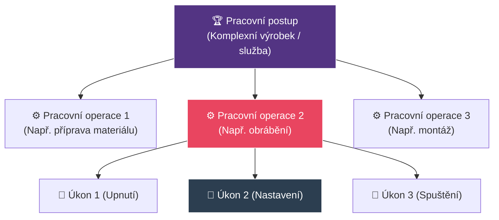

### 5 fází osvojení motorické dovednosti

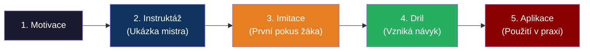

---

## Záludnosti a doplňující otázky

### ❓ 1. Proč je tak těžké odstranit "zlozvyk", který si žák v dílně zafixoval?
**Odpověď:** Zlozvyk je špatně provedená činnost, která se opakovaným drilem přesunula ze stádia "dovednost" do stádia "návyk". V ten okamžik ji už neřídí vědomá (pomalá) část mozku, ale automatická. Aby mistr zlozvyk odstranil, musí žáka "donutit" na činnost znovu začít myslet (přesunout ji zpět do vědomí), narušit staré neurální dráhy a vytvořit nové. To stojí obrovské množství energie a frustrace u obou. Proto je klíčové chytit chybu v 3. fázi (Imitace) dříve, než se zautomatizuje!

### ❓ 2. Co to znamená, když má mistr odborného výcviku vysokou „neformální autoritu“?
**Odpověď:** Formální autorita je dána "funkcí" (Jsem učitel, vy mě musíte poslouchat a mohu vám dát pětku). Neformální autorita je dána "respektem". Žáci mistra poslouchají, protože vidí, že svému oboru dokonale rozumí, je spravedlivý a dokáže poradit. V odborném výcviku, kde jsou žáci blízko skutečným zraněním a stresu z nepovedené práce, nelze přežít pouze s formální autoritou.

### ❓ 3. Který výchovný cíl je v praktickém vyučování nejvíce "kamenem úrazu"?
**Odpověď:** Hospodaření s materiálem a úklid (pracovní morálka). Žáci mají často pocit, že škola platí vše. Nerespektují ekonomiku (zkazím hliníkovou kostku, vezmu si druhou). Výchovným cílem mistra musí být vytvořit v žákovi zodpovědnost za hodnotu materiálu a nástrojů – na reálném pracovišti jim zničený materiál firma strhne z výplaty.

# ODIP 21–25: Organizační formy, metody a struktura učebního dne v praxi

> **TL;DR / Audio Shrnutí:**
> Odborný výcvik (praxe) netrvá 45 minut jako běžná hodina, ale tvoří celý **učební den** (až 7 hodin v kuse). Aby z toho žák nezkolaboval a zároveň se něco naučil, musí mít den pevnou strukturu (**články učebního dne**): začíná se úvodní instruktáží, následuje ukázka (kde má učitel hlavní slovo), přechází se do nácviku (kde už pracují žáci a učitel jen obchází a opravuje) a končí se závěrečným hodnocením. Kromě školních dílen ale existují i jiné **formy praxe** – od exkurzí až po tu nejcennější: individuální praxi přímo ve firmě. K učení žáků pak mistr nevyužívá sáhodlouhé přednášky, ale **metody praktického vyučování** (instruktáž s ukázkou), kdy propojuje slovo s reálným fyzickým pohybem.

---

## Znění státnicových otázek
- **ODIP 21:** Organizační formy praxe. Uveďte formy praxe, vysvětlete typ dovedností v ročnících, rozsah na vaší škole.
- **ODIP 22:** Vyučovací metody v praktickém vyučování. Zhodnoťte metody a charakterizujte prvky metodického postupu při osvojování dovedností a návyků.
- **ODIP 23:** Varianty praktických vyučovacích jednotek. Možné varianty a pro které praktické jednotky jsou vhodné.
- **ODIP 24:** Typy učebních dnů. Jakých typů lze využít v praktickém vyučování a kdy byste je zařadili?
- **ODIP 25:** Základní články struktury všeobecného učebního dne (kombinovaného). Vyjmenujte, vysvětlete. Požadavky na učební den.

---

## Klíčové pojmy

- **Odborný výcvik (OV)** — vyučovací předmět s vysokou dotací hodin (na SOU tvoří až 50 % času), kde si žák osvojuje psychomotorické dovednosti pro své budoucí povolání.
- **Učební den** — základní časový a organizační celek v OV. Trvá typicky 6–7 vyučovacích hodin (po 60 minutách, na rozdíl od 45min teorií!).
- **Instruktáž** — stěžejní metoda praktického vyučování. Kombinuje slovní vysvětlení a bezprostřední smyslovou (vizuální) ukázku postupu mistrem.
- **Individuální praxe** — forma výuky probíhající na smluvním pracovišti (ve skutečné firmě), kde žák pracuje po boku instruktora (zaměstnance firmy).
- **Kombinovaný (všeobecný) učební den** — standardní den v dílnách, kdy se míchá teoretický úvod, osvojování nové dovednosti, procvičování staré a závěrečný úklid/hodnocení.

---

## Detailní rozebrání problematiky

### ODIP 21: Organizační formy praxe a posloupnost ročníků

Rozlišujeme několik základních forem, kde může praxe probíhat:
1. **Dílenská (školní) praxe:** Probíhá ve speciálně vybavených školních dílnách (cvičných laboratořích, kuchyních). Prostředí je přizpůsobeno žákům (stroje s extra bezpečností). Skupinová forma výuky (mistr má na starosti např. 12 žáků).
2. **Skupinová praxe na reálném pracovišti:** Celá skupina žáků s jedním mistrem jede např. stavět skutečnou zeď na zakázku.
3. **Individuální (provozní) praxe:** Žák z vyššího ročníku je přiřazen do reálné firmy jako "pracovník" pod dohledem podnikového instruktora.
4. **Exkurze:** Pozorovací praxe, nenasazují se montérky (viz ODIP 8).

**Návaznost v ročnících:**
- *1. ročník:* Osvojování zcela základních *pracovních úkonů* a operací. (Řezání, pilování, pájení). Žáci jsou chráněni v simulovaném prostředí školních dílen.
- *2. ročník:* Žáci provádějí *celé pracovní postupy* (vyrábí jednoduché sestavy). Často pracují na zakázkách pro školu.
- *3. (a 4.) ročník:* Samostatnost. Řešení komplexních celků, často rovnou na individuálních pracovištích u zaměstnavatelů.

---

### ODIP 22: Vyučovací metody v praktickém vyučování

Přednáška mistrovi v dílně nepomůže. Metody praxe se řídí pravidlem: **„Slyším – zapomenu, Vidím – zapamatuji si, Udělám – pochopím.“**

1. **Instruktáž (Slovní metoda + Ukázka):** Nejpoužívanější metoda.
   - Učitel nejprve vysvětlí postup slovně. 
   - Pak ho reálně předvede (ukázka v reálném čase, aby žáci viděli dynamiku a rytmus).
   - Následuje ukázka zpomalená, krok za krokem, upozornění na kritická místa.
   - *Metodický prvek:* Během instruktáže musí mít učitel všechny žáky v půlkruhu tak, aby mu **viděli na ruce** (nesmí k nim stát zády).
2. **Cvičení a dril (Pracovní metoda):** Žáci opakují danou operaci. Cílem je přesun od pomalé vědomé kontroly k rutinnímu návyku (zrychlení, snížení zmetkovitosti).
3. **Laboratorní a projektová metoda:** Aplikace pro vyšší ročníky. Žák dostane zadání ("Navrhni a smontuj funkční obvod k ovládání motoru z více míst") a postup volí sám.

---

### ODIP 24: Typy učebních dnů (Z hlediska obsahu)

Protože se v dílnách tráví celý den (často od 7:00 do 14:00), učební den má různé "žánry" podle toho, co se učí:
1. **Úvodní (expozicní) den:** Mistr vysvětluje úplně novou látku, bezpečnost pro nový typ stroje. Žáci toho rukama mnoho neudělají, den je spíše pozorovací.
2. **Nácvičný (fixační) den:** Nejčastější ve 2. ročníku. Dělá se jedna stejná operace dokola.
3. **Kombinovaný (všeobecný) učební den:** Zlatý standard. Polovinu dne cvičíme staré, druhou polovinu se učíme nové operace.
4. **Zkušební (diagnostický) den:** Den pololetních zkoušek, ročníkových prací nebo samotných Závěrečných učňovských zkoušek (NZZ).
5. **Souborné práce:** Práce na velkém a dlouhodobém projektu (např. třída vyrábí 50 kusů židlí pro školu).

---

### ODIP 23 a 25: Varianty jednotek a Články (struktura) kombinovaného učebního dne

Rozvrhnout pozornost a fyzickou sílu patnáctiletého člověka na 7 hodin fyzické práce není sranda. **Všeobecný učební den má pevnou, téměř vojenskou strukturu:**

**1. Úvodní část (Organizace a Instruktáž):**
   - *Ranní nástup:* Kontrola přítomnosti, vhodnosti pracovního oděvu a stavu žáků (únava, nemoc, příznaky zneužití látek – klíčové pro bezpečnost!).
   - *Rozdělení práce:* Kdo bude u jakého svěráku/stroje. 
   - *Instruktáž a ukázka* nové látky (s vysvětlením BOZP). 
   - Přidělení materiálu a nářadí.

**2. Pracovní část (Hlavní gro dne - Fixace a Nácvik):**
   - Žáci pracují.
   - *Činnost učitele (Hromadná instruktáž):* Učitel "obchází revír". Pokud vidí, že celá třída drží pilník špatně, práci **zastaví**, svolá všechny dohromady a chybu znovu vysvětlí (hromadná korekce).
   - *Individuální instruktáž:* Učitel obchází jednotlivce a drobně je koriguje ("Tlač víc levým ramenem").

**3. Závěrečná část (Diagnostika a Úklid):**
   - 30 minut před koncem se ukončuje výroba.
   - *Odevzdání prací.*
   - *Vyhodnocení (Reflexe):* Učitel veřejně předstoupí, vezme 2 povedené a 2 zkažené výrobky. Vysvětlí, proč se povedly a kde se stala chyba (chyba není trestána, pokud je z ní ponaučení). 
   - *Úklid:* Stroje a pracoviště musí být odevzdány v dokonalém stavu pro další směnu. Mistr přebírá nářadí.

---

## Vizualizace

### Hierarchie forem praktického vyučování

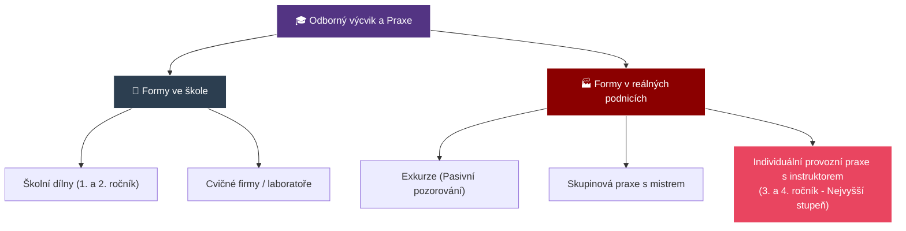

### Struktura všeobecného učebního dne

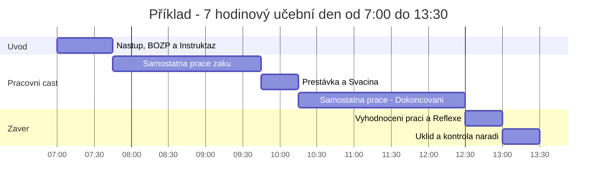

---

## Záludnosti a doplňující otázky

### ❓ 1. Proč musí proběhnout "instruktáž (ukázka)" nejprve v reálném čase a až poté zpomaleně? Nebylo by bezpečnější to rovnou ukázat krok po kroku pomalu?
**Odpověď:** Pokud žák uvidí složitou pohybovou operaci (např. hod oštěpem nebo soustružení plynulého oblouku) pouze rozsekanou a zpomalenou, nepochopí vnitřní "rytmus a dynamiku" daného pohybu. Výsledkem bude robotické, trhavé provádění, které často vede u strojů k fatálním chybám. Žák musí nejprve vidět cíl – plynulou, ladnou práci profesionála. Až k tomu se přidá pomalý "krok za krokem" rozbor.

### ❓ 2. Co je největším rizikem individuální (provozní) praxe ve firmách a jak tomu škola předchází?
**Odpověď:** Riziko "levné pracovní síly". Firmy často vezmou žáky ve 3. ročníku na praxi, ale místo aby je rotovaly po provozech a nechaly podnikového instruktora věnovat se jim, strčí žáka na měsíc k pásu nebo mu dají do ruky koště a nechají ho zametat dvůr. Škola tomu brání **Smlouvou o obsahu praxe** a pravidelnými kontrolami učitele OV, který přijede neohlášeně do firmy zkontrolovat, zda žák plní činnosti odpovídající ŠVP.

### ❓ 3. Proč je u ranního nástupu v dílnách vyžadována kontrola stavu žáků (zatímco učitel dějepisu to neřeší)?
**Odpověď:** Jde o zásadní požadavek BOZP. Pokud sedí nevyspalý, podnapilý žák s kocovinou v lavici na dějepisu, nejhorší, co se stane, je, že usne. Pokud postaví učitel odborného výcviku téhož žáka v 7:15 za formátovací pilu nebo s napětím 230V do ruky, vystavuje žáka riziku amputace / smrti a sebe obvinění z trestného činu ublížení z nedbalosti.

# ODIP 26–30: Hodnocení praxe, příprava učitele a bezpečnost na dílnách

> **TL;DR / Audio Shrnutí:**
> Hodnotit žáka v dílnách znamená víc než jen obodovat test. Mistr nehodnotí papír, ale reálný výrobek nebo službu, a proto musí mít předem jasně stanovená objektivní **kritéria a ukazatele** (např. *je svar rovný a struska odklepaná?*). Nejde jen o výsledek, ale i o proces – dodržel žák BOZP? Měl uklizený ponk? Aby tohle všechno mohlo proběhnout, musí mistr odvést obrovský kus neviditelné práce už odpoledne předtím: jde o **materiální přípravu** (zkontrolovat stroje, nařezat tyčovinu, připravit výkresy) i o **pedagogickou přípravu** (deník OV, plán hodiny). Pokud se na to mistr vykašle, výuka skončí v chaosu nebo zraněním, na což se rychle přijde během **hospitace**, která v dílnách hlídá nejen pedagogickou kvalitu, ale i rizika úrazů.

---

## Znění státnicových otázek
- **ODIP 26:** Metody prověřování praktických dovedností. Způsoby prověřování, kritéria klasifikace, vymezení klasifikačních stupňů u konkrétního tématu.
- **ODIP 27:** Metody zkoušení a hodnocení v praktickém vyučování. Formy zkoušení. Ukazatele hodnocení praktického vyučování a jejich důležitost.
- **ODIP 28:** Materiální příprava na praktickou vyučovací jednotku. Význam, materiální a organizační zabezpečení na vaší SŠ.
- **ODIP 29:** Příprava učitele na praktickou vyučovací jednotku. Pedagogické dokumenty, vyjmenujte a popište náležitosti.
- **ODIP 30:** Hospitační činnost v praktickém vyučování. Popište činnost na pracovišti OV a zaměřte se na možné rizikové situace.

---

## Klíčové pojmy

- **Ukazatele hodnocení v praxi** — soubor měřitelných aspektů žákovy práce, které brání tomu, aby učitel hodnotil jen na základě pocitu (obsahují např. přesnost, rychlost, dodržení postupu, BOZP, úklid).
- **Komplexní práce** — zkušební metoda pro zjištění celkových dovedností žáka (od přečtení výkresu po finální výrobek).
- **Materiální příprava** — zajištění hardwaru (nástrojů, materiálu), nezbytné pro průběh praxe. Bez ní žáci stojí a nudí se.
- **Deník odborného výcviku** — základní úřední dokument mistra prokazující probíranou látku, docházku a BOZP.
- **Hospitace v praxi** — na rozdíl od teoretické výuky zahrnuje silný prvek kontroly bezpečnostních a hygienických norem pracoviště.

---

## Detailní rozebrání problematiky

### ODIP 26 a 27: Prověřování a Hodnocení v praxi

Hodnotit v praxi je objektivnější, ale zároveň náročnější než v teorii, protože se hodnotí *proces* (průběh práce) i *výsledek* (výrobek). 

**Formy a metody prověřování:**
1. **Průběžné prověřování:** Mistr prochází dílnou, sleduje žáka u soustruhu a rovnou mu verbálně dává zpětnou vazbu.
2. **Kontrolní práce (Tematická):** Po ukončení tematického celku.
3. **Zkušební práce (Souborná):** Na konci pololetí. Hodnotí se velký komplexní výrobek. 

**Ukazatele hodnocení (Na co se mistr dívá):**
Aby byla známka spravedlivá, nesmí záležet na sympatiích. Mistr má rozpad hodnocení do 5 kritérií (ukazatelů):
- **Odbornost a přesnost:** Výrobek má správné rozměry (změřeno posuvkou/mikrometrem). Toleranci neokecáte.
- **Dodržení pracovního postupu:** Dělal to žák chronologicky správně, nebo to "spytlíkoval" nakonec?
- **Rychlost (Kvantita) a Samostatnost:** Nepotřebuje žák na utažení šroubu 3 hodiny? Pracoval sám bez dotazů?
- **BOZP a hygiena:** Použil rukavice a brýle?
- **Hospodárnost a úklid pracoviště:** Zničil při tom nástroj za dva tisíce? Zametl piliny?

**Klasifikační stupně (Příklad z praxe: Soustružení čepu):**
- *1 (Výborný):* Rozměry plně v toleranci výkresu. 100% samostatnost, perfektní bezpečnost, čisté pracoviště.
- *3 (Dobrý):* Mírné nepřesnosti v tolerancích. Občas si vyžádal pomoc mistra (zasekl se u výpočtu otáček). Výrobek je ale stále funkční.
- *5 (Nedostatečný):* Výrobek je naprostý zmetek (podmíra). Žák nedodržel BOZP a hrozilo zranění.

---

### ODIP 28 a 29: Příprava Učitele OV (Materiální a Pedagogická)

Zatímco učitel dějepisu může učit, i když ve škole zrovna nejde proud, mistr odborného výcviku má bez připravené dílny 12 patnáctiletých "neřízených střel".

**1. Materiální příprava:**
   - Probíhá předchozí odpoledne po odchodu směny.
   - Mistr musí zajistit materiál (když mají žáci svařovat, musí den předem uříznout na pile 30 kusů úhelníků, zkontrolovat stav plynu v lahvích).
   - Zajištění nástrojů a technické dokumentace (každý žák musí mít vytištěný výkres!).

**2. Pedagogická příprava (Dokumenty):**
   - *Tematický plán:* Rozpis učiva na celý rok. Z něj vychází.
   - *Písemná příprava (Scénář dne):* Zahrnuje organizační zabezpečení (do kdy se dělá), cíl dne, jaké metody použije na ukázku.
   - *Deník odborného výcviku:* Nejdůležitější úřední dokument! Zapisuje se tam absence, téma dne a hlavně **Záznam o proškolení BOZP** na daný den (pokud se stane úraz a není v deníku podpis, jde mistr k soudu).

---

### ODIP 30: Hospitační činnost v praxi (a Rizika)

Hospitující (ředitel / vedoucí praktického vyučování) vstupuje do extrémně rizikového prostředí.
Hodnotí nejen metodiku mistra (jak umí vysvětlovat), ale i **stav dílny a disciplínu**.

**Specifická rizika a co hospitující sleduje:**
- *Pracovní oděvy:* Mají všichni žáci monterky, obuv s pevnou špičkou, dlouhé vlasy v gumičce? Žádné prstýnky nebo řetízky, které může chytit fréza!
- *Pořádek:* Neleží na zemi kabely, o které může někdo zakopnout a padnout na běžící pilu?
- *Pozornost:* Nedovolí mistr žákům sahat na mobilní telefon během práce u stroje? (Sekundová nepozornost = chybějící prst).

Hospitace v praxi má 3 roviny: Pedagogickou (umí mistr učit), Odbornou (umí sám mistr obsluhovat stroj) a Právně-bezpečnostní (BOZP).

---

## Vizualizace

### Ukazatele hodnocení výrobku v praxi (Příklad vah kritérií)

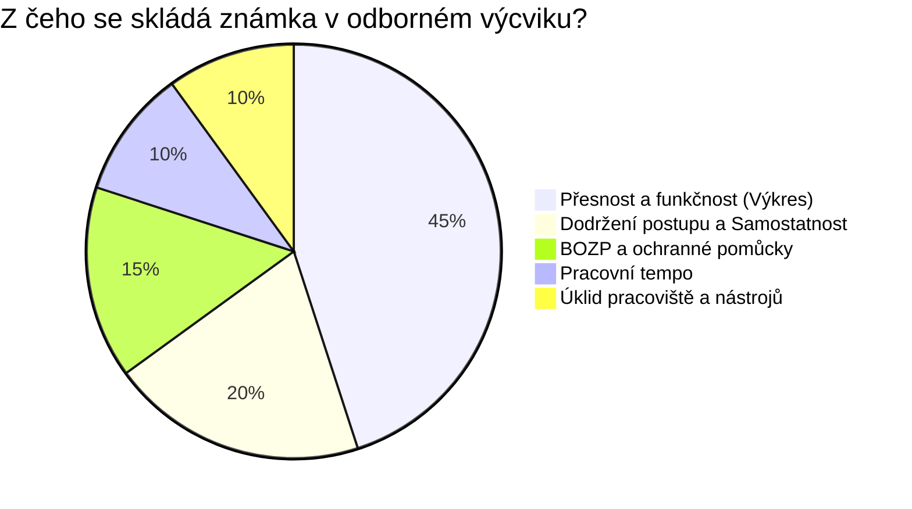

### Harmonogram příprav mistra na Učební den

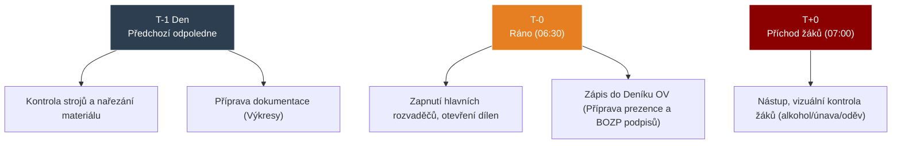

---

## Záludnosti a doplňující otázky

### ❓ 1. Co má dělat mistr, když zjistí, že si k hodnocení naplánoval kontrolní práci (soustružení hřídele), ale před začátkem směny se rozbije hlavní kompresor a stroje nejdou spustit?
**Odpověď:** Zde se projevuje nutnost záložní varianty v pedagogické i materiální přípravě. Mistr nemůže žáky poslat domů. Měl by mít připravený tzv. "suchý program" (náhradní činnost, která odpovídá cílům ŠVP, ale nevyžaduje energii/materiál). Například rozbor technických výkresů, měření tolerancí na již hotových zmetcích, údržbu nářadí nebo zkoušení z teorie BOZP.

### ❓ 2. Když chci dát žákovi 5, protože nedonesl hotový výrobek, ale on se hájí, že měl tupý nůž u soustruhu. Komu padá chyba na hlavu?
**Odpověď:** V takovém případě padá chyba na mistra. Mistr má povinnost zajistit odpovídající *materiální přípravu*. Pokud žák dostal špatný, nebezpečný nebo tupý nástroj a sám nemá oprávnění nebo schopnost (v 1. ročníku) ho nabrousit, nemůže být klasifikován z nedostatečného výkonu, protože nebyly naplněny podmínky pro spravedlivé prověření dovednosti.

### ❓ 3. Je možné při hospitaci na dílnách přerušit mistra a zasáhnout do výuky?
**Odpověď:** Běžně platí tvrdé pravidlo, že hospitující (např. ředitel) sedí vzadu jako "neviditelný duch" a nesmí do hodiny zasáhnout. **V odborném výcviku existuje jedna absolutní výjimka!** Pokud hospitující vidí bezprostřední a vážné porušení BOZP (např. žák zapíná pilu a vedle leží hadr, nebo se naklání k vrtačce s rozpuštěnými vlasy, čehož si mistr nevšiml), je hospitující povinen *okamžitě zasáhnout* a stroj zastavit, i za cenu narušení vyučovacího procesu. Zdraví je nadřazeno didaktice.

