# Psychologie

### Přehled témat ke státní bakalářské zkoušce
### Učitelství praktického vyučování

<div style='page-break-after: always;'></div>

## Seznam otázek z PDF

Přehled témat ke státní bakalářské zkoušce
Učitelství praktického vyučování

Psychologie

PSY 1. Charakterizujte předmět psychologie, její vývoj, disciplíny a metody. Vysvětlete význam
psychologie v pedagogické praxi.

PSY 2. Zařaďte procesy vnímání a představování do struktury psychických jevů, popište je
a objasněte jejich funkci ve výchovně-vzdělávacím procesu.

PSY 3. Zařaďte proces myšlení do struktury psychických jevů, popište jeho formy, druhy,
poruchy a vysvětlete jeho význam v procesu učení.

PSY 4. Popište význam a funkci paměti se zaměřením na důležitost jejích jednotlivých fází
v procesu učení.

PSY 5. Vysvětlete pojem psychický stav, zařaďte jej do struktury psychických jevů, zaměřte se
na objasnění stavu pozornosti, její druhy a možnosti navození a udržení pozornosti ve
vyučování.

PSY 6. Vysvětlete význam citových procesů v životě člověka, uveďte klasifikaci citů a možnosti
jejich rozvoje ve výchovně-vzdělávacím procesu, objasněte pojem emoční inteligence.

PSY 7. Zařaďte volní procesy do struktury psychických jevů, vysvětlete pojem vůle a její
význam v životě člověka, popište možnosti rozvoje volních vlastností ve výchovněvzdělávacím procesu.

PSY 8. Popište faktory utvářející osobnost a vysvětlete jejich vzájemný vztah. Charakterizujte
proces interiorizace a objasněte jeho význam.


---

PSY 9. Pojednejte o složkách struktury osobnosti žáka střední školy a možnostech jejich
ovlivňování ve výchovně-vzdělávacím procesu. Uveďte výhody a nevýhody jednotlivých
typů temperamentu.

PSY 10. Objasněte pojem charakter, zařaďte do systému psychických jevů, uveďte některou
z charakterových typologií, popište možnosti rozvoje morálních vlastností žáků střední
školy.

PSY 11. Vysvětlete psychologický základ motivace, vnitřní a vnější motivy, jejich vzájemné
souvislosti a využití ve výchovně-vzdělávacím procesu.

PSY 12. Popište význam sociální psychologie v systému psychologických věd, vysvětlete pojmy
interakce a vztahy, uveďte jejich vzájemné souvislosti.

PSY 13. Vysvětlete pojem sociální skupina, její charakteristiky, třídění, charakterizujte školní
třídu jako sociální skupinu, vysvětlete možnosti pedagoga při poznávání a formování
třídní skupiny.

PSY 14. Uveďte hlavní zásady komunikace učitel-žák během výchovně-vzdělávacího procesu,
popište význam jednotlivých složek komunikačního procesu, naznačte možné bariéry
v komunikaci a možnosti jejich odstranění.

PSY 15. Charakterizujte druhy náročných situací, vysvětlete jejich význam v životě člověka,
popište metody jejich zvládání, řešení problémových situací, objasněte pojem stres
a zaměřte se na možnosti minimalizace stresorů ve vyučování.

PSY 16. Vysvětlete pojmy sociální status, sociální pozice, sociální role, individuální systém rolí.
Popište role učitele a žáka ve výchovně-vzdělávacím procesu.

PSY 17. Popište rodinu jako primární sociální skupinu a její význam pro socializaci jedince,
charakterizujte základní funkce rodiny.


---

PSY 18. Charakterizujte dysfunkční rodinu, uveďte některé typy dysfunkčních rodin a popište,
jak se dysfunkce projeví na rozvoji dítěte, charakterizujte přístupy učitele k žákům
z dysfunkčních rodin.

PSY 19. Popište předmět pedagogické psychologie, objasněte základní pojmy: vývoj, výchova,
učení, vyučování a vysvětlete trendy ve vyučování od osobnosti k týmové práci, od
znalostí ke kompetencím.

PSY 20. Vyjmenujte druhy učení se zaměřením na učení senzomotorické, popište změny, ke
kterým v jeho průběhu dochází, uveďte, co je jeho výsledkem.

PSY 21. Srovnejte učení se poznatkům s učením se metodám řešení problému, popište, které
psychické jevy se na těchto druzích učení podílejí, co je jejich výsledkem, vysvětlete
pojem učení ve spirále.

PSY 22. Popište proces výchovy, výchovné prostředky a metody, objasněte pojem obrácená
socializace a její důsledky, vysvětlete princip technik modifikace chování.

PSY 23. Charakterizujte učitele v roli poradce, popište jeho základní kvality a přístup k žákovi,
uveďte možné chyby, kterých by se měl učitel v roli poradce vyvarovat.

PSY 24. Vysvětlete pojem metoda výuky a uveďte příklady metod, popište, z jakých činností
učitele a žáka se skládají. Vysvětlete souvislosti mezi metodami výuky, poznávacími
procesy žáka a jeho motivací. Vysvětlete pojem aktivizující metoda. Uveďte příklady
aktivizujících metod a jejich využití ve výuce.

PSY 25. Popište projevy některých poruch socializace (např. lhaní, krádeže, záškoláctví atd.),
vysvětlete jejich příčiny a naznačte možnost nápravy. Zaměřte se na agresivní poruchy
chování, šikanu, její průběh, stadia, druhy a možnosti prevence.

PSY 26. Charakterizujte prenatální, novorozenecké a kojenecké období podle různých
vývojových teorií (Piaget, Freud, Erikson), uveďte klíčová témata psychického,
sociálního a somatického vývoje. Vysvětlete teorii citové vazby (attachmentu).


---

PSY 27. Charakterizujte batolecí a předškolní období podle různých vývojových teorií (Piaget,
Freud, Erikson, Kohlberg), uveďte klíčová témata psychického, sociálního a tělesného
vývoje, zejména vývoj řeči a dětské hry.

PSY 28. Charakterizujte mladší a střední školní věk podle různých vývojových teorií (Piaget,
Freud, Erikson, Kohlberg), uveďte klíčová témata psychického, sociálního a tělesného
vývoje, zejména problematiku školní zralosti.

PSY 29. Charakterizujte dospívání – pubescenci a adolescenci podle vývojových teorií (Piaget,
Freud, Erikson, Kohlberg), uveďte klíčová témata psychického, sociálního a tělesného
vývoje.

PSY 30. Charakterizujte stádia dospělosti a stáří, vysvětlete problematiku rodičovské a profesní
role, krize středního věku a kvality života (stádia dle Eriksona, postformální myšlení,
postkonvenční morálka podle Kohlberga, stádia přijetí smrtelnosti dle Kübler-Rossové).


---


<div style='page-break-after: always;'></div>

## Zpracované materiály

# PSY 1–3: Základy psychologie, vnímání a myšlení

> **TL;DR / Audio Shrnutí:**
> Aby učitel mohl žáky něco naučit, musí vědět, jak funguje lidská mysl. **Psychologie** mu dává do ruky „manuál k mozku“. Pomocí jejích disciplín (jako pedagogická nebo vývojová psychologie) může učitel pochopit, proč se žák v 15 letech chová jinak než ve 20. Samotné učení by nefungovalo bez základních **kognitivních (poznávacích) procesů**. Prvním z nich je **vnímání a představivost**, kterými přijímáme informace z vnějšího světa (zde platí Komenského pravidlo názornosti: čím víc smyslů zapojíme, tím lépe). Následuje vrcholný proces – **myšlení**. To vzájemně propojuje pojmy a řeší problémy. Myšlení a řeč jsou jako dvě strany jedné mince. Když učitel zná, jak tyto procesy fungují, netlačí do žáků informace silou, ale přizpůsobuje výklad tomu, jak je lidský mozek přirozeně zpracovává.

---

## Znění státnicových otázek
- **[DOB]** **PSY 1:** Charakterizujte předmět psychologie, její vývoj, disciplíny a metody. Vysvětlete význam psychologie v pedagogické praxi.
- **[DOB]** **PSY 2:** Zařaďte procesy vnímání a představování do struktury psychických jevů, popište je a objasněte jejich funkci ve výchovně-vzdělávacím procesu.
- **[DOB]** **PSY 3:** Zařaďte proces myšlení do struktury psychických jevů, popište jeho formy, druhy, poruchy a vysvětlete jeho význam v procesu učení.

---

## Klíčové pojmy

- **Psychologie** — věda o lidské psychice, chování a prožívání.
- **Struktura psychických jevů** — lidská psychika se dělí na psychické *procesy* (dynamické, probíhají rychle - např. myšlení), *stavy* (dočasné - např. pozornost, strach) a *vlastnosti* (trvalé - např. temperament).
- **Vnímání (Percepce)** — psychický proces zachycující to, co zrovna *teď a tady* působí na naše smysly. Výsledkem vnímání je *vjem* (celistvý obraz) nebo *počitky* (jednotlivé smyslové podněty - červená barva, kulatý tvar).
- **Představivost** — schopnost vybavit si to, co zrovna teď nepůsobí na smysly (vzpomínka na včerejší oběd), nebo vytvořit obraz něčeho nového (fantazie).
- **Myšlení** — nejvyšší forma poznávacího procesu. Jde o nepřímé a zobecňující poznávání reality, které hledá vztahy mezi pojmy (analýza, syntéza).
- **Pojem** — základní jednotka (forma) myšlení. Spojením pojmů vzniká *soud* a spojením soudů *úsudek*.

---

## Detailní rozebrání problematiky

### PSY 1: Předmět, vývoj a disciplíny psychologie

**Co psychologie zkoumá?**
Psychologie zkoumá chování (vnější, viditelné projevy – např. pláč, mrkání, útěk) a prožívání (vnitřní děje – emoce, myšlenky).

**Stručný vývoj:**
1. *Předvědecká fáze:* Spojena s filozofií. Aristoteles (dílo *O duši*). Věřilo se, že nositelem psychiky je nesmrtelná duše.
2. *Vznik psychologie jako vědy (1879):* **Wilhelm Wundt** zakládá první psychologickou laboratoř v Lipsku. Odděluje psychologii od filozofie pomocí experimentálních metod.
3. *Hlavní směry:*
   - **Behaviorismus:** J. B. Watson. Zkoumá pouze vnější chování (reakce na stimul: S-R model). Odmítá „černou skříňku“ vědomí.
   - **Psychoanalýza:** S. Freud. Zaměřuje se na nevědomí (potlačené pudy, id/ego/superego).
   - **Kognitivní a humanistická psychologie:** Zkoumá poznávací procesy a seberealizaci člověka (viz A. Maslow, C. Rogers v pedagogice).

**Disciplíny:**
- *Teoretické:* Obecná psychologie (co je paměť), Vývojová (od dětství do stáří), Sociální (člověk v davu).
- *Aplikované:* Pedagogická (proces učení), Klinická (nemoci duše), Forenzní (soudní – např. psychologie zločince), Psychologie práce.

**Význam pro učitele:** Učitel, který nerozumí psychologii, učí metodou "pokus-omyl". Psychologie mu radí, jak motivovat, jak řešit konflikty ve třídě a jak žáci vnímají nové informace. K tomu učitel využívá metody jako je *pozorování*, *rozhovor* a *sociometrie*.

---

### PSY 2: Vnímání a představování (Kognitivní procesy)

Oba jevy patří mezi **kognitivní (poznávací) psychické procesy**.

**Vnímání (Percepce):**
- Je to odraz reality. Funguje tady a teď.
- *Zákony vnímání:* Lidský mozek si věci zjednodušuje. Má tendenci vnímat "Figuru" (to hlavní, na co se soustředíme) a "Pozadí" (zbytek). 
- *Vady vnímání:* Iluze (vidím provaz, myslím si, že to je had - podnět existuje, ale mozek ho zkreslí) vs. Halucinace (vidím hada, ale žádný tam není - podnět neexistuje, jde o nemoc).
- **Aplikace v praxi:** Pokud má učitel tichý hlas bez intonace a splývá s tabulí, stává se z něj "pozadí". Aby žáci vnímali ("figura"), musí měnit hlas, psát barevně, ukazovat předměty (Zásada názornosti).

**Představivost a fantazie:**
- Je to obraz něčeho, co momentálně na smysly nepůsobí.
- *Paměťová představa:* Vyvolání toho, co jsem už zažil. (Např. Představ si, jak vypadá Eiffelovka).
- *Fantazie:* Tvorba obrazů, které jsem nikdy neviděl.
- **Aplikace v praxi:** Fantazie u dětí na ZŠ je obrovská, ale na SŠ vlivem drilu upadá. Učitel by ji měl stimulovat (např. projektovou výukou: "Navrhni design nového vozu bez ohledu na současná technologická omezení").

---

### PSY 3: Myšlení a proces učení

Myšlení je nejdokonalejší poznávací psychický proces. Vnímání nám řekne, že vidíme "dvě jablka a dvě jablka", ale myšlení nám dovolí pochopit abstraktní pravidlo "2 + 2 = 4". Myšlení je neoddělitelně spojeno s řečí.

**Myšlenkové operace (Jak mozek přemýšlí):**
- **Analýza:** Rozklad celku na části (motor -> píst, válec, svíčka).
- **Syntéza:** Složení částí do celku (složení motoru dohromady).
- **Indukce:** Od konkrétního k obecnému (Vidím měď, že vede proud, železo vede proud -> Všechny kovy vedou proud).
- **Dedukce:** Od obecného pravidla ke konkrétnímu (Všechny kovy vedou proud -> hliník je kov -> hliník vede proud).

**Druhy myšlení:**
1. *Motorické:* Řešení problému pohybem (Malé dítě cpe kostku do otvoru, dokud to nevyjde. Automechanik rukama zkouší utáhnout šroub, dokud nepadne).
2. *Názorné (Imaginativní):* Řešení v představách. (Šachista vidí tahy dopředu v hlavě).
3. *Abstraktní:* Práce s pojmy a symboly. (Matematika, programování).

**Poruchy myšlení:**
- *Kvantitativní:* Bradypsychismus (chorobně zpomalené myšlení, např. při těžké depresi), Tachypsychismus (chorobně zrychlené, myšlenkový trysk, člověk nestíhá mluvit, co mu mozek diktuje).
- *Kvalitativní:* Bludy (nezvratné, chorobné a nepravdivé přesvědčení - např. blud perzekuční: "Všichni mě sledují").

**Význam v učení:**
Biflování nazpaměť nevyžaduje myšlení (je to jen paměť). Skutečné učení vzniká tam, kde žák musí tvořit *soudy a úsudky* (řešení problémových úloh, heuristická metoda E-U-R). Učitel musí trénovat dedukci i indukci.

---

## Vizualizace

### Struktura psychických jevů

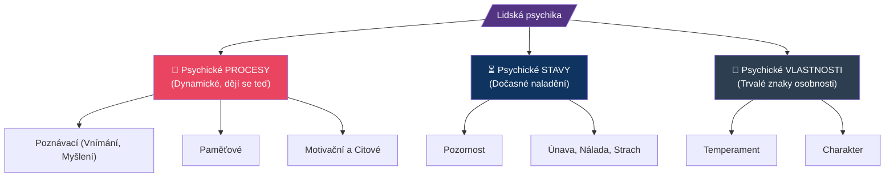

### Hierarchie forem myšlení

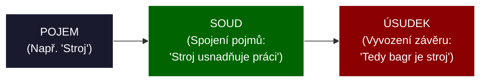

---

## Záludnosti a doplňující otázky

### ❓ 1. Dá se myšlení oddělit od řeči? Mohu myslet na něco, k čemu nemám slova?
**Odpověď:** V psychologii se tvrdí, že myšlení a řeč jsou úzce provázané. Člověk myslí v pojmech, které má verbalizované (často si mluvíme tzv. vnitřní řečí). Pokud pro nějaký jev nemáme pojem (slovo), je velmi obtížné ho abstraktně uchopit a myslet na něj. To má obrovský dopad na vzdělávání: rozšiřování slovní zásoby a terminologie žáka přímo rozšiřuje kapacitu a hloubku jeho myšlení!

### ❓ 2. Jaký je rozdíl mezi iluzí a bludem?
**Odpověď:** Iluze je *vada vnímání* – existuje reálný podnět (vidím stín), ale můj mozek (např. pod vlivem únavy nebo strachu) ho špatně interpretuje jako postavu. Když se přiblížím, iluze zmizí a já si uvědomím pravdu. Naproti tomu Blud je *porucha myšlení* – je to nezvratné patologické přesvědčení (např. že jsem Napoleon). Člověku s bludem nelze jeho stav vymluvit žádným logickým argumentem, jedná se o projev psychiatrické diagnózy (např. schizofrenie).

### ❓ 3. Proč dnešní vzdělávací programy (RVP) tolik tlačí na rozvoj abstraktního myšlení, když jsme v odborném školství (praxi)?
**Odpověď:** V minulosti (v době pásové výroby) stačilo dělníkovi motorické myšlení (zvládl jednu rutinní operaci se šroubovákem). Dnes, v době Průmyslu 4.0 a CNC technologií, pracovník musí umět číst složité kódy, představovat si 3D modely a analyzovat chybová hlášení v angličtině. Bez abstraktního a imaginativního myšlení nelze ovládat moderní výrobní linky.


<div style='page-break-after: always;'></div>

# PSY 4–7: Paměť, pozornost, emoce a vůle

> **TL;DR / Audio Shrnutí:**
> Proč žák do zítřka zapomene to, co dnes skvěle chápal? Odpověď leží ve fungování **paměti** – mozek si neukládá všechno, filtruje to. Pokud žák nedává **pozor** (nemá navozený psychický stav pozornosti), informace se do paměti vůbec nedostane. Pozornost ale nevyženeme křikem; učitel musí zapojit **emoce** (city). Pozitivní emoce a zážitek fungují jako lepidlo na informace. Emoční inteligence navíc chrání žáky před vyhořením. A když učení není zábavné (protože rovnice prostě bolí)? Pak přichází na řadu **vůle** – schopnost překonat překážky a donutit se k činnosti. Škola nesmí cvičit jen intelekt, ale musí trénovat i volní vlastnosti (vytrvalost, houževnatost).

---

## Znění státnicových otázek
- **[DOB]** **PSY 4:** Popište význam a funkci paměti se zaměřením na důležitost jejích jednotlivých fází v procesu učení.
- **[DOB]** **PSY 5:** Vysvětlete pojem psychický stav, zařaďte jej do struktury psychických jevů, zaměřte se na objasnění stavu pozornosti, její druhy a možnosti navození a udržení pozornosti ve vyučování.
- **[DOB]** **PSY 6:** Vysvětlete význam citových procesů v životě člověka, uveďte klasifikaci citů a možnosti jejich rozvoje ve výchovně-vzdělávacím procesu, objasněte pojem emoční inteligence.
- **[DOB]** **PSY 7:** Zařaďte volní procesy do struktury psychických jevů, vysvětlete pojem vůle a její význam v životě člověka, popište možnosti rozvoje volních vlastností ve výchovně-vzdělávacím procesu.

---

## Klíčové pojmy

- **Paměť** — schopnost přijímat, uchovávat a znovu vybavovat informace a minulé zkušenosti. Bez ní by nebylo možné učení (začínali bychom každý den od nuly).
- **Psychický stav** — aktuální, dočasné nastavení psychiky (např. únava, stres, radost, pozornost). Stavy se mění, vlastnosti (temperament) zůstávají.
- **Pozornost** — stav zaměřenosti a soustředěnosti vědomí na určitý objekt nebo činnost.
- **Emoce (City)** — subjektivní prožívání vztahu k věcem, lidem a sobě samému. Dávají věcem v paměti „zabarvení“.
- **Emoční inteligence (EQ)** — schopnost rozpoznat, pochopit a regulovat vlastní i cizí emoce (autor Daniel Goleman).
- **Vůle** — schopnost vědomě řídit své chování a překonávat překážky při dosahování vytyčeného cíle.

---

## Detailní rozebrání problematiky

### PSY 4: Paměť a její fáze v procesu učení

Paměť není "jedna velká krabice", ale komplexní proces se třemi fázemi. Učitel na ně musí pamatovat při stavbě hodiny.

1. **Fáze zapamatování (Uložení / Kódování):**
   - Informace vstupuje do mozku.
   - *Krátkodobá paměť:* Udrží 7 ± 2 položky na zhruba 20–30 sekund.
   - *Jak podpořit v učení:* Nepoužívat dlouhá nezajímavá souvětí. Využívat mnemotechnické pomůcky (Šetři se osle = 6378 km, poloměr Země) a zapojit vícero smyslů (Zásada názornosti).
2. **Fáze uchování (Retence):**
   - Přenos z krátkodobé do dlouhodobé paměti. Vyžaduje *opakování* a *emocionální ukotvení*.
   - *Ebbinghausova křivka:* Nejvíce informací zapomeneme do 24 hodin po výkladu. Učitel musí zařadit fixaci učiva.
3. **Fáze vybavování (Reprodukce):**
   - Úmyslné (zkoušení u tabule) nebo neúmyslné vybavení.
   - *Jak podpořit v učení:* Zkoušet v logických souvislostech, netrvat na doslovném znění (papouškování).

---

### PSY 5: Psychický stav a Pozornost

Psychický stav ovlivňuje kvalitu všech psychických procesů (unavený mozek hůře myslí a pamatuje si). **Pozornost** je propustka do vědomí.

**Druhy pozornosti:**
1. **Neúmyslná (pasivní) pozornost:** Vzniká bez úsilí vůle. Vyvolá ji silný, nový nebo nečekaný podnět (výbuch, změna barvy na tabuli, cizí člověk ve třídě). Rychle vzniká, rychle mizí.
2. **Úmyslná (aktivní) pozornost:** Vyžaduje zapojení vůle (žák se musí donutit poslouchat nudný, ale důležitý výklad o normách ISO). Kapacita úmyslné pozornosti u dospívajících je max. 15–20 minut.
3. **Poúmyslná pozornost:** Nejcennější stav. Žák se nejprve musel donutit (úmyslná), ale činnost ho tak pohltila (flow), že pozornost udržuje bez námahy (např. hraní počítačové hry, řešení zajímavé konstrukce).

*Role učitele:* Výklad začne silným podnětem (experiment) – aktivuje *neúmyslnou* pozornost. Pak jasně vysvětlí cíl (proč to žáci potřebují do praxe) – zapojí *úmyslnou* pozornost. A díky aktivizačním metodám (E-U-R) se snaží dosáhnout *poúmyslné* pozornosti.

---

### PSY 6: Citové procesy a Emoční inteligence (EQ)

Škola se dlouho tvářila, jako by žáci byli "chodící mozky bez těla a citů". Dnes víme, že emoce rozhodují o tom, co si zapamatujeme.

**Klasifikace citů:**
- *Nižší city:* Spojeny s biologickými potřebami (radost ze zahnání hladu, strach o život).
- *Vyšší city:* Specifické pro člověka. Dělí se na **intelektuální** (radost z vyřešení rovnice), **etické** (pocit nespravedlnosti) a **estetické** (úžas nad krásou obrazu).

**Význam v učení:**
Kognitivní psychologie dokazuje, že informace zabarvená silnou emocí se ukládá hlouběji. Pokud žák zažije při učení strach a ponižování (toxické klima), mozek zablokuje myšlení a spustí reakci "útok/útěk".

**Emoční inteligence (Goleman):**
IQ určuje, jestli člověk vystuduje VŠ. EQ určuje, jestli bude v životě šťastný a udrží si práci a rodinu. Skládá se z:
- Sebeuvědomění (Vím, že se vztekám).
- Seberegulace (Nerozmlátím kvůli tomu klávesnici).
- Empatie (Vnímám, jak se cítí druhý).
*Rozvoj ve výuce:* Práce ve skupinách (kooperativní výuka), diskuze, zdrženlivost učitele v kárání (učitel nesmí na žáka křičet v afektu, musí jít příkladem v seberegulaci).

---

### PSY 7: Volní procesy (Vůle)

Patří mezi *výkonné psychické procesy* (spolu s motivací). Bez vůle by lidstvo nic nevybudovalo – veškerá činnost by skončila při první překážce nebo nudě.

**Fáze volního jednání:**
1. *Přípravná fáze:* Objeví se konflikt motivů (Chci jít ven s kamarády vs. Musím se učit na písemku). Dochází k rozhodnutí.
2. *Realizační fáze:* Překonávání překážek k dosažení cíle (Učím se i přesto, že mi píšou kamarádi na Instagramu).

**Rozvoj vůle ve škole:**
- Vůle se nedá "naučit z knihy", vůle se **trénuje jako sval**.
- *Učitel jako trenér:* Nesmí žákům zametat cestičky. Žák musí dostávat přiměřeně těžké úkoly. Nesmí to být moc lehké (nevyžaduje vůli), ani nesplnitelné (frustruje to a vůli to zlomí).
- Důslednost učitele: Pokud učitel zadá domácí úkol, musí ho zkontrolovat. Pokud učitel uhne ze svých požadavků, žákova vůle ochabuje.

---

## Vizualizace

### Ebbinghausova křivka a Fáze paměti

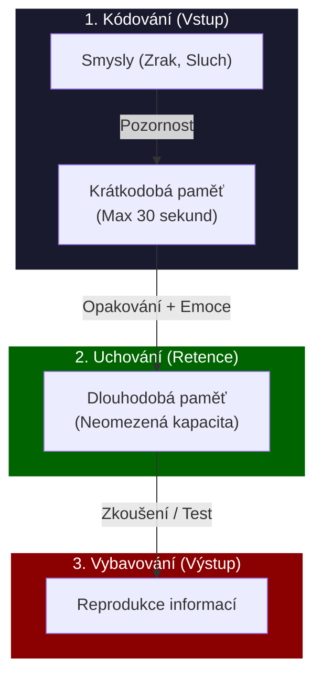

### Přechod fází pozornosti ve výuce

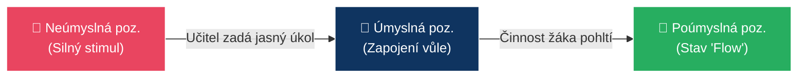

---

## Záludnosti a doplňující otázky

### ❓ 1. Dá se ve výuce udržet pozornost po celých 45 minut výkladu?
**Odpověď:** Ne. Kognitivní kapacita pro plnou úmyslnou pozornost (soustředění bez vyrušení) je u dospělého člověka cca 20 minut, u středoškoláka ještě méně (zhruba 10-15 minut). Učitel proto musí dělat didaktické "střihy" – po 15 minutách výkladu změnit činnost (např. nechat žáky na minutu probrat problém ve dvojici, změnit tón hlasu, přesunout se po třídě). To "vyresetuje" pozornost.

### ❓ 2. Co je to tzv. "Učení pod prahem (Latentní učení)" ve spojitosti s pamětí?
**Odpověď:** Jde o učení, které probíhá mimo naši úmyslnou pozornost a vůli (paměťové stopy se ukládají mimoděk). Ve škole se to děje neustále. Žák se neučí jen to, co učitel píše na tabuli, ale "pod prahem" se učí (ukládá si) sociální vzorce chování – jak učitel reaguje na stres, jak mluví se ženami atd. Škola tak vychovává, i když se o to záměrně nesnaží.

### ❓ 3. Proč psychologové tvrdí, že vysoké IQ bez vysokého EQ (Emoční inteligence) je pro učitele spíše rizikem?
**Odpověď:** Učitel s extrémně vysokým IQ často bleskově chápe abstraktní pojmy a nedokáže pochopit, "jak to ten žák může nechápat". Pokud takovému učiteli chybí EQ (empatie a seberegulace), rychle ztrácí s žáky trpělivost, reaguje podrážděně nebo arogantně ("To je přece triviální!"). Tím navodí ve třídě toxické klima plné strachu, čímž (dle bodu PSY 6) zcela zablokuje žákovu schopnost přijímat nové informace a učit se.


<div style='page-break-after: always;'></div>

# PSY 8–10: Osobnost, temperament a charakter

> **TL;DR / Audio Shrnutí:**
> Každý žák je unikátní koktejl genů a výchovy. V psychologii tomu říkáme **osobnost** – jedinečný celek vlastností, který se formuje pod tlakem biologických vloh, prostředí a vlastního já (procesem interiorizace). S částí tohoto balíčku učitel nehne: **temperament** je nám vrozený (flegmatika nepředěláte na tryskomyš). S čím ale škola hýbat může a musí, je **charakter**. Zatímco temperament určuje, *jak rychle a silně* žák reaguje, charakter určuje, *zda to je morálně správné*. Učitel tak musí respektovat vrozené tempo žáka, ale neslevit z morálních požadavků na jeho charakter.

---

## Znění státnicových otázek
- **[DOB]** **PSY 8:** Popište faktory utvářející osobnost a jejich vztah. Charakterizujte proces interiorizace a objasněte jeho význam.
- **[DOB]** **PSY 9:** Pojednejte o složkách struktury osobnosti žáka SŠ a možnostech jejich ovlivňování ve výuce. Výhody a nevýhody typů temperamentu.
- **[DOB]** **PSY 10:** Objasněte pojem charakter, zařaďte ho do systému psychických jevů. Uveďte charakterovou typologii. Rozvoj morálních vlastností žáků SŠ.

---

## Klíčové pojmy

- **Osobnost** — jedinečný, organizovaný celek duševního života člověka (jeho procesy, stavy a vlastnosti). Není to jen to, jak se člověk chová, ale kým skutečně je.
- **Faktory utvářející osobnost** — Biologické (vlohy, dědičnost), Sociální prostředí (rodina, škola, kultura) a Sebeutváření (vlastní vůle a svědomí).
- **Interiorizace (Zvnitřnění)** — klíčový proces učení a výchovy. Představuje přechod vnějšího pravidla (např. "učitel říká, že nemám krást") do vnitřního přesvědčení ("nekradu, protože se to příčí mému svědomí").
- **Temperament** — vrozená, biologicky podmíněná složka osobnosti. Určuje *dynamiku* prožívání a chování (sílu a rychlost emocí). Nelze ho změnit, pouze mírně tlumit.
- **Charakter** — naučená, společensky podmíněná složka osobnosti. Vyjadřuje vztah člověka k sobě, k lidem a k práci (hodnoty, morálka). Dá se po celý život formovat.

---

## Detailní rozebrání problematiky

### PSY 8 a 9: Osobnost a její utváření

Osobnost středoškoláka (adolescenta) je ve fázi masivní přestavby. Strukturu osobnosti dělíme na několik složek, přičemž každou z nich může škola ovlivnit jinak:

1. **Výkonové vlastnosti (Schopnosti, dovednosti, vědomosti):** 
   - Škola je ovlivňuje *nejvíce*. (Matematika rozvíjí analytické schopnosti). Jsou postaveny na vrozených vlohách.
2. **Dynamické vlastnosti (Temperament):** 
   - Škola je neovlivní (změnit je nelze). Učitel je musí *respektovat*.
3. **Regulační vlastnosti (Vůle, sebekontrola):** 
   - Ovlivnitelné skrze nastavování hranic a povinností (viz PSY 7).
4. **Motivační vlastnosti a zaměření (Potřeby, zájmy, postoje, charakter):**
   - Škola je ovlivňuje, ale vyžaduje to osobní příklad a zážitek (interiorizaci).

**Faktory vývoje osobnosti:**
Dlouho se vedl spor, zda je důležitější genetika (Co je vrozené), nebo výchova (Co je naučené). Dnes platí interakční model: **Genetika určuje hranice (strop), ke kterým se člověk může dostat, ale pouze prostředí a výchova určí, zda se tam člověk skutečně dostane.**
- *Příklad:* Žák se narodí s obrovským hudebním talentem (biologický faktor). Pokud ale vyrůstá v rodině, kde není klavír ani rádio a rodiče o něj nejeví zájem (sociální faktor), stane se z něj průměrný dělník a talent zanikne.

---

### PSY 9: Temperament a jeho typy ve škole

Temperament určuje to, jak rychle se člověk nadchne a jak dlouho mu to vydrží. Klasická Hippokratova-Galénova typologie (čtyři šťávy) doplněná I. P. Pavlovem a C. G. Jungem (extrovert/introvert):

1. **Sangvinik (Krev / Stabilní Extrovert):**
   - *Výhody:* Rychle chápe, přizpůsobivý, veselý, výborný do týmu, nebojí se mluvit.
   - *Nevýhody:* Povrchní. Nadchne se pro projekt, ale nedotáhne ho do konce. 
   - *Přístup učitele:* Zaměstnat ho, dávat mu krátkodobé cíle, hlídat pečlivost.
2. **Cholerik (Žluč / Labilní Extrovert):**
   - *Výhody:* Silný, průbojný, má tah na branku, skvělý lídr v krizových situacích.
   - *Nevýhody:* Výbušný, agresivní, netrpělivý. Při neúspěchu vzteky rozbije pomůcku.
   - *Přístup učitele:* Udržet klid! Nekřičet na něj (to ho ještě víc vytočí). Dát mu zodpovědnost (např. za bezpečnost skupiny).
3. **Flegmatik (Hlen / Stabilní Introvert):**
   - *Výhody:* Klidný, vyrovnaný, vysoce spolehlivý, pečlivý. Zvládne stereotypní práci u pásu.
   - *Nevýhody:* Pomalý ("brzda" skupiny). Neumí se nadchnout.
   - *Přístup učitele:* Nikdy ho nepopohánět křikem. Dát mu na vše dostatek času (např. prodloužit čas na písemku).
4. **Melancholik (Černá žluč / Labilní Introvert):**
   - *Výhody:* Hluboké prožívání, velmi empatický, věrný, často umělecky nadaný.
   - *Nevýhody:* Plachý, urážlivý, z běžné kritiky u tabule se složí. Rychle se unaví.
   - *Přístup učitele:* Chválit! Kritikou ho naprosto zdrtíte. Dodávat mu sebevědomí.

*(Pozn.: Čistý typ se vyskytuje vzácně, většinou jde o mix, např. Sangvinik-Cholerik).*

---

### PSY 10: Charakter a Morální vývoj

Zatímco temperament je „barva auta“, charakter je „volant“. Říká člověku, jak se chovat správně. Zahrnuje vlastnosti jako pracovitost, poctivost, lenost, altruismus.

**Charakterová typologie (např. E. Fromm - orientace charakteru):**
- *Receptivní typ:* Čeká, že ho škola / stát zabezpečí. Pasivní.
- *Vykořisťovatelský typ:* Krade nápady druhých, šikanuje, nebere ohledy.
- *Tržní typ:* Vše dělá jen pro prospěch a prodej (udělám to, jen když mi za to něco dáte).
- **Produktivní typ:** Zralý charakter. Pracuje pro radost z tvoření a přispívá společnosti.

**Rozvoj morálních vlastností (Interiorizace):**
Morální vlastnosti (Charakter) nelze naučit přednáškou (žák neodchází z přednášky o poctivosti jako poctivý člověk). 
- *Interiorizace (zvnitřnění)* funguje přes **modelové učení** (Albert Bandura). Žák sleduje učitele: Pokud učitel nedrží slovo nebo lže o termínu písemky, žák si "zvnitřní" lež jako povolený nástroj.
- Nejúčinnější na SŠ je diskuze nad **morálními dilematy** (L. Kohlberg). "Kdo má dostat místo v záchranném člunu?" Žák si musí svůj postoj obhájit, čímž si ho interiorizuje (zaryje do svého svědomí).

---

## Vizualizace

### Eysenckův model Temperamentu (Stabilita vs. Extroverze)

```mermaid
quadrantChart
    title Osobnostní osy temperamentu
    x-axis Introvert --> Extrovert
    y-axis Labilita --> Stabilita
    quadrant-1 CHOLERIK (Výbušný lídr)
    quadrant-2 MELANCHOLIK (Citlivý detailista)
    quadrant-3 FLEGMATIK (Klidný dříč)
    quadrant-4 SANGVINIK (Veselý bavič)
    
    "Rychlé reakce, hněv" : [0.8, 0.8]
    "Smutek, plachost" : [0.2, 0.8]
    "Spolehlivost, pomalost" : [0.2, 0.2]
    "Nadšení, povrchnost" : [0.8, 0.2]
```

### Proces Interiorizace morálky (Zvenku dovnitř)

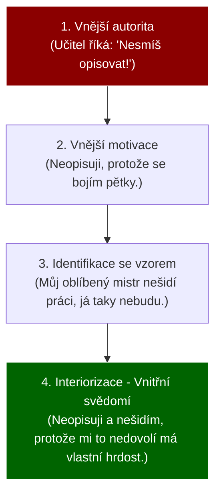

---

## Záludnosti a doplňující otázky

### ❓ 1. Dá se v dospělosti změnit temperament (například může se z introverta stát extrovert)?
**Odpověď:** Ne. Temperament je vázán na biologickou strukturu nervové soustavy (procesy vzruchu a útlumu v mozku). Z čistého melancholika nikdy neuděláte showmana sangvinika. Co se ale změnit dá, je chování (přes vůli a charakter). Melancholik se může "naučit" vystupovat sebevědomě na poradách, ale bude ho to stát obrovské množství energie a po poradě bude vyčerpaný (na rozdíl od sangvinika, kterého by porada dobila energií).

### ❓ 2. Co to znamená, když řekneme, že žák má "těžký temperament, ale výborný charakter"?
**Odpověď:** Znamená to, že se s ním těžce pracuje z hlediska dynamiky, ale morálně je spolehlivý. Například to může být silný Cholerik: Rychle vybuchne, když se mu ztupí vrták, křičí a je nepříjemný (temperament). Jakmile ale vychladne, přijde za mistrem, omluví se za svůj výstup a poškozený vrták ze svého kapesného zaplatí (čestný charakter).

### ❓ 3. Je inteligence spíše věcí dědičnosti (biologie), nebo výchovy (prostředí)?
**Odpověď:** Je to klasický průsečík (interakční model). U inteligence studie (např. na oddělených jednovaječných dvojčatech) ukazují, že dědičnost hraje zhruba 50–70% roli (určuje strop kapacity). Pokud ale geniální dítě vyroste izolované ve sklepě (nedostatek sociálních stimulů), jeho mozek neuronové spoje nevytvoří a bude mentálně retardované. Prostředí je klíč pro "odemčení" vrozeného potenciálu.


<div style='page-break-after: always;'></div>

# PSY 11–12: Motivace a základy sociální psychologie

> **TL;DR / Audio Shrnutí:**
> Proč jeden žák dokáže sedět u programování tři hodiny bez přestávky a druhý nevydrží ani deset minut? Odpověď leží v **motivaci**. Je to psychologický motor. Učitel se často snaží žáky nastartovat pomocí **vnějších motivů** (známky, hrozba propadnutí, pochvala), ty ale fungují jen krátkodobě. Skutečným cílem vzdělávání je probudit **vnitřní motivaci** (chuť poznávat, radost z práce). Jakmile má žák vnitřní motiv, učí se sám. To se ale neodehrává ve vzduchoprázdnu – učíme se ve třídě plné lidí. Zde nastupuje **sociální psychologie**, která zkoumá, jak se lidé navzájem ovlivňují (**interakce**) a jaké mezi sebou budují **vztahy**. Zkušený učitel ví, že špatné vztahy ve třídě dokážou zabít i tu nejsilnější motivaci k učení.

---

## Znění státnicových otázek
- **[DOB]** **PSY 11:** Vysvětlete psychologický základ motivace, vnitřní a vnější motivy, jejich vzájemné souvislosti a využití ve výchovně-vzdělávacím procesu.
- **[DOB]** **PSY 12:** Popište význam sociální psychologie v systému psychologických věd, vysvětlete pojmy interakce a vztahy, uveďte jejich vzájemné souvislosti.

---

## Klíčové pojmy

- **Motivace** — psychický proces, který energetizuje a zaměřuje chování člověka k dosažení určitého cíle (pochází z lat. *movere* = hýbat se).
- **Motiv** — konkrétní pohnutka (důvod), proč člověk něco dělá (např. motiv žízně, motiv touhy po uznání).
- **Potřeba** — základní zdroj motivace; stav nedostatku nebo naopak nadbytku, který se člověk snaží odstranit (viz Maslowova pyramida).
- **Sociální psychologie** — disciplína, která studuje, jak je chování, prožívání a myšlení jednotlivce ovlivňováno skutečnou nebo představovanou přítomností ostatních lidí.
- **Sociální interakce** — vzájemné působení (akce a reakce) dvou a více lidí na sebe (např. učitel se zamračí -> žák přestane mluvit).
- **Sociální vztahy** — dlouhodobější, relativně stabilní vazby mezi lidmi, které vznikají opakováním interakcí (např. přátelství, nepřátelství, autorita).

---

## Detailní rozebrání problematiky

### PSY 11: Motivace (Vnitřní a vnější)

Učení bez motivace je jako jízda autem bez benzínu – můžete točit volantem jak chcete, ale nepojedete. Pokud je žák motivován, učení se zrychlí a zanechává trvalé stopy. 

**Vnitřní motivace (Motivace "Z vlastního popudu"):**
- Pramení ze samotného žáka a z činnosti samé. Žák činnost dělá, protože ho baví, zajímá ho, nebo v ní vidí hluboký smysl.
- *Příklady motivů:* Kognitivní potřeba (touha přijít věci na kloub), seberealizace, radost z vyřešeného problému.
- *Význam:* Je nejefektivnější. Žák poháněný vnitřní motivací pracuje, i když nad ním nikdo nestojí.

**Vnější motivace (Motivace "Cukr a Bič"):**
- Pramení z vnějšku. Žák nevykonává činnost pro ni samotnou, ale jako prostředek k dosažení něčeho jiného (nebo aby se něčemu vyhnul).
- *Příklady motivů:* Touha po odměně (jednička, peníze za brigádu), strach z trestu (pětka, hněv rodičů), prestiž před spolužáky.
- *Význam:* Funguje rychle, ale krátkodobě. Jakmile zmizí "bič" (učitel odejde ze třídy) nebo "cukr" (rodiče přestanou platit za jedničky), činnost okamžitě ustane.

**Vzájemné souvislosti a využití ve škole:**
Vnější a vnitřní motivace se nevylučují, v praxi se míchají. 
1. *Narušení vnitřní motivace vnějšími odměnami (Overjustification effect):* Pokud žák programuje doma zadarmo pro radost (vnitřní), a my mu za to začneme platit (vnější), jeho mozek si přeformátuje motiv: "Dělám to pro peníze." Když platit přestaneme, žák s programováním sekne.
2. *Umění učitele:* Na začátku 1. ročníku často musí použít vnější motivaci (nastavit jasná pravidla a hodnocení). Cílem je ale tyto vnější motivy pomalu **interiorizovat** (viz PSY 8) – přesvědčit žáka, že to dělá pro sebe, a probudit v něm vnitřní motor.

---

### PSY 12: Sociální psychologie (Interakce a vztahy)

Člověk je "Zóon politikon" (tvor společenský). Mimo společnost (např. vlčí děti) z něj nevyroste člověk. Sociální psychologie řeší prostor "MEZI" lidmi. Pro pedagogiku je stěžejní, protože škola je uměle vytvořený sociální skleník.

**Interakce (Akce a Reakce):**
Je to dynamický proces, který se odehrává teď a tady.
- *Verbální interakce:* Učitel položí otázku -> žák odpoví.
- *Neverbální interakce (často mocnější!):* Žák přijde k tabuli a učitel si zhluboka povzdychne. I když nic neřekl, interakce proběhla (žák dostal najevo, že učitel od něj nic nečeká).

**Sociální vztahy:**
Vznikají dlouhodobým opakováním interakcí. Pokud je každá interakce mezi mistrem a žákem konfliktní, vytvoří se napjatý, toxický vztah.
- *Symetrické vztahy:* Mezi rovnými (žák – žák).
- *Asymetrické vztahy:* Jeden má formální moc nad druhým (učitel – žák, mistr – učeň). Učitel nesmí asymetrii zneužívat k šikaně (autokratický styl), ale nesmí se jí ani vzdát (hrozí anarchie).

**Význam pro školu:**
Učitel není jen odborník na "obsah" (řezání kovů), je manažer sociálních interakcí. Pokud nezvládne řídit interakce ve třídě (dovolí posměšky), rozbijí se vztahy (klima), a v důsledku toho klesne motivace k učení na nulu.

---

## Vizualizace

### Hierarchie motivů (Posun od vnějšku dovnitř)

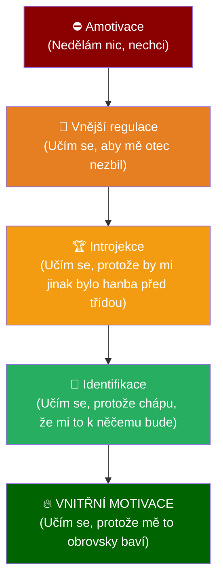

### Vztah mezi Interakcí a Vztahem

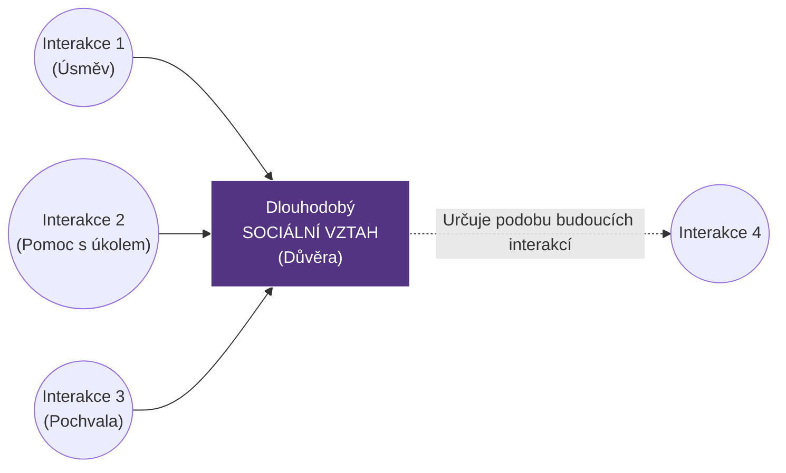

---

## Záludnosti a doplňující otázky

### ❓ 1. Je pětka do žákovské knížky dobrý motivační nástroj?
**Odpověď:** Pětka funguje jako vnější *negativní* motivátor (hrozba trestu). Může mít krátkodobý účinek (žák se ze strachu na příští hodinu nabifluje vzoreček). Psychologicky ale napáchá více škody než užitku. Časté pětky vyvolávají u žáka obranu (naučenou bezmocnost: "Jsem blbý, stejně to nemá cenu zkoušet"). Navíc, práce pod hrozbou trestu blokuje kreativní myšlení. Mnohem lepším nástrojem je formativní hodnocení (bodování postupu, ukázání cesty, jak to udělat lépe).

### ❓ 2. Může učitel být se svými žáky (např. ve 3. ročníku) "kamarád"?
**Odpověď:** Z hlediska sociální psychologie je vztah učitel-žák z podstaty věci *asymetrický* (učitel dává známky a rozhoduje o budoucnosti žáka). Skutečné přátelství (symetrický vztah) vyžaduje rovnocennost obou stran. Učitel by měl být k žákům přátelský, otevřený, spravedlivý a respektující (partnerský přístup), ale nesmí se s nimi stát "kamarádem", který ztratí profesionální odstup. Jakmile dojde na hodnocení, žáci zneužijí kamarádství k vynucování úlev a autorita se hroutí.

### ❓ 3. Co se děje s žákem, kterému rodiče platí 500 Kč za každou jedničku?
**Odpověď:** Dochází k vytěsnění vnitřní motivace tou vnější (tzv. korupce odměnou). Dítě přestane vidět smysl v samotném poznávání, jeho jediným cílem se stane zisk 500 Kč. To vede k podvádění (opisování taháků – účel světí prostředky). Navíc se zvyšuje jeho tolerance k odměně – za rok už mu 500 Kč stačit nebude a bude chtít 1000 Kč. Získání jedničky pro vlastní dobrý pocit pro něj ztratí jakoukoli hodnotu.


<div style='page-break-after: always;'></div>

# PSY 13–14: Sociální skupina a Komunikace

> **TL;DR / Audio Shrnutí:**
> Školní třída není jen hromada náhodných lidí, je to **malá sociální skupina**. Vládne v ní vlastní hierarchie, nepsaná pravidla a role (od vůdce až po otloukánka). Učitel nesmí třídu brát jako jednolitou hmotu. Musí její klima neustále mapovat (sociometrií) a formovat. Hlavním nástrojem učitele k formování třídy je **komunikace**. Komunikace však není jen o tom, co učitel říká (*verbální*), ale hlavně o tom, jak se u toho tváří a jaký má postoj (*neverbální a paralingvistická*). Pokud žák cítí z komunikace ironii, hrozbu nebo dvojnou vazbu (učitel říká "neboj se zeptat", ale pak po otázce obrací oči v sloup), vznikají **bariéry v komunikaci** a proces učení i výchovy se hroutí.

---

## Znění státnicových otázek
- **[DOB]** **PSY 13:** Vysvětlete pojem sociální skupina, její charakteristiky, třídění, charakterizujte školní třídu jako sociální skupinu, vysvětlete možnosti pedagoga při poznávání a formování třídní skupiny.
- **[DOB]** **PSY 14:** Uveďte hlavní zásady komunikace učitel-žák během výchovně-vzdělávacího procesu, popište význam jednotlivých složek komunikačního procesu, naznačte možné bariéry v komunikaci a možnosti jejich odstranění.

---

## Klíčové pojmy

- **Sociální skupina** — sdružení dvou a více lidí, které spojují společné cíle, normy (pravidla), vzájemná interakce a pocit sounáležitosti (my-vědomí). 
- **Školní třída** — specifická, formálně vytvořená malá sociální skupina.
- **Sociometrie** — výzkumná metoda (autor J. L. Moreno), která zjišťuje sympatie, antipatie a pozice členů uvnitř sociální skupiny (kdo s kým chce sedět).
- **Komunikace** — proces předávání a přijímání informací, postojů a emocí mezi lidmi (komunikátor -> sdělení -> komunikant).
- **Bariéry v komunikaci (Šumy)** — překážky, které způsobují, že příjemce zprávu nepochopí tak, jak ji odesílatel myslel (fyzické i psychologické).
- **Dvojná vazba (Double bind)** — toxický jev, kdy slova říkají něco jiného než tělo nebo tón hlasu.

---

## Detailní rozebrání problematiky

### PSY 13: Sociální skupina a Školní třída

Lidé se od přírody sdružují. Dav na koncertě ale není sociální skupina – nemají společný cíl, ani hierarchii (je to jen agregát).

**Charakteristiky sociální skupiny:**
1. Společný cíl (ve třídě to je dostudovat).
2. Společné normy a pravidla (nežaluje se, o přestávce se běhá).
3. Vzájemné vztahy a struktura (vůdce, následovníci, outsideři).
4. Vědomí MY (Naše třída vs. "Tamti C-čkaři").

**Třídění skupin:**
- *Podle velikosti:* Malé (do cca 30 lidí - všichni se znají jménem, např. třída) / Velké (škola, národ).
- *Podle vzniku:* Formální (vytvořeny uměle zvenčí - např. školní třída dekretem ředitele) / Neformální (vznikají spontánně na základě sympatií - např. parta kamarádů z internátu).
- *Podle intimity:* Primární (rodina - silné citové vazby) / Sekundární (pracovní tým).

**Školní třída jako sociální skupina:**
Je to paradoxní skupina. Vznikne **formálně** (rozhodnutím ředitele), ale okamžitě se v ní začnou tvořit **neformální** vztahy a kliky.

**Možnosti pedagoga (Formování a Poznáváni):**
- *Poznávání:* Učitel musí vědět, jaké je v třídě podhoubí. Používá pozorování a **Sociometrii** (Sociometrický dotazník: "Napiš 3 lidi, se kterými bys chtěl jet na vodu"). Výsledkem je *sociogram* – graf ukazuje hvězdu třídy (všichni s ní chtějí být) i černé ovce (nikdo je nechce).
- *Formování:* Pokud učitel vidí vyčleněného žáka, musí tvořit projektové skupiny tak, aby tohoto žáka zapojil a naučil ostatní s ním pracovat. Nesmí nechat vytváření skupin na žácích ("Rozdělte se sami"), protože pak outsideři vždy zbydou.

---

### PSY 14: Komunikace (Učitel - Žák)

Říká se, že *nelze nekomunikovat*. I když učitel mlčí a založí si ruce, vysílá silnou zprávu.

**Složky komunikačního procesu:**
1. **Verbální (Slova):** Obsah toho, co říkáme. Kupodivu tvoří jen cca 10 % dopadu na posluchače!
2. **Neverbální (Tělo):** Mimika (obličej), haptika (dotek), proxemika (vzdálenost), posturologie (postoj těla). Tvoří až 50 % dopadu. Pokud učitel říká "Mám radost" se zamračeným obličejem, žák uvěří obličeji.
3. **Paralingvistická (Hlas):** Intonace, síla, frázování, pauzy. Zvýšení hlasu, ticho.

**Bariéry v komunikaci a jejich odstranění:**
- *Fyzické bariéry:* Hluk traktoru venku, velká vzdálenost v tělocvičně. (Odstranění: Změna polohy, zavření oken).
- *Sémantické bariéry:* Učitel používá příliš složitá, odborná nebo cizí slova, kterým učeň 1. ročníku nerozumí (odborný žargon). (Odstranění: Učit v jazyce, kterému cílová skupina rozumí).
- *Psychologické bariéry:* Strach, úzkost, antipatie. Pokud má žák strach z výsměchu, nebude komunikovat, i když látce nerozumí.
- *Zkreslení informací:* Dvojná vazba, sarkasmus. U dětí a mládeže sarkasmus často nefunguje, pochopí ho doslova a cítí se zrazeny.

**Hlavní zásady komunikace pro učitele:**
- *Aktivní naslouchání:* Pokud žák mluví, učitel nepřerušuje, nedělá u toho jinou práci (např. nekouká do mobilu).
- *Asertivita místo agrese:* Pokud učitele naštve chování třídy, nepoužívá „Ty-výroky“ (*"Vy jste nejhorší banda idiotů!"* -> vyvolá obranu), ale používá „Já-výroky“ (*"Zlobí mě, když nenasloucháte mým instrukcím k bezpečnosti."*).

---

## Vizualizace

### Sociogram (Výsledek sociometrie)

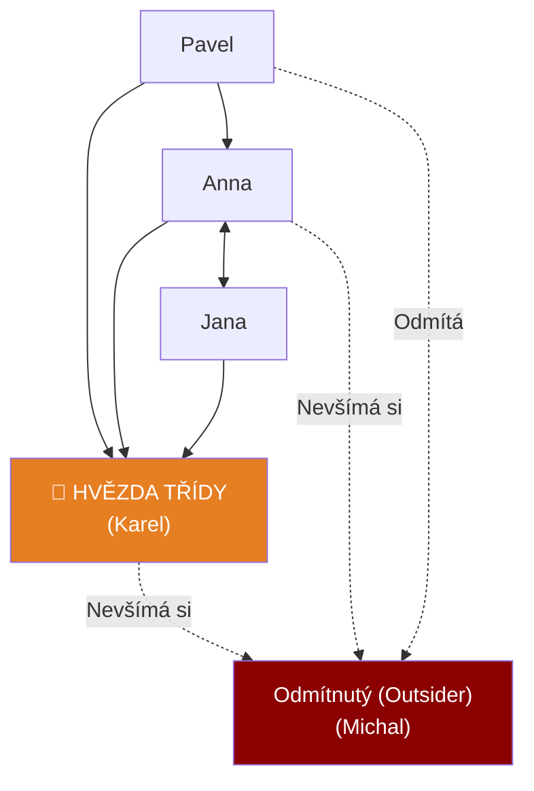

### Přenos informací a Vznik Bariér (Šumů)

```mermaid
graph LR
    O["UČITEL<br>(Vysílač)"] -->|Zakódování do slov| K["Komunikační kanál<br>+ Neverbální projev"]
    
    subgraph BAR [BARIÉRY ŠUMY]
        S1["Cizí slova (Žargon)"]
        S2["Hluk z ulice"]
        S3["Strach žáka"]
    end
    
    K -.-> S1
    K -.-> S2
    K -.-> S3
    
    K -->|Dekódování mozkem| P["ŽÁK<br>(Příjemce)"]
    
    P -.->|Zpětná vazba (Kývnutí)| O
    
    style O fill:#2c3e50,color:#fff
    style P fill:#006400,color:#fff
    style BAR fill:#e94560,color:#fff
```

---

## Záludnosti a doplňující otázky

### ❓ 1. Proč je ve škole tak nebezpečný Sarkasmus a Ironie ze strany učitele?
**Odpověď:** Sarkasmus je formou dvojné vazby. Učitel řekne "Teda ty jsi génius" žákovi, který právě řekl strašnou hloupost. Žák, který nemá dostatečně zralé abstraktní myšlení a EQ, zpracovává slova, ale cítí agresivní tón, což v něm vyvolá obrovský zmatek, ponížení a nedůvěru v učitele. Sarkasmus rozbíjí psychologické bezpečí, žáci pak raději mlčí, než aby riskovali další posměch. Komunikace ve třídě "umře".

### ❓ 2. Co je to tzv. "Haló efekt" při poznávání sociální skupiny učitelem?
**Odpověď:** Haló efekt je obrovská a velmi častá chyba ve vnímání. Znamená to, že se učitel nechá oslnit jedním výrazným rysem žáka a podle něj posuzuje i vše ostatní. Příklad: Žák má skvělé, čisté a nažehlené oblečení a slušně pozdraví (silný pozitivní první dojem). Učitel na základě toho předpokládá (chybně), že žák je pilný, chytrý a má perfektní zápisky, přestože reálně může být flákač. Učitel se pak k němu chová mírněji než k otrhanému, ale ve skutečnosti pilnému žákovi.

### ❓ 3. Má učitel aktivně zasahovat do neformální struktury třídy (např. rozbít silnou kamarádskou kliku), pokud narušují výuku?
**Odpověď:** Ano, musí. Pokud ve třídě vznikne neformální klika (např. parta 4 drsných hochů vzadu), kteří se pasují na "vůdce" třídy a tyranizují zbytek svými poznámkami, učitel na to musí reagovat. Nesmí to ale dělat agresi z pozice moci (to kliku jen víc semkne proti učiteli). Využívá prostorové uspořádání (rozsadí je), zadává úkoly tak, aby členové kliky museli pracovat v jiných skupinách se zbytkem třídy, čímž neformální zdi pomalu obrušuje.


<div style='page-break-after: always;'></div>

# PSY 15–16: Náročné životní situace, Stres a Sociální role

> **TL;DR / Audio Shrnutí:**
> Život žáka (i učitele) není jen klidné plutí po rybníku, občas přijde bouře. Těmto bouřím říkáme **náročné životní situace**. Tou neznámější je **stres**. Může to být krátkodobý stresor (přepadová písemka z fyziky) nebo chronický (rozvod rodičů, šikana). Pokud je stresu moc (distres), tělo začne selhávat a mozek se odmítá učit. Žáci (i dospělí) reagují na náročné situace různě – od agresivního útoku až po útěk do nemoci. Do toho všeho vstupují **sociální role**. Učitel není jen "stroj na výklad", hraje roli experta, soudce, někdy i rodiče. Stejně tak žák. Pokud se role "frajer třídy" dostane do střetu s rolí "poslušný student", vzniká vnitřní konflikt rolí.

---

## Znění státnicových otázek
- **[DOB]** **PSY 15:** Charakterizujte druhy náročných situací, význam v životě člověka, popište metody zvládání. Objasněte stres a zaměřte se na možnosti minimalizace stresorů ve vyučování.
- **[DOB]** **PSY 16:** Vysvětlete pojmy sociální status, sociální pozice, sociální role, individuální systém rolí. Popište role učitele a žáka ve výchovně-vzdělávacím procesu.

---

## Klíčové pojmy

- **Náročná životní situace** — stav, kdy překážky stojí v cestě k dosažení důležitého cíle, nebo situace hrozí snížením hodnoty člověka.
- **Stres** — stav nadměrné psychické a tělesné zátěže (odpověď organismu na stresor).
- **Eustres vs. Distres** — Eustres je pozitivní, motivující (tréma před zápasem). Distres je negativní, destruktivní (šikana, neřešitelné dluhy).
- **Frustrace** — pocit zklamání ze zmaření cíle (Učil jsem se na písemku do 3 ráno, a stejně mám pětku).
- **Deprivace** — dlouhodobé neuspokojování základních potřeb (Citová deprivace u dětí z dětských domovů).
- **Sociální status** — trvalejší hodnota a úcta, kterou člověku přisuzuje společnost (Status lékaře vs. status popeláře).
- **Sociální role** — očekávaný způsob chování vázaný na daný status (Od lékaře se *očekává* serióznost a mlčenlivost).

---

## Detailní rozebrání problematiky

### PSY 15: Náročné situace a Stres

Náročné situace nejsou jen zlo. Mají i pozitivní význam (resilience) – jako sval roste tím, že ho namáháme činkou, osobnost roste zvládáním přiměřených krizí. Pokud ale zátěž přesáhne kapacity jedince, hroutí se.

**Metody zvládání náročných situací (Copingové strategie):**
Lidé často používají podvědomé obranné mechanismy k ochraně vlastního ega:
1. *Agrese:* Přímá (křik, rozbití stolu), nebo nepřímá / posunutá (Naštve mě šéf -> kopnu do psa -> pes kousne dítě).
2. *Únik / Útěk:* Reálný útěk (záškoláctví před těžkou písemkou), nebo fantazijní (útěk k alkoholu, drogám, počítačovým hrám).
3. *Racionalizace:* Rozumová omluva selhání (Dostal jsem z přijímaček pětku, ale ta škola stejně za nic nestála a učitel na mě zasedl).
4. *Regrese:* Návrat na nižší vývojový stupeň (SŠ student se při těžkém konfliktu rozbrečí jako malé dítě).

**Stres a stresory ve škole:**
*Stresor* je spouštěč. Ve škole to jsou: zkoušení u tabule, šikana, hluk, nespravedlnost učitele, strach ze selhání. 
Při stresu se spouští starý biologický program **Bojuj, nebo Uteč (Fight or Flight)**: krev teče do svalů, srdce buší, mozek se přepne na pudové řešení, *kreativní abstraktní myšlení se vypne*.
- **Role učitele (Minimalizace stresorů):** Učitel nesmí používat distres jako nástroj výuky (neříkat věci jako: "Všichni propadnete, u maturity vás zničím"). Musí jasně předem sdělovat pravidla klasifikace (odstranění nejistoty) a zkoušení u tabule nahradit méně stresujícími formami (formativní hodnocení v lavici).

---

### PSY 16: Sociální status, pozice a ROLE

Sociální psychologie se na svět dívá jako na divadlo, kde každý hraje své předepsané role.

1. **Sociální pozice:** Místo, které člověk zaujímá ve skupině. (Např. pozice třídního předsedy).
2. **Sociální status:** Míra prestiže spojená s pozicí. Učitel by měl mít vysoký status odvozený z jeho odbornosti.
3. **Sociální role:** Scénář chování. 

**Individuální systém rolí (Konflikt rolí):**
Každý člověk má spoustu rolí. Žák je zároveň: *Synem* doma, *studentem* ve škole, *členem fotbalového týmu* odpoledne, a *kolemjdoucím* na ulici.
- *Konflikt rolí (Intrarolový):* Matka od žáka očekává, že bude odmlouvat, učitel očekává, že bude mlčet, a kamarádi očekávají, že udělá průšvih. Žák neví, jak se má chovat.

**Role Učitele ve vzdělávacím procesu:**
Učitel hraje mnoho dílčích rolí najednou a musí mezi nimi plynule přepínat:
- *Role experta / informátora:* Předává znalosti oboru.
- *Role facilitátora:* Provází procesem učení, radí a pomáhá.
- *Role hodnotitele (soudce):* Musí klasifikovat (zde nejčastěji vzniká konflikt s žákem).
- *Role projektanta:* Plánuje vyučování.
- *Role vzoru (modelu):* Sám žije to, co káže (viz interiorizace morálky).

**Role Žáka:**
Očekává se od něj spolupráce, plnění zadaných úkolů a podřízení se autoritě. Na střední škole se ale žák snaží získat roli *dospělého*, což naráží na omezující požadavky školy (vzniká tzv. revolta adolescentů).

---

## Vizualizace

### Klasifikace zátěžových (náročných) situací

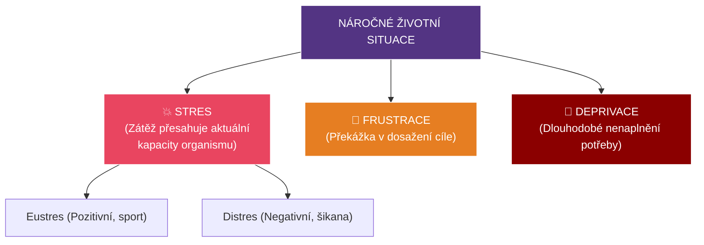

### Konflikt rolí v osobnosti žáka SŠ

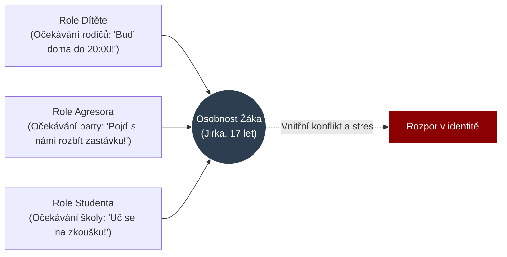

---

## Záludnosti a doplňující otázky

### ❓ 1. Dá se ze školy odstranit stres úplně? A bylo by to dobře?
**Odpověď:** Nedá a nebylo by to dobře. Škola musí žáka připravit na reálný život (a ten je plný stresu). Pokud by škola odstranila všechny nároky a žili bychom v inkubátoru (stoprocentní absence stresu), mluvíme o nudě a stagnaci, osobnost se nerozvíjí (nebuduje se rezilience). Cílem učitele není odstranit *Eustres* (např. zdravé napětí před prezentací projektu, které žáka vybičuje k výkonu), ale nesmí dopustit chronický *Distres* (pocit ohrožení), který tělo a mozek paralyzuje.

### ❓ 2. Co to znamená, když se řekne, že žák spadl do "Role třídního šaška"?
**Odpověď:** Jde o neformální sociální roli uvnitř skupiny. Často do ní spadnou žáci, kteří nemohou vyniknout ve výkonových rolích (mají např. dyslexii a zhoršený prospěch). Aby si ve třídě zajistili nějaký sociální status a pozornost, vezmou na sebe roli baviče / rebela, i za cenu poznámek a trestů od učitele. Je to vlastně copingová strategie chránící jejich zraněné ego. Pokud je učitel za tuto roli pouze trestá (dává jim další pětky), problém se zhorší. Musí jim umožnit vyniknout legální formou.

### ❓ 3. Proč se dnes tolik mluví o vyhoření (burn-out) u učitelů? S čím to z hlediska psychologie souvisí?
**Odpověď:** Souvisí to právě s náročnými situacemi, dlouhodobým distresem a *konfliktem rolí*. Na učitele jsou dnes kladeny naprosto protichůdné rolové požadavky. Rodiče očekávají volnou a hravou výchovu, ředitel vyžaduje tvrdé tabulkové výsledky u maturit, žáci chtějí zábavu. Učitel se snaží naplnit očekávání všech těchto rolí současně, což není fyzicky ani psychicky možné. Tento dlouhodobý "intrarolový konflikt" končí totálním vyčerpáním a emočním otupěním – vyhořením.


<div style='page-break-after: always;'></div>

# PSY 17–18: Rodina jako základní kámen a Dysfunkce

> **TL;DR / Audio Shrnutí:**
> Dítě se nerodí s hotovou osobností. To, kým se stane, určuje ze všeho nejvíc **rodina**. Jde o první (primární) sociální skupinu, která má člověka naučit žít ve společnosti (socializace). Její úkolem je zajistit nejen jídlo (biologická funkce), ale i lásku a bezpečí (emocionální funkce). Co se stane, když rodina selže? Vzniká **dysfunkční rodina**. Pokud doma vládne alkohol, nezájem nebo naopak chorobná opičí láska, dítě si tyto deformace nese rovnou do školní lavice. Učitel takového žáka často považuje za nevychovaného grázla nebo lenocha, ale ve skutečnosti se dívá na oběť. Úkolem učitele není rodinu „opravit“ (to často ani nejde), ale musí s žákem pracovat tak, aby mu škola dodala to jediné bezpečí, které v životě má.

---

## Znění státnicových otázek
- **[DOB]** **PSY 17:** Popište rodinu jako primární sociální skupinu a její význam pro socializaci jedince, charakterizujte základní funkce rodiny.
- **[DOB]** **PSY 18:** Charakterizujte dysfunkční rodinu, uveďte některé typy dysfunkčních rodin a popište, jak se dysfunkce projeví na rozvoji dítěte, charakterizujte přístupy učitele k žákům z dysfunkčních rodin.

---

## Klíčové pojmy

- **Rodina** — základní buňka společnosti, primární a intimní sociální skupina spojená pokrevními, manželskými nebo adoptivními svazky.
- **Socializace** — celoživotní proces, při kterém se jedinec začleňuje do společnosti. Učí se její jazyk, normy, hodnoty a sociální role. Nejsilněji probíhá v rodině.
- **Funkční rodina** — plní všechny své funkce a vytváří bezpečné prostředí pro rozvoj dítěte.
- **Dysfunkční rodina** — rodina, ve které dlouhodobě dochází k patologickým jevům (konflikty, zanedbávání, týrání), které vážně narušují vývoj dítěte.
- **Deprivace v rodině** — stav, kdy rodina nezajišťuje základní potřeby (často emocionální - dítě má sice co jíst, ale nikdo ho nepohladí).

---

## Detailní rozebrání problematiky

### PSY 17: Funkce rodiny a Socializace

Rodina je "skleník", ve kterém ze semínka (biologického tvora) vyrůstá člověk (sociální tvor). 

**Základní funkce rodiny:**
1. **Biologicko-reprodukční:** Zachování lidského rodu a uspokojení základních fyziologických potřeb (jídlo, teplo, spánek).
2. **Ekonomická (materiální):** Rodina jako hospodářská jednotka. Zajištění peněz, bydlení, ošacení a financování vzdělání dětí.
3. **Emocionální:** Klíčová funkce pro psychologii! Rodina je jediným místem absolutního přijetí. (V práci jste přijímáni, jen když podáváte výkon. Matka vás miluje, i když máte pětku z matematiky).
4. **Výchovná a Socializační:** Předávání vzorců chování. Dítě se učí nápodobou (např. syn vidí, jak otec řeší konflikty křikem, a "zvnitřní" si to jako normu pro řešení problémů ve škole).

*Při socializaci se dítě učí roli muže/ženy, učí se základům komunikace a nastavování hranic.*

---

### PSY 18: Dysfunkční rodina a přístup učitele

Pokud jedna nebo více funkcí rodiny dlouhodobě selhává, mluvíme o poruše rodiny. 

**Typy rodin podle funkčnosti:**
- *Funkční:* Plní vše, zvládá krize.
- *Problémová:* Občasné krize (hádky o peníze, mírné konflikty), ale rodina se snaží situaci řešit a vývoj dítěte není fatálně ohrožen.
- *Dysfunkční:* Hluboké narušení. Rodina sama situaci nezvládá a potřebuje zásah zvenčí (OSPOD, psycholog). Dítě je vážně ohroženo.
- *A-funkční:* Úplný rozpad (kriminalita, těžké závislosti). Děti jsou často odebírány.

**Příklady dysfunkčního prostředí a dopad na žáka:**
1. **Zanedbávající rodina (Citová deprivace):** Rodiče (často workoholici nebo alkoholici) nemají na dítě čas. 
   - *Projev u žáka:* Žák je uzavřený, apatický, nebo naopak zlobí, jen aby upoutal pozornost (i negativní pozornost učitele je pro něj lepší než prázdnota doma).
2. **Hyperprotektivní rodina ("Opičí láska"):** Rodiče dělají vše za dítě, hlídají každý jeho krok (helikoptéroví rodiče).
   - *Projev u žáka:* Žák je na SŠ nesamostatný, neschopný řešit vlastní problémy. Při první horší známce se psychicky hroutí nebo přijde matka "udělat do školy pořádek".
3. **Rodina s domácím násilím / alkoholismem:**
   - *Projev u žáka:* Žák žije v permanentním stresu (spuštěný režim Fight or Flight). Má výpadky paměti, je agresivní ke slabším (přenáší model z domova), objevuje se záškoláctví a poruchy spánku.

**Přístup učitele k žákům z dysfunkčních rodin:**
- Učitel **není psychoterapeut** a nesmí si hrát na spasitele rodiny.
- **Nepedagogizovat sociální problém:** Pokud žák spí na lavici, protože rodiče doma do 3 ráno pili, učitel to nevyřeší tím, že žákovi dá pětku z aktivity nebo poznámku.
- **Konzultace s odborníky:** Učitel musí okamžitě informovat školního metodika prevence nebo výchovného poradce (a případně kontaktovat OSPOD).
- **Vytvoření bezpečného přístavu:** Škola musí pro žáka zůstat místem, kde platí jasná, spravedlivá a neměnná pravidla (to mu dává pocit jistoty, který doma nemá). Učitel dává žákovi najevo osobní zájem ("Jsem tu, když budeš potřebovat mluvit").

---

## Vizualizace

### Hierarchie funkcí rodiny (Podmíněnost)

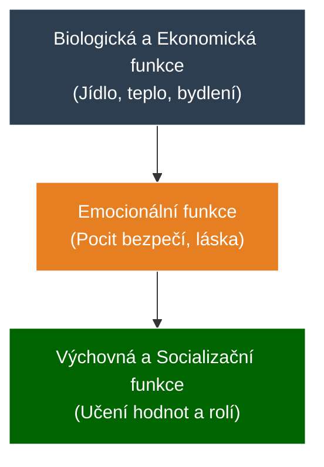

### Přenos dysfunkce (Cyklus násilí / zanedbávání)

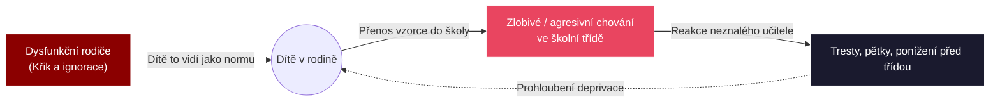

---

## Záludnosti a doplňující otázky

### ❓ 1. Dá se ze vzhledu žáka na střední škole poznat, že pochází z dysfunkční rodiny?
**Odpověď:** Může to být vodítko, ale je to velmi zrádné. Pokud chodí žák zanedbaný (špinavé oblečení, hlad), je deprivace zjevná (a-funkční sociálně slabá rodina). Obrovské množství dysfunkčních rodin se ale skrývá za "krásnou fasádou" (ekonomická funkce funguje na 100 %). Otec je manažer, matka právnička, žák přijede do školy ve drahém autě a má značkové oblečení, ale citová funkce je na nule (rodiče na něj nemají vůbec čas, doma vládne chlad). Zde učitel dysfunkci pozná až na základě chování žáka (apatie, deprese, sebepoškozování, drogy), nikoliv podle zevnějšku.

### ❓ 2. Co má učitel dělat, když zjistí, že je dítě doma obětí tvrdého fyzického týrání? Může si s otcem promluvit na třídních schůzkách?
**Odpověď:** Rozhodně NE! Pokud by učitel konfrontoval násilnického rodiče na schůzkách ("Vím, že ho bijete"), rodič to před učitelem popře a doma dítěti ublíží ještě více za to, že "vynáší z domu". V případě podezření na trestný čin (týrání) podléhá učitel ohlašovací povinnosti. Musí to řešit přes ředitele školy a orgány sociálně-právní ochrany dětí (OSPOD) či policii, kteří do rodiny vstoupí s právní mocí a provedou šetření.

### ❓ 3. Proč jsou pro socializaci dětí v rodině tak důležití prarodiče, když ekonomicky už rodinu netáhnou?
**Odpověď:** Prarodiče zastávají kritickou "kompenzační" emocionální funkci. Zatímco rodiče jsou často pod obrovským tlakem ekonomickým (musí splácet hypotéku a budovat kariéru) a nemají na dítě trpělivost, prarodiče už tento stres nemají. Dětem předávají tzv. "bezpodmínečnou lásku" (nemusí z nich vychovat úspěšné doktory, jen je mají rádi). Navíc předávají rodinnou historii a mezigenerační hodnoty, což dává dítěti hluboký pocit zakořenění.


<div style='page-break-after: always;'></div>

# PSY 19–22: Pedagogická psychologie, Učení a Výchova

> **TL;DR / Audio Shrnutí:**
> Proč se učíme matematiku z učebnice, ale na kole se musíme učit jezdit tím, že z něj párkrát spadneme? Zkoumáním toho, jak se lidé učí a jak je u toho formuje výchova, se zabývá **Pedagogická psychologie**. Ta nám říká, že **učení** není jen jedno (memorování básničky = *učení poznatkům*), ale má různé druhy. V odborném výcviku dominuje *senzomotorické učení* (propojení smyslů a svalů). Dnes se navíc odkláníme od pouhého biflování poznatků a jdeme k výuce **kompetencí** a řešení problémů. To vše se neodehrává ve vzduchoprázdnu, ale v rámci **procesu výchovy**, kde učitel nesmí zapomínat, že dnes zažíváme fenomén *obrácené socializace* (děti učí dospělé, např. s technologiemi). A pokud žák zlobí? Lze aplikovat techniky modifikace chování (odměny a tresty založené na behaviorismu).

---

## Znění státnicových otázek
- **[DOB]** **PSY 19:** Předmět pedagogické psychologie, pojmy: vývoj, výchova, učení, vyučování. Trendy: od osobnosti k týmu, od znalostí ke kompetencím.
- **[DOB]** **PSY 20:** Druhy učení se zaměřením na učení senzomotorické. Změny v jeho průběhu a co je jeho výsledkem.
- **[DOB]** **PSY 21:** Srovnejte učení se poznatkům s učením se řešení problému. Které psychické jevy se na nich podílejí, pojem učení ve spirále.
- **[DOB]** **PSY 22:** Proces výchovy, prostředky a metody. Obrácená socializace. Techniky modifikace chování.

---

## Klíčové pojmy

- **Pedagogická psychologie** — aplikovaná disciplína zkoumající psychologické zákonitosti výchovy a vzdělávání (co se děje v hlavě žáka, když ho učitel učí).
- **Učení** — v širším slova smyslu jakákoliv změna chování na základě zkušenosti.
- **Vyučování** — záměrné, organizované řízení učení žáků (dělá to škola).
- **Výchova** — proces záměrného formování osobnosti (morálka, postoje, charakter).
- **Senzomotorické učení** — osvojování manuálních dovedností (propojení senzorů /zraku/ a motoriky /svalů/ – typické pro odborný výcvik).
- **Obrácená socializace** — fenomén moderní doby, kdy mladší generace učí starší (např. vnímání IT technologií, sociálních sítí).
- **Modifikace chování** — aplikace behaviorálních principů k odstranění nežádoucího chování žáka (založeno na podmiňování: odměna a trest).

---

## Detailní rozebrání problematiky

### PSY 19: Předmět ped. psychologie a Trendy

**Základní pojmy v souvislostech:**
Aby proběhl zdravý *vývoj* žáka, musí probíhat *výchova* a zprostředkovaně přes školu *vyučování*. A aby mělo vyučování smysl, musí dojít k procesu *učení* (to dělá žák sám, nikdo se za něj nenaučí).

**Moderní trendy ve vzdělávání (Přesun paradigmatu):**
- *Od znalostí ke KOMPETENCÍM:* V minulosti byla škola instituce na předávání informací (encyklopedismus). Dnes máte všechny znalosti světa v kapse na smartphonu. Proto se cení *kompetence* = schopnost vyhledat, vyhodnotit a aplikovat informaci k řešení problému. (Ne biflovat letopočty, ale chápat souvislosti).
- *Od individualismu k TÝMU:* Moderní průmysl nevyžaduje osamělé vlky. Projekty tvoří týmy. Z toho vychází kooperativní výuka – učit se komunikovat a dělit si role.

---

### PSY 20 a 21: Druhy Učení

Učení není jen "čtení z knížky". Rozdělujeme ho podle toho, co se učíme:

**1. Senzomotorické učení (Práce rukama - Odborný výcvik):**
- Propojení analyzátorů (zrak, sluch) se svaly. Učíme se psát na klávesnici, jezdit na kole, svařovat.
- *Změny v průběhu:*
  1. *Fáze seznámení:* Žák svírá nářadí křečovitě, dělá zbytečné a hrubé pohyby, zapojuje svaly, které nepotřebuje (rychlá únava). Má plnou *úmyslnou pozornost* na každý centimetr pohybu.
  2. *Fáze procvičování (Dril):* Pohyb se čistí, zbytečné pohyby mizí, rychlost roste, zmetkovitost klesá.
  3. *Fáze automatizace:* Výsledkem je **Návyk / Dovednost**. Vědomá kontrola přechází do podvědomí. Žák u práce mluví a "ruce jedou samy".

**2. Učení se poznatkům (Verbo-kognitivní):**
- Biflování. Učení se vzorečků, slovíček, dějepisu.
- *Zapojené jevy:* Dominuje zde **Paměť**. Nejnižší stupeň myšlení.
- *Výsledek:* Vědomost.

**3. Učení se řešení problémů:**
- Nejvyšší forma učení. Učitel nedá žákovi hotovou odpověď ("Tady je vzorec"), ale zadá mu problém ("Jak spočítáme tlak v této trubce?"). Žák musí hledat cestu sám (heuristická metoda).
- *Zapojené jevy:* Dominuje **Abstraktní a logické Myšlení**, dedukce, tvořivost (kreativita).
- *Výsledek:* Intelektová dovednost, schopnost improvizovat.

**Učení ve spirále (Bruner):**
- Informace neprobíráme jen jednou "a dost" (linárně). K základnímu tématu se vracíme v dalších ročnících, ale na stále hlubší a složitější úrovni. (V 1. třídě učíme "Sluníčko svítí", ve fyzice na SŠ učíme termonukleární fúzi vodíku).

---

### PSY 22: Výchova, Modifikace chování a Obrácená socializace

Pokud je učení o "intelektu", výchova je o "morálce a charakteru". 

**Výchovné prostředky a metody:**
1. *Metoda přesvědčování:* Racionální argumentace (Proč bys neměl brát drogy).
2. *Metoda příkladu:* Velmi silná! Učitel se chová jako vzor.
3. *Metoda cvičení a návyku:* Nácvik zvyků (zdravení, mytí rukou, úklid pracovního místa).

**Obrácená (Prefigurativní) socializace:**
Klasicky starší generace učila mladší. Dnes, díky exponenciálnímu technologickému boomu, žijeme ve světě, kde **děti učí rodiče**. Žák SŠ musí učit svého padesátiletého mistra, jak pracovat s novým softwarovým aktualizátorem nebo jak funguje TikTok. 
- *Důsledky:* Narušuje to tradiční pojetí přirozené autority (učitel najednou neví všechno). Učitel s tím nesmí bojovat z pozice ega, ale musí se stát facilitátorem a s žáky spolupracovat.

**Techniky modifikace chování:**
Vychází z behaviorismu (Skinnerovo operantní podmiňování). Cílem je změnit problémové chování žáka pomocí vnějších stimulů (Nečekáme, až to žák pochopí, prostě to změníme).
- *Pozitivní posílení:* Žák nečekaně donese úkol -> učitel ho masivně pochválí před třídou (odměna). Pravděpodobnost, že žák přinese úkol i příště, se zvyšuje.
- *Vyhasínání (Extinkce):* Žák schválně vyrušuje vtipy, aby získal pozornost třídy. Učitel to absolutně ignoruje a zadá hned další práci. Pokud chování nepřináší žádný zisk (pozornost), postupně *vyhasne*.

---

## Vizualizace

### Křivka Senzomotorického učení (Trénink dovednosti)

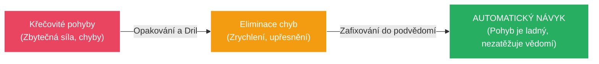

### Posun v paradigmatu výuky (Učení poznatkům vs. Problémům)

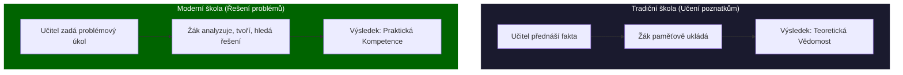

---

## Záludnosti a doplňující otázky

### ❓ 1. Dá se senzomotorické učení obejít tím, že se prostě podívám na 100 hodin videí na YouTube (např. jak vyrobit židli)?
**Odpověď:** Nedá. Video zajistí *učení se poznatkům* (vím teoreticky v jakém pořadí se věci dělají). Senzomotorické učení však vyžaduje vytvoření reálných nových synaptických spojení v mozku, která ovládají jemnou motoriku rukou a zpětnou vazbu z hmatových senzorů (odpor dřeva při řezání). Ruce bez fyzického tréninku (drilu) pohyb nedokážou provést, i kdyby mozek znal teorii na jedničku.

### ❓ 2. Proč metoda modifikace chování pomocí "Trestrání" často nefunguje a je lepší "Pozitivní posilování"?
**Odpověď:** Behavioristé zjistili, že Trest pouze říká žákovi: "Tohle nedělej." (Neukazuje ale správnou cestu). Trest vyvolává strach a často vede k tomu, že se žák nežádoucímu chování nevyhne, pouze se ho naučí lépe skrývat, aby nebyl chycen. Naproti tomu Pozitivní posilování (odměna za správný krok) jasně naviguje žáka ("Tohle je správně, dělej toho víc") a buduje pozitivní vztah k činnosti. Trestání by se mělo minimalizovat jen na bezprostřední zastavení nebezpečného chování (např. agrese, ohrožení BOZP).

### ❓ 3. Je učení ve spirále ztrátou času? Proč to rovnou nevysvětlit celé?
**Odpověď:** Žáci na nižším stupni zrání nemají dostatečně vyvinuté abstraktní myšlení (viz PSY 3 nebo vývojové teorie J. Piageta) na to, aby složitý problém pojmuli v celé jeho komplexnosti. Kdyby se jim fyzikář snažil vysvětlit rovnou kvantovou teorii světla v 6. třídě ZŠ, žáci by absolutně nic nepochopili a získali by odpor k předmětu. Spirála respektuje přirozený kognitivní vývoj dítěte – nejdřív učíme světlo jako rovnou čáru s baterkou (základní model), a o pět let později tento model zahodíme a nahradíme pokročilou teorií fotonů.


<div style='page-break-after: always;'></div>

# PSY 23–25: Učitel jako poradce a Poruchy socializace (Šikana)

> **TL;DR / Audio Shrnutí:**
> Dobrý učitel se nestará jen o známky, zajímá se i o žáka samotného – funguje v roli **poradce**. Nemá za úkol žáka psychologicky léčit, ale spíše mu pomoci zorientovat se v problému a odkázat ho na odborníka. Přitom se musí vyvarovat moralizování nebo shazování žákových citů. Učitel také musí umět zvolit správnou **metodu výuky**. Pokud třída spí, použije *aktivizující metody*, které žáky vtáhnou do hry (diskuse, problémové učení). A pak je tu temná stránka školy: **Poruchy socializace**. Pokud se žák nenaučí respektovat normy, sklouzává k záškoláctví, krádežím a agresi. Vrcholem této pyramidy je **šikana** – skrytá, rakovinotvorná nemoc třídy, která má svá přesná stádia a kterou učitel nikdy nesmí řešit konfrontací oběti a agresora tváří v tvář!

---

## Znění státnicových otázek
- **[DOB]** **PSY 23:** Učitel v roli poradce, základní kvality a přístup k žákovi, možné chyby, kterých by se měl vyvarovat.
- **[DOB]** **PSY 24:** Pojem metoda výuky, z jakých činností se skládá. Souvislost mezi poznávacími procesy a motivací. Aktivizující metoda a příklady jejího využití.
- **[DOB]** **PSY 25:** Poruchy socializace (lhaní, krádeže, záškoláctví), příčiny a náprava. Agresivní poruchy chování, šikana (průběh, stádia, druhy, prevence).

---

## Klíčové pojmy

- **Učitel - Poradce** — přístup učitele (často v rámci humanistické psychologie C. R. Rogerse), který se snaží empaticky naslouchat a pomáhat žákovi při řešení osobních nebo studijních problémů.
- **Metoda výuky** — záměrná, promyšlená cesta a postup, jakým učitel vede žáky k dosažení vytyčeného výukového cíle.
- **Aktivizující metoda** — metoda, která přesouvá těžiště práce z učitele (který mluví) na žáka (který tvoří, řeší a objevuje). Spouští vnitřní motivaci.
- **Porucha socializace** — stav, kdy si jedinec neosvojil normy chování dané společnosti (nerespektuje zákony, práva druhých). Může se projevit disociálním až antisociálním chováním.
- **Šikana** — záměrné, opakované a nevyprovokované ubližování slabšímu jedinci (fyzické nebo psychické), při kterém je zjevná asymetrie sil.

---

## Detailní rozebrání problematiky

### PSY 23: Učitel v Roli Poradce

Učitel nemá kompetence ani vzdělání klinického psychologa. Jeho poradenská role spočívá v **První pomoci**.

**Základní kvality (Dle C. R. Rogerse):**
1. *Empatie:* Schopnost vcítit se do pocitů žáka (vidět svět jeho očima).
2. *Kongruence (Opravdovost):* Učitel si na nic nehraje, neskrývá se za masku "Drsného Mistra", mluví narovinu.
3. *Bezpodmínečné přijetí:* Učitel respektuje žáka jako člověka, i když s jeho chováním nesouhlasí.

**Časté chyby učitele – Čemu se vyvarovat:**
- **Moralizování:** Žák se svěří s problémem (např. krádež v afektu) a učitel ho hned začne kázat: *"Jak jsi to mohl udělat, vždyť ty jsi tak chytrý kluk!"* Žák se okamžitě uzavře.
- **Bagatelizace:** Žák je na dně, protože se rozešel s první láskou. Učitel to shodí: *"Prosím tě, takových ještě bude, soustřeď se na písemku z matiky."* Pro žáka to je v danou chvíli konec světa.
- **Dávání "zaručených" rad:** Učitel řekne: *"Udělej to takhle a bude to dobré."* Pokud to nevyjde, žák svalí vinu na učitele. Poradce má žáka *navést*, aby si na řešení přišel sám.

---

### PSY 24: Metody výuky a Aktivizace

Metoda výuky je spojovacím mostem mezi obsahem (co učím) a žákem. Skládá se z činnosti učitele (zadá problém, řídí diskuzi) a činnosti žáka (řeší, počítá, obhajuje).

**Základní metody vs. Aktivizující:**
- *Tradiční metody:* Monolog (přednáška), Vysvětlování. Žák je pasivní (poslouchá a píše). Vede k rychlé ztrátě *úmyslné pozornosti* a útlumu *poznávacích procesů*.
- *Aktivizující metody:* Zvyšují *vnitřní motivaci* (žák chce přijít věci na kloub).
  1. **Heuristická metoda (Objevování):** Učitel nedá výsledek, ale zadá sérii nápověd, přes které žák k výsledku dojde sám. (Např. E-U-R model).
  2. **Situační metoda (Případová studie):** Třída řeší reálný problém z praxe (Kazuistika). "Jste na stavbě, praskla voda, hlavní uzávěr je zarezlej, co uděláte jako první?"
  3. **Didaktická hra:** Učení hrou (Simulace).

---

### PSY 25: Poruchy socializace a Šikana

Když selže rodina (PSY 18), dítě si neosvojí morálku (PSY 10) a nastupují poruchy socializace.

**Základní poruchy:**
- *Záškoláctví:* Často útěk před stresem (šikana, strach z testu) nebo vliv party. Náprava nespočívá v trestání (to strach zvýší), ale v odhalení příčiny.
- *Krádeže / Lhaní:* U dětí do 6 let (bájení) to je fantazie, na SŠ jde o účelové lhaní (ochrana před trestem, získání prestiže).

**Šikana (Nejnebezpečnější nemoc školy):**
Není to běžná rvačka dvou rovnocenných kluků! Je to cílené, opakované ničení slabšího, ze kterého má agresor potěšení.

**Pět stádií šikany (Michal Kolář):**
1. *Zrod ostrakismu:* Objeví se neoblíbený žák (odlišnost). Třída si z něj občas udělá lehkou legraci. Pokud učitel nezakročí, posouvá se to dál.
2. *Fyzické a psychické přitvrzování:* Dojde k první fackám nebo drsnému ponižování ze strany agresora (zkoušení hranic).
3. *Vytvoření jádra:* Agresor k sobě strhne 2-3 přívržence. Šikana začíná být systematická.
4. *Většina přijímá normy agresorů:* Třída se přidává. I "hodní" žáci začnou oběť ponižovat, aby nevypadli z party, nebo ze strachu, že budou další na řadě. Zlo se stává ve třídě "normou".
5. *Totalita (Dokonalá šikana):* Oběť je zlomená a dokonce začne svou vinu brát na sebe ("Zasloužím si to"). Třída ztratila jakékoliv zbytky empatie.

**Zlaté pravidlo řešení šikany (Pro učitele):**
- **Nிகdy nekonfrontujte agresora a oběť tváří v tvář ve sborovně!** Oběť ze strachu z pomsty řekne: "Byla to jen legrace, nic se mi nestalo." Agresor se pak oběti po škole krutě pomstí za "žalování".
- Vyšetřování probíhá vždy tajně, odděleně, nejprve u nezúčastněných svědků (tzv. metoda křížového výslechu).

---

## Vizualizace

### Spektrum přístupů učitele k žákovi v problémech

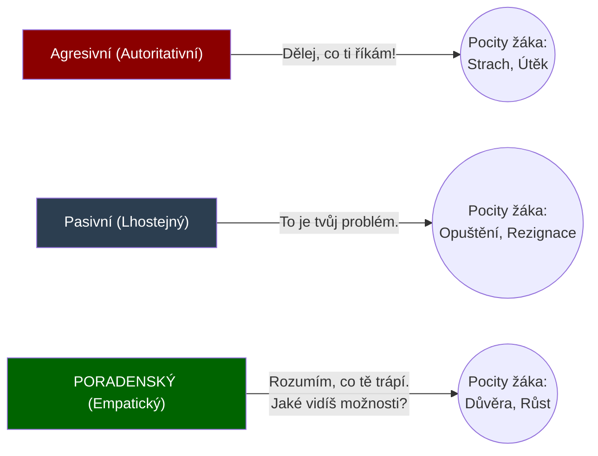

### 5 Stádií vzniku Šikany (Od vtipu k totalitě)

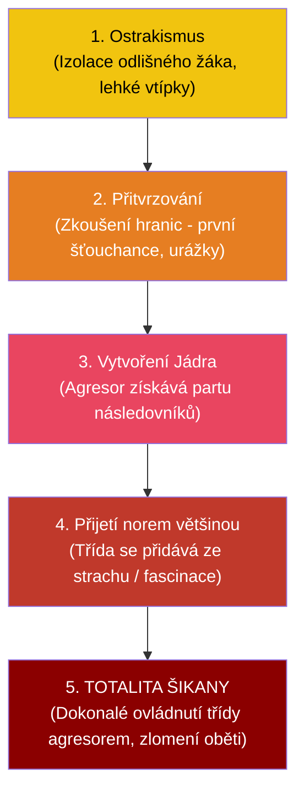

---

## Záludnosti a doplňující otázky

### ❓ 1. Dá se využít Aktivizující metoda u každého tématu v Odborném výcviku?
**Odpověď:** Ne. Heuristika (objevování) je fantastická na rozvoj myšlení (např. při hledání chyby v zapojení kabelů), ale je naprosto smrtící a zakázaná u věcí spojených s tvrdou BOZP. Učitel nemůže nechat žáka "samostatně heuristicky objevovat", jak se zapíná soustruh nebo jak se pracuje s formátovací pilou. Kde hrozí smrt nebo zničení drahého stroje, nastupuje tvrdá direktivní metoda (Dril a Instruktáž).

### ❓ 2. Co to znamená, když se při šikaně objevuje tzv. "Nepřímá agrese", a proč je u dívek častější než u chlapců?
**Odpověď:** Chlapci častěji řeší šikanu přímou agresí (fyzické násilí, ničení věcí, vydírání). Nepřímá agrese, typická pro dívčí kolektivy, je mnohem skrytější a zákeřnější. Jde o "sociální vraždu". Zahrnuje pomlouvání za zády, záměrné vyčleňování ze skupiny ("S tebou se nebavíme"), rozšiřování lží na sociálních sítích (kyberšikana) nebo krádeže tajemství. Pro učitele je extrémně těžké ji odhalit, protože nezanechává fyzické modřiny, ale psychiku oběti zničí úplně stejně.

### ❓ 3. Proč oběť šikany v pokročilém stádiu (totalita) často brání svého agresora?
**Odpověď:** Jedná se o hluboký psychologický rozpad osobnosti oběti (podobný tzv. Stockholmskému syndromu). Oběť je vystavena tak dlouhému a intenzivnímu brainwashingu (vymývání mozku) ze strany agresora i celé třídy, že si nakonec zvnitřní pocit své vlastní bezcennosti. Uvěří, že je opravdu k ničemu, hloupá, ošklivá a že si tresty vlastně zaslouží, protože "vytáčí" úžasného agresora (který je hvězdou třídy). Odhalit a vyšetřit takovou šikanu je pro učitele už téměř nemožné a vyžaduje to externí expertní tým.


<div style='page-break-after: always;'></div>

# PSY 26–30: Vývojová psychologie (Od kolébky po hrob)

> **TL;DR / Audio Shrnutí:**
> Člověk není statický kámen, celý život se mění. O tom je **Vývojová psychologie**. Zkoumá, jak ze shluku buněk vyroste člověk, který ve 2 letech bojuje o autonomii ("Já sám!"), v 6 letech je zralý na to udržet tužku a pozornost ve škole (**školní zralost**) a v 15 letech prochází divokou bouří **adolescence** (kdy hledá svou identitu a revoltuje proti rodičům). Tím ale vývoj nekončí! I dospělý člověk řeší krize (profese, rodičovství, krize středního věku) a nakonec se musí vyrovnat se stářím a vlastní smrtelností. Psychologové jako Freud, Erikson a Piaget nám dali „mapy“, jak tímto vývojem mozek, emoce a morálka procházejí. Bez této mapy nemůže učitel učit, protože 10leté dítě prostě nechápe svět stejně jako 16letý dospívající.

---

## Znění státnicových otázek
- **[DOB]** **PSY 26:** Prenatální, novorozenecké a kojenecké období (Piaget, Freud, Erikson). Klíčová témata psychického vývoje. Teorie citové vazby (attachment).
- **[DOB]** **PSY 27:** Batolecí a předškolní období. Klíčová témata tělesného a sociálního vývoje, vývoj řeči a dětské hry.
- **[DOB]** **PSY 28:** Mladší a střední školní věk. Problematika školní zralosti a připravenosti.
- **[DOB]** **PSY 29:** Dospívání (pubescence a adolescence) podle vývojových teorií. Sociální a tělesný vývoj.
- **[DOB]** **PSY 30:** Stádia dospělosti a stáří. Profesní role, krize středního věku, kvalita života (Erikson, postformální myšlení, stadia přijetí smrtelnosti dle Kübler-Rossové).

---

## Klíčové pojmy a Autoři

- **J. Piaget (Kognitivní vývoj):** Zabývá se vývojem *Myšlení*. Jak dítě chápe svět (od hmatání po abstraktní logiku).
- **S. Freud (Psychosexuální vývoj):** Zkoumá přesun *libida* (slasti) v různých obdobích života.
- **E. Erikson (Psychosociální vývoj):** Rozdělil celý život na 8 krizí (konfliktů). Pokud krizi člověk zvládne, posune se; pokud ne, nese si trauma dál.
- **L. Kohlberg (Morální vývoj):** Jak dítě chápe "dobro a zlo" (od strachu z trestu po vlastní svědomí).
- **Attachment (J. Bowlby):** Teorie citové vazby. V prvním roce života se tvoří bezpečné/nebezpečné pouto k matce, které určuje, jak bude člověk tvořit vztahy po zbytek života.
- **Školní zralost:** Biologická (tělo, mozek) a psychologická (emoce, soustředění) připravenost zvládnout požadavky 1. třídy ZŠ.

---

## Detailní rozebrání problematiky (Časová osa života)

### 1. Raná fáze (PSY 26 a 27): Kojenci, Batolata a Předškoláci
- **Prenatální až Kojenec (0–1 rok):** 
  - Tělesně roste raketovým tempem. Tvoří se mozek.
  - *Erikson:* Základní důvěra vs. Nedůvěra ke světu. Pokud matka reaguje na pláč (krmí, chová), vzniká *Bezpečný attachment*. Pokud matka chybí, vzniká deprivace.
  - *Piaget:* Senzomotorická inteligence (svět zkoumá cumláním, úchopem). Trvalost objektu (chápe, že hračka nezmizela, když se zakryje dekou).
- **Batole (1–3 roky):** 
  - Rozvoj řeči a chůze. 
  - *Erikson:* Autonomie vs. Stud. Dítě chce dělat věci samo ("Já sám"). Zkouší hranice, objevuje se období vzdoru. Pokud ho rodiče za vše trestají, vytvoří se stud.
- **Předškolák (3–6 let):** 
  - Vládne **Dětská hra**. Hra není ztráta času! Je to práce dítěte, učí se přes ni sociální role (hra na doktora, na maminku). 
  - *Piaget:* Názorné (předoperační) myšlení. Dítě věří na magii, neumí si v hlavě věci převrátit (egocentrismus – myslí si, že všichni vidí svět jako ono).

### 2. Školní fáze (PSY 28): Mladší a střední školní věk
Zlatý věk dětství (6–12 let).
- **Školní zralost (Kolem 6. roku):**
  - Dítě prochází tzv. *První strukturální proměnou* (prodlouží se nohy, ruka dosáhne přes hlavu na opačné ucho – tzv. Filipínská míra).
  - Mozek zraje k úmyslné pozornosti. Dítě udrží v ruce tužku (jemná motorika) a dokáže se soustředit na nezábavnou práci bez toho, aby po pěti minutách uteklo hrát si.
- **Psychický vývoj:** 
  - *Erikson:* Snaživost vs. Méněcennost. Žák chce získat uznání učitele a rodičů. Pokud ho za špatné známky jen bijí, získá pocit absolutní méněcennosti.
  - *Piaget:* Fáze Konkrétních operací. Dítě už umí logicky počítat, ale potřebuje k tomu jablíčka (názor). Abstraktní písmenka (x, y) nechápe.

### 3. Zlom: Dospívání (PSY 29): Pubescence a Adolescence
Doba přechodu mezi dítětem a dospělým (12–20 let). Pro střední školu a učitele OV absolutně klíčové!
- **Tělesný vývoj:** Bouřlivý hormonální růst, sekundární pohlavní znaky. Tělo je disproporční, objeví se akné, což vede k obrovské nejistotě o vlastním vzhledu.
- **Psychický vývoj:**
  - *Piaget:* Fáze Formálních (abstraktních) operací. Mozek už nepotřebuje obrázky, umí filozofovat a pochopí algebraické rovnice a hypotézy.
  - *Erikson:* Hledání identity vs. Zmatení rolí. "Kdo jsem? Kam patřím?"
- **Sociální vývoj:** Dochází k *emancipaci* (revoltě) od rodiny. Názor rodičů přestává být platný, hlavní je názor "Party" (vrstevnické skupiny).

### 4. Dospělost a Stáří (PSY 30)
Vývoj nekončí maturitou.
- **Mladá dospělost (20–30 let):** *Erikson:* Intimita vs. Izolace. Hledání trvalého partnera.
- **Střední dospělost (30–45 let):** Budování kariéry, rodiny. Kolem 40. roku přichází **Krize středního věku** (Bilancování: Jsem tam, kde jsem chtěl být? Často doprovázeno rozvody nebo změnou profese). *Kohlberg:* Postkonvenční morálka (Rozhoduji se už jen podle vlastního svědomí, ne podle zákonů).
- **Pozdní dospělost a Stáří (65+ let):** Úbytek tělesných a mentálních sil. 
  - *Erikson:* Integrita ega vs. Zoufání. (Smířil jsem se se svým životem, nebo mám pocit, že to celé bylo zbytečné?).
  - **Fáze umírání (E. Kübler-Rossová):** Když člověk zjistí blížící se smrt, projde 5 fázemi: 1. Popírání ("To není pravda"), 2. Hněv ("Proč zrovna já?!"), 3. Smlouvání ("Bože, když se vyléčím, budu pomáhat."), 4. Deprese, 5. **Smíření** (Akceptace).

---

## Vizualizace

### 8 fází vývoje osobnosti podle E. Eriksona

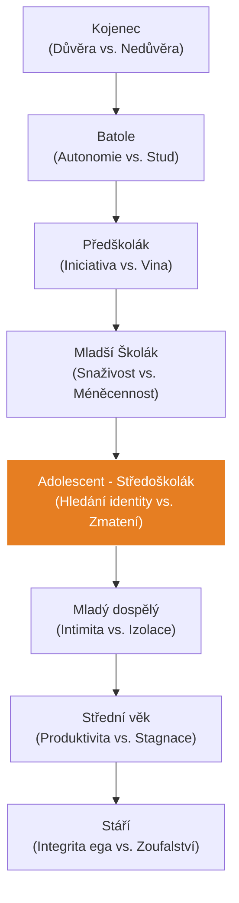

### Kognitivní (myšlenkový) vývoj podle Piageta

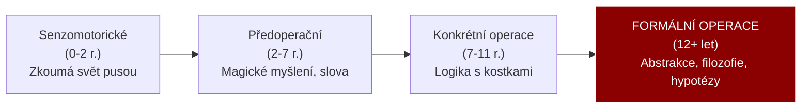

---

## Záludnosti a doplňující otázky

### ❓ 1. Co se stane, když dítě nevytvoří v prvním roce života bezpečnou vazbu (Attachment) s matkou (např. vyrůstá v ústavu s měnícími se sestrami)?
**Odpověď:** Vzniká obrovský psychologický deficit. Dítě si vytvoří tzv. úzkostný nebo vyhýbavý attachment. Následky si nese do celého života: jako adolescent nebude věřit učitelům, bude mít problém navázat trvalý milostný vztah, bude neustále žárlit nebo se naopak lidem emocionálně vyhýbat, protože podvědomě věří, že svět je nepřátelské místo, kde ho všichni nakonec opustí.

### ❓ 2. Co je to tzv. Postformální myšlení v dospělosti a proč ho Piaget neřešil?
**Odpověď:** Piaget skončil s vývojem u dospívajících (Formální abstraktní myšlení - chápání čisté logiky: 1+1=2). V reálném životě dospělého člověka ale čistá logika nefunguje (svět je plný kompromisů, emocí a nejasných řešení). Až psychologové po Piagetovi popsali tzv. *Postformální myšlení*. Je to myšlení zralého dospělého, které umí pracovat s paradoxem, s intuicí a ví, že na složitý problém (např. rozvod) neexistuje jedno jediné absolutně "správné" řešení.

### ❓ 3. Proč je adolescence označována za "nejtěžší období pro rodiče i učitele"?
**Odpověď:** Dospívající musí zvládnout dva obrovské psychologické úkoly. Zaprvé: najít odpověď na otázku "Kdo jsem?". Zadruhé: oddělit se od rodiny. Aby to dokázal, musí začít zpochybňovat všechna pravidla, která mu rodina (a škola) dala. Vytváří si vlastní morální žebříček. Pokud na tuto "revoltu" učitel (nebo rodič) zareaguje zvýšenou agresí a příkazy z pozice moci, adolescent se zcela odstřihne. Učitel se musí přesunout z role "nadřízeného velitele" do role "dospělého parťáka/facilitátora", který sice drží hranice bezpečnosti, ale respektuje názor adolescenta.


<div style='page-break-after: always;'></div>

