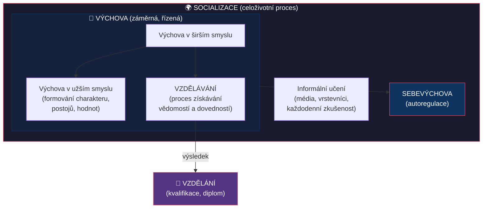
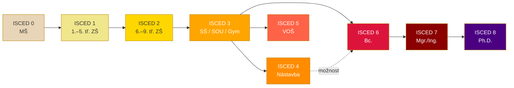
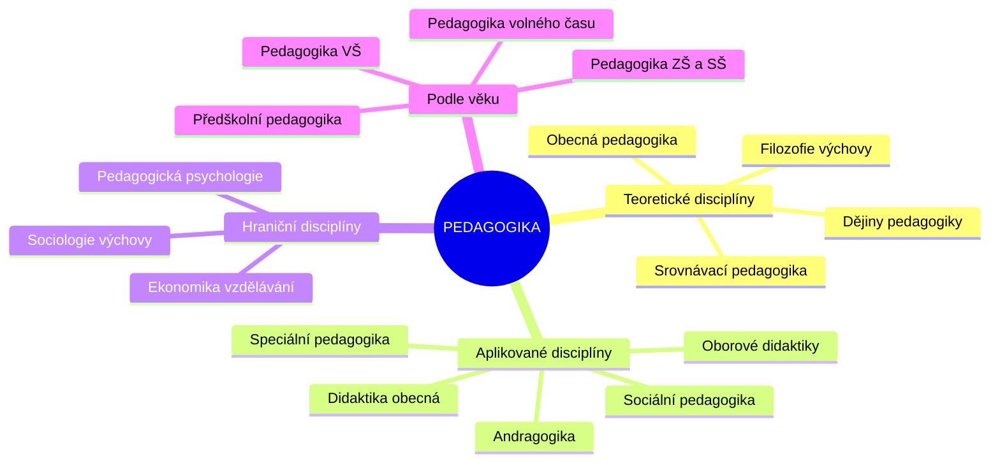

# PES 1–3: Pedagogika jako věda, výchova, vzdělávání a vzdělávací systém

> **TL;DR / Audio Shrnutí:**
> Pedagogika není jen „nauka o učení" — je to plnohodnotná společenská věda s vlastními disciplínami, metodami výzkumu a bohatou historií sahající až k Sokratovi. Výchova, vzdělávání a socializace jsou tři provázané, ale odlišné procesy, které společně formují člověka od narození až do smrti. Český vzdělávací systém je přitom zasazen do mezinárodního rámce ISCED, který umožňuje srovnávat školské soustavy celého světa. Porozumění těmto základním pilířům je nezbytný předpoklad pro každého, kdo chce učit — protože teprve když rozumíte „proč" a „jak" pedagogiky funguje, můžete kvalitně rozhodovat o „co" a „komu" ve své třídě.

---

## Znění státnicových otázek
- **PES 1:** Charakteristika pedagogiky – popsat pedagogické disciplíny, uvést významné informační zdroje pro studium pedagogiky a učitelskou praxi, vysvětlit vztah mezi studiem pedagogických věd a výkonem profese učitele.
- **PES 2:** Vysvětlete pojem výchova v širším a užším smyslu; zaměřte se na roli výchovy při formování osobnosti člověka, na její vztah k socializaci a ke kultuře; charakterizujte výchovu jako cestu k sebevýchově.
- **PES 3:** Vysvětlete pojmy vzdělání a vzdělávání; popište roli školy ve vzdělávání; vysvětlete pojmy vzdělávací systém a školská soustava; charakterizujte českou školskou soustavu; objasněte pojem celoživotní učení. Popište mezinárodní klasifikaci stupňů ve vzdělávání ISCED.

---

## Klíčové pojmy

- **Pedagogika** — společenská věda o výchově a vzdělávání člověka; zkoumá zákonitosti výchovně-vzdělávacího procesu a formuluje doporučení pro praxi.
- **Výchova** — cílevědomé a záměrné vytváření podmínek pro optimální rozvoj jedince; podmnožina socializace, která je charakterizovaná **řízeností a záměrností**.
- **Vzdělávání** — proces získávání vědomostí, dovedností, návyků, schopností a postojů; je celoživotní a nikdy nekončící.
- **Vzdělání** — dosažená úroveň (výsledek vzdělávání); doložitelná kvalifikací (maturita, diplom).
- **Socializace** — komplexní proces, při němž se biologický tvor stává sociální bytostí; probíhá **neustále** (řízené i neřízené interakce).
- **Sebevýchova** — cílevědomé a dlouhodobé úsilí jedince o formování sebe samého k vytyčenému cíli.
- **ISCED** — International Standard Classification of Education; mezinárodní klasifikace stupňů vzdělávání umožňující srovnání mezi zeměmi.
- **Celoživotní učení** — koncept zahrnující formální, neformální i informální vzdělávání po celý život.
- **Školská soustava** — organizovaný systém škol a vzdělávacích institucí dané země od MŠ po VŠ.

---

## Detailní rozebrání problematiky

### PES 1: Pedagogika jako věda

#### Předmět a postavení pedagogiky
Pedagogika je **společenská (sociální) věda**, která se zabývá **výchovou a vzděláváním** člověka v celé jeho šíři. Název pochází z řeckého *paidagógos* (otrok doprovázející dítě do školy). Dnes je pedagogika chápána jako **věda interdisciplinární** — čerpá z psychologie, sociologie, filozofie, biologie i ekonomie.

Jako věda musí pedagogika splňovat tři základní kritéria:
1. **Má jasně vymezený předmět zkoumání** — výchovně-vzdělávací proces.
2. **Používá vlastní i přejaté vědecké metody** — pozorování, experiment, dotazník, rozhovor, analýza dokumentů, případová studie.
3. **Formuluje zákonitosti a teorie** — didaktické zásady, vývojové teorie učení.

#### Pedagogické disciplíny (podle původního členění)
1. **Obecná pedagogika:** definuje základní pojmy (výchova, vzdělávání), vymezuje předmět pedagogiky a základní teorie.
2. **Dějiny výchovy a vzdělávání:** studium vývoje školy, vzdělávací soustavy, obsahu, metod a významných osobností.
3. **Teorie výchovy:** shromažďuje teorie a východiska pro vysvětlení pedagogické praxe (např. vztah rodinné výchovy a výsledků).
4. **Metodologie pedagogického výzkumu:** popisuje, jak probíhá výzkum, jaké metody zjišťování se používají a jak tvořit závěry.
5. **Obecná didaktika:** teorie vyučování (popisuje učitele, žáka, obsah, metody, formy, hodnocení nezávisle na věku).
6. **Srovnávací (komparativní, mezinárodní) pedagogika:** srovnávání vzdělávacích soustav různých zemí a popis trendů.

#### Informační zdroje pro studium a praxi
Zdroje pro učitelskou praxi (knihovny, učebnice, odborná literatura, tematické plány, konzultace s kolegy) dělíme na **tištěné, elektronické a mikrografické** (mikrofilmy a mikrofiše).

**1. Knihy a brožury:**
- *Knižní monografie* – ověřené informace zpracovávající úzce vymezené téma.
- *Jednorázové sborníky* – soubor textů (např. z konferencí).
- *Encyklopedie, naučné a jazykové slovníky*.
- *Příručky* – názorně zachycují postupy a metody.
- *Učební texty* – sumarizační dokumenty, nevýhodou je občasná stručnost a zastarávání.

**2. Periodické publikace:** *Časopisy*, *Ročenky* (statistické, výroční zprávy) a *Noviny*.

**3. Speciální dokumenty:**
- *Normativní dokumenty* (zákony, vyhlášky).
- *Firemní či interní dokumenty*.
- *Kvalifikační práce* (diplomové, absolventské).
- *Rukopisy, patenty* a *Zapisované informace z ústního zdroje* (přednášky).

**4. Významné instituce a databáze:** Jednotná informační brána (JIB), Národní knihovna, Národní pedagogická knihovna Komenského (NPKK), MŠMT, NÚV, ČŠI, portál RVP.cz.

#### Vztah studia pedagogiky a profese učitele
Studium pedagogických věd poskytuje učiteli **teoretický rámec** pro porozumění procesům, které řídí. Bez teorie je praxe „slepá" (intuitivní, nekonzistentní), bez praxe je teorie „prázdná". Profesní příprava učitele zahrnuje tři složky:
1. **Odbornou** (předmětovou) — co učím
2. **Pedagogicko-psychologickou** — jak a proč učím
3. **Praktickou** (pedagogická praxe) — zkušenost z reálné výuky

---

### PES 2: Výchova, socializace a sebevýchova

#### Výchova v širším a užším smyslu

**Výchova v širším smyslu** zahrnuje veškeré cílevědomé formativní působení na člověka — zahrnuje jak vzdělávání (kognitivní rozvoj), tak výchovu v užším smyslu (formování postojů, hodnot, charakteru).

**Výchova v užším smyslu** se zaměřuje primárně na **formování osobnostních kvalit** — morálních vlastností, postojů, sociálních dovedností a hodnotové orientace.

> **Definice (Průcha):** Výchova je cílevědomé a záměrné vytváření a ovlivňování podmínek umožňujících optimální rozvoj každého jedince v souladu s individuálními dispozicemi a stimulujících jeho vlastní snahu stát se autentickou, vnitřně integrovanou a socializovanou osobností.

#### Výchova a její vztah k socializaci

| Aspekt | Socializace | Výchova |
|--------|-------------|---------|
| **Záměrnost** | Záměrná i nezáměrná | Vždy záměrná a cílevědomá |
| **Rozsah** | Celoživotní, prolíná všechny situace | Podmnožina socializace |
| **Aktéři** | Kdokoli (média, vrstevníci, společnost) | Vychovatel ↔ vychovávaný |
| **Cíl** | Začlenění do společnosti | Formování osobnosti k vytyčeným cílům |
| **Kontrola** | Často nekontrolovaná | Řízená, plánovitá |

Socializace je **přirozený, celoživotní proces** vrůstání jedince do společnosti. Výchova je její **řízený a záměrný úsek**. Prostřednictvím socializace se reprodukují sociální normy, hodnoty, role a komunikační vzorce.

#### Role výchovy při formování osobnosti
Výchova působí na všechny složky osobnosti:
- **Kognitivní** — rozvoj myšlení, vědomostí, poznávacích schopností
- **Afektivní** — formování citů, postojů, hodnotové orientace
- **Konativní (volní)** — rozvoj vůle, sebekázně, vytrvalosti
- **Sociální** — budování sociálních dovedností a kompetencí

#### Výchova a kultura
Výchova je vždy **kulturně podmíněna** — předává kulturní dědictví (jazyk, tradice, normy, hodnoty) z generace na generaci. Zároveň kulturu **spoluvytváří** tím, že připravuje jedince na její obohacování a transformaci.

#### Sebevýchova
Sebevýchova je **vrcholná forma výchovy** — jedinec přebírá odpovědnost za vlastní rozvoj. Předpokládá:
- Schopnost **sebereflexe** (znám své silné i slabé stránky)
- Stanovení **vlastních cílů** rozvoje
- **Vůli a disciplínu** k jejich dosahování
- Využití vlastních i zprostředkovaných zkušeností

Výchova je tedy **cesta k sebevýchově** — od vnější regulace k vnitřní autoregulaci.

---

### PES 3: Vzdělání, vzdělávání, školská soustava a ISCED

#### Vzdělání vs. vzdělávání

| Pojem | Charakteristika |
|-------|-----------------|
| **Vzdělávání** | **Proces** — získávání vědomostí, dovedností, návyků, schopností, postojů |
| **Vzdělání** | **Výsledek** — dosažená úroveň; doložitelná kvalifikací (vysvědčení, diplom) |

Vzdělání není oddělitelné od výchovy — každé kvalitní vzdělávání má i výchovnou dimenzi. Vzdělání je zároveň **záležitostí politickou** (stát stanovuje povinnou školní docházku, obsah vzdělávání, standardy).

#### Role školy
Škola plní v moderní společnosti **několik klíčových funkcí**:
1. **Kvalifikační** — předává vědomosti a dovednosti potřebné pro profesní uplatnění
2. **Socializační** — učí žáky žít ve společnosti, spolupracovat, řešit konflikty
3. **Integrační** — začleňuje jedince do společnosti bez ohledu na původ
4. **Selektivní** — hodnotí a třídí žáky podle výkonu (kontroverzní funkce)
5. **Ochranná (kuratelární)** — poskytuje bezpečné prostředí, chrání před rizikovými vlivy
6. **Personalizační** — podporuje rozvoj individuality každého žáka

#### Vzdělávací systém a školská soustava

**Vzdělávací systém** = soubor všech forem a institucí vzdělávání (školy, kurzy, e-learning, rekvalifikace...).

**Školská soustava** = organizovaná struktura škol a školských zařízení podle zákona.

**Klíčová legislativa ČR:**
- **Zákon č. 561/2004 Sb.** — Školský zákon (předškolní, základní, střední, vyšší odborné a jiné vzdělávání)
- **Zákon č. 563/2004 Sb.** — Zákon o pedagogických pracovnících
- **Zákon č. 111/1998 Sb.** — Zákon o vysokých školách

**Zřizovatelé škol:**
- **Obec/svazek obcí** → MŠ, ZŠ
- **Krajský úřad** → SŠ, gymnázia, konzervatoře
- **MŠMT/stát** → vybrané školy
- **Soukromé osoby, církve** → soukromé a církevní školy

#### Formy vzdělávání
| Forma | Charakteristika |
|-------|-----------------|
| **Denní** | Pravidelná docházka 5× týdně |
| **Večerní** | Obvykle po pracovní době |
| **Dálková** | Samostudium + konzultace 1–2× za 14 dní (200–220 h/rok) |
| **Distanční** | Pomocí ICT technologií |
| **Kombinovaná** | Kombinace výše uvedených forem |

#### Celoživotní učení (Lifelong Learning)

Celoživotní učení je **zastřešující koncept**, který zahrnuje veškeré učení během celého života:

- **Formální vzdělávání** — ve školách a institucích, zakončené certifikátem (vysvědčení, diplom)
- **Neformální vzdělávání** — organizované kurzy, semináře, školení mimo školskou soustavu (bez oficiálního stupně vzdělání)
- **Informální učení** — spontánní, každodenní učení ze zkušenosti, z médií, od druhých lidí

#### ISCED — Mezinárodní klasifikace stupňů vzdělávání

ISCED (International Standard Classification of Education) je klasifikace UNESCO umožňující **mezinárodní srovnávání** vzdělávacích systémů.

| Úroveň | Název | Český ekvivalent |
|---------|-------|-------------------|
| **ISCED 0** | Vzdělávání v raném dětství | MŠ (povinný předškolní rok) |
| **ISCED 1** | Primární vzdělání | 1.–5. ročník ZŠ |
| **ISCED 2** | Nižší sekundární vzdělání | 6.–9. ročník ZŠ / nižší gymnázium |
| **ISCED 3** | Vyšší sekundární vzdělání | SŠ, SOU, gymnázium, lyceum |
| **ISCED 4** | Postsekundární neterciární | Nástavbové studium |
| **ISCED 5** | Krátký cyklus terciárního | VOŠ |
| **ISCED 6** | Bakalářská úroveň | Bc. studium |
| **ISCED 7** | Magisterská úroveň | Mgr./Ing. studium |
| **ISCED 8** | Doktorská úroveň | Ph.D. studium |

**Povinná školní docházka v ČR:** 9 let (od 6 do 15 let, resp. do splnění 9 let docházky). Od 2017 je povinný i **poslední rok předškolního vzdělávání** (ISCED 0).

---

## Vizualizace

### Vztah výchovy, vzdělávání a socializace

### Struktura ISCED a české školské soustavy

### Pedagogické disciplíny — mapa oboru

---

## Záludnosti a doplňující otázky

### ❓ 1. Jaký je rozdíl mezi socializací a výchovou? Může probíhat socializace bez výchovy a naopak?
**Odpověď:** Socializace probíhá **neustále** — i bez záměru (dítě se učí sledováním televize, interakcí s vrstevníky). Výchova je vždy **záměrná a řízená** podmnožina socializace. Socializace bez výchovy existuje (informální učení na ulici). Výchova bez socializace neexistuje — protože výchova je jedním z mechanismů socializace.

### ❓ 2. Co je to „obrácená socializace" a proč je dnes aktuální?
**Odpověď:** Obrácená (reverzní) socializace nastává, když **mladší generace ovlivňuje a „učí" starší** — typicky v oblasti technologií (dítě učí rodiče používat smartphone). V kontextu rychlého technologického vývoje a digitalizace je tento fenomén stále častější a mění tradiční dynamiku vychovatel–vychovávaný.

### ❓ 3. Proč nestačí rozlišovat vzdělání jen podle ISCED úrovně? Co dalšího je potřeba zohlednit?
**Odpověď:** ISCED klasifikuje pouze **stupeň** vzdělání, nikoli jeho **kvalitu, obor nebo zaměření**. Dvě osoby s ISCED 6 (Bc.) mohou mít zcela odlišné kompetence. Proto ISCED doplňuje klasifikace **ISCED-F** (Fields of Education — obory vzdělávání). Navíc ISCED nezachycuje **informální a neformální učení**, které může mít pro praxi větší význam než formální kvalifikace.
