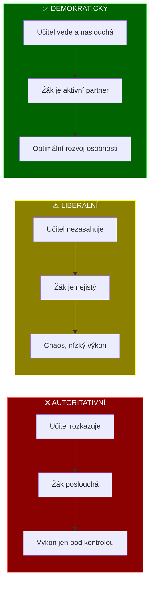
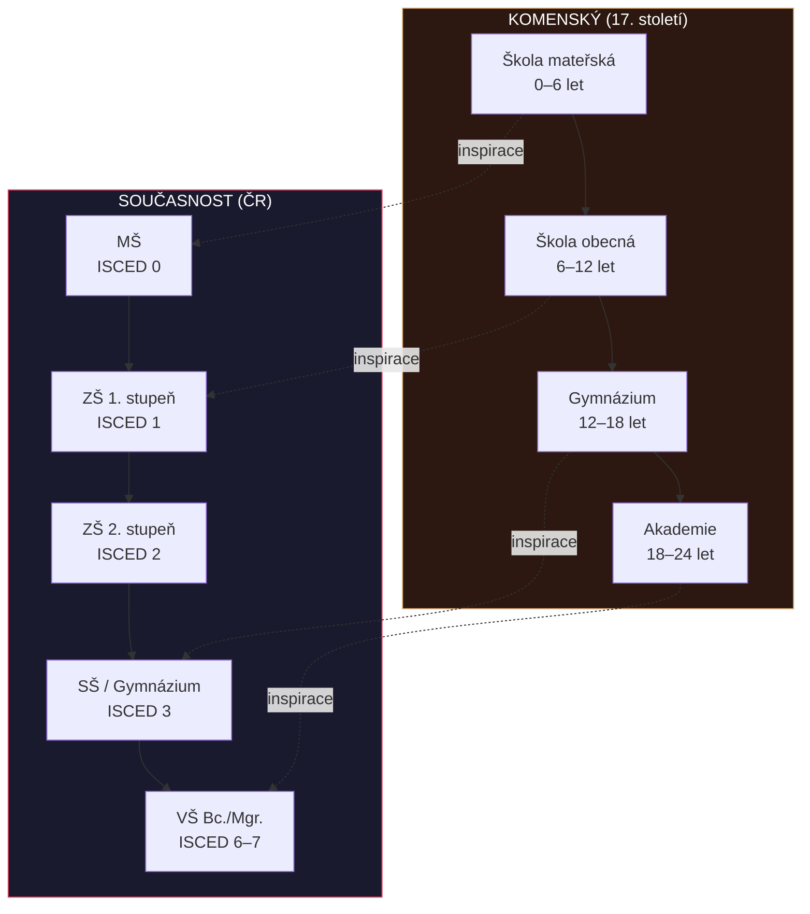
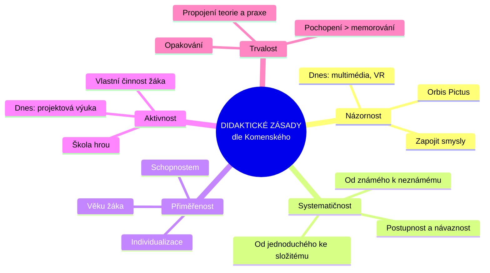

# PES 4–5: Profese učitele a odkaz J. A. Komenského

> **TL;DR / Audio Shrnutí:**
> Učitelství není pouhé zaměstnání — je to profese s vlastním etickým kodexem, kvalifikačními požadavky a třemi základními vyučovacími styly (autoritativní, liberální, demokratický). Každý učitel vstupuje do třídy s jedinečnou kombinací osobnostních předpokladů, od pedagogického taktu přes optimismus až po odbornou připravenost. A nad tím vším stojí odkaz Jana Amose Komenského — muže, který před 400 lety zformuloval principy, které dodnes tvoří páteř moderní didaktiky: názornost, systematičnost, přiměřenost a přesvědčení, že vzdělání patří všem. Jeho myšlenky nejsou historická kuriozita, ale živý návod pro každého, kdo dnes stojí před třídou.

---

## Znění státnicových otázek
- **[DOB, VOT]** **PES 4:** Charakterizujte profesi učitele, typologii učitele a vyučovacích stylů, vlastnosti a předpoklady pro výkon práce učitele, charakterizujte pedagogickou komunikaci, zaměřte se na možnosti kariérního vývoje a dalšího profesního vzdělávání pedagogických pracovníků.
- **[VOT]** **PES 5:** Vysvětlete význam J. A. Komenského pro dnešní pedagogiku a vzdělávání; představte důležitá díla a hlavní myšlenky jeho pedagogické koncepce; uveďte možné aplikace myšlenek J. A. Komenského pro současné vzdělávání.

---

## Klíčové pojmy

- **Profese učitele** — práce vyžadující odborné znalosti, specifickou přípravu, kvalifikační kritéria a etický kodex; učitel je odpovědný za svůj profesní výkon vůči žákům.
- **Vyučovací styl** — převládající způsob interakce učitele s žáky; závisí na osobnostních rysech, zkušenostech a filozofii výchovy.
- **Pedagogický takt** — schopnost respektovat žákovu osobnost při zachování náročnosti a důslednosti.
- **Pedagogická komunikace** — vzájemná výměna informací ve výchovně-vzdělávacím procesu jazykovými i nejazykovými prostředky.
- **Kariérní řád učitele** — systém profesního růstu pedagogických pracovníků (adaptační období → praxe → mentor/metodik).
- **Pansofie** — Komenského koncept „vševědy"; přesvědčení, že veškeré poznání tvoří harmonický celek.
- **Didaktické zásady** — obecné principy vyučování formulované Komenským (názornost, systematičnost, přiměřenost aj.).

---

## Detailní rozebrání problematiky

### PES 4: Profese učitele

#### Učitelství jako profese
Profese se od běžného zaměstnání liší v několika kritériích:
- **Jasně vymezený soubor odborných znalostí a dovedností** založený na vědeckých poznatcích
- **Kvalifikační požadavky** pro vstup (pedagogické vzdělání, zákon 563/2004 Sb.)
- **Etický kodex** — morální odpovědnost vůči žákům, rodičům, společnosti
- **Autonomie v rozhodování** — učitel volí metody, přístupy, hodnotí
- **Celoživotní profesní rozvoj** — povinnost dalšího vzdělávání

#### Typologie učitele — tři vyučovací styly

**1. Autoritativní (dominantní) styl**
- Převažují příkazy, hrozby, tresty; málo respektuje potřeby žáků
- Nepřipouští diskuzi, vyžaduje doslovnou reprodukci
- **Výsledek:** Vysoký výkon jen pod kontrolou; u slabších žáků → submisivita, u silných → agresivita
- **Riziko:** Potlačení tvořivosti a iniciativy žáků

**2. Liberální (nezasahující) styl**
- Řídí málo nebo vůbec; užívá neosobní výzvy („mělo by se...")
- Často z nejistoty nebo snahy vyhnout se chybám autoritativního přístupu
- **Výsledek:** Žáci jsou nejistí, chaotické reakce, nedosahují potenciálu
- **Riziko:** Chybí normy a organizace nezbytná pro formování charakteru

**3. Demokratický (integrační) styl**
- Dostatek kontroly + prostor pro iniciativu, samostatnost a tvořivost
- Sankce uplatňovány vyváženě a spravedlivě; třída má přehled o postupu k cíli
- **Výsledek:** Psychosociálně zralá osobnost žáka; nejlepší pro rozvoj kolektivu
- **Poznámka:** Nejtěžší styl — vyžaduje sebereflexi a neustálé učení se

#### Vlastnosti a předpoklady učitele

| Předpoklad | Popis |
|-----------|-------|
| **Pedagogický takt** | Respektování žáka + klidné a otevřené jednání + náročnost a důslednost |
| **Pedagogický klid** | Soustředěná, klidná práce; odolnost vůči provokacím |
| **Pedagogický optimismus** | Víra v účinnost svého působení a ve schopnosti žáka |
| **Pedagogická připravenost** | Odborné i pedagogické vědomosti + praktická zkušenost |
| **Pedagogické zaujetí** | Citově kladný a aktivní přístup k žákům a vlastní práci |
| **Tvůrčí práce** | Nespokojit se se stávající úrovní; inovovat a zlepšovat |
| **Morální postoj** | Osobnost učitele jako nejsilnější nástroj pozitivního ovlivňování |
| **Přístup k žákům** | Snaha poznat schopnosti žáků, odhalovat jejich potřeby a řešit jejich problémy |
| **Spravedlivý přístup** | Jednotné hodnocení všech žáků; odolnost vůči intervencím |

#### Pedagogická komunikace
- **Verbální** — řeč, kladení otázek, vysvětlování, instrukce
- **Neverbální** — mimika, gesta, proxemika (vzdálenost), haptika (dotek), posturologie (postoj těla)
- **Paralingvistika** — tón hlasu, tempo řeči, pauzy, intonace
- Optimální komunikace plní **pedagogické funkce**: motivuje, informuje, organizuje, hodnotí

#### Kariérní vývoj a další vzdělávání
Systém dalšího vzdělávání pedagogických pracovníků (DVPP):
- **Průběžné vzdělávání** — povinnost po celou dobu pedagogické činnosti
- **Kvalifikační studium** — rozšíření nebo zvýšení kvalifikace (CŽV na VŠ)
- **Funkční studium** — pro vedoucí pracovníky (ředitele, zástupce)
- **Specializační studium** — výchovný poradce, metodik prevence, koordinátor ŠVP, mentor

**Kariérní systém (novelizace 2024+):**
- **Adaptační období** (2 roky) — začínající učitel pod vedením uvádějícího učitele
- **Samostatný učitel** — plně kvalifikovaný pedagog
- **Vyšší kariérní stupně** — mentor, metodik, lektor DVPP

---

### PES 5: Jan Amos Komenský

#### Životní kontext
- **1592–1670**, poslední biskup Jednoty bratrské
- Celý život ovlivněn třicetiletou válkou; exulant (Lešno, Blatný Potok, Amsterdam)
- Přízvisko **„Učitel národů"** (Teacher of Nations)
- Zakladatel **moderní pedagogiky** — jako první systematicky zpracoval teorii vyučování

#### Klíčová díla

| Dílo | Rok | Význam |
|------|-----|--------|
| **Didactica magna** (Velká didaktika) | 1657 | Ucelená teorie vyučování — „umění učit všechny všemu" |
| **Orbis sensualium pictus** | 1658 | První ilustrovaná učebnice na světě — princip názornosti |
| **Janua linguarum reserata** (Brána jazyků otevřená) | 1631 | Revoluční metoda výuky jazyků přes věcný obsah |
| **Informatorium školy mateřské** | 1633 | Průkopnické dílo o předškolní výchově |
| **Schola ludus** (Škola hrou) | 1654 | Dramatizace ve výuce; učení hrou |
| **Obecná porada o nápravě věcí lidských** | nedokončeno | Velkolepý plán celosvětové reformy společnosti skrze vzdělání |

#### Hlavní pedagogické myšlenky

**1. Vzdělání pro všechny (demokratizace)**
- „Všichni mají být vzděláváni ve všem" — bez rozdílu pohlaví, původu, majetku
- Revoluční myšlenka v 17. století; předjímá moderní inkluzivní vzdělávání

**2. Didaktické zásady**
Komenský formuloval zásady, které platí dodnes:
- **Zásada názornosti** — „Nic není v rozumu, co nebylo dříve ve smyslech"; učení skrze přímou zkušenost
- **Zásada systematičnosti a posloupnosti** — od jednoduchého ke složitému, od známého k neznámému
- **Zásada přiměřenosti** — obsah a metody přizpůsobené věku a schopnostem žáka
- **Zásada aktivnosti** — žák se má učit vlastní činností, ne pouhým posloucháním
- **Zásada trvalosti** — opakování, procvičování, propojení teorie s praxí

**3. Koncept školy rozčleněné podle věku**
Komenský navrhl **čtyřstupňový systém:**
- **Škola mateřská** (0–6 let) — v rodině, pod vedením matky
- **Škola obecná** (6–12 let) — čtení, psaní, počítání, náboženství, mravní výchova
- **Škola latinská / gymnázium** (12–18 let) — sedmero svobodných umění, jazyky
- **Akademie** (18–24 let) — univerzitní studium, specializace

**4. Učitel jako „slunce" vzdělávání**
- Učitel má být vzdělaný, trpělivý, spravedlivý
- Má učit s radostí a nadšením — „Škola nemá být mučírnou, ale dílnou lidskosti"

**5. Škola jako „dílna lidskosti" (officina humanitatis)**
- Vzdělání není cíl sám o sobě — je **nástrojem nápravy společnosti**
- Pouze vzděláním se mohou rozvíjet kvality člověka

#### Aplikace myšlenek Komenského v současném vzdělávání

| Komenského princip | Současná aplikace |
|--------------------|-------------------|
| Názornost | Multimediální výuka, simulace, laboratorní pokusy, exkurze |
| Systematičnost | Strukturované kurikulum, spirálové uspořádání učiva |
| Přiměřenost | Diferenciace a individualizace výuky; IVP pro žáky se SVP |
| Aktivnost žáka | Aktivizační metody, projektová výuka, badatelské učení |
| Škola hrou | Gamifikace, didaktické hry, dramatická výchova |
| Vzdělání pro všechny | Inkluzivní vzdělávání, rovný přístup, antidiskriminace |
| Celoživotní vzdělávání | Koncept LLL; Komenský předjímal ideu, že se člověk učí celý život |

---

## Vizualizace

### Tři vyučovací styly — porovnání

### Komenského vzdělávací systém vs. současný

### Didaktické zásady — mindmapa

---

## Záludnosti a doplňující otázky

### ❓ 1. Je demokratický styl vždy nejlepší? Existují situace, kdy je vhodný autoritativní přístup?
**Odpověď:** Demokratický styl je obecně nejúčinnější pro rozvoj žáka, ale nejde aplikovat dogmaticky. V **krizových situacích** (BOZP, nebezpečí, akutní kázeňský problém) je autoritativní zásah nezbytný. Také u **velmi malých dětí** nebo v počátečních fázích nácviku složitých dovedností (např. bezpečnost u strojů v OV) je direktivní vedení opodstatněné. Klíčem je **flexibilita** — dobrý učitel umí přepínat mezi styly podle kontextu.

### ❓ 2. Proč je Komenský relevantní i v 21. století? Není jeho odkaz zastaralý?
**Odpověď:** Komenského principy jsou **nadčasové**, protože vycházejí z podstaty lidského poznávání (učení smysly, aktivním zapojením, v logické posloupnosti). Moderní neurověda potvrzuje to, co Komenský intuitivně popsal: multisenzorické učení je efektivnější, motivace zvyšuje retenci, přiměřená náročnost podporuje flow state. Navíc jeho myšlenka vzdělání pro všechny je stále nedokončeným projektem (inkluzivní vzdělávání, digitální propast, rovný přístup).

### ❓ 3. Jaký je rozdíl mezi vyučovacím stylem a vyučovací metodou?
**Odpověď:** **Vyučovací styl** je celkový přístup učitele k interakci se žáky — je relativně stabilní a odráží osobnost učitele (autoritativní/liberální/demokratický). **Vyučovací metoda** je konkrétní postup k dosažení výukového cíle (výklad, diskuze, demonstrace, skupinová práce). Jeden učitel může v rámci svého demokratického stylu používat různé metody. Styl je „jak jsem", metoda je „co dělám v dané hodině".
