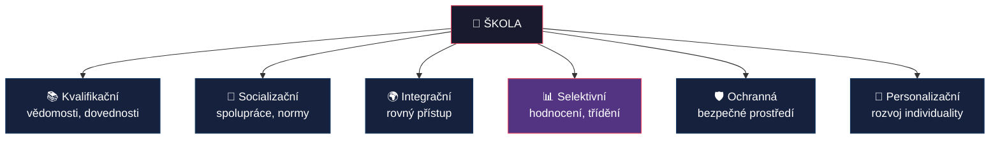
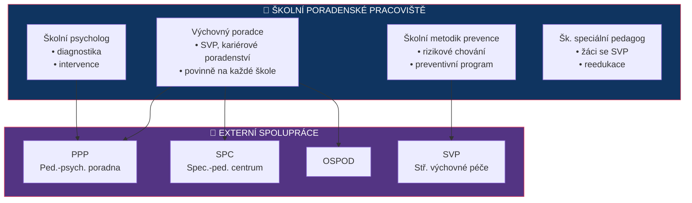
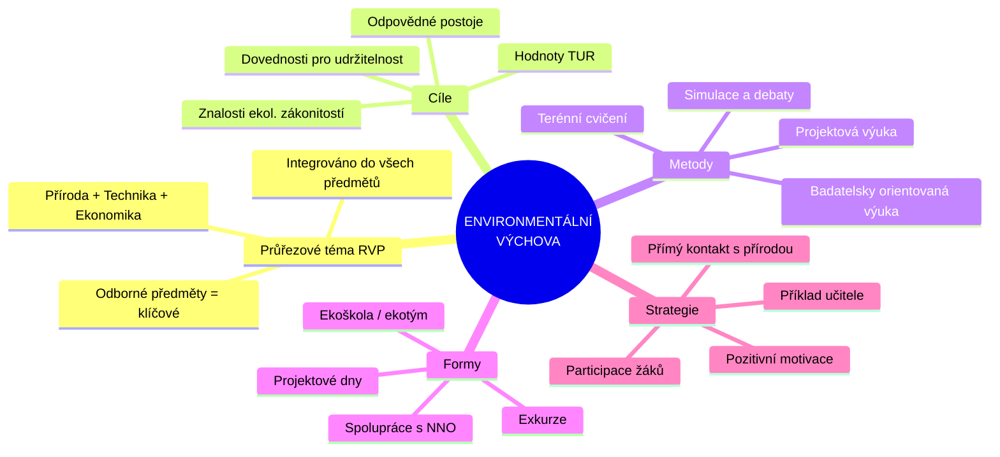

# PES 6–7: Environmentální výchova, funkce školy a odborné školství

> **TL;DR / Audio Shrnutí:**
> Environmentální výchova není jen „třídění odpadu ve škole" — je to systematický přístup k budování ekologické gramotnosti žáků, který prostupuje celým kurikulem jako průřezové téma. Učitel odborného předmětu má přitom unikátní pozici: může žákům ukázat konkrétní dopady jejich budoucí profese na životní prostředí. Škola jako taková plní v moderní společnosti šest klíčových funkcí — od kvalifikační přes socializační až po ochrannou. V odborném školství pak hraje zásadní roli propojení s trhem práce, systém podpůrných poradenských sítí a harmonizace s evropskými standardy (EQF, ECVET, Europass). Pochopení těchto souvislostí je klíčem k tomu, aby učitel nebyl jen „předavač informací", ale aktivní spolutvůrce vzdělávacího ekosystému.

---

## Znění státnicových otázek
- **PES 6:** Popište možnosti začlenění tématu trvale udržitelného rozvoje do obsahu výuky; charakterizujte cíle, formy a metody environmentální výchovy; popište možné strategie rozvoje vnímavosti žáků k životnímu prostředí v rámci školy.
- **PES 7:** Popište funkce školy, charakterizujte podpůrné sítě ve školství (úloha výchovných a kariérových poradců). Zaměřte se na odborné školství, možnosti odborného vzdělávání v kontextu se vzděláváním v EU.

---

## Klíčové pojmy

- **Environmentální výchova (EV)** — průřezové téma RVP zaměřené na rozvoj vnímavosti k životnímu prostředí, pochopení ekologických souvislostí a odpovědného chování.
- **Trvale udržitelný rozvoj (TUR / SDGs)** — rozvoj uspokojující potřeby současnosti bez ohrožení schopnosti budoucích generací uspokojovat své potřeby (def. Brundtlandová, 1987).
- **Průřezové téma** — téma, které se nepřiděluje jednomu předmětu, ale prostupuje celým kurikulem (EV, Mediální výchova, OSVP, Výchova k myšlení v evropských a globálních souvislostech aj.).
- **Výchovný poradce** — pedagog se specializačním studiem, zajišťuje kariérové a výchovné poradenství na škole.
- **Kariérový poradce** — pomáhá žákům s volbou dalšího vzdělávání a profesní orientací.
- **Školní metodik prevence** — koordinuje prevenci rizikového chování na škole.
- **EQF (European Qualifications Framework)** — Evropský rámec kvalifikací; 8 úrovní pro srovnání kvalifikací v EU.
- **ECVET** — Evropský systém kreditů pro odborné vzdělávání a přípravu.
- **Europass** — soubor dokumentů pro transparentní prezentaci kvalifikací v EU.

---

## Detailní rozebrání problematiky

### PES 6: Environmentální výchova a udržitelný rozvoj

#### Začlenění tématu udržitelného rozvoje do výuky

Environmentální výchova je v RVP zakotvena jako **průřezové téma** — nemá vlastní předmět, ale prolíná se všemi vzdělávacími oblastmi. Učitel odborných předmětů má přitom výjimečnou příležitost propojit environmentální tématiku s **konkrétní profesní praxí** žáků.

**Způsoby začlenění:**
1. **Integrace do odborných předmětů** — ekologické aspekty výrobních procesů, úspora materiálu, recyklace odpadů, energetická efektivita
2. **Projektová výuka** — ekologický audit školy/pracoviště, uhlíková stopa výrobku
3. **Exkurze** — čistírny odpadních vod, recyklační centra, ekologické farmy, solární/větrné elektrárny
4. **Školní akce** — Den Země, třídění odpadu, školní zahrada, kompostování
5. **Mezipředmětové vztahy** — propojení přírodovědných, technických a ekonomických předmětů

#### Cíle environmentální výchovy

| Úroveň | Cíl |
|---------|-----|
| **Znalosti** | Pochopení ekologických zákonitostí, příčin a důsledků environmentálních problémů |
| **Postoje** | Utváření odpovědného vztahu k přírodě a životnímu prostředí |
| **Dovednosti** | Schopnost posoudit ekologický dopad činností; kompetence k jednání pro udržitelnost |
| **Hodnoty** | Internalizace principů udržitelného rozvoje jako osobní hodnoty |

#### Formy a metody environmentální výchovy

**Formy:**
- Vyučovací hodina s ekologickým obsahem
- Terénní výuka a pobyt v přírodě
- Projektové dny/týdny
- Spolupráce s ekocentry a NNO (TEREZA, Ekocentrum Koniklec aj.)
- Školní ekotým (Eco-Schools / Ekoškola)

**Metody:**
- **Badatelsky orientovaná výuka** — žáci sami zkoumají environmentální problémy
- **Simulace a modelové situace** — rozhodování o využití přírodních zdrojů
- **Diskuze a debaty** — kontroverzní environmentální témata (jaderná energetika, GMO)
- **Práce s daty** — analýza spotřeby energie, vodní stopy, statistik znečištění
- **Terénní cvičení** — monitoring kvality vody/ovzduší, mapování biodiverzity

#### Strategie rozvoje vnímavosti žáků
1. **Přímý kontakt s přírodou** — nelze budovat vztah k něčemu, co žák nezná
2. **Osobní příklad učitele** — autentické ekologické chování
3. **Propojení s praxí** — „Co mohu já dělat jinak ve své profesi?"
4. **Pozitivní motivace** — ne strašení katastrofami, ale ukazování řešení
5. **Zapojení žáků do rozhodování** — participace na ekologických projektech školy

---

### PES 7: Funkce školy, podpůrné sítě a odborné školství

#### Funkce školy v moderní společnosti

| Funkce | Popis |
|--------|-------|
| **1. Kvalifikační** | Předává vědomosti, dovednosti a kompetence pro profesní uplatnění |
| **2. Socializační** | Učí žáky žít ve společnosti, spolupracovat, dodržovat normy |
| **3. Integrační** | Začleňuje jedince bez ohledu na sociální, etnický či zdravotní původ |
| **4. Selektivní** | Třídí žáky podle výkonu (klasifikace, přijímací řízení) — kontroverzní |
| **5. Ochranná (kuratelární)** | Zajišťuje bezpečné prostředí; chrání před rizikovými vlivy |
| **6. Personalizační** | Rozvíjí individualitu a jedinečný potenciál každého žáka |

#### Podpůrné sítě ve školství — školní poradenské pracoviště (ŠPP)

Na každé škole působí **školní poradenské pracoviště**, které tvoří:

**Výchovný poradce**
- Povinně na každé škole
- Koordinuje péči o žáky se SVP a žáky nadané
- Kariérové poradenství (volba SŠ/VŠ)
- Spolupráce s PPP, SPC a OSPOD
- Vyžaduje specializační studium (250 h)

**Školní metodik prevence**
- Koordinuje Minimální preventivní program školy
- Prevence rizikového chování (šikana, závislosti, kriminalita)
- Spolupráce s centry primární prevence
- Vzdělávání pedagogického sboru v oblasti prevence

**Školní psycholog / Školní speciální pedagog** (nepovinné, ale žádoucí)
- Přímá diagnostická a intervenční práce s žáky
- Individuální i skupinové poradenství
- Podpora učitelů v práci se žáky se SVP

**Externí spolupráce:**
- **PPP** (pedagogicko-psychologická poradna) — diagnostika, doporučení podpůrných opatření
- **SPC** (speciálně pedagogické centrum) — pro žáky s konkrétním typem postižení
- **OSPOD** — orgán sociálně-právní ochrany dětí
- **SVP** (středisko výchovné péče) — pro žáky s poruchami chování

#### Odborné školství v ČR

**Typy středních odborných škol:**
- **SOŠ** — zakončeno maturitní zkouškou (ISCED 3A)
- **SOU** — zakončeno výučním listem (ISCED 3C) nebo maturitou
- **Nástavbové studium** — pro absolventy učebních oborů → maturita (ISCED 4)

**Specifika odborného vzdělávání:**
- Důraz na **praktické vyučování** (odborný výcvik, praxe)
- Propojení s **reálným pracovním prostředím** (firmy, dílny)
- Výuka dle **ŠVP** zpracovaného podle **RVP** pro daný obor
- Klíčové kompetence + odborné kompetence

#### Odborné vzdělávání v kontextu EU

| Nástroj | Funkce |
|---------|--------|
| **EQF** (Evropský rámec kvalifikací) | 8 úrovní kvalifikací pro srovnání napříč EU; české „Národní soustava kvalifikací" (NSK) je na EQF navázána |
| **ECVET** | Kreditní systém pro odborné vzdělávání — umožňuje uznávání výsledků učení získaných v zahraničí |
| **Europass** | Soubor dokumentů (životopis, jazykový pas, dodatek k osvědčení) pro transparentní prezentaci kvalifikací |
| **Erasmus+** | Program EU pro mobility žáků a učitelů; stáže v zahraničí |
| **Kodaňský proces** | Iniciativa EU pro posílení kvality a atraktivity odborného vzdělávání |

**Duální vzdělávání** — model, kde žák tráví část studia ve škole a část v reálném podniku. V ČR pilotně zaváděno, v Německu, Rakousku a Švýcarsku je základem systému.

---

## Vizualizace

### Funkce školy

### Školní poradenské pracoviště — struktura

### Environmentální výchova — začlenění do výuky

---

## Záludnosti a doplňující otázky

### ❓ 1. Jak může učitel odborného výcviku (např. automechanik, kuchař) začlenit environmentální výchovu do svého předmětu?
**Odpověď:** Automechanik: likvidace provozních kapalin, recyklace autovraku, emisní normy, alternativní pohony. Kuchař: local sourcing, minimalizace food waste, sezónní suroviny, kompostování bioodpadu, energetická efektivita při vaření. Klíčové je, aby EV nebyla „navíc", ale **integrální součást** odborné praxe — žák vidí, že ekologické jednání je znakem profesionála.

### ❓ 2. Co je EQF a proč je důležitý pro absolventy českých škol?
**Odpověď:** EQF (European Qualifications Framework) je referenční rámec s 8 úrovněmi, který umožňuje **srovnání kvalifikací** získaných v různých zemích EU. Český výuční list (ISCED 3C) odpovídá zhruba EQF úrovni 3, maturita EQF 4, Bc. EQF 6. Díky EQF zaměstnavatel v Německu rozumí, co český absolvent umí. Doplňuje ho **Europass** (standardizované dokumenty) a **ECVET** (kreditní systém pro uznávání učení v zahraničí).

### ❓ 3. Jaký je rozdíl mezi výchovným poradcem a kariérovým poradcem?
**Odpověď:** **Výchovný poradce** je pedagogický pracovník školy se specializačním studiem (250 h); řeší jak kariérové poradenství, tak péči o žáky se SVP a výchovné problémy. **Kariérový poradce** je užší role zaměřená specificky na profesní orientaci a volbu dalšího vzdělávání. V praxi výchovný poradce často plní obě role. Na větších školách může být kariérové poradenství odděleno. Od roku 2024 se posiluje koncept **kariérového vzdělávání** jako součásti kurikula (ne jen jednorázového poradenství).
