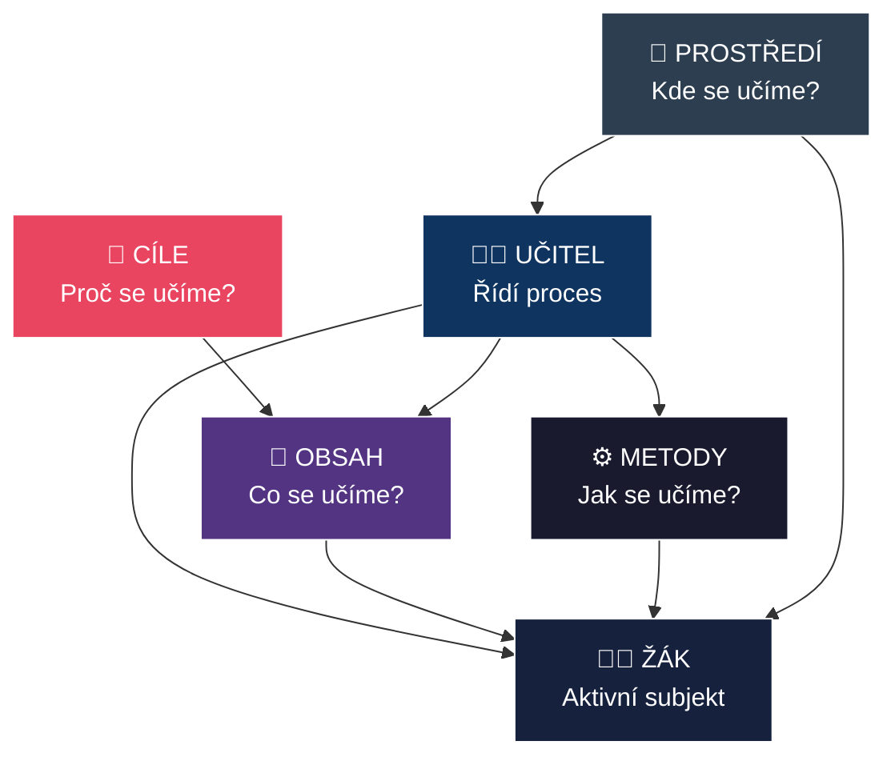
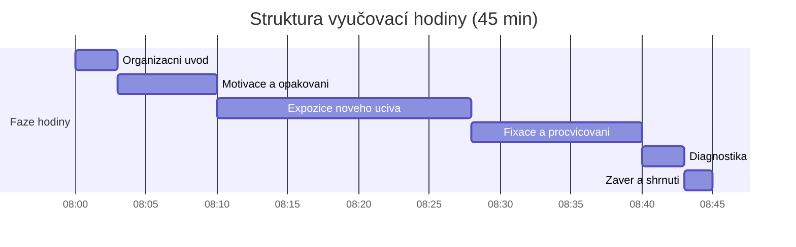

# PES 8–10: Model výuky, didaktická analýza a třídní management

> **TL;DR / Audio Shrnutí:**
> Vyučování není náhodný proces — je to systém s jasnými prvky (učitel, žák, obsah, prostředí) a vazbami mezi nimi, který probíhá ve fázích od přípravy přes realizaci po reflexi. Didaktická analýza je klíčová učitelská dovednost: myšlenkový proces, kterým učitel rozkládá učivo na zvládnutelné části, stanovuje cíle, volí metody a hodnotí výsledky. A třídní management? To je umění řídit celou tuto orchestraci v reálném čase — od motivačního úvodu přes udržení pozornosti až po závěrečné shrnutí. Kdo tyto tři pilíře ovládá, ten nejen „učí", ale skutečně řídí proces učení.

---

## Znění státnicových otázek
- **PES 8:** Popište model procesu výuky, stručně vysvětlete pojmy učitel, žák, obsah výuky, prostředí a vztahy mezi nimi; charakterizujte obvyklé fáze přípravy a realizace vyučování; objasněte význam vnějších a vnitřních podmínek na efektivitu vyučování.
- **PES 9:** Vysvětlete pojem didaktická analýza obsahu, popište její fáze; charakterizujte kritéria kvalitní výuky a efektivního učení, popište didaktické zásady.
- **PES 10:** Vysvětlete pojem třídní management; popište role a úkoly učitele během vyučování; uveďte možné scénáře vyučovací hodiny, vysvětlete smysl a návaznost jednotlivých fází.

---

## Klíčové pojmy

- **Model procesu výuky** — zjednodušená reprezentace vyučovacího procesu; zachycuje klíčové prvky (učitel, žák, obsah, prostředí) a vztahy mezi nimi.
- **Didaktický trojúhelník** — základní model: Učitel ↔ Žák ↔ Obsah.
- **Didaktická analýza** — myšlenková činnost učitele umožňující pochopit obsah, rozsah a strukturu učiva a najít jeho výchovnou a vzdělávací hodnotu.
- **Třídní management** — soubor strategií a postupů pro řízení třídy, organizaci výuky, udržení kázně a vytváření produktivního učebního prostředí.
- **Didaktické zásady** — obecné požadavky na vyučování v souladu s výchovně-vzdělávacími cíli.
- **Vnitřní podmínky učení** — motivace, předchozí znalosti, pozornost, paměť, inteligence, styl učení.
- **Vnější podmínky učení** — prostředí, klima třídy, používané metody, učivo, čas.
- **Bloomova taxonomie** — hierarchická klasifikace kognitivních cílů od zapamatování po tvoření.

---

## Detailní rozebrání problematiky

### PES 8: Model procesu výuky

#### Didaktický trojúhelník a jeho rozšíření

Nejjednodušší model výuky tvoří **didaktický trojúhelník**: **Učitel – Žák – Obsah (učivo)**. V reálné praxi se však přidávají další prvky:

**Rozšířený model výuky:**
- **Učitel** — řídí proces; volí cíle, obsah, metody, hodnotí
- **Žák** — aktivní subjekt učení; přichází s vlastními zkušenostmi, motivací, stylem učení
- **Obsah výuky (učivo)** — „co" se učí; určeno kurikulem (RVP → ŠVP)
- **Metody a formy** — „jak" se učí; organizace a postupy
- **Prostředí** — fyzické (třída, dílna) i psychosociální (klima)
- **Cíle** — „proč" se učí; co má žák na konci umět/znát/dokázat

**Vztahy mezi prvky:**
Všechny prvky jsou vzájemně provázané. Změna jednoho ovlivní ostatní: jiný obsah vyžaduje jiné metody; jiné prostředí (dílna vs. třída) vyžaduje jinou organizaci; motivovaný žák reaguje na jiné podněty než nemotivovaný.

#### Fáze přípravy a realizace vyučování

**I. Příprava (pre-aktivní fáze)**
1. **Dlouhodobá příprava** — roční tematický plán, rozložení učiva
2. **Střednědobá příprava** — plán tematického celku
3. **Bezprostřední příprava** — příprava na konkrétní vyučovací jednotku:
   - Stanovení cílů (co se žáci naučí?)
   - Výběr obsahu (základní, rozšiřující, doplňující učivo)
   - Volba metod a forem
   - Příprava pomůcek a materiálů
   - Časový plán hodiny

**II. Realizace (interaktivní fáze)**
- Vlastní průběh vyučovací hodiny
- Řízení komunikace, motivace, udržování pozornosti
- Flexibilní reakce na nečekané situace

**III. Reflexe (post-aktivní fáze)**
- Vyhodnocení: Dosáhl jsem cílů?
- Co fungovalo, co ne?
- Úpravy pro příště

#### Vnitřní a vnější podmínky efektivity vyučování

**Vnitřní podmínky (na straně žáka):**
- **Motivace** — proč se učím, k čemu mi to je?
- **Předchozí znalosti** — na co mohu navázat?
- **Pozornost** — dokážu se soustředit?
- **Paměť** — kolik si zapamatuji?
- **Inteligence** — jak hluboce proniknu do problematiky?
- **Volní vlastnosti** — vytrvalost, sebekázeň
- **Kompetence k učení** — umím se učit?
- **Styl učení** — vizuální, auditivní, kinestetický...

**Vnější podmínky (na straně prostředí):**
- **Prostředí** — fyzické vlastnosti (osvětlení, teplota, hluk) + klima třídy
- **Pedagog** — jeho osobnost, odbornost, používané metody
- **Učivo** — jeho smysluplnost, srozumitelnost, přiměřenost
- **Čas** — kdy se učím, kolik mám času?
- **Motivační pobídky** — incentivy, hodnocení, zpětná vazba

---

### PES 9: Didaktická analýza obsahu

#### Co je didaktická analýza
Didaktická analýza je **myšlenková činnost učitele** (metoda), která mu umožňuje:
- Pochopit **obsah, rozsah a strukturu** učiva
- Najít **výchovnou a vzdělávací hodnotu** učiva
- Propojit **cíle s učivem a dosahovanými kompetencemi**

Provádí se na úrovni celého předmětu, tematického celku nebo jedné vyučovací jednotky.

#### Kroky (fáze) didaktické analýzy

| Krok | Činnost | Otázka |
|------|---------|--------|
| **1. Situační analýza** | Zjištění vstupních znalostí žáků (rozhovor, písemné ověření — neklasifikuje se!) | Co už žáci znají? |
| **2. Analýza a stanovení cílů** | Vyvození vzdělávacích a výchovných cílů (Bloomova taxonomie) | Kam směřuji? |
| **3. Výběr a uspořádání učiva** | Rozlišení učiva na **základní** (povinné), **rozšiřující** a **doplňující** | Co učit a v jakém pořadí? |
| **4. Volba metod** | Výběr vyučovacích metod odpovídajících cílům a obsahu | Jak učit? |
| **5. Volba prostředků** | Výběr materiálních didaktických prostředků (pomůcky, technika, učebnice) | Čím učit? |
| **6. Fixace** | Naplánování aktivit pro upevnění poznatků, dovedností a návyků | Jak procvičit? |
| **7. Hodnocení** | Stanovení způsobu ověření dosažení cílů | Jak zjistím, že se žáci naučili? |
| **8. Časový plán** | Rozložení aktivit do časového rámce hodiny | Kdy co stihnout? |
| **9. Formální zpracování** | Písemná příprava na vyučování | Jak to zapíšu? |

#### Efektivita a kvalita výuky

Efektivita vzdělávání odráží poměr mezi vynaloženým úsilím, časem, prostředky a dosaženými cíli. Pedagogicky efektivní vzdělávání je takové, při němž za minimálního vynaložení prostředků a energie (pedagogů a žáků) lze dosáhnout maximálních výsledků.

**Kritéria pro hodnocení efektivity se dělí na:**
- **Kvantitativní** — množství prostudovaných témat, rozsah vědomostí, čas, úsilí (vše, co lze měřit statisticky).
- **Kvalitativní** — změny ve vědomí účastníků a schopnost praktického uplatnění.
- **Vnitřní** — změny v kognitivním systému studujících, v motivaci a postojích.
- **Vnější** — změny v reálném jednání jednotlivců i skupin.

**Zvyšování efektivnosti školy (7 principů):**
1. **Profesionální vedení školy** (leadership, vize, kreativita, dělba práce).
2. **Sdílení vize** (hrdost na instituci, komunikace).
3. **Vhodné edukativní prostředí** (klima, mezilidské vztahy, povzbuzení ke spolupráci).
4. **Evaluace kvality práce** (kvalitní zpětná vazba zevnitř i zvenčí od absolventů/zaměstnavatelů).
5. **Učící se škola** („Pokud se přestávají učit učitelé, přestávají se učit i jejich žáci“).
6. **Otevřená škola** (horizontální i vertikální komunikace, upřímnost).
7. **Ekonomická efektivita** (kvalitní management zdrojů).

**Profesní standard kvality učitele** popisuje žádoucí stav kompetencí (excelentní způsobilosti) nezbytných pro kvalifikovaný výkon. Tyto kompetence musí být rozvoje schopné, variabilní a flexibilní v měnící se škole.

#### Didaktické zásady

| Zásada | Podstata | Příklad v praxi |
|--------|----------|-----------------|
| **Vědeckosti** | Učivo musí být odborně správné a aktuální | Aktualizace informací o technologiích |
| **Názornosti** | Zapojit více smyslů; ukázat, předvést | Demonstrace na reálném stroji |
| **Uvědomělosti a aktivity** | Žáky to baví → jsou motivovaní a aktivní | Problémové úlohy místo diktování |
| **Systematičnosti a posloupnosti** | Od jednoduchého ke složitému; zpětná vazba | Spirálové uspořádání učiva |
| **Přiměřenosti** | Odpovídající věku, schopnostem, předchozím znalostem | Diferenciace úloh |
| **Trvalosti a důkladnosti** | Porozumět > memorovat; opakování v kontextu | Aplikace teorie v praxi |
| **Propojení teorie s praxí** | Teorie slouží praxi; praxe obohacuje teorii | Odborný výcvik navazující na teorii |

---

### PES 10: Třídní management

#### Co je třídní management
Třídní management je **soubor strategií a dovedností**, které učitel používá k:
- Vytvoření a udržení **produktivního učebního prostředí**
- **Organizaci** času, prostoru a zdrojů
- **Prevenci** a řešení kázeňských problémů
- **Podpoře** pozitivních vztahů a motivace

#### Role a úkoly učitele během vyučování

| Role | Činnost |
|------|---------|
| **Plánovač** | Připravuje obsah, volí metody, stanovuje cíle |
| **Organizátor** | Řídí průběh hodiny, rozděluje úkoly, spravuje čas |
| **Motivátor** | Vzbuzuje zájem, propojuje s praxí, oceňuje snahu |
| **Facilitátor** | Vede diskuze, podporuje aktivitu žáků, moderuje |
| **Diagnostik** | Sleduje pokrok, identifikuje obtíže, dává zpětnou vazbu |
| **Hodnotitel** | Posuzuje výkon, klasifikuje, formativně hodnotí |
| **Vychovatel** | Formuje postoje, řeší konflikty, buduje klima |
| **Poradce** | Pomáhá s učebními i osobními problémy |

#### Scénáře vyučovací hodiny — typické fáze

**Klasická vyučovací hodina (45 min):**

| Fáze | Čas | Obsah |
|------|-----|-------|
| **1. Organizační úvod** | 2–3 min | Třídní kniha, docházka, organizační pokyny |
| **2. Motivace a opakování** | 5–8 min | Propojení s předchozím učivem; motivační otázka/problém |
| **3. Expozice nového učiva** | 15–20 min | Výklad, demonstrace, řízenediskuze |
| **4. Fixace** | 10–15 min | Procvičování, aplikace, samostatná/skupinová práce |
| **5. Diagnostika** | 3–5 min | Ověření pochopení (otázky, kvíz, miniprezentace) |
| **6. Závěr** | 2–3 min | Shrnutí, zadání domácí práce, náhled na příští hodinu |

**Alternativní scénáře:**
- **Obrácená hodina (flipped classroom)** — žáci si nové učivo nastudují doma; ve škole aplikují a procvičují
- **Projektová hodina** — celá hodina věnována práci na projektu
- **Laboratorní/praktická hodina** — experiment, praktická činnost, reflexe
- **Diskuzní hodina** — moderovaná diskuze k problémovému tématu

---

## Vizualizace

### Didaktický trojúhelník — rozšířený model

### Kroky didaktické analýzy

```mermaid
graph LR
    SA["1️⃣ Situační<br/>analýza"] --> CILE["2️⃣ Stanovení<br/>cílů"]
    CILE --> UCIVO["3️⃣ Výběr<br/>učiva"]
    UCIVO --> METODY["4️⃣ Volba<br/>metod"]
    METODY --> PROSTREDKY["5️⃣ Volba<br/>prostředků"]
    PROSTREDKY --> FIXACE["6️⃣ Plán<br/>fixace"]
    FIXACE --> HODNOCENI["7️⃣ Způsob<br/>hodnocení"]
    HODNOCENI --> CAS["8️⃣ Časový<br/>plán"]
    CAS --> PRIPRAVA["9️⃣ Písemná<br/>příprava"]

    style SA fill:#1a1a2e,stroke:#e94560,color:#fff
    style CILE fill:#16213e,stroke:#e94560,color:#fff
    style UCIVO fill:#0f3460,stroke:#e94560,color:#fff
    style METODY fill:#533483,stroke:#e94560,color:#fff
    style PROSTREDKY fill:#5b2c6f,stroke:#e94560,color:#fff
    style FIXACE fill:#6c3483,stroke:#e94560,color:#fff
    style HODNOCENI fill:#7d3c98,stroke:#e94560,color:#fff
    style CAS fill:#8e44ad,stroke:#e94560,color:#fff
    style PRIPRAVA fill:#9b59b6,stroke:#e94560,color:#fff
```

### Fáze vyučovací hodiny

---

## Záludnosti a doplňující otázky

### ❓ 1. Čím se liší didaktická analýza od přípravy na hodinu?
**Odpověď:** Didaktická analýza je **širší myšlenkový proces** — učitel analyzuje učivo jako celek, hledá jeho strukturu, hodnotu, vazby na předchozí znalosti. Příprava na hodinu je **konkrétní výstup** didaktické analýzy — písemný dokument s časovým plánem konkrétní vyučovací jednotky. Didaktická analýza může probíhat na úrovni celého předmětu (roční plán), příprava je vždy na konkrétní hodinu.

### ❓ 2. Jaký je rozdíl mezi vnitřními a vnějšími podmínkami učení? Co může učitel ovlivnit?
**Odpověď:** Vnitřní podmínky (motivace, paměť, pozornost, styl učení) jsou primárně **na straně žáka**. Vnější podmínky (prostředí, klima, metody, čas) jsou primárně **na straně prostředí a učitele**. Učitel přímo ovlivňuje vnější podmínky (volba metod, organizace prostoru, budování klimatu). Vnitřní podmínky ovlivňuje **nepřímo** — vhodnou motivací, aktivizací, formativní zpětnou vazbou a vytvořením bezpečného prostředí.

### ❓ 3. Proč je důležitá situační analýza (1. krok didaktické analýzy) a proč se neklasifikuje?
**Odpověď:** Situační analýza zjišťuje **vstupní úroveň žáků** — co už vědí z předchozího vzdělávání, z jiných předmětů, z praxe. Neklasifikuje se, protože její účel je **diagnostický, nikoli hodnotící** — učiteli pomáhá přizpůsobit výuku reálným potřebám. Kdyby se klasifikovala, žáci by se snažili „uhodnout správnou odpověď" místo upřímného sdílení toho, co vědí a nevědí. Měla by být bezpečným prostorem pro identifikaci mezer.
