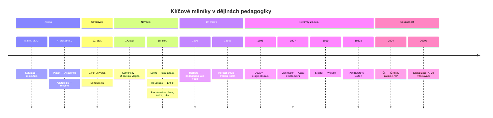
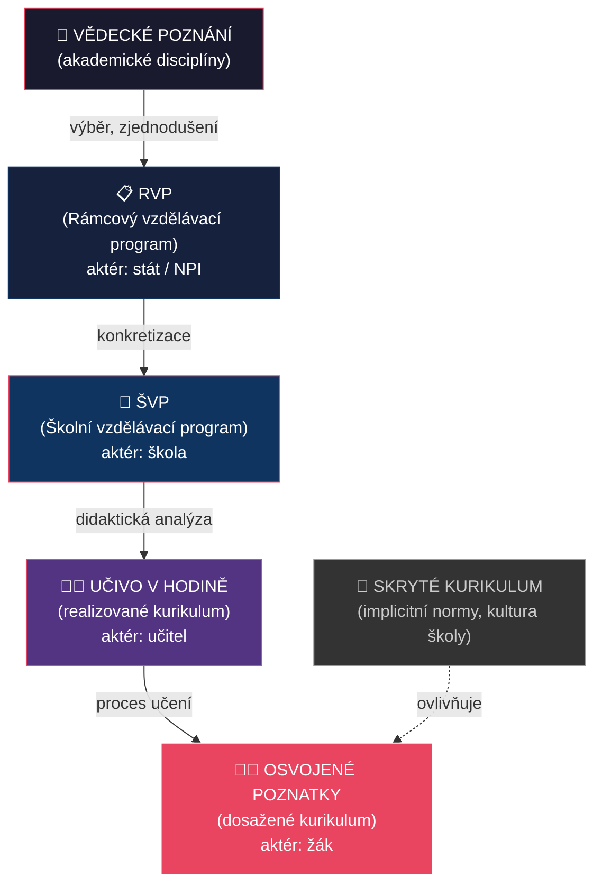
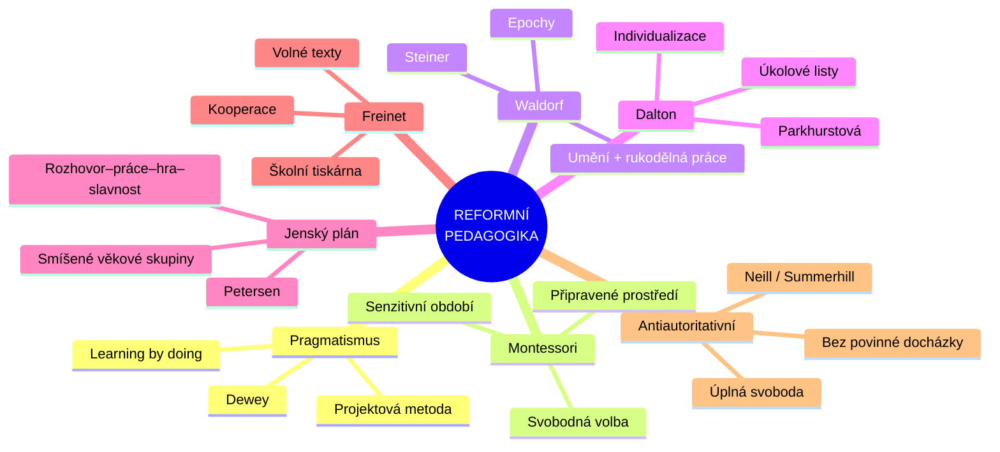

# PES 11–13: Dějiny pedagogiky, reformní hnutí a kurikulum

> **TL;DR / Audio Shrnutí:**
> Dějiny pedagogiky nejsou seznam jmen a dat — jsou to příběhy o tom, jak lidstvo postupně objevovalo, co to vlastně znamená „učit" a „vychovávat". Od Sokratovy maieutiky přes středověké klášterní školy a herbartovský formalismus až po reformní pedagogiku 20. století, která se vzbouřila proti „škole poslouchání" a dala vzniknout Montessori, Waldorfu i daltonským školám. A nad tím vším stojí klíčový pojem moderní didaktiky — **kurikulum**: co učit, proč to učit a jak to transformovat z vědeckého poznání do zvládnutelné podoby pro žáka. Pochopení tohoto historického oblouku vám umožní vidět dnešní vzdělávání v kontextu a rozpoznat, které „nové" myšlenky jsou ve skutečnosti staré staletí.

---

## Znění státnicových otázek
- **PES 11:** Popište fáze a důležitá témata ve vývoji pedagogického myšlení (antika, středověk, počátek novověku a reformace, osvícenství); vysvětlete vznik tradičního pojetí vzdělávání v 19. století (Herbart a herbartismus); uveďte souvislosti s dnešním vzděláváním.
- **PES 12:** Charakterizujte příčiny vzniku reformního pedagogického hnutí; uveďte znaky alternativních škol, důležité představitele a směry; vysvětlete možnosti uplatnění alternativních a inovativních prvků v dnešním vzdělávání.
- **PES 13:** Vysvětlete pojem kurikulum; popište didaktickou transformaci obsahu, její fáze a jednotlivé aktéry; zaměřte se na způsob stanovení kurikula v odborném vzdělávání.

---

## Klíčové pojmy

- **Maieutika** — Sokratova metoda „porodního umění"; učitel kladením otázek pomáhá žákovi „porodit" vlastní poznání.
- **Scholastika** — středověká metoda vzdělávání; důraz na logiku, memorování, autoritativní výklad textu.
- **Herbartismus** — směr 19. století odvozený z díla J. F. Herbarta; formální stupně vyučovací (jasnost → asociace → systém → metoda); základ „tradiční školy".
- **Reformní pedagogika** — hnutí konce 19. a začátku 20. století kritizující herbartismus; důraz na aktivitu žáka, jeho zájmy a zkušenost.
- **Alternativní škola** — škola pracující podle odlišných pedagogických koncepcí (Montessori, Waldorf, Dalton, Jenský plán aj.).
- **Kurikulum** — obsah vzdělávání v širším smyslu: co se učí, proč, jak, v jakém pořadí a s jakými výsledky.
- **Didaktická transformace** — proces přeměny vědeckého poznání (kurikulum zamýšlené) do podoby učiva zvládnutelného žákem (kurikulum realizované).
- **RVP** — Rámcový vzdělávací program; státní úroveň kurikula.
- **ŠVP** — Školní vzdělávací program; školní úroveň kurikula.

---

## Detailní rozebrání problematiky

### PES 11: Vývoj pedagogického myšlení

#### Antika (5. stol. př. n. l. – 5. stol. n. l.)

**Řecko:**
- **Sokrates (469–399 př. n. l.)** — maieutika (kladení otázek); „Vím, že nic nevím"; učitel jako průvodce, ne přednášející
- **Platón (427–347 př. n. l.)** — ideální stát vyžaduje ideální výchovu; škola Akadémie; vzdělání jako cesta k dobru a pravdě
- **Aristoteles (384–322 př. n. l.)** — empirické poznání; výchova má rozvíjet rozum, mravnost i tělo; peripatetická škola (učení za chůze)

**Dva modely výchovy:**
- **Spartský** — kolektivní, vojenský, fyzická zdatnost a disciplína
- **Athénský** — harmonický rozvoj těla i ducha; gymnastika + múzická výchova

**Řím:**
- **Quintilianus (35–100 n. l.)** — Institutio Oratoria; první systematická metodika; proti tělesným trestům; dobrý učitel = dobrý člověk

**Souvislost s dneškem:** Sokratova maieutika je předchůdcem **dialogických a heuristických metod**. Aristotelův důraz na zkušenost inspiroval **empirismus a badatelské učení**.

#### Středověk (5.–15. století)

- **Klášterní a katedrální školy** — trivium (gramatika, rétorika, dialektika) + quadrivium (aritmetika, geometrie, astronomie, hudba)
- **Scholastika** — dominantní metoda; učení z textů autorit (Bible, Aristoteles); disputace
- **Univerzity** (od 12. stol.) — Boloňa (1088), Paříž, Oxford, Praha (1348)
- **Důraz na memorování**, latinský jazyk, poslušnost, tělesné tresty

**Souvislost s dneškem:** Středověký model přežíval staletí a jeho pozůstatky (frontální výuka, autorita textu, memorování) jsou kritizovány dodnes.

#### Počátek novověku a reformace (15.–17. století)

- **Humanismus** — návrat k antickým ideálům; rozvoj individuality; Erasmus Rotterdamský
- **Reformace** — Luther požadoval školní docházku pro všechny; vzdělání jako cesta ke čtení Bible
- **J. A. Komenský (1592–1670)** — viz PES 5; systematizoval didaktiku; demokratizace vzdělávání

#### Osvícenství (17.–18. století)

- **John Locke (1632–1704)** — „tabula rasa" (čistá deska); dítě se rodí bez vrozených idejí; výchova formuje vše
- **J. J. Rousseau (1712–1778)** — „Émile" (1762); přirozená výchova; dítě je přirozeně dobré, společnost ho kazí; respekt k přirozenému vývoji
- **J. H. Pestalozzi (1746–1827)** — výchova srdce, hlavy a ruky; vzdělávání chudých; důraz na názornost

#### Herbart a herbartismus (19. století)

**Johann Friedrich Herbart (1776–1841):**
- Zakladatel pedagogiky jako **vědecké disciplíny**
- Pedagogika se opírá o **etiku** (cíle výchovy) a **psychologii** (prostředky)
- Formuloval **formální stupně vyučovací**: jasnost → asociace → systém → metoda

**Herbartismus** (Herbart-Zillerova škola):
- Přeměnili Herbartovy myšlenky v **rigidní systém**
- Každá hodina musí projít 5 formálními stupni
- Důraz na **systematičnost, učitelovu autoritu, disciplínu, memorování**
- Žák = pasivní příjemce; frontální výuka jako jediná správná forma
- **Vzniká „tradiční pojetí" vzdělávání**, které se stalo terčem kritiky reformistů

**Souvislost s dneškem:** Herbartismus vytvořil model školy, který dodnes částečně přežívá (frontální výuka, důraz na reprodukci znalostí, učitel jako hlavní autorita).

---

### PES 12: Reformní pedagogické hnutí a alternativní školy

#### Příčiny vzniku reformního hnutí (konec 19. / začátek 20. století)

1. **Kritika herbartismu** — mechanické formální stupně, pasivita žáka, odtržení od reality
2. **Nové poznatky psychologie** — dětská psychologie (G. S. Hall), pragmatismus (W. James)
3. **Společenské změny** — industrializace, urbanizace, demokratizace; potřeba jiného typu vzdělání
4. **Pedocentrismus** — „od dítěte k učivu" místo „od učiva k dítěti"

#### Společné znaky reformní pedagogiky
- **Aktivita žáka** — „learning by doing"
- **Respekt k individuálním potřebám** a vývojovým stádiím
- **Kritika frontální výuky** jako jediné formy
- **Propojení školy se životem** — praktičnost, zkušenost
- **Změna role učitele** — z autority na průvodce

#### Hlavní představitelé a směry

| Směr / Škola | Zakladatel | Klíčové principy |
|---|---|---|
| **Pragmatická pedagogika** | John Dewey (1859–1952) | „Learning by doing"; škola jako laboratoř demokracie; projektová metoda |
| **Montessori pedagogika** | Maria Montessori (1870–1952) | Připravené prostředí; senzitivní období; svobodná volba činnosti; „Pomoz mi, abych to dokázal sám" |
| **Waldorfská pedagogika** | Rudolf Steiner (1861–1925) | Antroposofie; epochové vyučování; umělecký rozvoj; bez známek a učebnic |
| **Daltonský plán** | Helen Parkhurstová (1886–1973) | Individualizované učení; úkolové listy; svoboda a zodpovědnost žáka |
| **Jenský plán** | Peter Petersen (1884–1952) | Věkově smíšené skupiny; cyklus: rozhovor–práce–hra–slavnost |
| **Freinetova pedagogika** | Célestin Freinet (1896–1966) | Školní tiskárna; volné texty; kooperace; propojení školy a komunity |
| **Experimentální školy** | A. S. Neill (1883–1973) | Summerhill; úplná svoboda dítěte; antiautoritativní výchova |
| **Kritická pedagogika** | Paulo Freire (1921–1997) | Vzdělávání jako nástroj osvobození (Pedagogika utlačovaných); dialogická metoda; propojení s reálným světem |

#### Uplatnění alternativních prvků v dnešním vzdělávání

| Alternativní prvek | Uplatnění v běžné škole |
|---|---|
| Montessori pomůcky | Manipulační materiály v MŠ a na 1. stupni ZŠ |
| Projektová metoda (Dewey) | Projektové dny/týdny; mezipředmětové projekty |
| Epochové vyučování (Waldorf) | Blokové vyučování; integrovaná tématická výuka |
| Individualizace (Dalton) | IVP pro žáky se SVP; diferencované úkoly |
| Kooperace (Freinet) | Skupinová a kooperativní výuka |
| Svobodná volba | Volitelné předměty; výběr témat projektů |

---

### PES 13: Kurikulum a didaktická transformace

#### Pojem kurikulum
**Kurikulum** (z lat. *currere* = běžet) je komplexní pojem zahrnující:
- **Co** se učí (obsah vzdělávání)
- **Proč** se to učí (cíle, kompetence)
- **Jak** se to učí (metody, formy)
- **Kdy** se to učí (pořadí, návaznost)
- **S jakými výsledky** (výstupy, standardy)

#### Úrovně kurikula

| Úroveň | Název | Charakteristika |
|---------|-------|-----------------|
| **Zamýšlené** | Ideální kurikulum | Co si tvůrci představují (politická vize) |
| **Projektované** | Formální kurikulum | Dokumenty: RVP, ŠVP, učebnice |
| **Realizované** | Implementované | Co učitel skutečně učí v hodině |
| **Dosažené** | Výsledky žáků | Co se žáci reálně naučili |
| **Skryté** | Hidden curriculum | Neformální pravidla, kultura školy, implicitní normy |

#### Didaktická transformace obsahu

Didaktická transformace = proces, kterým se **vědecké poznání** mění v **učivo** zvládnutelné žákem.

**Fáze:**
1. **Vědecké poznatky** (akademické disciplíny, výzkum)
2. **Kurikulární dokumenty** (RVP — rámcová úroveň)
3. **ŠVP** (školní úroveň — učitel/škola přizpůsobuje)
4. **Učivo v hodině** (realizovaná transformace — konkrétní výklad, úlohy)
5. **Osvojené poznatky žáka** (dosažené kurikulum)

**Aktéři:**
- **Stát / MŠMT / NPI** → RVP (rámcový vzdělávací program)
- **Škola / ředitel / předmětová komise** → ŠVP (školní vzdělávací program)
- **Učitel** → příprava na hodinu, výběr metod, didaktická analýza
- **Autoři učebnic** → zprostředkování obsahu

#### Kurikulum v odborném vzdělávání

**Specifika:**
- RVP pro obory vzdělávání (např. RVP 23-51-H/01 Strojní mechanik)
- Dvě složky: **všeobecné vzdělávání** + **odborné vzdělávání** (teorie + praxe)
- **Profil absolventa** — popis klíčových a odborných kompetencí
- **Rámcové rozvržení učiva** — minimální počty hodin pro oblasti
- **Škola vytváří ŠVP** podle místních podmínek a potřeb trhu práce

**Struktura RVP:**
- Profil absolventa
- Klíčové kompetence (komunikativní, personální, sociální, k učení, k řešení problémů, matematické, digitální, pracovní)
- Odborné kompetence
- Rámcové rozvržení obsahu vzdělávání
- Průřezová témata

---

## Vizualizace

### Vývoj pedagogického myšlení — časová osa

### Didaktická transformace obsahu

### Reformní pedagogika — mapa směrů

---

## Záludnosti a doplňující otázky

### ❓ 1. Co je to „herbartismus" a jak se liší od Herbarta samotného?
**Odpověď:** Herbart formuloval pedagogiku jako **vědeckou disciplínu** opřenou o etiku a psychologii. Jeho následovníci (Ziller, Rein) z toho udělali **rigidní systém** — formální stupně se staly dogmatem, které se muselo mechanicky opakovat v každé hodině. Herbart sám byl flexibilnější, než jeho „-ismus" naznačuje. Herbartismus = **zjednodušení a ztuhnutí** Herbartových myšlenek.

### ❓ 2. Jaký je rozdíl mezi RVP a ŠVP? Kdo za co zodpovídá?
**Odpověď:** **RVP** = celostátní rámec stanovený státem (NPI/MŠMT) — definuje minimum: kompetence, vzdělávací oblasti, průřezová témata, profil absolventa. **ŠVP** = konkrétní program vytvořený školou na základě RVP — přizpůsobuje obsah místním podmínkám, potřebám žáků a trhu práce. Za RVP zodpovídá stát, za ŠVP ředitel školy. Učitel pak ŠVP dále transformuje do konkrétních hodin.

### ❓ 3. Může se „skryté kurikulum" dostat do rozporu s oficiálním? Uveďte příklad.
**Odpověď:** Ano, a děje se to běžně. Příklad: Škola oficiálně deklaruje v ŠVP rozvoj kritického myšlení a demokratických hodnot (formální kurikulum). Ale v praxi učitelé vyžadují pouze reprodukci poznatků, netoleruji diskuzi a rozhodují autoritativně (skryté kurikulum). Žáci se naučí, že „správná odpověď" je důležitější než vlastní názor — což je přesný opak deklarovaného cíle.
