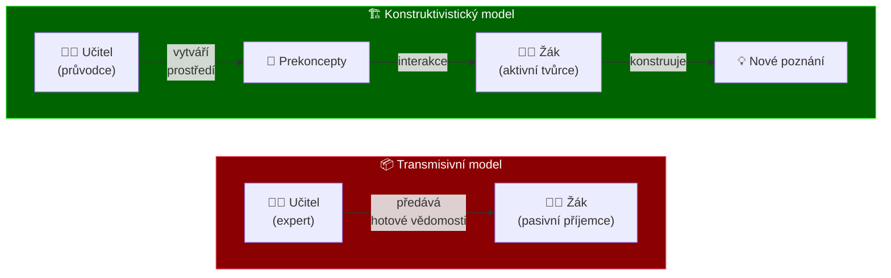
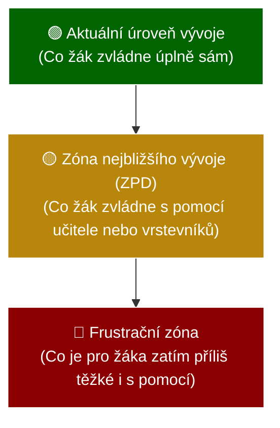
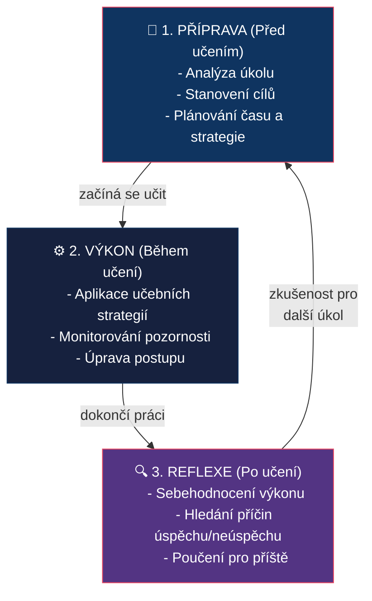

# PES 14–16: Transmisivní a konstruktivistické pojetí výuky, sebeřízené učení

> **TL;DR / Audio Shrnutí:**
> Představte si vyučování jako předávání balíčku — to je klasická **transmisivní výuka**. Učitel ví, žák neví, a informace putuje jedním směrem. Je to rychlé, efektivní pro velké skupiny, ale často to vede k rychlému zapomínání. Na druhé straně stojí **konstruktivismus**, který říká, že vědomosti nelze prostě předat jako balíček — každý žák si je musí „vystavět“ sám ve své hlavě na základě svých předchozích zkušeností. Učitel zde není předavač, ale spíše architekt, který připravuje prostředí pro stavbu. A vrcholem tohoto přístupu je **sebeřízené učení**, kdy žák přebírá volant: sám si určuje cíle, plánuje strategii, učí se a nakonec hodnotí svůj pokrok. Tyto tři přístupy nejsou nepřátelé; mistrný učitel ví, kdy má žákům něco prostě vysvětlit (transmise), a kdy je má nechat badatelsky objevovat (konstruktivismus).

---

## Znění státnicových otázek
- **[VOT]** **PES 14:** Charakterizujte transmisivní koncepci vzdělávání, její výhody a nevýhody; uveďte příklady vhodných výukových strategií ve frontální výuce (slovní monologické metody, názorně demonstrační metody, učení se z textu).
- **[VOT]** **PES 15:** Charakterizujte teorie vzdělávání zaměřené na psychologické aspekty procesu učení. Vysvětlete pojem konstruktivismus, popište strategie podporující konstruktivismus ve výuce.
- **[VOT]** **PES 16:** Charakterizujte pojem sebeřízené učení; vysvětlete význam zodpovědnosti žáka za vlastní učení; popište cyklus sebeřízeného učení; uveďte možné strategie pro podporu sebeřízení žáka ve výuce.

---

## Klíčové pojmy

- **Transmisivní výuka** — odvozeno od lat. *transmissio* (přenos); tradiční model výuky založený na jednosměrném předávání hotových poznatků od učitele k žákovi.
- **Frontální výuka** — organizační forma typická pro transmisivní pojetí; učitel pracuje s celou třídou hromadně.
- **Konstruktivismus** — psychologický a pedagogický směr tvrdící, že poznání nelze mechanicky přenést, ale učící se subjekt si ho musí sám aktivně „zkonstruovat“ na základě dosavadních zkušeností.
- **Prekoncepty** — dětská (často naivní nebo chybná) pojetí a představy o tom, jak funguje svět, se kterými žák vstupuje do výuky.
- **Kognitivní konflikt** — situace, kdy nová informace nabourá žákův dosavadní prekoncept (např. těžké a lehké těleso padají ve vakuu stejně rychle), což vyvolá potřebu rekonstrukce poznání.
- **Sebeřízené učení (Self-regulated learning)** — proces, při kterém je žák aktivním a zodpovědným tvůrcem svého učení (v rovině motivační, kognitivní i behaviorální).
- **Metakognice** — „myšlení o vlastním myšlení“; schopnost sledovat a regulovat vlastní proces učení (vím, jak se učí).

---

## Detailní rozebrání problematiky

### PES 14: Transmisivní koncepce vzdělávání

#### Charakteristika transmisivního (tradičního) pojetí
Vychází z herbartismu (19. století). Vychází z předpokladu, že lidská mysl je nádoba (nebo *tabula rasa*), kterou je třeba naplnit informacemi.
- **Role učitele:** Dominantní expert, „majitel pravdy“, primární zdroj informací. Řídí celý proces.
- **Role žáka:** Pasivní příjemce, posluchač. Očekává se od něj pozornost, memorování a přesná reprodukce.
- **Obsah:** Kladen důraz na faktografii, objem učiva a logickou strukturu z pohledu vědy, ne z pohledu dítěte.
- **Hlavní forma:** Frontální hromadná výuka.

#### Výhody a nevýhody

| Výhody | Nevýhody |
|--------|----------|
| **Časová a ekonomická efektivita** — předání maxima informací velké skupině v krátkém čase. | **Pasivita žáků** — vede k nudě a ztrátě vnitřní motivace. |
| **Systematičnost** — jasná struktura, logická návaznost, zamezení chaosu. | **Povrchní učení** — důraz na memorování bez hlubokého porozumění (krátkodobá paměť). |
| **Snadná kontrola a hodnocení** — jasně definované a měřitelné výstupy. | **Nerespektování individuality** — všichni dělají totéž ve stejném tempu. |
| **Pocit bezpečí pro učitele** — má plnou kontrolu nad hodinou a obsahem. | **Potlačení kritického myšlení** — neučí žáky řešit problémy, jen reprodukovat řešení. |

#### Výukové strategie pro frontální / transmisivní výuku
I transmisivní výuka může být efektivní, pokud je vedena kvalitně.

1. **Slovní monologické metody**
   - **Výklad:** Logické, systematické vysvětlení složitějšího jevu. Musí mít jasnou strukturu, záchytné body a intonační dynamiku.
   - **Vyprávění:** Emocionálně zabarvené, příběhové předání informací (dějepis, literatura).
2. **Názorně demonstrační metody**
   - Pozorování předváděného jevu (pokus z chemie, ukázka pracovního postupu v dílně).
   - Práce s modely, schématy, videoukázkami. Zásada: „Slyším a zapomenu, vidím a pamatuji si.“
3. **Učení se z textu**
   - Práce s učebnicí nebo pracovním listem pod přímým vedením učitele (společné čtení, podtrhávání klíčových slov).

---

### PES 15: Teorie vzdělávání a konstruktivismus

#### Teorie vzdělávání zaměřené na psychologické aspekty
Učení a vyučování nelze pochopit bez znalosti psychologických aspektů (pozornost, vnímání, paměť, myšlení). V průběhu vývoje vzniklo několik hlavních teorií (koncepcí) vzdělávání:

1. **Kognitivní teorie**
   - Zaměřují se na rozvoj kognitivních vlastností žáka a procesy učení. Kladou důraz na prekoncepty, spontánní reprezentace a kognitivní konflikty.
   - *Představitelé:* J. Piaget, G. Bachelard, A. Giordan.
2. **Technologické (systémové) teorie**
   - Zdůrazňují zdokonalení předávání poznatků pomocí technologií, médií a konstrukce poznání. Zaměřují se na komunikaci a interakci člověk-počítač.
   - *Představitelé:* B. F. Skinner, J. Carroll.
3. **Sociokognitivní teorie**
   - Kladou důraz na roli sociální interakce, kultury a sociálního prostředí v mechanismech učení. L. S. Vygotskij (učení táhne vývoj) vs. J. Piaget (mentální vývoj předchází učení).
   - *Představitelé:* L. S. Vygotskij, A. Bandura, J. Bruner.
4. **Sociální teorie**
   - Vzdělání má umožnit řešení sociálních, kulturních a environmentálních problémů (nerovnosti, elitářství, moc, osvobození).
   - *Představitelé:* J. Dewey, P. Freire, P. Bourdieu.
5. **Akademické (klasické) teorie**
   - Soustřeďují se na předávání obecných poznatků (tradicionalisté vs. generalisté), předměty, logiku a kritické myšlení. Staví se proti přílišné specializaci.

#### Podstata konstruktivismu
Zatímco transmisivní škola klade důraz na učivo a učitele, psychologické teorie učení (J. Piaget, L. Vygotskij) obrátily pozornost k **vnitřním procesům v mysli žáka**.

**Konstruktivismus** tvrdí, že poznání nevzniká pasivním příjmem zvenčí, ale **aktivní mentální konstrukcí**.
- Každý žák přichází do školy s určitými **prekoncepty** (osobními teoriemi o světě).
- Nová informace je filtrována přes tyto prekoncepty.
- Učení je proces asimilace (zařazení nové informace do existujících struktur) a akomodace (změna mentálních struktur pod tlakem nové informace — kognitivní konflikt).

#### Dvě větve konstruktivismu
1. **Kognitivní (Piaget):** Důraz na individuální zrání mysli a řešení logických rozporů (kognitivní konflikt) uvnitř jednotlivce.
2. **Sociální (Vygotskij):** Poznání se konstruuje primárně v sociální interakci (skupinová práce, diskuze). Klíčový koncept: **Zóna nejbližšího vývoje** (to, co dítě dnes dokáže s pomocí dospělého/vrstevníka, dokáže zítra samo).

#### Změna rolí
- **Učitel:** Průvodce (facilitátor), tvůrce podnětného prostředí. Neříká hotové pravdy, ale klade otázky a předkládá problémy.
- **Žák:** Aktivní badatel, spolutvůrce vlastního poznání. Nese zodpovědnost za své učení.

#### Strategie podporující konstruktivismus ve výuce
- **Zjišťování prekonceptů:** Brainstorming, myšlenkové mapy na začátku tématu (Co už víte o gravitaci?).
- **E-U-R (Evokace – Uvědomění si významu – Reflexe):** Model kritického myšlení, který kopíruje konstruktivistický proces.
- **Badatelsky orientovaná výuka (Inquiry-based learning):** Žáci dostanou problém, formulují hypotézy, zkoumají a dělají závěry.
- **Projektová výuka:** Řešení reálného problému v širším kontextu.
- **Skupinová diskuze a vrstevnické učení:** Nutí žáky verbalizovat své myšlenky a konfrontovat je s názory jiných.

---

### PES 16: Sebeřízené učení (Self-regulated learning)

#### Co je sebeřízené učení
Sebeřízení je schopnost žáka převzít iniciativu a zodpovědnost za vlastní proces učení. Sebeřízený žák nečeká, až mu učitel „nalije“ vědomosti do hlavy — ví, co se chce naučit, jak se to naučí, a dokáže sám sebe zhodnotit. Je to **klíčová kompetence pro celoživotní učení**.

**Význam zodpovědnosti:** Pokud je veškerá zodpovědnost za výsledek delegována na učitele, žák je v pozici konzumenta. Jakmile ji převezme, stává se tvůrcem. Zvyšuje se vnitřní motivace a vytrvalost (rezilience) při překonávání překážek.

#### Cyklus sebeřízeného učení (dle Zimmermana)

Sebeřízení probíhá ve třech cyklických fázích:

1. **Fáze přípravná (Plánování)**
   - Žák analyzuje úkol (Co se ode mě žádá?)
   - Stanovuje si osobní cíle (Chci to umět na jedničku, nebo mi stačí základ?)
   - Plánuje strategii a čas (Udělám si výpisky, vyhradím si na to 2 hodiny v pátek)
   - *Klíčová je zde self-efficacy (víra ve vlastní schopnosti) a vnitřní motivace.*
2. **Fáze výkonová (Realizace a monitorování)**
   - Žák se reálně učí (využívá zvolené strategie: čtení, podtrhávání, mnemotechniky)
   - Současně **monitoruje sám sebe** (Rozumím tomu? Nedívám se moc do mobilu? Jsem unavený?)
   - Mění strategii, pokud nefunguje.
3. **Fáze reflexe (Sebehodnocení)**
   - Zhodnocení výsledku: Dosáhl jsem cíle?
   - Atribuce: Proč jsem (ne)uspěl? (Špatně jsem si to naplánoval vs. byl to nespravedlivý test).
   - Úprava pro příště: Co udělám příště jinak? (Zkušenost se přenáší do fáze 1 dalšího cyklu).

#### Strategie učitele pro podporu sebeřízení žáků

Učitel by měl sebeřízení žáků systematicky „lešenovat“ (scaffolding):
- **Otevřené cíle a volba:** Dát žákům na výběr z různých úkolů nebo forem zpracování (např. napiš esej NEBO natoč video).
- **Trénink strategií učení:** Učit žáky, *jak* se učit (myšlenkové mapy, technika Pomodoro, Cornellův systém poznámek).
- **Práce s portfoliem:** Žák si zakládá své práce a vidí vlastní progres.
- **Sebehodnocení a vrstevnické hodnocení:** Vést žáky k tomu, aby sami posoudili svůj výkon pomocí předem daných kritérií (rubrik) dříve, než je oznámkuje učitel.
- **Formativní zpětná vazba:** Zaměřovat se na proces a úsilí žáka, ne jen na výsledek („Líbí se mi, jak sis rozvrhl čas na tento velký projekt.“).

---

## Vizualizace

### Transmisivní vs. Konstruktivistické pojetí

### Zóna nejbližšího vývoje (Vygotskij)

### Cyklus sebeřízeného učení

---

## Záludnosti a doplňující otázky

### ❓ 1. Znamená konstruktivismus, že učitel už nesmí nic vysvětlovat a frontální výuka je „zlo“?
**Odpověď:** Vůbec ne. Jde o extrém, před kterým varují i moderní pedagogové. Frontální, transmisivní výuka je vysoce efektivní pro **základní obeznámení s fakty**, bezpečnostní školení, zavedení nových pojmů nebo silný motivační výklad. Konstruktivismus a badatelské učení jsou časově velmi náročné. Klíčem je **vyváženost a střídání metod** podle toho, jaký cíl zrovna učitel sleduje.

### ❓ 2. Co se stane, když konstruktivistický přístup aplikujeme na žáka, který nemá žádné vstupní znalosti (prekoncepty)?
**Odpověď:** Dojde k tzv. **kognitivnímu přetížení** (cognitive overload). Pokud má žák samostatně objevovat zákonitosti v prostředí, o kterém nic neví, cítí zmatek a frustraci. Pro začátečníky je proto vhodnější direktivnější (transmisivní) vedení. Až po získání solidního faktického základu by měl učitel postupně přecházet ke konstruktivistickým metodám a řešení problémů (tento koncept se opírá o *Teorii kognitivní zátěže*).

### ❓ 3. Lze po žácích na SŠ/SOU automaticky požadovat sebeřízené učení?
**Odpověď:** Zcela určitě ne. Schopnost sebeřízení (metakognice) se **vyvíjí a musí se trénovat**. Mnoho středoškoláků z tradičních základek přijde v „čekacím módu“ — čekají na instrukci a tahák k testu. Učitel musí sebeřízení podporovat postupně metodou „lešení“ (scaffolding): zpočátku dát strukturovaný plán a jasná kritéria hodnocení, učit je sebehodnotícím rubrikám, a teprve postupně přenášet zodpovědnost a uvolňovat kontrolu.
