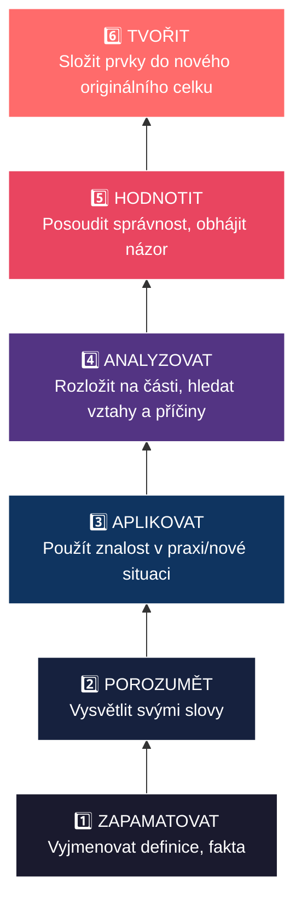
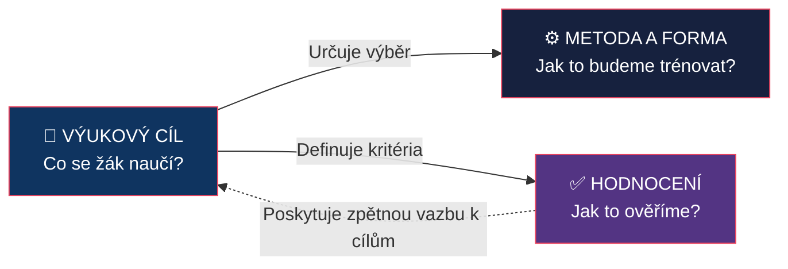
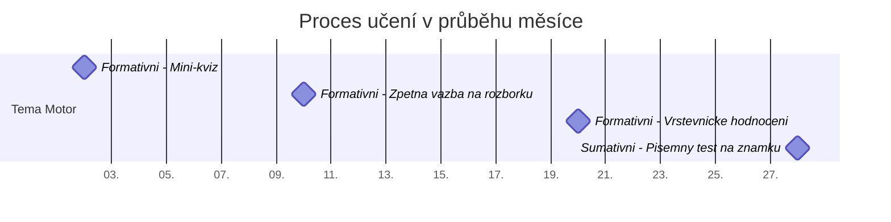

# PES 17–18: Výukové cíle, Bloomova taxonomie a školní hodnocení

> **TL;DR / Audio Shrnutí:**
> Představte si výuku jako cestu z bodu A do bodu B. Výukový **cíl** je ten bod B — jasná představa o tom, co má žák na konci hodiny umět, znát nebo dokázat. Aby cíl nebyl jen prázdnou frází, pomáhá nám **Bloomova taxonomie**, která kognitivní cíle řadí od nejjednoduššího zapamatování až po tvoření vlastních řešení. A jak poznáme, že jsme do bodu B dorazili? K tomu slouží **hodnocení a zpětná vazba**. Moderní pedagogika ustupuje od pouhého známkování (sumativní hodnocení) a klade důraz na **formativní hodnocení** — zpětnou vazbu, která žáka neškatulkuje, ale dává mu jasný návod: co dělám dobře, kde dělám chybu a jak se mohu zlepšit.

---

## Znění státnicových otázek
- **[VOT]** **PES 17:** Charakterizujte behaviorální teorie vzdělávání a zaměřte se na roli zpětné vazby v procesu učení; popište funkce školního hodnocení; vysvětlete pojem formativní hodnocení.
- **[VOT]** **PES 18:** Vysvětlete pojem cíl; popište funkce cílů z hlediska plánování výuky a řízení učení žáka; charakterizujte Bloomovu taxonomii cílů a na příkladech ilustrujte její použití.

---

## Klíčové pojmy

- **Výukový cíl** — ideální, předpokládaný a zamýšlený výsledek vyučovacího procesu (co si má žák osvojit, co má umět).
- **Bloomova taxonomie** — hierarchické uspořádání vzdělávacích cílů v kognitivní (poznávací) oblasti od nejnižší náročnosti po nejvyšší (Zapamatovat → Porozumět → Aplikovat → Analyzovat → Hodnotit → Tvořit).
- **Sumativní hodnocení** — hodnocení výsledku učení (tzv. hodnocení *učení*); často vyjádřeno známkou nebo procenty na konci tematického celku. Má sumarizační a selektivní funkci.
- **Formativní hodnocení** — průběžná zpětná vazba (tzv. hodnocení *pro učení*); poskytuje žákovi i učiteli informace o tom, co už umí a jak má postupovat dál.
- **Zpětná vazba (Feedback)** — informace o výkonu nebo porozumění poskytnutá žákovi (případně učiteli), která slouží k úpravě dalšího postupu.
- **Autentické hodnocení** — hodnocení založené na řešení reálných životních/profesních situací (např. obhajoba projektu, diagnostika reálné závady), nikoli jen izolovaných školních testů.

---

## Detailní rozebrání problematiky

### PES 18: Výukové cíle a Bloomova taxonomie

*(Pozn.: Začínáme otázkou 18, protože logicky cíl předchází hodnocení.)*

#### Pojem výukový cíl a jeho funkce
**Cíl** odpovídá na otázku: *„Co se žáci naučí?“* (Ne co bude dělat učitel!) 
Kvalitně formulovaný cíl začíná aktivním slovesem popisujícím výkon žáka (vyjmenuje, sestrojí, porovná). Nejasné cíle (např. „seznámit žáky s historií“, „uvědomit si význam“) nelze objektivně změřit.

**Funkce cílů:**
- **Pro učitele (plánování):** Určují výběr učiva (obsah), volbu výukových metod a prostředků (jak to naučit) a způsob hodnocení (jak to změřit).
- **Pro žáka (řízení učení):** Dávají učení smysl, orientují pozornost žáka na to podstatné a zvyšují motivaci (vím, kam jdu).

**Cíle se dělí do 3 oblastí:**
1. **Kognitivní (vzdělávací)** — znalosti a intelektuální dovednosti (rozum).
2. **Afektivní (výchovné)** — postoje, hodnoty, emoce (srdce).
3. **Psychomotorické (výcvikové)** — tělesné a manuální dovednosti (ruce).

#### Bloomova taxonomie kognitivních cílů
B. S. Bloom (1956, revidováno 2001) vytvořil pyramidu kognitivní náročnosti. Slouží k tomu, aby učitelé nezůstávali jen u pouhého memorování (1. úroveň), ale vedli žáky k hlubšímu porozumění.

| Úroveň | Charakteristika výkonu | Typická aktivní slovesa (žák...) |
|--------|--------------------------|----------------------------------|
| **1. Zapamatovat** | Žák vybaví termíny, fakta a definice z paměti. Bez nutnosti porozumění. | *vyjmenuje, definuje, popíše, přiřadí, zopakuje* |
| **2. Porozumět** | Žák chápe smysl informací; umí to vysvětlit vlastními slovy. | *vysvětlí, objasní, shrne, demonstruje na příkladu* |
| **3. Aplikovat** | Žák použije znalost v nové nebo konkrétní situaci (řešení problému). | *vypočítá, navrhne postup, použije pravidlo, sestrojí* |
| **4. Analyzovat** | Žák rozloží celek na části a chápe vztahy mezi nimi (hledá příčiny). | *rozebere, srovná, určí příčiny, rozliší podstatné* |
| **5. Hodnotit** | Žák posoudí hodnotu/správnost na základě daných kritérií, obhájí názor. | *obhájí, posoudí, zkritizuje, zdůvodní, argumentuje* |
| **6. Tvořit** | Žák spojí prvky do nového celku (syntéza); vymyslí originální řešení. | *vytvoří (projekt), navrhne (design), zkonstruuje* |

*Příklad aplikace z automechaniky (Téma: Brzdový systém):*
1. **Zapamatovat:** Vyjmenuje hlavní části kotoučové brzdy.
2. **Porozumět:** Vysvětlí vlastními slovy princip hydraulického přenosu síly.
3. **Aplikovat:** Vymění brzdové destičky podle dílenského manuálu.
4. **Analyzovat:** Zjistí příčinu pískání brzd na základě indicií zákazníka.
5. **Hodnotit:** Posoudí, zda je míra opotřebení kotoučů ještě v rámci bezpečné normy.
6. **Tvořit:** Navrhne úpravu brzdového systému pro závodní účely.

---

### PES 17: Hodnocení, zpětná vazba a behaviorální teorie

#### Behaviorální teorie učení a role zpětné vazby
**Behaviorální teorie** (představitelé B. F. Skinner, I. P. Pavlov, J. B. Watson) se zaměřují výhradně na **vnější, pozorovatelné chování** a výkon žáků. Procesy uvnitř mysli (tzv. "černá skříňka") tyto teorie nezkoumají. Učení definují jako **změnu chování** na základě vnějších podnětů.

V tomto modelu hraje **zpětná vazba (posílení)** naprosto klíčovou roli:
- **Kladné posílení** (odměna, pochvala, dobrá známka) — zvyšuje pravděpodobnost, že žák správné chování zopakuje.
- **Záporné posílení** (odstranění nepříjemného podnětu po správné reakci).
- **Trest** (špatná známka, poznámka) — slouží k potlačení nežádoucího chování.

Zpětná vazba v behaviorálním pojetí okamžitě informuje žáka, co je správné a co chybné, a silně ho motivuje (či podmiňuje) k učení nových věcí a upevnění návyků (tzv. operantní podmiňování).

#### Funkce školního hodnocení
Hodnocení je nedílnou součástí výuky. Jeho funkce jsou:
1. **Informativní** — co žák umí a co ne (pro žáka i rodiče).
2. **Motivační** — pochvala posiluje chování, spravedlivá známka stimuluje k výkonu.
3. **Regulativní** — učitel zjišťuje efektivitu své výuky a mění postup (Zpomalím? Zopakuji?).
4. **Selektivní (třídící)** — rozhoduje o přijetí na SŠ/VŠ (často kritizovaná funkce).
5. **Výchovná** — vede k zodpovědnosti, sebereflexi a vytrvalosti.

#### Sumativní vs. Formativní hodnocení

| Kritérium | Sumativní hodnocení | Formativní hodnocení |
|-----------|---------------------|----------------------|
| **Cíl** | Vyhodnotit a klasifikovat (známka) | Zlepšit a podpořit učení (rada) |
| **Kdy probíhá** | Na konci procesu (písemka, vysvědčení) | Průběžně během učení |
| **Otázka** | „Co se naučil a jaká je jeho úroveň?“ | „Co umí, kam směřuje a jak tam dojít?“ |
| **Role žáka** | Pasivní objekt hodnocení | Aktivní subjekt (zapojen do sebehodnocení) |
| **Atmosféra** | Soutěživá, zaměřená na výkon | Bezpečná, chyba je vítaná součást procesu |
| **Příměr** | Degustátor (hodnotí hotovou polévku) | Kuchař (ochutnává a dochucuje polévku během vaření) |

#### Formativní hodnocení (Assessment for Learning)
Formativní hodnocení není jen „hodnocení bez známek“, je to ucelený pedagogický přístup. **Pilíře formativního hodnocení:**
1. **Ujasnění cílů:** Žák ví, kam směřuje a jak vypadá dobrý výsledek (zná kritéria).
2. **Tvorba důkazů o učení:** Učitel v hodině neustále monitoruje pochopení (mini-kvízy, práce s mazacími tabulkami, položení otázky celé třídě před vyvoláním jedince).
3. **Poskytování efektivní zpětné vazby:** Zpětná vazba musí být popisná, nikoli posuzující. Neříká „jsi šikovný / toto je špatně“, ale „výpočet je správně, ale zapomněl jsi jednotky – doplň je“.
4. **Aktivizace žáků jako zdroje učení pro sebe navzájem:** Vrstevnické učení a hodnocení.
5. **Aktivizace žáka jako vlastníka svého učení:** Systematické vedení k sebehodnocení.

#### Zpětná vazba (Feedback)
Kvalitní zpětná vazba je motorem učení. Podle Hattieho (viditelné učení) patří k faktorům s nejvyšším vlivem na úspěch žáka.
- **Musí být včasná** (hned po výkonu, ne za měsíc).
- **Musí být konkrétní** a zaměřená na úkol/proces, ne na osobnost žáka (chválit úsilí, ne inteligenci — *Growth mindset*).
- Podle *D. Wiliama* má odpovídat na 3 otázky: **Kde jsem? Kam jdu? Jak se tam dostanu?**

---

## Vizualizace

### Bloomova taxonomie (Revidovaná, kognitivní doména)

### Provázanost Cíle, Metody a Hodnocení

### Formativní vs. Sumativní hodnocení v čase

---

## Záludnosti a doplňující otázky

### ❓ 1. Dá se cíl „Žák pochopí princip funkce spalovacího motoru“ považovat za správně formulovaný?
**Odpověď:** Z didaktického hlediska **ne**. Sloveso „pochopí“ (nebo „porozumí“, „uvědomí si“, „seznámí se“) nelze objektivně změřit a zkontrolovat. Jak učitel v hlavě žáka uvidí, že to pochopil? Správně formulovaný cíl musí obsahovat **aktivní, měřitelné sloveso** z Bloomovy taxonomie: *„Žák vysvětlí vlastními slovy princip funkce spalovacího motoru“* nebo *„Žák na schématu popíše 4 doby motoru“*.

### ❓ 2. Může sumativní hodnocení plnit formativní funkci?
**Odpověď:** **Ano, ale je to obtížnější.** Příkladem je maturita nanečisto nebo pololetní testová písemka, kterou sice učitel oznámkuje (sumativní – hodnotí probraný celek), ale následně celou hodinu stráví s žáky podrobným rozborem chyb a vysvětlením, jak se v daných oblastech zlepšit pro příště. Tím se i závěrečný (sumativní) test stává formativním (informačním) nástrojem pro další postup. Záleží vždy na tom, **jak s informací naložíme**.

### ❓ 3. Co je to tzv. chyba v dedukci hodnocení (haló efekt)?
**Odpověď:** Je to jedno z rizik hodnocení, kterému se musí učitel vyhýbat. *Haló efekt* nastává, když učitel hodnotí konkrétní výkon žáka na základě celkového dojmu nebo jedné výrazné vlastnosti. Například jedničkář s pečlivou úpravou sešitu dostane v písemce za chybu jen „mínus“, zatímco zlobivý žák dostane za totožnou chybu zhoršenou známku. Je to porušení zásady spravedlnosti a objektivity, často se mu předchází striktním zavedením a dodržováním jasných hodnoticích kritérií (rubrik).
