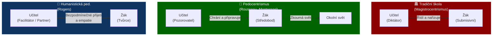
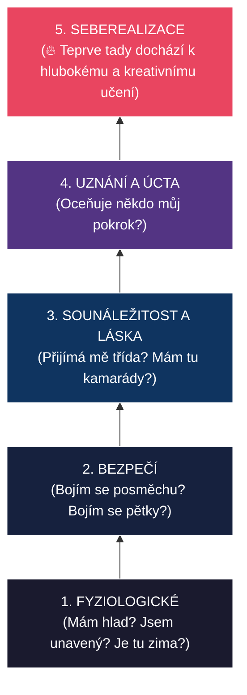

# PES 19–21: Pedocentrismus, humanistické a sociální teorie vzdělávání

> **TL;DR / Audio Shrnutí:**
> Po staletích, kdy bylo dítě vnímáno jen jako zmenšený dospělý, kterého je třeba disciplínou natvarovat do správné podoby, přišel obrat: **pedocentrismus**. Středobodem vzdělávání se stalo dítě, jeho potřeby, přirozený vývoj a zájmy. Od Rousseauova návratu k přírodě přes Summerhill A. S. Neilla až po humanistickou psychologii Rogerse a Maslowa — tito všichni razí myšlenku, že učitel nemá žáka řídit, ale **provázet**. Není to však jen o jednotlivci. Sociální a kritická pedagogika (např. John Dewey nebo Paulo Freire) upozorňují, že škola nežije ve vakuu. Vzdělávání je vždy politický akt, který může společnost buď slepě reprodukovat, nebo ji měnit k lepšímu. Učitel se tak stává partnerem v seberozvoji žáka i hybatelem sociálních změn.

---

## Znění státnicových otázek
- **[VOT]** **PES 19:** Popište historické počátky teorií vzdělávání zaměřených na osobnost žáka (například J. J. Rousseau, snahy reformního pedagogického hnutí, M. Montessori, A. S. Neill a antiautoritativní výchova, P. Grey a svobodné školy); uveďte možné výhody a nevýhody pedocentrického pojetí výuky.
- **[VOT]** **PES 20:** Charakterizujte soudobé teorie vzdělávání zaměřené na osobnost žáka (C. Rogers, A. Maslow, J. Holt aj.); popište principy a strategie nedirektivního přístupu ve výuce a roli učitele jako poradce a partnera v učení; charakterizujte zdroje autority učitele a možnosti budování vztahu se žáky.
- **[VOT]** **PES 21:** Popište pedagogické teorie vzdělávání zaměřené na sociální prostředí, zaměřte se na význam školního sociálního prostředí pro učení a na využití vztahu školy a společnosti. Vysvětlete pojmy sociálně angažovaná a kritická pedagogika, popište její cíle a možnosti začlenění do výuky.

---

## Klíčové pojmy

- **Pedocentrismus** — pedagogický přístup kladoucí do středu vzdělávacího procesu dítě, jeho přirozenost, potřeby a zájmy (opakem je *magistrocentrismus*).
- **Antiautoritativní výchova** — výchova zříkající se vnějších trestů, zákazů a příkazů; důraz na naprostou svobodu dítěte (A. S. Neill).
- **Humanistická psychologie/pedagogika** — směr zdůrazňující svobodu volby, seberealizaci, empatii a bezpodmínečné přijetí jedince (Maslow, Rogers).
- **Nedirektivní přístup** — styl výuky, kde učitel žákovi neříká, *co* a *jak* má dělat, ale pomáhá mu, aby k řešení došel sám.
- **Kritická pedagogika** — směr zkoumající, jak škola reprodukuje společenské nerovnosti (třídní, genderové, rasové); jejím cílem je emancipace utlačovaných.
- **Unschooling (odškolnění)** — radikální hnutí odmítající institucionální vzdělávání (J. Holt, I. Illich); dítě se učí přirozeně životem.

---

## Detailní rozebrání problematiky

### PES 19: Historické kořeny pedocentrismu

Dokonale strukturovaná herbartovská škola 19. století sice dokázala efektivně naučit masy číst a psát, ale za cenu potlačení individuality. Proti tomu se zvedla vlna pedocentrismu.

#### Klíčové postavy a proudy

1. **Jean-Jacques Rousseau (18. stol.)**
   - Kniha *Émile čili o výchově*. Dítě se rodí přirozeně dobré, společnost ho kazí.
   - Výchova má být **přirozená**, negativní (chránit dítě před škodlivými vlivy společnosti) a řídit se jeho přirozeným vývojem.
2. **Reformní hnutí a Maria Montessori (poč. 20. stol.)**
   - Vycházela z lékařské praxe. Vytvořila koncept **připraveného prostředí**, kde dítě samo volí aktivitu.
   - Respektovala tzv. *senzitivní období* (okna příležitosti pro učení konkrétních dovedností).
3. **Alexander Sutherland Neill a Summerhill (1921)**
   - Extrémní antiautoritativní přístup. Škola jako demokratická komunita (děti a dospělí mají rovnocenný hlas).
   - Žádná povinná výuka, důraz na **emocionální zdraví a štěstí** dítěte. „Raději ať je ze školy šťastný metař než neurotický premiér.“
4. **Peter Gray a svobodné školy (současnost)**
   - Psycholog zkoumající význam svobodné dětské hry.
   - Škola typu *Sudbury Valley*: neexistují osnovy, třídy ani testy. Děti se učí naprosto organicky tím, co je zrovna zajímá.

#### Výhody a nevýhody pedocentrismu

| Výhody | Nevýhody a rizika |
|--------|-------------------|
| Vysoká vnitřní motivace žáků. | Riziko chaotičnosti a ztráty systematičnosti v poznání. |
| Rozvoj kritického myšlení, kreativity a samostatnosti. | Náročné na přípravu učitele a vybavení prostředí. |
| Nižší úroveň stresu a úzkosti u dětí. | Slabá připravenost na soutěživé prostředí reálného trhu práce. |
| Zdravý psychosociální vývoj a pozitivní vztah k učení. | Může vést k egocentrismu („svět se točí kolem mě“). |

---

### PES 20: Humanistické teorie a soudobé zaměření na žáka

V polovině 20. století reagovala psychologie na chladný behaviorismus (cukr a bič) a temnou psychoanalýzu (pudy) vznikem **humanistické psychologie**. Její aplikace do pedagogiky přinesla zásadní změny.

#### Hlavní představitelé
- **Abraham Maslow:** Hierarchie potřeb (pyramida). Zjistil klíčovou věc pro pedagogiku: *Pokud dítě nemá uspokojené nižší potřeby (bezpečí, sounáležitost, najíst se), nemůže se učit a seberealizovat.*
- **Carl Rogers:** Zakladatel nedirektivního přístupu (tzv. psychoterapie/výuka zaměřená na klienta/žáka).
- **John Holt:** Odpůrce klasických škol, zakladatel unschoolingu. Tvrdil, že škola děti učí hlavně strachu ze selhání.

#### Nedirektivní přístup (Rogers) a role učitele
Podle Rogerse se člověk nedá nic přímo „naučit“ – lze mu jen usnadnit, aby to objevil sám. Role učitele se mění na **facilitátora** (usnadňovatele) učení.
Rogers definoval **3 podmínky efektivního učení**:
1. **Kongruence (autenticita):** Učitel je sám sebou, nehraje roli experta schovaného za maskou autority.
2. **Bezpodmínečné pozitivní přijetí:** Učitel žáka respektuje a přijímá, bez ohledu na jeho výkon nebo názor.
3. **Empatie:** Schopnost vidět svět očima žáka.

#### Zdroje autority učitele
V nedirektivním přístupu učitel neztrácí autoritu, ale mění se její zdroj:
- ❌ **Formální (poziční) autorita:** „Poslouchej mě, protože jsem tvůj učitel.“ (Tradiční škola).
- ✅ **Neformální autorita:** Autorita založená na odbornosti (učitel to skvěle umí), pedagogickém taktu (je spravedlivý), charismatu a autentičnosti. Získává se budováním vztahu, ne vynucováním.

---

### PES 21: Teorie zaměřené na sociální prostředí a kritická pedagogika

Žák nežije ve vzduchoprázdnu. Jeho rozvoj je formován sociálním prostředím (třídou, školou, komunitou, státem). Sociálně orientované teorie přesouvají fokus z psychiky jednotlivce na vztahy a společnost.

#### Vztah školy a společnosti (John Dewey)
Dewey tvrdil, že „škola není příprava na život, škola je život sám“. 
- Založil pragmatickou pedagogiku (*learning by doing*).
- Škola by měla být zmenšenou verzí ideální **demokratické společnosti**.
- Žáci se učí spolupracovat a řešit reálné problémy komunity (zárodek dnešní projektové výuky a service-learningu).

#### Sociálně angažovaná a Kritická pedagogika

Kritická pedagogika vznikla ve 2. polovině 20. století (tzv. frankfurtská škola, neomarxismus). Ptá se: *„Komu současný systém vzdělávání slouží?“*

- **Základní myšlenka:** Vzdělávání není nikdy neutrální. Vždy je to politický akt. Škola často funguje jako nástroj pro reprodukci stávající moci a nerovností (děti dělníků se ve škole učí poslouchat příkazy a stávají se dělníky; děti elit se učí kriticky myslet a stávají se manažery).
- **Paulo Freire:** Brazilský pedagog (kniha *Pedagogika utlačovaných*). Tvrdil, že klasická výuka je **bankovní systém vzdělávání** (učitel „vkládá“ informace do prázdných žáků). Namísto toho navrhl **problémovou výuku**, která vede k *uvědomění* (conscientização) — žáci chápou příčiny svého útlaku a učí se, jak společnost změnit.
- **Cíl kritické pedagogiky:** Emancipace žáka. Vychovat z něj aktivního, kriticky myslícího občana, který dokáže zpochybnit status quo a bojovat za sociální spravedlnost.

**Začlenění do výuky:**
- Rozbor mediálních manipulací a dezinformací.
- Diskuze nad kontroverzními tématy (ekologie, lidská práva, sociální nerovnost).
- Zpochybňování „jediné správné pravdy“ v učebnicích dějepisu.

---

## Vizualizace

### Vývoj role dítěte a učitele (Transmise vs. Pedocentrismus vs. Nedirektiva)



### Maslowova hierarchie potřeb (Aplikace na žáka)



### Bankovní vzdělávání (Freire) vs. Kritická pedagogika

```mermaid
graph LR
    subgraph BANK["Bankovní pojetí (Útlak)"]
        direction LR
        U1["Učitel"] -->|"Vkládá vědomosti"| Z1["Žák (Trezor)"]
        Z1 -->|"Reprodukuje"| S1["Stávající systém"]
    end

    subgraph KRIT["Problémové pojetí (Emancipace)"]
        direction LR
        U2["Učitel"] <==>|"Dialog"| Z2["Žák"]
        Z2 -->|"Zpochybňuje"| S2["Stávající systém"]
        S2 -.->|"Změna k lepšímu"| KRIT
    end
    
    style BANK fill:#2c3e50,stroke:#fff,color:#fff
    style KRIT fill:#e67e22,stroke:#fff,color:#fff
```

---

## Záludnosti a doplňující otázky

### ❓ 1. Dá se humanistický (Rogersův) přístup uplatnit, když vím, že žák udělá v dílně na soustruhu katastrofální chybu, pokud mu přímo neřeknu, co má dělat?
**Odpověď:** Zde narážíme na limit čistého nedirektivního přístupu v oblastech, kde hrozí fyzické nebezpečí nebo trvalé škody (BOZP). Humanistická pedagogika nepopírá zodpovědnost učitele. V takové chvíli musí učitel zasáhnout direktivně. Nedirektivní přístup je ideální pro řešení problémů, diskuzi, design nebo seberozvoj. Odborný učitel proto musí umět plynule přepínat mezi expertním vedením (jak ovládat soustruh) a facilitací (jaký výrobek na soustruhu navrhneš a vymyslíš).

### ❓ 2. Kritická pedagogika tvrdí, že škola reprodukuje nerovnosti. Jak to dělá, když máme všichni stejný systém bezplatného veřejného školství?
**Odpověď:** Přes tzv. **skryté kurikulum** a jazykový/kulturní kód. Škola je postavena na hodnotách střední a vyšší třídy (znalost „vysoké“ kultury, formální projev, způsob argumentace). Děti ze sociálně slabých rodin přicházejí do školy s jiným kódem a škola jejich způsobům vyjadřování nerozumí (a hodnotí je jako horší). Navíc děti elit mají kapacity na doučování, přípravky k přijímačkám atd., takže bezplatné školství de facto prohlubuje propast mezi těmi, kdo si mohou zaplatit podporu, a těmi, kdo ne.

### ❓ 3. Je možné aplikovat úplnou svobodu a pedocentrismus (typu Summerhill) v klasickém českém školství?
**Odpověď:** Ne, protože to naráží na legislativní a strukturální překážky. Český vzdělávací systém ukládá povinnou školní docházku a definuje výstupy přes Rámcový vzdělávací program (RVP), což implikuje povinnost určitý obsah probrat a ověřit. Zcela svobodná škola (unschooling/Summerhill), kde se žák sám rozhodne, zda půjde vůbec do třídy, je u nás zatím možná pouze v režimu domácího vzdělávání, a i tam musí dítě procházet periodickým přezkoušením ve spádové škole. Lze však z těchto směrů přebírat prvky – např. svobodu volby úkolu, sebehodnocení a podíl na tvorbě třídních pravidel.
