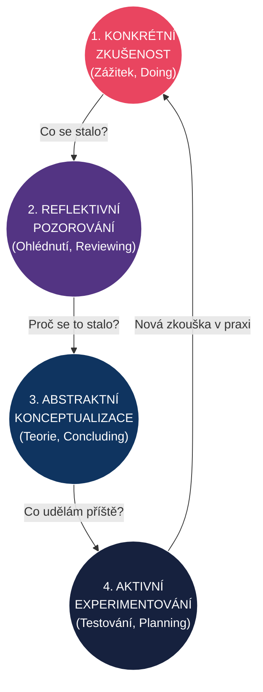
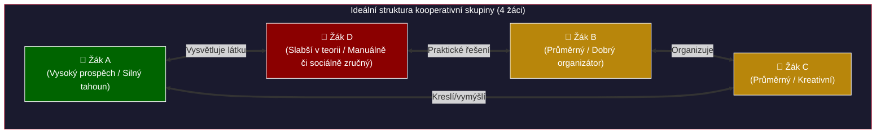

# PES 22–25: Kooperativní výuka, zkušenostní učení a projektová výuka

> **TL;DR / Audio Shrnutí:**
> Zkušenost je nejlepší učitel. Místo abychom žákům o světě jen vyprávěli, necháme je, aby si ho sami „osahali“. Na tomto principu stojí **zkušenostní učení** (typicky Kolbův cyklus), kde se poznání nerodí z výkladu, ale z konkrétního zážitku, jeho reflexe a vyvození pravidel pro příště. A jak zajistit, aby to žáci dělali efektivně? Přes **kooperativní a projektovou výuku**. Kooperace neznamená, že pět žáků sedí u jednoho stolu a jeden to odpracuje za všechny. Znamená to sdílenou zodpovědnost a pozitivní vzájemnou závislost. Když tyto metody spojíme, vznikají komplexní **projekty**, které žáky připravují na reálný život — učí je nejen odborné dovednosti, ale i komunikaci, řešení problémů a time management.

---

## Znění státnicových otázek
- **[VOT]** **PES 22:** Charakterizujte specifika skupinové výuky a kooperativního učení; vysvětlete pojem kooperace v pedagogickém kontextu; popište význam kooperace a skupinové práce pro učení a přípravu žáka na život a profesi; uveďte možné úskalí zavedení skupinové práce do výuky; vysvětlete principy sestavování skupin.
- **[VOT]** **PES 23:** Popište pedagogické teorie vzdělávání zaměřené na činnost a zkušenost. Charakterizujte pojem zkušenost v procesu učení (např. D. Kolb, J. Dewey); popište strategie výuky zaměřené na řešení problémů, objevování, činnost a zkušenost.
- **[VOT]** **PES 24:** Vysvětlete principy zkušenostního učení a zážitkové pedagogiky na základě Kolbova cyklu; popište jednotlivé fáze a význam sebereflexe, uveďte možnosti aplikace v praktickém i teoretickém vyučování.
- **[VOT]** **PES 25:** Vysvětlete principy projektové výuky, popište fáze a druhy projektů; uveďte možnosti, rizika a přínosy jejího začlenění do výuky.

---

## Klíčové pojmy

- **Skupinová výuka** — organizační forma výuky; žáci pracují ve skupinkách (nejčastěji 3–5 členů).
- **Kooperativní učení** — vyšší forma skupinové práce, která je záměrně strukturovaná tak, že úspěch jednotlivce je podmíněn úspěchem celé skupiny (*pozitivní vzájemná závislost*).
- **Zkušenostní učení (Experiential learning)** — proces učení probíhající skrze přímou osobní zkušenost a její následnou vědomou reflexi (Kolb, Dewey).
- **Zážitková pedagogika** — specifický přístup učení zacílený na celostní rozvoj osobnosti (rozum, emoce, tělo) skrze silný, často nestandardní zážitek (typicky outdoorové kurzy, lanová centra, simulace).
- **Projektová výuka** — komplexní metoda, při které žáci řeší reálný problém. Výsledkem je konkrétní produkt (výkres, funkční model, návrh kampaně).
- **Pozitivní interdependence (vzájemná závislost)** — klíčový princip kooperace: "Toneme nebo plaveme společně."

---

## Detailní rozebrání problematiky

### PES 23 a 24: Zkušenostní učení a Kolbův cyklus

*(Pozn.: Otázky 23 a 24 spolu těsně souvisí, proto je řešíme společně.)*

Tradiční škola postupuje deduktivně (od teorie k praxi): učitel vysvětlí vzorec a žáci počítají příklady. Teorie zaměřené na činnost (John Dewey – pragmatická pedagogika) postupují induktivně (od praxe k teorii): žák něco zažije/udělá a z toho vyvodí teoretické pravidlo.

#### David Kolb a cyklus zkušenostního učení
Kolb (1984) popsal, že skutečné učení není jednorázový akt, ale cyklus čtyř na sebe navazujících kroků. Pokud jeden krok vynecháme, poznání je povrchní a neukotví se.

**4 fáze Kolbova cyklu:**
1. **Konkrétní zkušenost (Zážitek):** Žák něco reálně prožije nebo zkusí udělat (např. v dílně zkusí svařit dva plechy k sobě, ale svár praskne). Nejde o čtení z knihy, ale o osobní zapojení.
2. **Reflektivní pozorování (Reflexe):** Žák (sám nebo s učitelem) přemýšlí o tom, co se stalo. *„Proč to prasklo? Co jsem dělal jinak než mistr?“* Toto je nejdůležitější fáze! Zážitek bez reflexe není učení.
3. **Abstraktní konceptualizace (Teorie/Pochopení):** Žák vyvodí obecné pravidlo, nebo si přečte teorii, která jeho zážitek vysvětluje. *„Ahá, měl jsem špatně nastavený proud na svářečce, takže plech se neprovařil do hloubky.“*
4. **Aktivní experimentování (Nová zkouška):** Žák aplikuje nově objevené pravidlo do praxe v nové situaci. Nastaví správný proud a zkusí svařovat znovu. (A tím vzniká nová *Konkrétní zkušenost* a cyklus se opakuje).

**Aplikace v praxi:**
- **Praktické vyučování:** Učeň nerozebírá motor podle návodu na tabuli. Dostane nářadí a zkusí to rozebrat (Zkušenost). Narazí na problém (Reflexe). Mistr mu vysvětlí fyzikální princip pnutí a poradí techniku (Teorie). Učeň to zkusí znovu (Experiment).
- **Teoretické vyučování:** Simulační hry. Žáci hrají „burzu cenných papírů“ (Zkušenost). Pak reflektují, proč prodělali (Reflexe). Učitel na tom vysvětlí zákon nabídky a poptávky (Teorie).

---

### PES 22: Skupinová výuka a Kooperativní učení

Zatímco ve *skupinové práci* mohou žáci jen sedět u jednoho stolu a každý si dělá své (nebo jeden pracuje a zbytek se veze – tzv. *ringelfí* neboli sociální zahálení), v **kooperativní výuce** musí spolupracovat, aby úkol vůbec šel splnit.

#### 5 znaků skutečného kooperativního učení
1. **Pozitivní vzájemná závislost:** Cíl, zdroje nebo role jsou rozděleny tak, že bez pomoci ostatních nemůže jednotlivec uspět.
2. **Osobní odpovědnost:** Skupina má sice společný výsledek, ale učitel může kdykoli přezkoušet kteréhokoli člena skupiny z čehokoli. Nikdo se neschová.
3. **Podpora interakce tváří v tvář:** Fyzické uspořádání prostoru (žáci na sebe musí vidět).
4. **Nácvik interpersonálních dovedností:** Žáci se neučí jen matematiku, ale i to, jak řešit konflikt, jak si naslouchat a jak dělat kompromisy.
5. **Skupinová reflexe:** Na konci úkolu skupina zhodnotí nejen to, co vytvořila (obsah), ale i to, *jak dobře u toho spolupracovala* (proces).

#### Úskalí a pravidla sestavování skupin
- **Úskalí:** Ztráta kontroly (hluk ve třídě), pocit křivdy u nadaných žáků („musím to dělat za ty pomalejší“), dominance jednoho žáka.
- **Principy sestavování:**
  - *Velikost:* Ideální jsou 3–4 žáci. Ve dvojici chybí variabilita nápadů, nad 5 žáků se už obtížně organizuje práce.
  - *Složení:* **Heterogenní skupiny** (namíchané silní, průměrní, slabší) jsou pro učení nejlepší. Silnější se učí tím, že látku vysvětlují (nejvyšší patro Bloomovy taxonomie), slabší mají výhodu vrstevnického jazyka.
  - *Role:* Každý by měl mít roli (např. organizátor, zapisovatel, hlídač času, mluvčí), které se střídají.

---

### PES 25: Projektová výuka

Zatímco kooperace je organizační forma, **projekt je metoda**. Je to nejvyšší forma výuky zaměřené na zkušenost. Žáci při ní propojí znalosti z mnoha předmětů (matematika, fyzika, čeština, občanka), aby vyřešili jeden velký problém.

#### Principy projektové výuky
- **Reálnost a užitečnost:** Neřeší se abstraktní cvičení z učebnice, ale problém ze života. Výsledkem je **konkrétní produkt** (např. návrh úspornějšího osvětlení pro naši dílnu).
- **Zodpovědnost a sebeřízení:** Učitel nevydává přesné povely. Třída / skupina si sama musí rozplánovat čas, rozdělit úkoly a najít zdroje (PES 16 - sebeřízení).
- **Mezipředmětovost:** Přirozeně maže hranice mezi předměty.

#### Fáze projektu
1. **Volba tématu (Iniciace):** Musí vycházet ze zájmu žáků (např. Vedení školy chce zrušit bufet – pojďme vytvořit projekt zdravého školního bistra).
2. **Plánování:** Jak budeme postupovat? Jaké potřebujeme zdroje a materiál? Kdo udělá co? (Zde je role učitele jako konzultanta stěžejní).
3. **Realizace:** Samotná práce – měření, vyhledávání na internetu, kreslení návrhů, konstrukce, psaní textů.
4. **Prezentace (Zveřejnění):** Každý projekt musí být představen publiku (ostatním třídám, řediteli, rodičům). To mu dává smysl a váhu.
5. **Hodnocení (Reflexe):** Nehodnotí se jen kvalita konečného produktu, ale celý proces. Jak jsme spolupracovali? Co jsme se u toho naučili? (Často probíhá formou vrstevnického hodnocení).

#### Druhy projektů
- *Podle délky:* Krátkodobé (půldenní), střednědobé (týdenní projektové dny), dlouhodobé (celoroční absolventská práce).
- *Podle rozsahu:* Jednopředmětové, mezipředmětové.
- *Podle zadavatele:* Žákovské (vymysleli si sami), učitelské (zadal učitel).

---

## Vizualizace

### Kolbův cyklus zkušenostního učení

### Kooperativní učení: Heterogenní sestavení

---

## Záludnosti a doplňující otázky

### ❓ 1. Dá se do Kolbova cyklu „nastoupit“ i jinak než zkušeností?
**Odpověď:** Ano, Kolbův cyklus je nepřetržitý a **dá se do něj vstoupit v kterékoli fázi**. Tradiční frontální škola do něj nastupuje ve fázi *Abstraktní konceptualizace* (učitel vyloží teorii) → pak žáci počítají příklady (Aktivní experimentování) → zažijí u toho úspěch/chybu (Zkušenost) → zjistí, proč chybovali (Reflexe). Problém tradiční školy je, že často skončí u bodu 3 a nenechá žáky nabýt vlastní zkušenost.

### ❓ 2. Proč je tak obrovský rozdíl mezi skupinovou prací a kooperativním učením?
**Odpověď:** Protože bez *pozitivní vzájemné závislosti* se vždy stane to, že nejchytřejší/nejaktivnější žák udělá celou práci, aby zajistil skupině jedničku, zatímco ostatní ho jen sledují. Kooperativní učení nutí učitele strukturovat úkol tak (např. každý žák dostane jen čtvrtinu textu s indiciemi a musí si je navzájem posdílet), že bez zapojení slabšího člena skupina prostě nedosáhne výsledku.

### ❓ 3. Projektová výuka zabírá strašně moc času a osnovy (ŠVP) jsou plné. Jak to skloubit?
**Odpověď:** Toto je nejčastější obava učitelů. Projektová výuka není o tom zastavit výuku a „odskočit si k projektu“. Projekt **je výuka sama o sobě**. Během dobře naplánovaného projektu (např. „Měření emisí a návrh filtrů pro místní továrnu“) si žáci zcela organicky projdou učivem chemie, fyziky, matematiky a občanské výchovy. Namísto izolovaného zkoušení v jednotlivých předmětech probere učitel dané tematické celky integrovaně skrze řešení projektu. Zásadní je ale špičkové plánování (Fáze 2).
