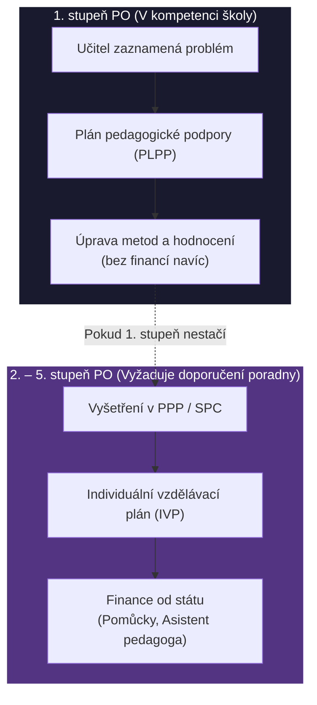

# PES 26–30: Výchova k hodnotám, klima, diagnostika, SVP a aktivizace

> **TL;DR / Audio Shrnutí:**
> Škola není jen továrna na vědomosti, ale prostor pro formování člověka. Učitel zde nestojí jen jako předavač faktů, ale jako diagnostik a manažer sociálního klimatu. Musí umět „číst“ svou třídu pomocí **pedagogické diagnostiky** (od pozorování po tvorbu testů), aby věděl, co žáci potřebují. Obzvlášť velkou výzvu představují **žáci se speciálními vzdělávacími potřebami (SVP)**, pro které zákon definuje 5 stupňů podpůrných opatření (od prodloužení času po asistenta pedagoga). To vše se odehrává v určitém **třídním klimatu** — pokud není bezpečné, učení se zastaví. Aby učitel žáky zaujal a vedl je k aktivní **výchově k hodnotám a charakteru**, opouští frontální výklad a zapojuje **aktivizační metody** založené na třífázovém modelu učení (Evokace – Uvědomění – Reflexe).

---

## Znění státnicových otázek
- **[VOT]** **PES 26:** Charakterizujte výchovu zaměřenou na formování charakteru a metody výchovy k hodnotám.
- **[DOB, VOT]** **PES 27:** Vysvětlete pojem školní a třídní sociální klima; popište znaky bezpečného školního prostředí a vhodné postupy, jak je možné jej budovat.
- **[DYT, VOT]** **PES 28:** Charakterizujte význam a využití diagnostiky v práci učitele (cíle a oblasti); popište diagnostický proces (fáze, metody), zásady a rizika diagnostikování.
- **[VOT]** **PES 29:** Charakterizujte žáky se speciálními vzdělávacími potřebami (SVP) a uveďte příklady podpůrných opatření (dle aktuální legislativy pro SŠ).
- **[VOT]** **PES 30 (AKTM):** Definujte aktivizační metody a jejich význam. Popište třífázový model E-U-R. Charakterizujte 3 metody a jejich aplikaci v praxi. *(Pozn.: Lze volit z okruhů AKTM, SOCPED, PRERICH, PEDVOL. Pro potřeby tohoto bloku a logickou návaznost rozebíráme AKTM).*

---

## Klíčové pojmy

- **Výchova k hodnotám** — proces formování morálních postojů, charakteru a svědomí; nelze ji nařídit, žák si hodnoty musí zvnitřnit (internalizovat).
- **Sociální klima třídy** — dlouhodobé emocionální ladění a kvalita mezilidských vztahů ve třídě (na rozdíl od *atmosféry*, která je krátkodobá).
- **Pedagogická diagnostika** — systematický proces, kdy učitel zjišťuje stav žáka (vědomosti, dovednosti, předpoklady, klima), aby mohl optimalizovat další výuku.
- **Speciální vzdělávací potřeby (SVP)** — stav, kdy žák k naplnění svých vzdělávacích možností potřebuje poskytnutí *podpůrných opatření* (např. kvůli zdravotnímu postižení, znevýhodnění nebo mimořádnému nadání).
- **Podpůrná opatření (PO)** — úpravy ve vzdělávání (metody, hodnocení, pomůcky, asistent) rozdělené do 5 stupňů (dle vyhlášky č. 27/2016 Sb.).
- **E-U-R (Evokace - Uvědomění si významu - Reflexe)** — konstruktivistický model kritického myšlení kopírující přirozený proces učení.
- **Aktivizační metody** — postupy, které mění žáka z pasivního příjemce na aktivního tvůrce poznání (diskuse, heuristika, hry, řešení problémů).

---

## Detailní rozebrání problematiky

### PES 26: Výchova k hodnotám a formování charakteru

Hodnoty (co je dobré, správné, spravedlivé) nelze žákům nadiktovat jako vzorec z fyziky. Hodnoty se předávají **nápodobou a prožitkem**. 
Podle psychologa L. Kohlberga prochází člověk fázemi morálního vývoje (od poslušnosti ze strachu z trestu, přes konformitu se skupinou, až po autonomní vnitřní morálku).

**Metody výchovy k hodnotám:**
1. **Osobní příklad učitele:** Nejmocnější nástroj. Učitel, který požaduje spravedlnost, ale sám je nespravedlivý, hodnoty deformuje.
2. **Práce s morálním dilematem:** Žákům je předložen nedokončený příběh (např. Heinzovo dilema: *Může muž ukrást lék pro umírající ženu, když na něj nemá peníze?*) a třída diskutuje o řešení. Učí se argumentovat a respektovat jiný názor.
3. **Příběhy a vzory:** Analýza literárních nebo historických postav, diskuze nad filmem.
4. **Charitativní akce a dobrovolnictví (Service-learning):** Žáci jdou například pomáhat do domova seniorů. Zážitek (PES 24) buduje hodnotu silněji než výklad.

---

### PES 27: Školní a třídní sociální klima

Klima je pro učení jako půda pro rostlinu. V toxickém klimatu (strach z výsměchu, šikana, obrovská soutěživost) je kognitivní kapacita mozku paralyzována stresem a učení se zastaví (viz Maslowova pyramida, PES 20).

**Znaky bezpečného klimatu:**
- Důvěra a otevřená komunikace.
- Chyba je chápána jako příležitost k učení, ne jako důvod k trestu.
- Pocit sounáležitosti (každý má ve třídě své místo).

**Jak budovat pozitivní klima:**
- **Pravidla třídy:** Žáci by se měli podílet na jejich tvorbě (budou je pak lépe dodržovat).
- **Rituály:** Třídnické hodiny, komunitní kruhy, ranní pozdravy.
- **Kooperativní výuka (PES 22):** Žáci se učí spolupracovat a vážit si odlišností.
- **Včasná diagnostika:** Zjišťování vztahů ve třídě (sociometrie), aby se předešlo vyčlenění jednotlivců.

---

### PES 28: Pedagogická diagnostika

Aby mohl učitel efektivně učit a budovat klima, musí vědět, koho má před sebou. K tomu slouží diagnostika. Cílem **není nálepkovat** (diagnózu dysleksie stanoví výhradně pedagogicko-psychologická poradna - PPP), ale zjistit stav a navrhnout zlepšení.

**Diagnostický proces (fáze):**
1. *Stanovení cíle* (Co chci zjistit? Např. proč je žák X náhle agresivní).
2. *Volba metod* (Budu ho pozorovat? Promluvím s ním?).
3. *Sběr dat a analýza* (Záznamy z hodin).
4. *Interpretace a návrh opatření* (Promluvím s rodiči, upravím mu zasedací pořádek).

**Metody pedagogické diagnostiky:**
- **Pozorování:** Nejčastější metoda. Musí být systematické (víme, na co se zaměřujeme).
- **Rozhovor:** Nejpřirozenější cesta. S žákem, s rodiči, s výchovným poradcem.
- **Analýza žákovských prací:** Rozbor chyb v sešitech, výkresech (nejen výsledek, ale *jak* to udělal).
- **Dotazníky a ankety:** Rychlý sběr dat (např. dotazník na třídní klima B-4).
- **Sociometrie:** Metoda měřící vztahy ve třídě (Kdo se s kým kamarádí? Kdo je izolován?).

*Rizika učitelské diagnostiky:* Haló efekt (hodnotím vše na základě jedné vlastnosti), předsudky, neobjektivnost, překračování kompetencí (učitel nesmí stanovovat medicínské diagnózy jako ADHD).

---

### PES 29: Žáci se speciálními vzdělávacími potřebami (SVP)

Podle školského zákona (a tzv. inkluzivní vyhlášky č. 27/2016 Sb.) má každý žák právo na vzdělávání, které respektuje jeho možnosti. Pokud běžné metody nestačí, přicházejí na řadu **Podpůrná opatření (PO)**.

**Kdo jsou žáci se SVP?**
- Žáci se zdravotním postižením (zrakové, sluchové, tělesné, mentální).
- Žáci se zdravotním znevýhodněním (alergie, oslabení) nebo specifickými poruchami učení a chování (SPU - dyslexie, dysgrafie / SPCH - ADHD).
- Žáci ze sociálně znevýhodněného prostředí (odlišný mateřský jazyk, chudoba).
- *Pozor:* I mimořádně **nadaní žáci** mají SVP!

**Stupně podpůrných opatření (1. – 5. stupeň):**
- **1. stupeň:** Poskytuje škola/učitel sám (bez poradny). Mírné úpravy metod (posadím žáka blíž, dám mu více času, plán pedagogické podpory - PLPP).
- **2. až 5. stupeň:** Poskytuje se výhradně na základě doporučení PPP nebo SPC (Speciálně pedagogického centra). Financuje stát.
  - *Příklady opatření:* Individuální vzdělávací plán (IVP), úprava maturitní zkoušky (delší čas), kompenzační pomůcky (speciální klávesnice, lupa), pedagogická intervence (doučování).
  - V nejvyšších stupních: **Asistent pedagoga** (pomáhá učiteli s organizací výuky), tlumočník znakového jazyka.

---

### PES 30: Aktivizační metody a E-U-R

Klasický frontální výklad po 15 minutách ztrácí pozornost. **Aktivizační metody** vyžadují, aby žák myslel, tvořil a obhajoval. Aby tyto metody nebyly jen zmatenou hrou, vkládáme je do modelu **E-U-R (konstruktivismus)**:

1. **E = Evokace:** Aktivace dosavadních znalostí (prekonceptů). *Co už o tématu víme? Co si myslíme, že se stane?* Cíl: probudit zájem.
2. **U = Uvědomění si významu:** Žák získává nové informace (čte text, zkoumá v dílně, sleduje pokus) a konfrontuje je se svými předchozími představami.
3. **R = Reflexe:** Zhodnocení. *Co nového jsem se naučil? Kde jsem měl chybu? Jak to využiji?* Znalost se trvale upevňuje.

**Příklady 3 aktivizačních metod v praxi (Odborný výcvik / Praxe):**
1. **Brainstorming (Burza nápadů):**
   - *Fáze E-U-R:* Evokace.
   - *Aplikace:* „Jaké znáte způsoby spojování materiálů?“ Žáci chrlí nápady na tabuli. 
   - *Pravidlo:* Zákaz kritiky během vymýšlení.
2. **T-graf (Analýza výhod a nevýhod):**
   - *Fáze E-U-R:* Uvědomění / Reflexe.
   - *Aplikace:* Žáci do dvou sloupců píšou argumenty PRO a PROTI (např. využití elektromobilů vs. spalovacích motorů). Učí to kritickému myšlení a strukturování argumentů.
3. **Případová studie (Case study):**
   - *Fáze E-U-R:* Uvědomění.
   - *Aplikace:* Žáci dostanou popis reálné havárie v továrně. Ve skupinách musí zanalyzovat technickou dokumentaci a navrhnout, kde se stala chyba a jak jí příště zabránit.
   - *Výhoda:* Obrovská propojenost s reálným životem. *Nevýhoda:* Náročné na přípravu kvalitního případu učitelem.

---

## Vizualizace

### Systém Podpůrných opatření (PO)



### Třífázový model učení (E-U-R)

```mermaid
graph LR
    E((("🧠 EVOKACE<br>Co už vím?<br>(Aktivace)"))]
    U((("📖 UVĚDOMĚNÍ<br>Co nového zjišťuji?<br>(Konfrontace)"))]
    R((("💡 REFLEXE<br>Co jsem se naučil?<br>(Ukotvení)"))]

    E -->|"Zájem a prekoncepty"| U
    U -->|"Získání informace"| R
    R -.->|"Nová evokace pro další téma"| E

    style E fill:#e94560,color:#fff
    style U fill:#0f3460,color:#fff
    style R fill:#006400,color:#fff
```

---

## Záludnosti a doplňující otázky

### ❓ 1. Může učitel sám předepsat žákovi s ADHD individuální vzdělávací plán (IVP) a zkrátit mu testy?
**Odpověď:** Ne, vypracování IVP (podpůrné opatření 2. a vyššího stupně) je právní úkon vázaný na posudek školského poradenského zařízení (PPP nebo SPC) a písemný souhlas rodičů. Učitel však může (a měl by) na úrovni 1. stupně PO sám zohlednit žákovy potřeby v rámci běžné diferenciace výuky (např. rozdělit dlouhý test na dvě kratší části), ideálně formou PLPP.

### ❓ 2. Proč je v metodě E-U-R fáze „Evokace“ tak důležitá? Nestačí rovnou začít učit (Uvědomění)?
**Odpověď:** Mozek nefunguje jako prázdný harddisk, na který prostě zapíšete soubor. Mozek se učí tak, že nové informace „zahákuje“ za ty staré. Pokud žákům nedáte čas, aby si uvědomili, co o tématu už ví (nebo si myslí, že ví), nová informace po nich steče a druhý den ji zapomenou. Evokace připravuje tyto „háčky“ v paměti.

### ❓ 3. Kdo je asistent pedagoga? Je to osobní sluha žáka se SVP?
**Odpověď:** V žádném případě. Asistent pedagoga **je k ruce pedagogovi** (ne konkrétnímu dítěti, byť tam byl kvůli němu přidělen). Jeho úkolem je pomáhat s organizací třídy tak, aby se učitel mohl věnovat dítěti se SVP (nebo naopak, asistent pracuje se zbytkem třídy, zatímco učitel něco individuálně dovysvětluje žákovi se SVP). Asistent je pedagogický pracovník a učitel ho plně řídí.
