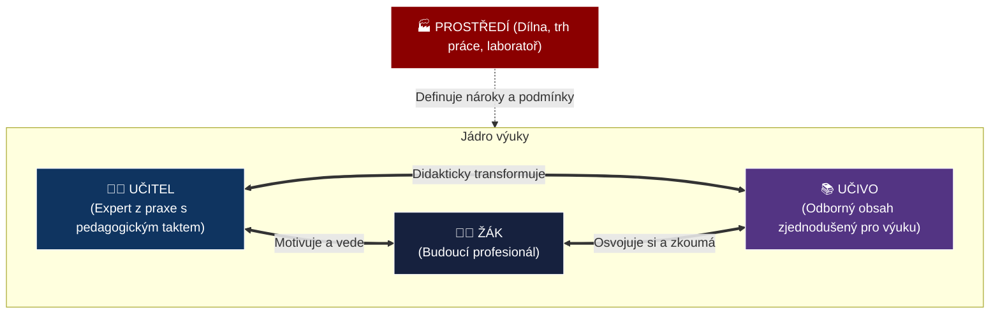
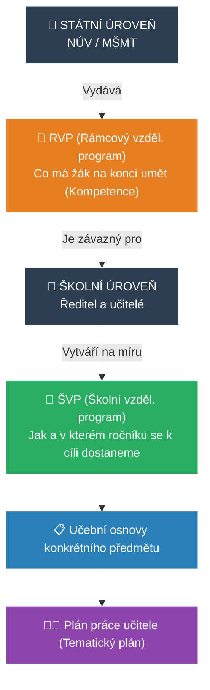

# ODIP 1–5: Oborová didaktika, kurikulum, učitel a zkoušky na SOŠ/SOU

> **TL;DR / Audio Shrnutí:**
> Oborová didaktika je mostem mezi čistou vědou (např. strojírenstvím) a tím, jak ji srozumitelně předat žákovi. Základním modelem tohoto procesu je **didaktický trojúhelník** (Učitel – Žák – Učivo). Pro odborné školy je přitom zcela klíčové propojení s praxí. To se odráží ve struktuře **kurikulárních dokumentů** (státní RVP nastavuje laťku, školní ŠVP s osnovami určují, jak se k ní dostaneme). Odborný učitel ale není jen úředník plnící osnovy. Je to specifická **osobnost**, která musí skloubit hluboké odborné mistrovství z praxe s pedagogickým taktem. Celý tento proces vzdělávání na středních školách pak vrcholí zkouškou dospělosti — **maturitou** (společná a profilová část) nebo **závěrečnou zkouškou** na učilišti, kde žák musí prokázat, že obstojí na trhu práce.

---

## Znění státnicových otázek
- **ODIP 1:** Didaktika odborných předmětů. Pojednejte o předmětu, úkolech, metodách zkoumání, vztahu k ostatním vědním disciplínám a její struktuře. Vysvětlete, jaké části obsahuje didaktický trojúhelník.
- **ODIP 2:** Základní kurikulární dokumenty. Vyjmenujte základní učební dokumenty a vysvětlete jejich význam a závaznost. Posuďte obory vzdělání související s vaším zaměřením, jejich pojetí srovnejte s potřebami praxe.
- **ODIP 3:** Učební osnovy a zásady jejich tvorby. Uveďte zásady tvorby učebních osnov s respektováním požadavků RVP (kompetence žáků). Vysvětlete na praktických příkladech u zvoleného předmětu.
- **ODIP 4:** Osobnost učitele odborných předmětů. Definujte požadavky na učitele SOŠ a SOU. Konkretizujte kompetence učitele na příkladech.
- **ODIP 5:** Aktuální model maturitní zkoušky. Vysvětlete konstrukci stávajícího modelu a zvláštnosti v odborném předmětu. Popište možnosti ukončení vzdělávání na SOU.

---

## Klíčové pojmy

- **Oborová didaktika** — teorie vzdělávání a vyučování v určitém oboru (např. didaktika odborných předmětů strojírenských). Transformuje vědecký systém oboru do školského systému (didaktická transformace).
- **Didaktický trojúhelník** — základní model znázorňující vztah mezi Učitelem, Žákem a Učivem v konkrétním prostředí.
- **Kurikulum** — veškerý obsah, proces a prostředí, ve kterém probíhá učení.
- **RVP (Rámcový vzdělávací program)** — státní, závazný dokument určující obecné cíle (kompetence) a minimální výstupy pro daný obor.
- **ŠVP (Školní vzdělávací program)** — školní dokument vytvořený na základě RVP, který obsahuje konkrétní **učební osnovy** (co a v jakém ročníku se učí).
- **Klíčové kompetence** — soubor vědomostí, dovedností a postojů, které přesahují konkrétní předmět (např. kompetence k řešení problémů, komunikativní, pracovní).
- **Profilová (školní) část maturity** — odborná část maturitní zkoušky, kterou si plně řídí a tvoří sama škola.

---

## Detailní rozebrání problematiky

### ODIP 1: Didaktika odborných předmětů a Didaktický trojúhelník

**Předmět a úkoly:** 
Oborová didaktika zkoumá proces výuky ve specifickém odborném předmětu. Řeší, **PROČ** se předmět vyučuje (cíle), **CO** se v něm učí (výběr učiva z obrovského balíku vědy) a **JAK** se to učí (metody, pomůcky).
- *Vztah k jiným vědám:* Úzce spolupracuje s obecnou didaktikou, psychologií (jak žák vnímá), a samozřejmě s **mateřským vědním oborem** (např. strojírenství, ekonomika).

**Didaktický trojúhelník:**
Jde o dynamický systém tří prvků, které se navzájem ovlivňují:
1. **Žák (Ten, kdo se učí):** S jeho prekoncepty, motivací a schopnostmi.
2. **Učitel (Ten, kdo učí):** S jeho odborností, pedagogickým taktem a stylem.
3. **Učivo (To, co se učí):** Transformovaný vědecký poznatek (musí být didakticky zjednodušen).
*Dnes se často přidává čtvrtý prvek – **Prostředí** (vzniká Didaktický čtyřstěn), protože výuka v moderní laboratoři probíhá jinak než v zastaralé učebně.*

---

### ODIP 2 a 3: Kurikulární dokumenty a Tvorba osnov

*(Pozn.: Otázky 2 a 3 tvoří logický celek řízení obsahu vzdělávání).*

V České republice platí **dvouúrovňový model kurikula**: Státní úroveň (NÚV / MŠMT) a Školní úroveň (ředitel a učitelé).

1. **RVP (Rámcový vzdělávací program) — Státní úroveň**
   - Vydává stát pro každý obor (např. RVP pro obor 23-41-M/01 Strojírenství).
   - Je **právně závazný**.
   - Neříká, v jakém ročníku se má učit dané téma. Definuje **výsledky vzdělávání** (co má žák umět na konci studia) a klíčové + odborné **kompetence**.

2. **ŠVP (Školní vzdělávací program) — Školní úroveň**
   - Vytváří si ho škola sama (tzv. "ušije si ho na míru"). Musí stoprocentně naplnit požadavky RVP.
   - Součástí ŠVP je **učební plán** (kolik hodin týdně má jaký předmět) a **učební osnovy**.
   - Zde probíhá profilace: škola v Mladé Boleslavi zaměří osnovy více na automotive, škola v Ostravě na těžký průmysl.

**Zásady tvorby učebních osnov (ODIP 3):**
Učební osnova rozpracovává RVP do konkrétního předmětu a ročníku. Při její tvorbě učitelé musí respektovat:
- **Návaznost:** Zajištění mezipředmětových vztahů (aby žáci nepočítali v odborném předmětu výkony, když ještě nebrali vzorce ve fyzice).
- **Zásadu přiměřenosti:** Učivo musí odpovídat věku a chápání žáků.
- **Zaměření na kompetence:** Osnova by neměla být jen "seznam kapitol knihy", ale měla by obsahovat výkonové standardy (např. místo tématu "Soustruh" napsat výkon žáka: "Žák obsluhuje hrotový soustruh podle výkresu").

---

### ODIP 4: Osobnost učitele odborných předmětů

Učitel odborných předmětů (či mistr odborného výcviku) má těžší roli než učitel všeobecně vzdělávacího předmětu. Musí být **dvojitým expertem**: ve svém řemesle/oboru i v pedagogice.

**Základní požadavky a kompetence:**
1. **Odborná a předmětová kompetence:** Musí mít hlubokou znalost svého oboru, ale navíc musí **sledovat aktuální vývoj praxe a technologií**. (Pokud učí IT podle osnov z roku 2010, je pro žáky k ničemu).
2. **Pedagogicko-psychologická kompetence:** Umí učivo zjednodušit (didaktická transformace), umí řešit konflikty, motivovat a budovat bezpečné klima.
3. **Organizační kompetence:** Zvlášť v odborném výcviku (dílnách) řídí složité procesy, zajišťuje materiál a primárně **bezpečnost práce (BOZP)**.
4. **Komunikativní kompetence:** Reprezentuje školu u zaměstnavatelů (při zajišťování praxí firem), komunikuje s rodiči a odbornou veřejností.

*Příklad z praxe:* Mistr odborného výcviku automechaniků sice dokonale umí rozebrat převodovku (odborná kompetence), ale pokud u toho žákům nadává, nenechá je to zkusit rukama a nedokáže logicky vysvětlit posloupnost kroků (selhání pedagogické kompetence), nemůže být dobrým učitelem.

---

### ODIP 5: Maturitní a závěrečné zkoušky

#### Maturitní zkouška (Zákon č. 561/2004 Sb. - Školský zákon)
Skládá se ze dvou částí (aby byla zkouška platná, musí žák složit obě):
1. **Společná (státní) část:**
   - Organizuje CERMAT. Cílem je objektivní srovnání napříč republikou.
   - Povinně: **Český jazyk a literatura**.
   - Volitelně: **Cizí jazyk** NEBO **Matematika**.
   - Forma: Didaktické testy (často se k nim u jazyků přidávají školní ústní a písemné části, ty už ale patří do gesce ředitele).

2. **Profilová (školní) část:**
   - Plně v kompetenci ředitele školy (vychází z ŠVP).
   - Obsahuje typicky **2 až 3 povinné zkoušky z odborných předmětů**.
   - **Formy zkoušek:** Ústní zkouška (losování otázek), Písemná práce, nebo nejdůležitější pro SOŠ: **Praktická zkouška** (obhajoba maturitní práce / řešení souvislého praktického úkolu v laboratoři či softwaru). Zde žák prokazuje reálné dovednosti.

#### Závěrečné zkoušky (obory s výučním listem - SOU)
Jednotné zadání závěrečných zkoušek (NZZ). Skládá se ze tří částí:
1. **Písemná zkouška:** Ověření odborných teoretických znalostí.
2. **Praktická zkouška:** Těžiště výučního listu! Žák samostatně zhotovuje výrobek nebo poskytuje službu v reálném (nebo věrně simulovaném) prostředí za dodržení časového limitu a BOZP.
3. **Ústní zkouška:** Žák odpovídá na vylosovanou otázku ze světa práce (včetně otázek na ekonomiku a právní minimum).

---

## Vizualizace

### Didaktický trojúhelník (v kontextu SOŠ)

### Kurikulární dokumenty: Od státu k učiteli

---

## Záludnosti a doplňující otázky

### ❓ 1. Co dělat, když se RVP rozejde s aktuální praxí (např. v RVP je povinnost učit staré normy)?
**Odpověď:** RVP je poměrně rigidní dokument (trvá roky, než se inovuje). Učitel ale v rámci ŠVP **může nad rámec RVP inovovat**. Učitel učí to, co vyžaduje RVP v minimální míře (aby žák uspěl u jednotných zkoušek), ale v profilaci školy modernizuje výuku a zařazuje nejnovější technologie. RVP nediktuje, že se *nesmí* učit nic nového, udává pouze společné minimum.

### ❓ 2. Co je největším úskalím tvorby ŠVP na středních odborných školách?
**Odpověď:** **Mezipředmětová roztříštěnost.** Každý učitel je expert na svůj předmět a má tendenci si "urvat" co nejvíce hodin pro sebe, často bez toho, aby komunikoval s kolegy. Stává se tak, že žáci v odborném kreslení kreslí hřídel, ale v technologii obrábění se učí o frézování rovinných ploch. ŠVP musí vznikat týmovou spoluprací (tzv. předmětové komise), aby se učivo prolnulo horizontálně (v témže ročníku) i vertikálně (napříč ročníky).

### ❓ 3. Proč je profilová (praktická) maturitní zkouška pro žáka SOŠ důležitější než státní část?
**Odpověď:** Státní část slouží spíše k ověření gramotnosti a obecné připravenosti (často kvůli prostupnosti na VŠ). Z pohledu trhu práce a zaměstnavatele je ale naprosto irelevantní, kolik bodů má instalatér/IT technik z literárního rozboru Babičky. Zaměstnavatele zajímá, zda absolvent umí odvést odbornou práci. Praktická zkouška simuluje reálný úkol, prokazuje profesní samostatnost, aplikaci BOZP a řešení problémů v reálném čase.
