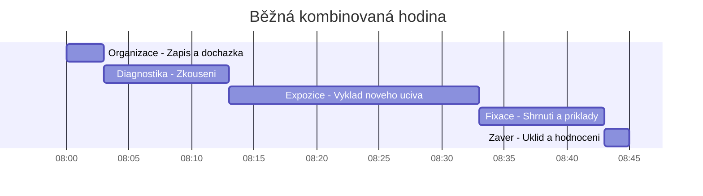

# ODIP 6–10: Metody teoretické výuky, formy a exkurze

> **TL;DR / Audio Shrnutí:**
> Učit odborný předmět neznamená jen přečíst učebnici. Musíme si ujasnit **cíle a obsah** (co přesně budoucí profesionál potřebuje vědět a co už je zbytečná vata). K tomu volíme vhodné **organizační formy** — od klasické hodiny ve třídě až po **exkurzi**, která obrovsky rozšiřuje obzory, pokud je ovšem dokonale připravená (od cílů přes BOZP až po závěrečnou reflexi). Samotné učení pak řídíme pomocí **metod**: ty expoziční (výklad, dialog) slouží k předání nového učiva, fixační (opakování, drill) zajišťují, aby ho žák do druhého dne nezapomněl, a diagnostické (testy, zkoušení) nám oběma ukážou, jak jsme v tom byli úspěšní. Každá metoda má svůj čas a místo; mistrovství učitele spočívá v jejich správném střídání.

---

## Znění státnicových otázek
- **ODIP 6:** Koncepce výchovy a vzdělávání v odborných předmětech. Charakterizujte výchovně-vzdělávací cíle, rozeberte jejich koncepci, doložte příklady. Posuďte obsah vzdělávání a vymezte rozsah učiva s akcentem na základní učivo.
- **ODIP 7:** Formy výuky odborných předmětů. Popište formy výuky, analyzujte jejich účinnost. Analyzujte strukturu různých typů teoretických vyučovacích jednotek.
- **ODIP 8:** Exkurze – příprava, organizace, vyhodnocení. Navrhněte témata. Uveďte zásady přípravy, organizace a vyhodnocení.
- **ODIP 9:** Vyučovací metody – expoziční. Posuďte účinnost monologických a dialogických metod. Navrhněte aktivizační metody, ukažte aplikaci. Metoda samostatné práce.
- **ODIP 10:** Vyučovací metody – fixační a diagnostické. Postupy pro fixaci poznatků. Diagnostika vědomostí, zásady klasifikace. Diferenciace testů a jejich hlavní vlastnosti.

---

## Klíčové pojmy

- **Základní (kmenové) učivo** — nezbytné minimum poznatků a dovedností, bez kterých nelze obor vykonávat (odlišuje se od rozšiřujícího učiva).
- **Organizační forma výuky** — vnější uspořádání podmínek výuky (prostředí, čas, způsob uspořádání žáků). Nejčastější formou je *vyučovací hodina (45 min)*.
- **Exkurze** — specifická organizační forma výuky probíhající v reálném (často pracovním) prostředí mimo školu.
- **Expoziční metody** — metody sloužící k prvotnímu předání nového učiva (např. výklad, přednáška, demonstrace).
- **Fixační metody** — metody sloužící k upevnění a prohloubení učiva (např. opakování, dril, řešení typových úloh).
- **Diagnostické metody** — metody sloužící ke zjištění míry osvojení učiva (zkoušení, testy).
- **Didaktický test** — objektivní nástroj měření výsledků výuky splňující požadavky na validitu a reliabilitu.

---

## Detailní rozebrání problematiky

### ODIP 6: Cíle a Obsah vzdělávání v odborných předmětech

Výuka odborných předmětů nemůže být "všechno o všem". Informací v technice nebo ekonomice přibývá exponenciálně.
Učitel proto musí obsah **didakticky redukovat** a stanovit:
1. **Základní učivo:** To, co musí znát naprosto každý žák, aby prošel. (Např. automechanik *musí* umět popsat 4 doby motoru).
2. **Rozšiřující učivo:** Pro nadané žáky nebo pro hlubší pochopení kontextu. (Např. detailní princip variabilního časování ventilů).

Cíle se dělí do tří sfér (viz PES 18): Kognitivní (znalosti), Psychomotorické (dovednosti) a Afektivní (postoje - např. výchova k bezpečnosti a přesnosti). Cíl odborného předmětu by měl vždy směřovat k **reálné profesní kompetenci**, nikoli jen k odříkání teorie.

---

### ODIP 7: Organizační formy výuky

Forma řeší "V jakém vnějším rámci se učíme?".
1. **Podle místa:** Třída, laboratoř, školní dílna, reálné pracoviště (exkurze, praxe).
2. **Podle uspořádání žáků:**
   - *Hromadná (frontální):* Učitel mluví ke všem. Rychlé, levné, ale pasivní.
   - *Skupinová (kooperativní):* Žáci řeší úkol společně. Dobré pro složitější problémy.
   - *Individuální:* Žák pracuje vlastním tempem na svém zadání.
3. **Podle fází (Struktura vyučovací hodiny):**
   - *Základní (kombinovaná) hodina:* Nejčastější. Má fázi organizační, opakovací (diagnostickou), expoziční (nové učivo), fixační (procvičení) a závěrečnou (zadání DÚ).
   - *Specializované hodiny:* Čistě opakovací (před testem), čistě zkušební, čistě expoziční (úvod do velkého tématu).

---

### ODIP 8: Exkurze (Příprava, organizace, vyhodnocení)

Exkurze není „výlet, aby se neučilo“. Je to náročná organizační forma, která propojuje teorii s realitou podniku.

**3 nezbytné fáze exkurze:**
1. **Příprava (Nejdůležitější!):**
   - *Pedagogická:* Stanovení cílů. Učitel se tam musí jet podívat předem! Připraví pro žáky úkoly (pracovní list).
   - *Organizační:* Doprava, finance, zgrupování žáků, souhlasy rodičů.
   - *Bezpečnostní:* Školení BOZP, zjištění nutnosti OOPP (přilby, reflexní vesty do výroby).
2. **Realizace:**
   - Přesun a poučení na místě. Samotná prohlídka. Žáci plní zadané úkoly (neposlouchají jen pasivně průvodce). Učitel hlídá kázeň a doplňuje průvodce o souvislosti s probraným učivem.
3. **Vyhodnocení (Reflexe):**
   - V nejbližší vyučovací hodině po návratu! (Zážitek rychle bledne).
   - Zhodnocení pracovních listů, diskuze nad tím, co žáky překvapilo, propojení s teorií na tabuli.

*Vhodná témata:* Pásová výroba (Škoda Auto), Logistické centrum (Amazon), Čistička odpadních vod – věci, které nelze ukázat ve třídě.

---

### ODIP 9: Expoziční metody (Předávání nového)

Expoziční metody slouží k seznámení se s novou látkou. Z hlediska aktivity je dělíme na:
1. **Monologické (Transmisivní):**
   - *Výklad, přednáška, popis.* 
   - Účinnost: Velmi vysoká pro rychlé předání faktů, ale žáci udrží pozornost max. 15 minut. Musí být proloženo vizualizací (prezentace, nákres).
2. **Dialogické (Interaktivní):**
   - *Rozhovor (Heuristická metoda):* Učitel pokládá návodné otázky a žáci logicky dospějí k novému poznatku sami. (Např. "Proč myslíte, že se kolejnice v létě kroutí? Co dělá kov v teple?")
   - Účinnost: Pomalejší proces, ale znalost je hlubší a trvalejší.
3. **Samostatná práce:**
   - Práce s textem, manuálem nebo internetem. Učí žáka vyhledávat informace, což je v dnešní době klíčová kompetence (manuály se mění každý rok).

*Aktivizace:* Během výkladu učitel použije „Brainstorming“ nebo „Sněhovou kouli“ (žáci nejdřív přemýšlí sami, pak ve dvojici, pak ve čtveřici), aby je udržel v pozoru.

---

### ODIP 10: Fixační a diagnostické metody

Když učivo odvykládáme (expozice), za hodinu žák zapomene 50 % informací (Ebbinghausova křivka zapomínání). Proto musí přijít **fixace**.

**Fixační postupy:**
- Ústní opakování (shrnutí toho nejdůležitějšího na konci hodiny).
- Řešení typových úloh (výpočty, rýsování).
- Praktické cvičení (manuální dril).

**Diagnostické metody (Hodnocení vědomostí):**
Zjišťujeme, zda žák dosáhl cíle.
- *Ústní zkoušení:* Hluboký vhled do myšlení žáka, možnost doplňujících otázek. Nevýhoda: neobjektivní (haló efekt, tréma), časově extrémně náročné (vyzkouším 3 žáky za hodinu).
- *Písemné zkoušení:* Objektivnější, prověří všechny žáky naráz. Nevýhoda: nevidím, *jak* žák k výsledku došel, jen výsledek.
- **Didaktické testy:** Nástroj k hromadnému a přesnému zjištění vědomostí.
  - *Standardizované (Cermat):* Pečlivě ověřené na vzorku tisíců žáků.
  - *Nestandardizované (Učitelské):* Vytváří si je učitel sám pro svou třídu.

**Hlavní vlastnosti dobrého testu:**
- **Validita (Platnost):** Měří test to, co opravdu měřit má? (Pokud dám do testu z autoopravárenství složité souvětí, kterým žák neporozumí, měřím jeho čtenářskou gramotnost, ne znalost aut).
- **Reliabilita (Spolehlivost):** Pokud test zadám stejné skupině znovu, měly by vyjít podobné výsledky. (Test nesmí být postaven na náhodném tipování).
- **Praktičnost:** Je snadné ho zadat i vyhodnotit (např. zaškrtávací a-b-c-d vs. volné eseje).

---

## Vizualizace

### Ebbinghausova křivka zapomínání a význam FIXACE

### Struktura kombinované vyučovací hodiny (45 min)

---

## Záludnosti a doplňující otázky

### ❓ 1. Proč je metoda „samostatné práce s textem“ u dnešních žáků často neúspěšná?
**Odpověď:** Narůstá problém se čtenářskou gramotností. Žáci umí text přečíst (dekódovat písmena), ale nedokážou z něj vytáhnout hlavní myšlenku nebo ignorovat nepodstatné detaily. Pokud učitel zadá "přečtěte si strany 10–15 a udělejte výpisky", často žáci opíší první dvě věty z každého odstavce. Samostatná práce s textem se musí *učit* (např. pomocí strukturovaných pracovních listů nebo metody podtrhávání klíčových slov).

### ❓ 2. Jak zabráním tomu, aby si žáci z exkurze udělali „volný den“ a nic si neodnesli?
**Odpověď:** Zlatým pravidlem exkurze je **pracovní list**. Žáci musí mít už při nástupu do autobusu v ruce konkrétní úkoly, které mají v továrně zjistit (např. "Zjistěte 3 způsoby povrchové úpravy karoserie", "Zeptejte se mistra, jak řeší recyklaci oleje"). Pracovní list musí být hodnocen (byť třeba jen formativně / plusem za aktivitu). Druhou pojistkou je provedení okamžité reflexe další hodinu.

### ❓ 3. Je vždy validnější test, který je tzv. "multiple choice" (výběr z možností A-B-C-D)?
**Odpověď:** Ne vždy. Uzavřené testy jsou vysoce reliabilní (objektivní hodnocení – i stroj ho opraví bez chyby), ale mají nižší validitu pro zjištění *hloubky* porozumění. Lze v nich dobře testovat 1. patro Bloomovy taxonomie (zapamatování). Pokud ale chci změřit, zda žák dokáže analyzovat problém a navrhnout řešení (vysoká patra Blooma), je "A-B-C-D" test nevalidní. K tomu potřebuji úkoly s otevřenou (tvořenou) odpovědí.
