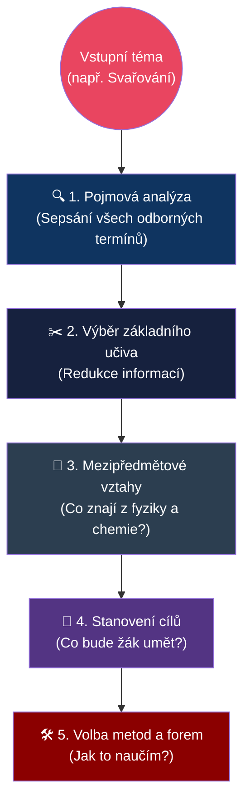
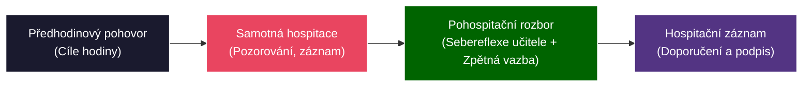

# ODIP 11–15: Didaktická příprava, prostředky a hospitace

> **TL;DR / Audio Shrnutí:**
> Dobrý učitel neimprovizuje. Za každou úspěšnou vyučovací hodinou se skrývá precizní **didaktická analýza**, kdy učitel učivo nejprve "rozešije" na základní pojmy, určí si vzdělávací cíle a prováže je s tím, co už žáci znají z jiných oborů (**mezipředmětové vztahy**). Teprve pak usedne k psaní **písemné přípravy**, do které naplánuje, jaké metody a **didaktické prostředky** (od učebnice přes modely až po stroje) použije. Vše musí podléhat didaktickým zásadám (např. od jednoduššího ke složitějšímu). A jak ředitel nebo kolega pozná, že je tato příprava kvalitní? Skrze **hospitaci** — kontrolní a poradenskou návštěvu přímo v hodině, jejímž cílem není učitele "potopit", ale pomoci mu zkvalitnit výuku.

---

## Znění státnicových otázek
- **ODIP 11:** Materiální didaktické prostředky. Vysvětlete funkci a vliv na zvyšování účinnosti výuky. Zaměřte se na význam textových pomůcek (učebnic) po metodické stránce a jejich využití.
- **ODIP 12:** Didaktická analýza a její kroky. Popište jednotlivé kroky, konkretizujte u vybraného celku. Stanovte cíle, formu, metody a prostředky. Uveďte faktory ovlivňující učitele.
- **ODIP 13:** Mezipředmětové vztahy a didaktické zásady. Objasněte podstatu a význam mezipředmětových vztahů (MPV) ve výuce. Aplikujte didaktické zásady.
- **ODIP 14:** Příprava na vyučovací jednotku. Analyzujte obsahové a formální náležitosti přípravy. Přizpůsobte volbu prostředků. Zdůrazněte možnosti výchovného působení.
- **ODIP 15:** Hospitační činnost v odborných předmětech. Popište hospitaci jako evaluační nástroj, její cíle, způsoby realizace, subjekty, kritéria hodnocení a náležitosti hospitačního záznamu.

---

## Klíčové pojmy

- **Didaktická analýza učiva** — myšlenkový proces učitele (prováděný před výukou), při kterém rozkládá učivo na základní pojmy, hledá souvislosti a transformuje je pro pochopení žákem.
- **Didaktické prostředky** — všechny materiální (pomůcky, stroje, učebny) i nemateriální (metody, formy) nástroje, kterými učitel dosahuje výukových cílů.
- **Učební pomůcky** — nosiče informací (modely, přístroje, učebnice), které usnadňují pochopení probírané látky díky názornosti.
- **Mezipředmětové vztahy (MPV)** — propojování poznatků a dovedností z různých předmětů za účelem vytvoření komplexního obrazu u žáka (odstranění tzv. "škatulkování" znalostí).
- **Didaktické zásady** — obecná pravidla a požadavky, která by měla platit v každé výuce (např. zásada názornosti, přiměřenosti, postupnosti). Komenského vynález.
- **Hospitace** — přímé pozorování a hodnocení výchovně-vzdělávacího procesu ve vyučovací hodině (zpravidla provádí ředitel, zástupce nebo jiný učitel).

---

## Detailní rozebrání problematiky

### ODIP 12 a 14: Didaktická analýza a Příprava na hodinu

*(Pozn.: Tyto dvě otázky na sebe bezprostředně navazují. Analýza je myšlenkový proces, příprava je jeho papírový výstup.)*

**Didaktická analýza (Kroky):**
1. **Pojmová analýza:** Učitel si vezme téma (např. *Elektrický obvod*) a vypíše si všechny odborné pojmy (zdroj, spotřebič, napětí, proud, odpor).
2. **Výběr základního a rozšiřujícího učiva:** Rozhodne, co musí umět každý žák (Ohmův zákon) a co je jen pro nadané (Kirchhoffovy zákony).
3. **Analýza vztahů (MPV):** Kde se s tím žáci už setkali? (Např. ve fyzice probírali napětí).
4. **Stanovení výukových cílů:** Musí být měřitelné (viz Bloomova taxonomie v PES 18). Tedy: *„Žák podle schématu správně zapojí jednoduchý elektrický obvod.“*
5. **Volba metod a forem:** Jak se k cíli dostaneme? Bude to výklad s ukázkou na tabuli, nebo samostatná práce s elektronikou v laboratoři?
6. **Volba prostředků:** Co k tomu potřebuji (kabely, žárovky, multimetr).

**Příprava na vyučovací jednotku:**
Mladý učitel by si měl psát **podrobnou písemnou přípravu**. Zkušený učitel má často "bleskovou" přípravu, ale nikdy nejde do třídy s prázdnou hlavou.

*Náležitosti přípravy (co musí obsahovat):*
- **Hlavička:** Třída, předmět, datum, téma hodiny.
- **Cíl hodiny:** Co se žáci naučí.
- **Fáze hodiny (Časový snímek):** 
  - 5 min: zápis, opakování. 
  - 20 min: výklad nového učiva (expozice). 
  - 15 min: samostatné procvičování (fixace). 
  - 5 min: shrnutí a DÚ.
- **Výchovné působení:** U odborných předmětů to je vždy *výchova k BOZP* a *přesnosti / zodpovědnosti za práci*.

---

### ODIP 11: Materiální didaktické prostředky

Učit odborný předmět (např. programování CNC strojů nebo anatomii pro kadeřnice) bez pomůcek je jako učit plavat na suchu. Materiální prostředky rozdělujeme na:
- **Žákovské pomůcky:** Sešity, rýsovací potřeby, pracovní oděv.
- **Učitelské pomůcky:** Modely (řez motorem), skutečné předměty (vadná součástka pro ukázku trhliny), audiovizuální technika.
- **Zařízení školy:** Tabule, projektor, speciálně vybavená laboratoř, cvičná kuchyně.

**Vliv na účinnost výuky:**
Zapojují více smyslů. Pokud žák pouze slyší definici (10 % zapamatování), ale pokud vidí reálný vadný píst, může si ho osahat a porovnat se zdravým kusem, zapamatování stoupá k 80 %. Jde o uplatnění **Zásady názornosti**.

**Textové učební pomůcky (Učebnice):**
- Pro učitele je to zdroj pro přípravu (ale neměl by to být jediný zdroj!).
- Pro žáka to je opora pro fixaci a opakování. 
- *Metodické využití:* Žáci neumí z učebnic automaticky studovat. Učitel by s nimi měl text aktivně rozebrat (hledat klíčová slova, klást k textu otázky - tzv. činnostní čtení). V moderní době textovou pomůckou není jen kniha, ale i e-learningové materiály a technické normy (tabulky).

---

### ODIP 13: Mezipředmětové vztahy a Didaktické zásady

**Mezipředmětové vztahy (MPV):**
Zabraňují "atomizaci" vědomostí (stavu, kdy žák umí matematiku v hodině matematiky, ale neumí ji aplikovat v dílně, aby spočítal spotřebu materiálu).
- *Horizontální MPV:* Vztahy mezi předměty v témže ročníku (např. ve stejnou dobu se probírají kovy v chemii a obrábění kovů v odborném výcviku).
- *Vertikální MPV:* Návaznost na učivo z nižších ročníků (na fyziku ze ZŠ navazuje na SŠ statika a mechanika).

**Didaktické zásady:**
Základní "zákony" učitelství, zformulované z velké části J. A. Komenským:
1. **Zásada názornosti:** Učit primárně přes smysly (ukázat, osahat).
2. **Zásada přiměřenosti:** Obsah a tempo musí odpovídat věku a úrovni žáků.
3. **Zásada posloupnosti a systematičnosti:** Postupovat od známého k neznámému, od jednoduchého ke složitému, od konkrétního k abstraktnímu.
4. **Zásada uvědomělosti a aktivity:** Žák musí vědět, *proč* se to učí, a sám při učení vyvíjet činnost (ne jen pasivně sedět).
5. **Zásada trvalosti:** Nutnost neustálého opakování (fixace) a propojování s praxí.

---

### ODIP 15: Hospitační činnost

Hospitace je pozorování výuky (typicky ze zadní lavice). Slouží k evaluaci (vyhodnocení kvality), nikoli k "nachytání" učitele při chybě.

**Cíle a subjekty:**
- *Kontrolní (Ředitel/zástupce):* Splňuje učitel ŠVP? Dodržuje BOZP? Je objektivní při klasifikaci?
- *Metodicko-poradenská (Uvádějící učitel nebo kolega):* Pomoc začínajícímu kolegovi, sdílení dobré praxe.

**Fáze hospitace:**
1. **Příprava:** Hospitující si zjistí, co se bude probírat (často proběhne krátký rozhovor s učitelem před hodinou). Hospitace nikdy nebývá "tajná".
2. **Pozorování v hodině:** Hospitující nevyrušuje! Nedělá zápisy na tabuli za učitele, do průběhu nezasahuje. Pozoruje interakci a zapisuje si časy (tzv. snímek hodiny).
3. **Rozbor (Pohospitační pohovor):** Klíčová část. Odehrává se v klidu po vyučování. **Nejprve hodnotí sám sebe učitel** (sebereflexe: "Dneska se mi nepovedlo to zkoušení..."). Teprve pak dává zpětnou vazbu hospitující.

**Hospitační záznam:**
Je to oficiální (často digitalizovaný) dokument uložený u vedení školy. Obsahuje datum, jméno učitele, téma hodiny a hodnocení kritérií (přiměřenost výkladu, aktivizace žáků, kázeň, pomůcky). Končí písemným závěrem (doporučením) a podpisy obou stran.

---

## Vizualizace

### Proces Didaktické analýzy učiva

### Typický průběh hospitace (Evaluační cyklus)

---

## Záludnosti a doplňující otázky

### ❓ 1. Dá se dodržet "Zásada posloupnosti a systematičnosti" v praxi, když mi mistr pošle žáka, ať k autu hned přimontuje kolo, a on ještě nezná teorii momentů sil?
**Odpověď:** Zásada posloupnosti "od teorie k praxi" není posvátná kráva. Někdy (zejména v oborovém výcviku) je efektivnější postupovat induktivně (viz Kolbův cyklus, PES 24): nechat žáka udělat konkrétní úkon a *následně* na tom vystavět teorii. Podstatou systematičnosti je, aby v poznání žáka nakonec nezůstala bílá místa. Není dogma, čím se musí začít.

### ❓ 2. Pokud se jako učitel před hospitujícím ředitelem v hodině zaseknu a udělám odbornou chybu, znamená to automaticky špatné hodnocení z hospitace?
**Odpověď:** Ne, pokud chybu učitel sám odhalí a správně zareaguje! Zkušený hospitující nečeká divadlo bez chybičky, ale sleduje reakci učitele. Přiznat před žáky "Aha, teď jsem to na tabuli napsal špatně, vidíte někdo kde?" je projevem pedagogického taktu a neformální autority (nepředstírá vševědoucnost). Hlavní průšvih je chybu zatlouct nebo svést na žáky.

### ❓ 3. Má smysl dělat písemnou přípravu i pro staršího učitele, který učí totéž už 10 let?
**Odpověď:** Rozhodně. Nemusí jít o přípravu na tři stránky (stačí mu 5 odrážek na papírku), ale učitel musí reagovat na konkrétní třídu. Letošní třída je "slabší" než loňská, takže v přípravě musí zařadit více fixačních metod a zpomalit tempo. Pokud učitel použije přesnou kopii přípravy z roku 2014, výuka nedopadne dobře.
