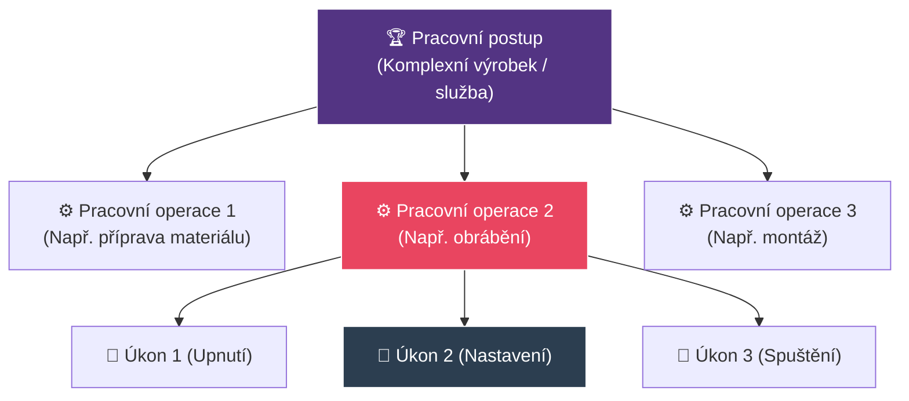
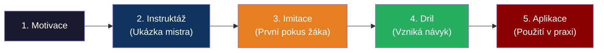

# ODIP 16–20: Praxe, dovednosti a učitel odborného výcviku

> **TL;DR / Audio Shrnutí:**
> Učitel praktického vyučování (mistr) nemá před sebou tabuli, ale reálný stroj, pacienta nebo rozvaděč. Je pro žáky přímým **profesním vzorem**. Učí je, že práce se neskládá z chaotických pohybů, ale z logicky seřazených **pracovních úkonů, operací a postupů**. Aby si žáci vytvořili správné a bezpečné **návyky**, nestačí jim to jen říct – musí si projít fázemi od nácviku naslepo až po automatizaci. K tomu si mistr definuje jasné **dovednostní cíle** (např. *dokázat svařit koutový svar*) i **výchovné cíle** (např. *uklidit si po sobě dílnu*). Tento učitel ale není na škole sám; musí intenzivně **spolupracovat** s učiteli teoretických předmětů (předmětová komise), aby žáci v dílnách nedělali věci, jejichž teorii ještě v lavicích neprobrali.

---

## Znění státnicových otázek
- **ODIP 16:** Osobnost učitele praktického vyučování. Vliv na žáky, atributy. Činnost plánovací, řídicí, kontrolní. Mimoškolní činnost a zvyšování kvalifikace.
- **ODIP 17:** Formy spolupráce mezi učiteli praktického vyučování a ostatními. Mezipředmětové a vnitropředmětové vztahy v praxi. Vztah praxe a teorie. Předmětová (metodická) komise.
- **ODIP 18:** Dovednostní cíle praktického vyučování. Stanovení cílů pro konkrétní jednotku. Výchovné cíle a jejich význam.
- **ODIP 19:** Postup při vytváření praktických dovedností a návyků. Vysvětlete pojmy dovednost a návyk, jejich rozdělení a postup osvojování.
- **ODIP 20:** Základní pojmy didaktiky praktického vyučování: pracovní postup, pracovní operace, pracovní úkon. Konkretizace u vybraného tématu.

---

## Klíčové pojmy

- **Dovednost** — schopnost žáka úspěšně vykonávat určitou činnost (např. dovednost řídit auto, dovednost zapojit obvod). Dovednost se skládá z osvojených vědomostí a návyků.
- **Návyk** — zautomatizovaná složka dovednosti (např. šlápnutí na spojku při řazení). Nevyžaduje už plnou vědomou pozornost.
- **Pracovní úkon** — nejmenší, dále nedělitelná část práce (např. uchopení šroubováku).
- **Pracovní operace** — ucelený soubor úkonů s jasným dílčím výsledkem (např. zašroubování vrutu).
- **Pracovní postup** — logický a chronologický sled pracovních operací vedoucí ke vzniku hotového výrobku (např. výroba stoličky).
- **Předmětová komise** — tým učitelů příbuzných předmětů (např. komise elektro), kteří společně tvoří plány a slaďují teorii s praxí.

---

## Detailní rozebrání problematiky

### ODIP 20: Struktura práce (Úkon, operace, postup)

Při výuce praxe (odborného výcviku) nelze žákovi říct "vyrob to". Práce se musí didakticky rozložit:
1. **Pracovní postup (Nejsložitější):** Celý návod od začátku do konce. 
   - *Příklad:* Výroba prodlužovacího kabelu.
2. **Pracovní operace (Střední úroveň):** Skládá postup. Musí mít technologický smysl.
   - *Příklad:* Odizolování kabelu; Nalisování dutinek; Zapojení do vidlice. Učitel často v 1. ročníku učí a známkuje jen jednotlivé operace, ne celé postupy.
3. **Pracovní úkon (Základní jednotka):** Většinou jde o motorický pohyb ruky nebo těla.
   - *Příklad:* Stisk rukojeti lisovacích kleští. 

---

### ODIP 18 a 19: Cíle a vytváření dovedností a návyků

**Cíle praktického vyučování:**
Zatímco teorie má cíle převážně kognitivní (znalosti), praxe se soustředí na:
1. **Dovednostní (Psychomotorické) cíle:** Týkají se těla a pohybu. (Např. *Žák správně drží pilník a oddělí materiál s přesností na 1 mm.*).
2. **Výchovné (Afektivní) cíle:** V praxi jsou kriticky důležité! (Např. *Žák dodržuje BOZP, nosí ochranné brýle a po práci uklidí pracoviště.*). Zručnost bez zodpovědnosti vede k pracovním úrazům a ekonomickým škodám.

**Rozdíl mezi dovedností a návykem:**
- *Dovednost* je vědomá (vím, co dělám a proč). Dělíme je na intelektové (čtení výkresu), senzomotorické (řezání materiálu) a komunikační (jednání se zákazníkem).
- *Návyk* je automatismus vzniklý opakovaným drilem. Výborný je návyk bezpečné práce (automaticky si beru brýle), špatný je zlozvyk (držím myš tak, že mě bolí zápěstí).

**Postup vytváření senzomotorických dovedností (Jak to naučit):**
1. **Seznámení a motivace:** Žák musí vědět, co jdeme dělat a proč (ukázka hotového výrobku).
2. **Instruktáž (Ukázka učitele):** Učitel činnost předvede v reálném čase, pak zpomaleně s výkladem. (Viz ODIP 22).
3. **Imitace (Pokus žáka):** Žák se snaží učitele napodobit. Učitel hned koriguje chyby! Zde se fixují zlozvyky, nesmí se to podcenit.
4. **Cvičení a dril (Automatizace):** Žák činnost opakuje tak dlouho, dokud z ní nevznikne návyk. Činnost se zrychluje a zpřesňuje.
5. **Aplikace:** Žák dovednost využije v novém, složitějším komplexním úkolu.

---

### ODIP 16: Osobnost učitele praktického vyučování

Učitel odborného výcviku (UOV / mistr) je s žáky často až 6 hodin v kuse v jednom dni. Má na ně obrovský výchovný vliv. Ztělesňuje pro ně vztah k řemeslu.

**Atributy a činnosti:**
- **Plánovací činnost:** Připravuje harmonogram prací, rozděluje žáky na pracoviště, zajišťuje materiál (objednávky u dodavatelů, protože jinak žáci nemají z čeho vyrábět).
- **Řídicí činnost:** Přímo vede provoz na dílně. Má zodpovědnost za BOZP a dodržování technologické kázně. Je to manažer mikropodniku (dílny).
- **Kontrolní a rozhodovací:** Hodnotí výrobky žáků (např. pomocí posuvného měřítka, kde se nedá subjektivně uhádat, že to je "dobře", když to nesedí). Rozhoduje o vyřazení zmetku.
- **Mimoškolní činnost a kvalifikace:** Obory se vyvíjí brutální rychlostí (např. IT, elektro, auto). Pokud mistr nespolupracuje s firmami a nejezdí na školení dodavatelů, za 3 roky učí muzejní historii.

---

### ODIP 17: Formy spolupráce a Mezipředmětové vztahy

Toxickým neduhem mnoha škol je boj mezi učiteli teorie ("Ti dole v dílnách žáky nic nenaučí") a mistry praxe ("Ti nahoře v teorii je učí zbytečnosti"). 

**Předmětová (Metodická) komise:**
Klíčový orgán školy. Sdružuje učitele teorie a praxe daného oboru. Úkoly komise:
- Sjednocovat požadavky na žáky.
- Provazovat (koordinovat) výuku: Zamezit tomu, aby žáci v dílnách svařovali metodou TIG, zatímco v teorii ještě ani neprobrali elektrický oblouk.
- Shodnout se na nákupu nového vybavení.

**Typy vztahů:**
- **Mezipředmětové vztahy (MPV):** Vztah praxe a ostatních předmětů. (Např. žák u CNC stroje musí aplikovat znalosti z Matematiky a ze strojírenské Technologie).
- **Vnitropředmětové vztahy (VPV):** Návaznost učiva v rámci jednoho předmětu. (Než začnu řezat závit, musím umět navrtat díru = návaznost operací).

---

## Vizualizace

### Hierarchie pracovní činnosti

### 5 fází osvojení motorické dovednosti

---

## Záludnosti a doplňující otázky

### ❓ 1. Proč je tak těžké odstranit "zlozvyk", který si žák v dílně zafixoval?
**Odpověď:** Zlozvyk je špatně provedená činnost, která se opakovaným drilem přesunula ze stádia "dovednost" do stádia "návyk". V ten okamžik ji už neřídí vědomá (pomalá) část mozku, ale automatická. Aby mistr zlozvyk odstranil, musí žáka "donutit" na činnost znovu začít myslet (přesunout ji zpět do vědomí), narušit staré neurální dráhy a vytvořit nové. To stojí obrovské množství energie a frustrace u obou. Proto je klíčové chytit chybu v 3. fázi (Imitace) dříve, než se zautomatizuje!

### ❓ 2. Co to znamená, když má mistr odborného výcviku vysokou „neformální autoritu“?
**Odpověď:** Formální autorita je dána "funkcí" (Jsem učitel, vy mě musíte poslouchat a mohu vám dát pětku). Neformální autorita je dána "respektem". Žáci mistra poslouchají, protože vidí, že svému oboru dokonale rozumí, je spravedlivý a dokáže poradit. V odborném výcviku, kde jsou žáci blízko skutečným zraněním a stresu z nepovedené práce, nelze přežít pouze s formální autoritou.

### ❓ 3. Který výchovný cíl je v praktickém vyučování nejvíce "kamenem úrazu"?
**Odpověď:** Hospodaření s materiálem a úklid (pracovní morálka). Žáci mají často pocit, že škola platí vše. Nerespektují ekonomiku (zkazím hliníkovou kostku, vezmu si druhou). Výchovným cílem mistra musí být vytvořit v žákovi zodpovědnost za hodnotu materiálu a nástrojů – na reálném pracovišti jim zničený materiál firma strhne z výplaty.
