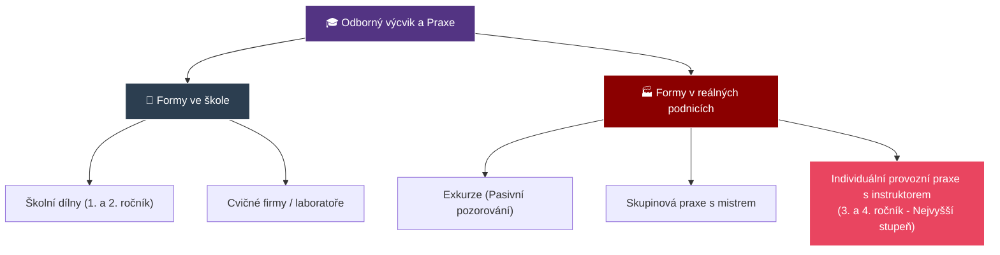
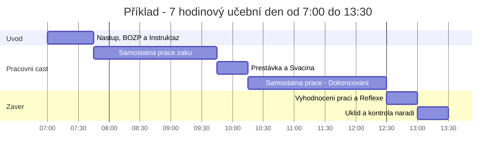

# ODIP 21–25: Organizační formy, metody a struktura učebního dne v praxi

> **TL;DR / Audio Shrnutí:**
> Odborný výcvik (praxe) netrvá 45 minut jako běžná hodina, ale tvoří celý **učební den** (až 7 hodin v kuse). Aby z toho žák nezkolaboval a zároveň se něco naučil, musí mít den pevnou strukturu (**články učebního dne**): začíná se úvodní instruktáží, následuje ukázka (kde má učitel hlavní slovo), přechází se do nácviku (kde už pracují žáci a učitel jen obchází a opravuje) a končí se závěrečným hodnocením. Kromě školních dílen ale existují i jiné **formy praxe** – od exkurzí až po tu nejcennější: individuální praxi přímo ve firmě. K učení žáků pak mistr nevyužívá sáhodlouhé přednášky, ale **metody praktického vyučování** (instruktáž s ukázkou), kdy propojuje slovo s reálným fyzickým pohybem.

---

## Znění státnicových otázek
- **[DYT]** **ODIP 21:** Organizační formy praxe. Uveďte formy praxe, vysvětlete typ dovedností v ročnících, rozsah na vaší škole.
- **[DYT]** **ODIP 22:** Vyučovací metody v praktickém vyučování. Zhodnoťte metody a charakterizujte prvky metodického postupu při osvojování dovedností a návyků.
- **[DYT]** **ODIP 23:** Varianty praktických vyučovacích jednotek. Možné varianty a pro které praktické jednotky jsou vhodné.
- **[DYT]** **ODIP 24:** Typy učebních dnů. Jakých typů lze využít v praktickém vyučování a kdy byste je zařadili?
- **[DYT]** **ODIP 25:** Základní články struktury všeobecného učebního dne (kombinovaného). Vyjmenujte, vysvětlete. Požadavky na učební den.

---

## Klíčové pojmy

- **Odborný výcvik (OV)** — vyučovací předmět s vysokou dotací hodin (na SOU tvoří až 50 % času), kde si žák osvojuje psychomotorické dovednosti pro své budoucí povolání.
- **Učební den** — základní časový a organizační celek v OV. Trvá typicky 6–7 vyučovacích hodin (po 60 minutách, na rozdíl od 45min teorií!).
- **Instruktáž** — stěžejní metoda praktického vyučování. Kombinuje slovní vysvětlení a bezprostřední smyslovou (vizuální) ukázku postupu mistrem.
- **Individuální praxe** — forma výuky probíhající na smluvním pracovišti (ve skutečné firmě), kde žák pracuje po boku instruktora (zaměstnance firmy).
- **Kombinovaný (všeobecný) učební den** — standardní den v dílnách, kdy se míchá teoretický úvod, osvojování nové dovednosti, procvičování staré a závěrečný úklid/hodnocení.

---

## Detailní rozebrání problematiky

### ODIP 21: Organizační formy praxe a posloupnost ročníků

Rozlišujeme několik základních forem, kde může praxe probíhat:
1. **Dílenská (školní) praxe:** Probíhá ve speciálně vybavených školních dílnách (cvičných laboratořích, kuchyních). Prostředí je přizpůsobeno žákům (stroje s extra bezpečností). Skupinová forma výuky (mistr má na starosti např. 12 žáků).
2. **Skupinová praxe na reálném pracovišti:** Celá skupina žáků s jedním mistrem jede např. stavět skutečnou zeď na zakázku.
3. **Individuální (provozní) praxe:** Žák z vyššího ročníku je přiřazen do reálné firmy jako "pracovník" pod dohledem podnikového instruktora.
4. **Exkurze:** Pozorovací praxe, nenasazují se montérky (viz ODIP 8).

**Návaznost v ročnících:**
- *1. ročník:* Osvojování zcela základních *pracovních úkonů* a operací. (Řezání, pilování, pájení). Žáci jsou chráněni v simulovaném prostředí školních dílen.
- *2. ročník:* Žáci provádějí *celé pracovní postupy* (vyrábí jednoduché sestavy). Často pracují na zakázkách pro školu.
- *3. (a 4.) ročník:* Samostatnost. Řešení komplexních celků, často rovnou na individuálních pracovištích u zaměstnavatelů.

---

### ODIP 22: Vyučovací metody v praktickém vyučování

Přednáška mistrovi v dílně nepomůže. Metody praxe se řídí pravidlem: **„Slyším – zapomenu, Vidím – zapamatuji si, Udělám – pochopím.“**

1. **Instruktáž (Slovní metoda + Ukázka):** Nejpoužívanější metoda.
   - Učitel nejprve vysvětlí postup slovně. 
   - Pak ho reálně předvede (ukázka v reálném čase, aby žáci viděli dynamiku a rytmus).
   - Následuje ukázka zpomalená, krok za krokem, upozornění na kritická místa.
   - *Metodický prvek:* Během instruktáže musí mít učitel všechny žáky v půlkruhu tak, aby mu **viděli na ruce** (nesmí k nim stát zády).
2. **Cvičení a dril (Pracovní metoda):** Žáci opakují danou operaci. Cílem je přesun od pomalé vědomé kontroly k rutinnímu návyku (zrychlení, snížení zmetkovitosti).
3. **Laboratorní a projektová metoda:** Aplikace pro vyšší ročníky. Žák dostane zadání ("Navrhni a smontuj funkční obvod k ovládání motoru z více míst") a postup volí sám.

---

### ODIP 24: Typy učebních dnů (Z hlediska obsahu)

Protože se v dílnách tráví celý den (často od 7:00 do 14:00), učební den má různé "žánry" podle toho, co se učí:
1. **Úvodní (expozicní) den:** Mistr vysvětluje úplně novou látku, bezpečnost pro nový typ stroje. Žáci toho rukama mnoho neudělají, den je spíše pozorovací.
2. **Nácvičný (fixační) den:** Nejčastější ve 2. ročníku. Dělá se jedna stejná operace dokola.
3. **Kombinovaný (všeobecný) učební den:** Zlatý standard. Polovinu dne cvičíme staré, druhou polovinu se učíme nové operace.
4. **Zkušební (diagnostický) den:** Den pololetních zkoušek, ročníkových prací nebo samotných Závěrečných učňovských zkoušek (NZZ).
5. **Souborné práce:** Práce na velkém a dlouhodobém projektu (např. třída vyrábí 50 kusů židlí pro školu).

---

### ODIP 23 a 25: Varianty jednotek a Články (struktura) kombinovaného učebního dne

Rozvrhnout pozornost a fyzickou sílu patnáctiletého člověka na 7 hodin fyzické práce není sranda. **Všeobecný učební den má pevnou, téměř vojenskou strukturu:**

**1. Úvodní část (Organizace a Instruktáž):**
   - *Ranní nástup:* Kontrola přítomnosti, vhodnosti pracovního oděvu a stavu žáků (únava, nemoc, příznaky zneužití látek – klíčové pro bezpečnost!).
   - *Rozdělení práce:* Kdo bude u jakého svěráku/stroje. 
   - *Instruktáž a ukázka* nové látky (s vysvětlením BOZP). 
   - Přidělení materiálu a nářadí.

**2. Pracovní část (Hlavní gro dne - Fixace a Nácvik):**
   - Žáci pracují.
   - *Činnost učitele (Hromadná instruktáž):* Učitel "obchází revír". Pokud vidí, že celá třída drží pilník špatně, práci **zastaví**, svolá všechny dohromady a chybu znovu vysvětlí (hromadná korekce).
   - *Individuální instruktáž:* Učitel obchází jednotlivce a drobně je koriguje ("Tlač víc levým ramenem").

**3. Závěrečná část (Diagnostika a Úklid):**
   - 30 minut před koncem se ukončuje výroba.
   - *Odevzdání prací.*
   - *Vyhodnocení (Reflexe):* Učitel veřejně předstoupí, vezme 2 povedené a 2 zkažené výrobky. Vysvětlí, proč se povedly a kde se stala chyba (chyba není trestána, pokud je z ní ponaučení). 
   - *Úklid:* Stroje a pracoviště musí být odevzdány v dokonalém stavu pro další směnu. Mistr přebírá nářadí.

---

## Vizualizace

### Hierarchie forem praktického vyučování

### Struktura všeobecného učebního dne

---

## Záludnosti a doplňující otázky

### ❓ 1. Proč musí proběhnout "instruktáž (ukázka)" nejprve v reálném čase a až poté zpomaleně? Nebylo by bezpečnější to rovnou ukázat krok po kroku pomalu?
**Odpověď:** Pokud žák uvidí složitou pohybovou operaci (např. hod oštěpem nebo soustružení plynulého oblouku) pouze rozsekanou a zpomalenou, nepochopí vnitřní "rytmus a dynamiku" daného pohybu. Výsledkem bude robotické, trhavé provádění, které často vede u strojů k fatálním chybám. Žák musí nejprve vidět cíl – plynulou, ladnou práci profesionála. Až k tomu se přidá pomalý "krok za krokem" rozbor.

### ❓ 2. Co je největším rizikem individuální (provozní) praxe ve firmách a jak tomu škola předchází?
**Odpověď:** Riziko "levné pracovní síly". Firmy často vezmou žáky ve 3. ročníku na praxi, ale místo aby je rotovaly po provozech a nechaly podnikového instruktora věnovat se jim, strčí žáka na měsíc k pásu nebo mu dají do ruky koště a nechají ho zametat dvůr. Škola tomu brání **Smlouvou o obsahu praxe** a pravidelnými kontrolami učitele OV, který přijede neohlášeně do firmy zkontrolovat, zda žák plní činnosti odpovídající ŠVP.

### ❓ 3. Proč je u ranního nástupu v dílnách vyžadována kontrola stavu žáků (zatímco učitel dějepisu to neřeší)?
**Odpověď:** Jde o zásadní požadavek BOZP. Pokud sedí nevyspalý, podnapilý žák s kocovinou v lavici na dějepisu, nejhorší, co se stane, je, že usne. Pokud postaví učitel odborného výcviku téhož žáka v 7:15 za formátovací pilu nebo s napětím 230V do ruky, vystavuje žáka riziku amputace / smrti a sebe obvinění z trestného činu ublížení z nedbalosti.
