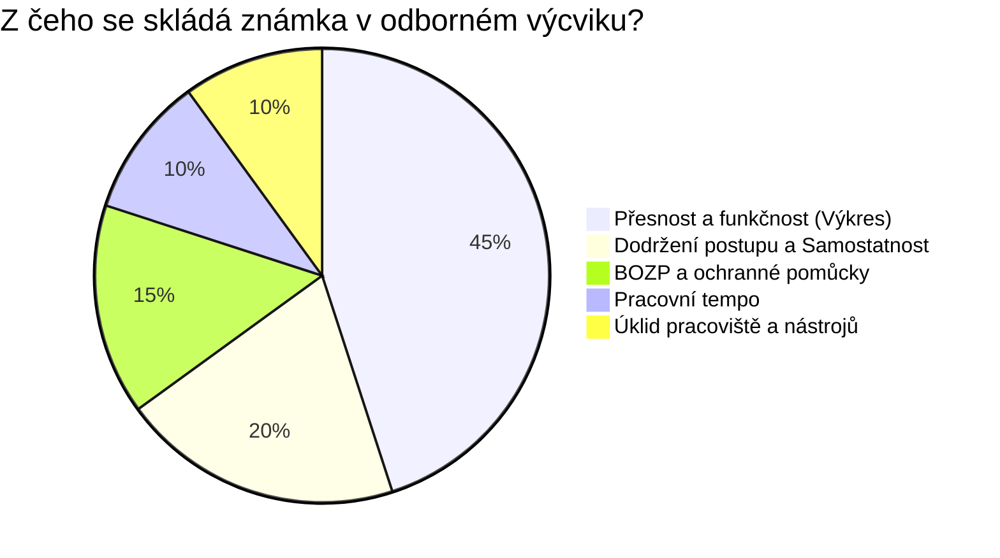
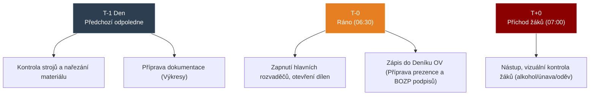

# ODIP 26–30: Hodnocení praxe, příprava učitele a bezpečnost na dílnách

> **TL;DR / Audio Shrnutí:**
> Hodnotit žáka v dílnách znamená víc než jen obodovat test. Mistr nehodnotí papír, ale reálný výrobek nebo službu, a proto musí mít předem jasně stanovená objektivní **kritéria a ukazatele** (např. *je svar rovný a struska odklepaná?*). Nejde jen o výsledek, ale i o proces – dodržel žák BOZP? Měl uklizený ponk? Aby tohle všechno mohlo proběhnout, musí mistr odvést obrovský kus neviditelné práce už odpoledne předtím: jde o **materiální přípravu** (zkontrolovat stroje, nařezat tyčovinu, připravit výkresy) i o **pedagogickou přípravu** (deník OV, plán hodiny). Pokud se na to mistr vykašle, výuka skončí v chaosu nebo zraněním, na což se rychle přijde během **hospitace**, která v dílnách hlídá nejen pedagogickou kvalitu, ale i rizika úrazů.

---

## Znění státnicových otázek
- **ODIP 26:** Metody prověřování praktických dovedností. Způsoby prověřování, kritéria klasifikace, vymezení klasifikačních stupňů u konkrétního tématu.
- **ODIP 27:** Metody zkoušení a hodnocení v praktickém vyučování. Formy zkoušení. Ukazatele hodnocení praktického vyučování a jejich důležitost.
- **ODIP 28:** Materiální příprava na praktickou vyučovací jednotku. Význam, materiální a organizační zabezpečení na vaší SŠ.
- **ODIP 29:** Příprava učitele na praktickou vyučovací jednotku. Pedagogické dokumenty, vyjmenujte a popište náležitosti.
- **ODIP 30:** Hospitační činnost v praktickém vyučování. Popište činnost na pracovišti OV a zaměřte se na možné rizikové situace.

---

## Klíčové pojmy

- **Ukazatele hodnocení v praxi** — soubor měřitelných aspektů žákovy práce, které brání tomu, aby učitel hodnotil jen na základě pocitu (obsahují např. přesnost, rychlost, dodržení postupu, BOZP, úklid).
- **Komplexní práce** — zkušební metoda pro zjištění celkových dovedností žáka (od přečtení výkresu po finální výrobek).
- **Materiální příprava** — zajištění hardwaru (nástrojů, materiálu), nezbytné pro průběh praxe. Bez ní žáci stojí a nudí se.
- **Deník odborného výcviku** — základní úřední dokument mistra prokazující probíranou látku, docházku a BOZP.
- **Hospitace v praxi** — na rozdíl od teoretické výuky zahrnuje silný prvek kontroly bezpečnostních a hygienických norem pracoviště.

---

## Detailní rozebrání problematiky

### ODIP 26 a 27: Prověřování a Hodnocení v praxi

Hodnotit v praxi je objektivnější, ale zároveň náročnější než v teorii, protože se hodnotí *proces* (průběh práce) i *výsledek* (výrobek). 

**Formy a metody prověřování:**
1. **Průběžné prověřování:** Mistr prochází dílnou, sleduje žáka u soustruhu a rovnou mu verbálně dává zpětnou vazbu.
2. **Kontrolní práce (Tematická):** Po ukončení tematického celku.
3. **Zkušební práce (Souborná):** Na konci pololetí. Hodnotí se velký komplexní výrobek. 

**Ukazatele hodnocení (Na co se mistr dívá):**
Aby byla známka spravedlivá, nesmí záležet na sympatiích. Mistr má rozpad hodnocení do 5 kritérií (ukazatelů):
- **Odbornost a přesnost:** Výrobek má správné rozměry (změřeno posuvkou/mikrometrem). Toleranci neokecáte.
- **Dodržení pracovního postupu:** Dělal to žák chronologicky správně, nebo to "spytlíkoval" nakonec?
- **Rychlost (Kvantita) a Samostatnost:** Nepotřebuje žák na utažení šroubu 3 hodiny? Pracoval sám bez dotazů?
- **BOZP a hygiena:** Použil rukavice a brýle?
- **Hospodárnost a úklid pracoviště:** Zničil při tom nástroj za dva tisíce? Zametl piliny?

**Klasifikační stupně (Příklad z praxe: Soustružení čepu):**
- *1 (Výborný):* Rozměry plně v toleranci výkresu. 100% samostatnost, perfektní bezpečnost, čisté pracoviště.
- *3 (Dobrý):* Mírné nepřesnosti v tolerancích. Občas si vyžádal pomoc mistra (zasekl se u výpočtu otáček). Výrobek je ale stále funkční.
- *5 (Nedostatečný):* Výrobek je naprostý zmetek (podmíra). Žák nedodržel BOZP a hrozilo zranění.

---

### ODIP 28 a 29: Příprava Učitele OV (Materiální a Pedagogická)

Zatímco učitel dějepisu může učit, i když ve škole zrovna nejde proud, mistr odborného výcviku má bez připravené dílny 12 patnáctiletých "neřízených střel".

**1. Materiální příprava:**
   - Probíhá předchozí odpoledne po odchodu směny.
   - Mistr musí zajistit materiál (když mají žáci svařovat, musí den předem uříznout na pile 30 kusů úhelníků, zkontrolovat stav plynu v lahvích).
   - Zajištění nástrojů a technické dokumentace (každý žák musí mít vytištěný výkres!).

**2. Pedagogická příprava (Dokumenty):**
   - *Tematický plán:* Rozpis učiva na celý rok. Z něj vychází.
   - *Písemná příprava (Scénář dne):* Zahrnuje organizační zabezpečení (do kdy se dělá), cíl dne, jaké metody použije na ukázku.
   - *Deník odborného výcviku:* Nejdůležitější úřední dokument! Zapisuje se tam absence, téma dne a hlavně **Záznam o proškolení BOZP** na daný den (pokud se stane úraz a není v deníku podpis, jde mistr k soudu).

---

### ODIP 30: Hospitační činnost v praxi (a Rizika)

Hospitující (ředitel / vedoucí praktického vyučování) vstupuje do extrémně rizikového prostředí.
Hodnotí nejen metodiku mistra (jak umí vysvětlovat), ale i **stav dílny a disciplínu**.

**Specifická rizika a co hospitující sleduje:**
- *Pracovní oděvy:* Mají všichni žáci monterky, obuv s pevnou špičkou, dlouhé vlasy v gumičce? Žádné prstýnky nebo řetízky, které může chytit fréza!
- *Pořádek:* Neleží na zemi kabely, o které může někdo zakopnout a padnout na běžící pilu?
- *Pozornost:* Nedovolí mistr žákům sahat na mobilní telefon během práce u stroje? (Sekundová nepozornost = chybějící prst).

Hospitace v praxi má 3 roviny: Pedagogickou (umí mistr učit), Odbornou (umí sám mistr obsluhovat stroj) a Právně-bezpečnostní (BOZP).

---

## Vizualizace

### Ukazatele hodnocení výrobku v praxi (Příklad vah kritérií)

### Harmonogram příprav mistra na Učební den

---

## Záludnosti a doplňující otázky

### ❓ 1. Co má dělat mistr, když zjistí, že si k hodnocení naplánoval kontrolní práci (soustružení hřídele), ale před začátkem směny se rozbije hlavní kompresor a stroje nejdou spustit?
**Odpověď:** Zde se projevuje nutnost záložní varianty v pedagogické i materiální přípravě. Mistr nemůže žáky poslat domů. Měl by mít připravený tzv. "suchý program" (náhradní činnost, která odpovídá cílům ŠVP, ale nevyžaduje energii/materiál). Například rozbor technických výkresů, měření tolerancí na již hotových zmetcích, údržbu nářadí nebo zkoušení z teorie BOZP.

### ❓ 2. Když chci dát žákovi 5, protože nedonesl hotový výrobek, ale on se hájí, že měl tupý nůž u soustruhu. Komu padá chyba na hlavu?
**Odpověď:** V takovém případě padá chyba na mistra. Mistr má povinnost zajistit odpovídající *materiální přípravu*. Pokud žák dostal špatný, nebezpečný nebo tupý nástroj a sám nemá oprávnění nebo schopnost (v 1. ročníku) ho nabrousit, nemůže být klasifikován z nedostatečného výkonu, protože nebyly naplněny podmínky pro spravedlivé prověření dovednosti.

### ❓ 3. Je možné při hospitaci na dílnách přerušit mistra a zasáhnout do výuky?
**Odpověď:** Běžně platí tvrdé pravidlo, že hospitující (např. ředitel) sedí vzadu jako "neviditelný duch" a nesmí do hodiny zasáhnout. **V odborném výcviku existuje jedna absolutní výjimka!** Pokud hospitující vidí bezprostřední a vážné porušení BOZP (např. žák zapíná pilu a vedle leží hadr, nebo se naklání k vrtačce s rozpuštěnými vlasy, čehož si mistr nevšiml), je hospitující povinen *okamžitě zasáhnout* a stroj zastavit, i za cenu narušení vyučovacího procesu. Zdraví je nadřazeno didaktice.
