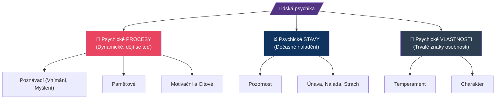
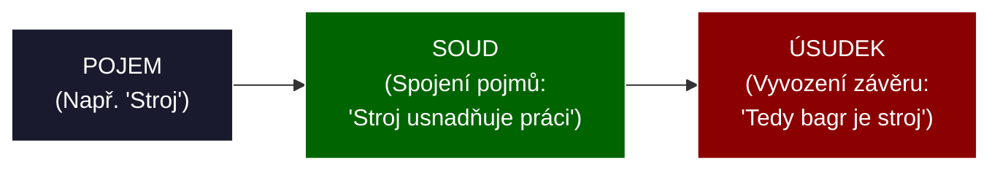

# PSY 1–3: Základy psychologie, vnímání a myšlení

> **TL;DR / Audio Shrnutí:**
> Aby učitel mohl žáky něco naučit, musí vědět, jak funguje lidská mysl. **Psychologie** mu dává do ruky „manuál k mozku“. Pomocí jejích disciplín (jako pedagogická nebo vývojová psychologie) může učitel pochopit, proč se žák v 15 letech chová jinak než ve 20. Samotné učení by nefungovalo bez základních **kognitivních (poznávacích) procesů**. Prvním z nich je **vnímání a představivost**, kterými přijímáme informace z vnějšího světa (zde platí Komenského pravidlo názornosti: čím víc smyslů zapojíme, tím lépe). Následuje vrcholný proces – **myšlení**. To vzájemně propojuje pojmy a řeší problémy. Myšlení a řeč jsou jako dvě strany jedné mince. Když učitel zná, jak tyto procesy fungují, netlačí do žáků informace silou, ale přizpůsobuje výklad tomu, jak je lidský mozek přirozeně zpracovává.

---

## Znění státnicových otázek
- **[DOB]** **PSY 1:** Charakterizujte předmět psychologie, její vývoj, disciplíny a metody. Vysvětlete význam psychologie v pedagogické praxi.
- **[DOB]** **PSY 2:** Zařaďte procesy vnímání a představování do struktury psychických jevů, popište je a objasněte jejich funkci ve výchovně-vzdělávacím procesu.
- **[DOB]** **PSY 3:** Zařaďte proces myšlení do struktury psychických jevů, popište jeho formy, druhy, poruchy a vysvětlete jeho význam v procesu učení.

---

## Klíčové pojmy

- **Psychologie** — věda o lidské psychice, chování a prožívání.
- **Struktura psychických jevů** — lidská psychika se dělí na psychické *procesy* (dynamické, probíhají rychle - např. myšlení), *stavy* (dočasné - např. pozornost, strach) a *vlastnosti* (trvalé - např. temperament).
- **Vnímání (Percepce)** — psychický proces zachycující to, co zrovna *teď a tady* působí na naše smysly. Výsledkem vnímání je *vjem* (celistvý obraz) nebo *počitky* (jednotlivé smyslové podněty - červená barva, kulatý tvar).
- **Představivost** — schopnost vybavit si to, co zrovna teď nepůsobí na smysly (vzpomínka na včerejší oběd), nebo vytvořit obraz něčeho nového (fantazie).
- **Myšlení** — nejvyšší forma poznávacího procesu. Jde o nepřímé a zobecňující poznávání reality, které hledá vztahy mezi pojmy (analýza, syntéza).
- **Pojem** — základní jednotka (forma) myšlení. Spojením pojmů vzniká *soud* a spojením soudů *úsudek*.

---

## Detailní rozebrání problematiky

### PSY 1: Předmět, vývoj a disciplíny psychologie

**Co psychologie zkoumá?**
Psychologie zkoumá chování (vnější, viditelné projevy – např. pláč, mrkání, útěk) a prožívání (vnitřní děje – emoce, myšlenky).

**Stručný vývoj:**
1. *Předvědecká fáze:* Spojena s filozofií. Aristoteles (dílo *O duši*). Věřilo se, že nositelem psychiky je nesmrtelná duše.
2. *Vznik psychologie jako vědy (1879):* **Wilhelm Wundt** zakládá první psychologickou laboratoř v Lipsku. Odděluje psychologii od filozofie pomocí experimentálních metod.
3. *Hlavní směry:*
   - **Behaviorismus:** J. B. Watson. Zkoumá pouze vnější chování (reakce na stimul: S-R model). Odmítá „černou skříňku“ vědomí.
   - **Psychoanalýza:** S. Freud. Zaměřuje se na nevědomí (potlačené pudy, id/ego/superego).
   - **Kognitivní a humanistická psychologie:** Zkoumá poznávací procesy a seberealizaci člověka (viz A. Maslow, C. Rogers v pedagogice).

**Disciplíny:**
- *Teoretické:* Obecná psychologie (co je paměť), Vývojová (od dětství do stáří), Sociální (člověk v davu).
- *Aplikované:* Pedagogická (proces učení), Klinická (nemoci duše), Forenzní (soudní – např. psychologie zločince), Psychologie práce.

**Význam pro učitele:** Učitel, který nerozumí psychologii, učí metodou "pokus-omyl". Psychologie mu radí, jak motivovat, jak řešit konflikty ve třídě a jak žáci vnímají nové informace. K tomu učitel využívá metody jako je *pozorování*, *rozhovor* a *sociometrie*.

---

### PSY 2: Vnímání a představování (Kognitivní procesy)

Oba jevy patří mezi **kognitivní (poznávací) psychické procesy**.

**Vnímání (Percepce):**
- Je to odraz reality. Funguje tady a teď.
- *Zákony vnímání:* Lidský mozek si věci zjednodušuje. Má tendenci vnímat "Figuru" (to hlavní, na co se soustředíme) a "Pozadí" (zbytek). 
- *Vady vnímání:* Iluze (vidím provaz, myslím si, že to je had - podnět existuje, ale mozek ho zkreslí) vs. Halucinace (vidím hada, ale žádný tam není - podnět neexistuje, jde o nemoc).
- **Aplikace v praxi:** Pokud má učitel tichý hlas bez intonace a splývá s tabulí, stává se z něj "pozadí". Aby žáci vnímali ("figura"), musí měnit hlas, psát barevně, ukazovat předměty (Zásada názornosti).

**Představivost a fantazie:**
- Je to obraz něčeho, co momentálně na smysly nepůsobí.
- *Paměťová představa:* Vyvolání toho, co jsem už zažil. (Např. Představ si, jak vypadá Eiffelovka).
- *Fantazie:* Tvorba obrazů, které jsem nikdy neviděl.
- **Aplikace v praxi:** Fantazie u dětí na ZŠ je obrovská, ale na SŠ vlivem drilu upadá. Učitel by ji měl stimulovat (např. projektovou výukou: "Navrhni design nového vozu bez ohledu na současná technologická omezení").

---

### PSY 3: Myšlení a proces učení

Myšlení je nejdokonalejší poznávací psychický proces. Vnímání nám řekne, že vidíme "dvě jablka a dvě jablka", ale myšlení nám dovolí pochopit abstraktní pravidlo "2 + 2 = 4". Myšlení je neoddělitelně spojeno s řečí.

**Myšlenkové operace (Jak mozek přemýšlí):**
- **Analýza:** Rozklad celku na části (motor -> píst, válec, svíčka).
- **Syntéza:** Složení částí do celku (složení motoru dohromady).
- **Indukce:** Od konkrétního k obecnému (Vidím měď, že vede proud, železo vede proud -> Všechny kovy vedou proud).
- **Dedukce:** Od obecného pravidla ke konkrétnímu (Všechny kovy vedou proud -> hliník je kov -> hliník vede proud).

**Druhy myšlení:**
1. *Motorické:* Řešení problému pohybem (Malé dítě cpe kostku do otvoru, dokud to nevyjde. Automechanik rukama zkouší utáhnout šroub, dokud nepadne).
2. *Názorné (Imaginativní):* Řešení v představách. (Šachista vidí tahy dopředu v hlavě).
3. *Abstraktní:* Práce s pojmy a symboly. (Matematika, programování).

**Poruchy myšlení:**
- *Kvantitativní:* Bradypsychismus (chorobně zpomalené myšlení, např. při těžké depresi), Tachypsychismus (chorobně zrychlené, myšlenkový trysk, člověk nestíhá mluvit, co mu mozek diktuje).
- *Kvalitativní:* Bludy (nezvratné, chorobné a nepravdivé přesvědčení - např. blud perzekuční: "Všichni mě sledují").

**Význam v učení:**
Biflování nazpaměť nevyžaduje myšlení (je to jen paměť). Skutečné učení vzniká tam, kde žák musí tvořit *soudy a úsudky* (řešení problémových úloh, heuristická metoda E-U-R). Učitel musí trénovat dedukci i indukci.

---

## Vizualizace

### Struktura psychických jevů

### Hierarchie forem myšlení

---

## Záludnosti a doplňující otázky

### ❓ 1. Dá se myšlení oddělit od řeči? Mohu myslet na něco, k čemu nemám slova?
**Odpověď:** V psychologii se tvrdí, že myšlení a řeč jsou úzce provázané. Člověk myslí v pojmech, které má verbalizované (často si mluvíme tzv. vnitřní řečí). Pokud pro nějaký jev nemáme pojem (slovo), je velmi obtížné ho abstraktně uchopit a myslet na něj. To má obrovský dopad na vzdělávání: rozšiřování slovní zásoby a terminologie žáka přímo rozšiřuje kapacitu a hloubku jeho myšlení!

### ❓ 2. Jaký je rozdíl mezi iluzí a bludem?
**Odpověď:** Iluze je *vada vnímání* – existuje reálný podnět (vidím stín), ale můj mozek (např. pod vlivem únavy nebo strachu) ho špatně interpretuje jako postavu. Když se přiblížím, iluze zmizí a já si uvědomím pravdu. Naproti tomu Blud je *porucha myšlení* – je to nezvratné patologické přesvědčení (např. že jsem Napoleon). Člověku s bludem nelze jeho stav vymluvit žádným logickým argumentem, jedná se o projev psychiatrické diagnózy (např. schizofrenie).

### ❓ 3. Proč dnešní vzdělávací programy (RVP) tolik tlačí na rozvoj abstraktního myšlení, když jsme v odborném školství (praxi)?
**Odpověď:** V minulosti (v době pásové výroby) stačilo dělníkovi motorické myšlení (zvládl jednu rutinní operaci se šroubovákem). Dnes, v době Průmyslu 4.0 a CNC technologií, pracovník musí umět číst složité kódy, představovat si 3D modely a analyzovat chybová hlášení v angličtině. Bez abstraktního a imaginativního myšlení nelze ovládat moderní výrobní linky.
