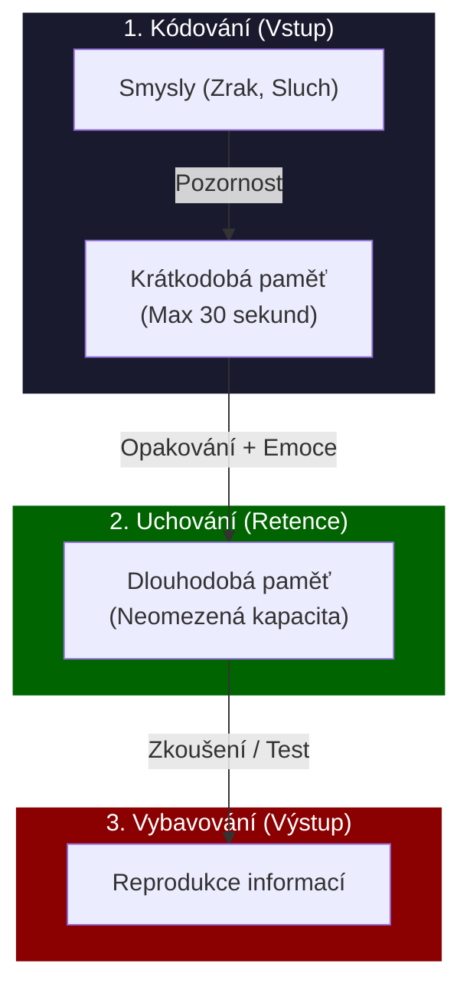
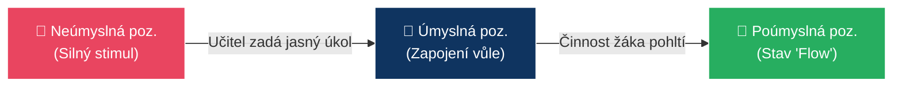

# PSY 4–7: Paměť, pozornost, emoce a vůle

> **TL;DR / Audio Shrnutí:**
> Proč žák do zítřka zapomene to, co dnes skvěle chápal? Odpověď leží ve fungování **paměti** – mozek si neukládá všechno, filtruje to. Pokud žák nedává **pozor** (nemá navozený psychický stav pozornosti), informace se do paměti vůbec nedostane. Pozornost ale nevyženeme křikem; učitel musí zapojit **emoce** (city). Pozitivní emoce a zážitek fungují jako lepidlo na informace. Emoční inteligence navíc chrání žáky před vyhořením. A když učení není zábavné (protože rovnice prostě bolí)? Pak přichází na řadu **vůle** – schopnost překonat překážky a donutit se k činnosti. Škola nesmí cvičit jen intelekt, ale musí trénovat i volní vlastnosti (vytrvalost, houževnatost).

---

## Znění státnicových otázek
- **PSY 4:** Popište význam a funkci paměti se zaměřením na důležitost jejích jednotlivých fází v procesu učení.
- **PSY 5:** Vysvětlete pojem psychický stav, zařaďte jej do struktury psychických jevů, zaměřte se na objasnění stavu pozornosti, její druhy a možnosti navození a udržení pozornosti ve vyučování.
- **PSY 6:** Vysvětlete význam citových procesů v životě člověka, uveďte klasifikaci citů a možnosti jejich rozvoje ve výchovně-vzdělávacím procesu, objasněte pojem emoční inteligence.
- **PSY 7:** Zařaďte volní procesy do struktury psychických jevů, vysvětlete pojem vůle a její význam v životě člověka, popište možnosti rozvoje volních vlastností ve výchovně-vzdělávacím procesu.

---

## Klíčové pojmy

- **Paměť** — schopnost přijímat, uchovávat a znovu vybavovat informace a minulé zkušenosti. Bez ní by nebylo možné učení (začínali bychom každý den od nuly).
- **Psychický stav** — aktuální, dočasné nastavení psychiky (např. únava, stres, radost, pozornost). Stavy se mění, vlastnosti (temperament) zůstávají.
- **Pozornost** — stav zaměřenosti a soustředěnosti vědomí na určitý objekt nebo činnost.
- **Emoce (City)** — subjektivní prožívání vztahu k věcem, lidem a sobě samému. Dávají věcem v paměti „zabarvení“.
- **Emoční inteligence (EQ)** — schopnost rozpoznat, pochopit a regulovat vlastní i cizí emoce (autor Daniel Goleman).
- **Vůle** — schopnost vědomě řídit své chování a překonávat překážky při dosahování vytyčeného cíle.

---

## Detailní rozebrání problematiky

### PSY 4: Paměť a její fáze v procesu učení

Paměť není "jedna velká krabice", ale komplexní proces se třemi fázemi. Učitel na ně musí pamatovat při stavbě hodiny.

1. **Fáze zapamatování (Uložení / Kódování):**
   - Informace vstupuje do mozku.
   - *Krátkodobá paměť:* Udrží 7 ± 2 položky na zhruba 20–30 sekund.
   - *Jak podpořit v učení:* Nepoužívat dlouhá nezajímavá souvětí. Využívat mnemotechnické pomůcky (Šetři se osle = 6378 km, poloměr Země) a zapojit vícero smyslů (Zásada názornosti).
2. **Fáze uchování (Retence):**
   - Přenos z krátkodobé do dlouhodobé paměti. Vyžaduje *opakování* a *emocionální ukotvení*.
   - *Ebbinghausova křivka:* Nejvíce informací zapomeneme do 24 hodin po výkladu. Učitel musí zařadit fixaci učiva.
3. **Fáze vybavování (Reprodukce):**
   - Úmyslné (zkoušení u tabule) nebo neúmyslné vybavení.
   - *Jak podpořit v učení:* Zkoušet v logických souvislostech, netrvat na doslovném znění (papouškování).

---

### PSY 5: Psychický stav a Pozornost

Psychický stav ovlivňuje kvalitu všech psychických procesů (unavený mozek hůře myslí a pamatuje si). **Pozornost** je propustka do vědomí.

**Druhy pozornosti:**
1. **Neúmyslná (pasivní) pozornost:** Vzniká bez úsilí vůle. Vyvolá ji silný, nový nebo nečekaný podnět (výbuch, změna barvy na tabuli, cizí člověk ve třídě). Rychle vzniká, rychle mizí.
2. **Úmyslná (aktivní) pozornost:** Vyžaduje zapojení vůle (žák se musí donutit poslouchat nudný, ale důležitý výklad o normách ISO). Kapacita úmyslné pozornosti u dospívajících je max. 15–20 minut.
3. **Poúmyslná pozornost:** Nejcennější stav. Žák se nejprve musel donutit (úmyslná), ale činnost ho tak pohltila (flow), že pozornost udržuje bez námahy (např. hraní počítačové hry, řešení zajímavé konstrukce).

*Role učitele:* Výklad začne silným podnětem (experiment) – aktivuje *neúmyslnou* pozornost. Pak jasně vysvětlí cíl (proč to žáci potřebují do praxe) – zapojí *úmyslnou* pozornost. A díky aktivizačním metodám (E-U-R) se snaží dosáhnout *poúmyslné* pozornosti.

---

### PSY 6: Citové procesy a Emoční inteligence (EQ)

Škola se dlouho tvářila, jako by žáci byli "chodící mozky bez těla a citů". Dnes víme, že emoce rozhodují o tom, co si zapamatujeme.

**Klasifikace citů:**
- *Nižší city:* Spojeny s biologickými potřebami (radost ze zahnání hladu, strach o život).
- *Vyšší city:* Specifické pro člověka. Dělí se na **intelektuální** (radost z vyřešení rovnice), **etické** (pocit nespravedlnosti) a **estetické** (úžas nad krásou obrazu).

**Význam v učení:**
Kognitivní psychologie dokazuje, že informace zabarvená silnou emocí se ukládá hlouběji. Pokud žák zažije při učení strach a ponižování (toxické klima), mozek zablokuje myšlení a spustí reakci "útok/útěk".

**Emoční inteligence (Goleman):**
IQ určuje, jestli člověk vystuduje VŠ. EQ určuje, jestli bude v životě šťastný a udrží si práci a rodinu. Skládá se z:
- Sebeuvědomění (Vím, že se vztekám).
- Seberegulace (Nerozmlátím kvůli tomu klávesnici).
- Empatie (Vnímám, jak se cítí druhý).
*Rozvoj ve výuce:* Práce ve skupinách (kooperativní výuka), diskuze, zdrženlivost učitele v kárání (učitel nesmí na žáka křičet v afektu, musí jít příkladem v seberegulaci).

---

### PSY 7: Volní procesy (Vůle)

Patří mezi *výkonné psychické procesy* (spolu s motivací). Bez vůle by lidstvo nic nevybudovalo – veškerá činnost by skončila při první překážce nebo nudě.

**Fáze volního jednání:**
1. *Přípravná fáze:* Objeví se konflikt motivů (Chci jít ven s kamarády vs. Musím se učit na písemku). Dochází k rozhodnutí.
2. *Realizační fáze:* Překonávání překážek k dosažení cíle (Učím se i přesto, že mi píšou kamarádi na Instagramu).

**Rozvoj vůle ve škole:**
- Vůle se nedá "naučit z knihy", vůle se **trénuje jako sval**.
- *Učitel jako trenér:* Nesmí žákům zametat cestičky. Žák musí dostávat přiměřeně těžké úkoly. Nesmí to být moc lehké (nevyžaduje vůli), ani nesplnitelné (frustruje to a vůli to zlomí).
- Důslednost učitele: Pokud učitel zadá domácí úkol, musí ho zkontrolovat. Pokud učitel uhne ze svých požadavků, žákova vůle ochabuje.

---

## Vizualizace

### Ebbinghausova křivka a Fáze paměti

### Přechod fází pozornosti ve výuce

---

## Záludnosti a doplňující otázky

### ❓ 1. Dá se ve výuce udržet pozornost po celých 45 minut výkladu?
**Odpověď:** Ne. Kognitivní kapacita pro plnou úmyslnou pozornost (soustředění bez vyrušení) je u dospělého člověka cca 20 minut, u středoškoláka ještě méně (zhruba 10-15 minut). Učitel proto musí dělat didaktické "střihy" – po 15 minutách výkladu změnit činnost (např. nechat žáky na minutu probrat problém ve dvojici, změnit tón hlasu, přesunout se po třídě). To "vyresetuje" pozornost.

### ❓ 2. Co je to tzv. "Učení pod prahem (Latentní učení)" ve spojitosti s pamětí?
**Odpověď:** Jde o učení, které probíhá mimo naši úmyslnou pozornost a vůli (paměťové stopy se ukládají mimoděk). Ve škole se to děje neustále. Žák se neučí jen to, co učitel píše na tabuli, ale "pod prahem" se učí (ukládá si) sociální vzorce chování – jak učitel reaguje na stres, jak mluví se ženami atd. Škola tak vychovává, i když se o to záměrně nesnaží.

### ❓ 3. Proč psychologové tvrdí, že vysoké IQ bez vysokého EQ (Emoční inteligence) je pro učitele spíše rizikem?
**Odpověď:** Učitel s extrémně vysokým IQ často bleskově chápe abstraktní pojmy a nedokáže pochopit, "jak to ten žák může nechápat". Pokud takovému učiteli chybí EQ (empatie a seberegulace), rychle ztrácí s žáky trpělivost, reaguje podrážděně nebo arogantně ("To je přece triviální!"). Tím navodí ve třídě toxické klima plné strachu, čímž (dle bodu PSY 6) zcela zablokuje žákovu schopnost přijímat nové informace a učit se.
