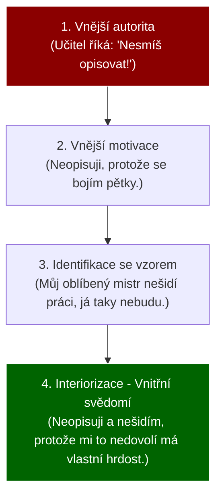

# PSY 8–10: Osobnost, temperament a charakter

> **TL;DR / Audio Shrnutí:**
> Každý žák je unikátní koktejl genů a výchovy. V psychologii tomu říkáme **osobnost** – jedinečný celek vlastností, který se formuje pod tlakem biologických vloh, prostředí a vlastního já (procesem interiorizace). S částí tohoto balíčku učitel nehne: **temperament** je nám vrozený (flegmatika nepředěláte na tryskomyš). S čím ale škola hýbat může a musí, je **charakter**. Zatímco temperament určuje, *jak rychle a silně* žák reaguje, charakter určuje, *zda to je morálně správné*. Učitel tak musí respektovat vrozené tempo žáka, ale neslevit z morálních požadavků na jeho charakter.

---

## Znění státnicových otázek
- **[DOB]** **PSY 8:** Popište faktory utvářející osobnost a jejich vztah. Charakterizujte proces interiorizace a objasněte jeho význam.
- **[DOB]** **PSY 9:** Pojednejte o složkách struktury osobnosti žáka SŠ a možnostech jejich ovlivňování ve výuce. Výhody a nevýhody typů temperamentu.
- **[DOB]** **PSY 10:** Objasněte pojem charakter, zařaďte ho do systému psychických jevů. Uveďte charakterovou typologii. Rozvoj morálních vlastností žáků SŠ.

---

## Klíčové pojmy

- **Osobnost** — jedinečný, organizovaný celek duševního života člověka (jeho procesy, stavy a vlastnosti). Není to jen to, jak se člověk chová, ale kým skutečně je.
- **Faktory utvářející osobnost** — Biologické (vlohy, dědičnost), Sociální prostředí (rodina, škola, kultura) a Sebeutváření (vlastní vůle a svědomí).
- **Interiorizace (Zvnitřnění)** — klíčový proces učení a výchovy. Představuje přechod vnějšího pravidla (např. "učitel říká, že nemám krást") do vnitřního přesvědčení ("nekradu, protože se to příčí mému svědomí").
- **Temperament** — vrozená, biologicky podmíněná složka osobnosti. Určuje *dynamiku* prožívání a chování (sílu a rychlost emocí). Nelze ho změnit, pouze mírně tlumit.
- **Charakter** — naučená, společensky podmíněná složka osobnosti. Vyjadřuje vztah člověka k sobě, k lidem a k práci (hodnoty, morálka). Dá se po celý život formovat.

---

## Detailní rozebrání problematiky

### PSY 8 a 9: Osobnost a její utváření

Osobnost středoškoláka (adolescenta) je ve fázi masivní přestavby. Strukturu osobnosti dělíme na několik složek, přičemž každou z nich může škola ovlivnit jinak:

1. **Výkonové vlastnosti (Schopnosti, dovednosti, vědomosti):** 
   - Škola je ovlivňuje *nejvíce*. (Matematika rozvíjí analytické schopnosti). Jsou postaveny na vrozených vlohách.
2. **Dynamické vlastnosti (Temperament):** 
   - Škola je neovlivní (změnit je nelze). Učitel je musí *respektovat*.
3. **Regulační vlastnosti (Vůle, sebekontrola):** 
   - Ovlivnitelné skrze nastavování hranic a povinností (viz PSY 7).
4. **Motivační vlastnosti a zaměření (Potřeby, zájmy, postoje, charakter):**
   - Škola je ovlivňuje, ale vyžaduje to osobní příklad a zážitek (interiorizaci).

**Faktory vývoje osobnosti:**
Dlouho se vedl spor, zda je důležitější genetika (Co je vrozené), nebo výchova (Co je naučené). Dnes platí interakční model: **Genetika určuje hranice (strop), ke kterým se člověk může dostat, ale pouze prostředí a výchova určí, zda se tam člověk skutečně dostane.**
- *Příklad:* Žák se narodí s obrovským hudebním talentem (biologický faktor). Pokud ale vyrůstá v rodině, kde není klavír ani rádio a rodiče o něj nejeví zájem (sociální faktor), stane se z něj průměrný dělník a talent zanikne.

---

### PSY 9: Temperament a jeho typy ve škole

Temperament určuje to, jak rychle se člověk nadchne a jak dlouho mu to vydrží. Klasická Hippokratova-Galénova typologie (čtyři šťávy) doplněná I. P. Pavlovem a C. G. Jungem (extrovert/introvert):

1. **Sangvinik (Krev / Stabilní Extrovert):**
   - *Výhody:* Rychle chápe, přizpůsobivý, veselý, výborný do týmu, nebojí se mluvit.
   - *Nevýhody:* Povrchní. Nadchne se pro projekt, ale nedotáhne ho do konce. 
   - *Přístup učitele:* Zaměstnat ho, dávat mu krátkodobé cíle, hlídat pečlivost.
2. **Cholerik (Žluč / Labilní Extrovert):**
   - *Výhody:* Silný, průbojný, má tah na branku, skvělý lídr v krizových situacích.
   - *Nevýhody:* Výbušný, agresivní, netrpělivý. Při neúspěchu vzteky rozbije pomůcku.
   - *Přístup učitele:* Udržet klid! Nekřičet na něj (to ho ještě víc vytočí). Dát mu zodpovědnost (např. za bezpečnost skupiny).
3. **Flegmatik (Hlen / Stabilní Introvert):**
   - *Výhody:* Klidný, vyrovnaný, vysoce spolehlivý, pečlivý. Zvládne stereotypní práci u pásu.
   - *Nevýhody:* Pomalý ("brzda" skupiny). Neumí se nadchnout.
   - *Přístup učitele:* Nikdy ho nepopohánět křikem. Dát mu na vše dostatek času (např. prodloužit čas na písemku).
4. **Melancholik (Černá žluč / Labilní Introvert):**
   - *Výhody:* Hluboké prožívání, velmi empatický, věrný, často umělecky nadaný.
   - *Nevýhody:* Plachý, urážlivý, z běžné kritiky u tabule se složí. Rychle se unaví.
   - *Přístup učitele:* Chválit! Kritikou ho naprosto zdrtíte. Dodávat mu sebevědomí.

*(Pozn.: Čistý typ se vyskytuje vzácně, většinou jde o mix, např. Sangvinik-Cholerik).*

---

### PSY 10: Charakter a Morální vývoj

Zatímco temperament je „barva auta“, charakter je „volant“. Říká člověku, jak se chovat správně. Zahrnuje vlastnosti jako pracovitost, poctivost, lenost, altruismus.

**Charakterová typologie (např. E. Fromm - orientace charakteru):**
- *Receptivní typ:* Čeká, že ho škola / stát zabezpečí. Pasivní.
- *Vykořisťovatelský typ:* Krade nápady druhých, šikanuje, nebere ohledy.
- *Tržní typ:* Vše dělá jen pro prospěch a prodej (udělám to, jen když mi za to něco dáte).
- **Produktivní typ:** Zralý charakter. Pracuje pro radost z tvoření a přispívá společnosti.

**Rozvoj morálních vlastností (Interiorizace):**
Morální vlastnosti (Charakter) nelze naučit přednáškou (žák neodchází z přednášky o poctivosti jako poctivý člověk). 
- *Interiorizace (zvnitřnění)* funguje přes **modelové učení** (Albert Bandura). Žák sleduje učitele: Pokud učitel nedrží slovo nebo lže o termínu písemky, žák si "zvnitřní" lež jako povolený nástroj.
- Nejúčinnější na SŠ je diskuze nad **morálními dilematy** (L. Kohlberg). "Kdo má dostat místo v záchranném člunu?" Žák si musí svůj postoj obhájit, čímž si ho interiorizuje (zaryje do svého svědomí).

---

## Vizualizace

### Eysenckův model Temperamentu (Stabilita vs. Extroverze)

```mermaid
quadrantChart
    title Osobnostní osy temperamentu
    x-axis Introvert --> Extrovert
    y-axis Labilita --> Stabilita
    quadrant-1 CHOLERIK (Výbušný lídr)
    quadrant-2 MELANCHOLIK (Citlivý detailista)
    quadrant-3 FLEGMATIK (Klidný dříč)
    quadrant-4 SANGVINIK (Veselý bavič)
    
    "Rychlé reakce, hněv" : [0.8, 0.8]
    "Smutek, plachost" : [0.2, 0.8]
    "Spolehlivost, pomalost" : [0.2, 0.2]
    "Nadšení, povrchnost" : [0.8, 0.2]
```

### Proces Interiorizace morálky (Zvenku dovnitř)



---

## Záludnosti a doplňující otázky

### ❓ 1. Dá se v dospělosti změnit temperament (například může se z introverta stát extrovert)?
**Odpověď:** Ne. Temperament je vázán na biologickou strukturu nervové soustavy (procesy vzruchu a útlumu v mozku). Z čistého melancholika nikdy neuděláte showmana sangvinika. Co se ale změnit dá, je chování (přes vůli a charakter). Melancholik se může "naučit" vystupovat sebevědomě na poradách, ale bude ho to stát obrovské množství energie a po poradě bude vyčerpaný (na rozdíl od sangvinika, kterého by porada dobila energií).

### ❓ 2. Co to znamená, když řekneme, že žák má "těžký temperament, ale výborný charakter"?
**Odpověď:** Znamená to, že se s ním těžce pracuje z hlediska dynamiky, ale morálně je spolehlivý. Například to může být silný Cholerik: Rychle vybuchne, když se mu ztupí vrták, křičí a je nepříjemný (temperament). Jakmile ale vychladne, přijde za mistrem, omluví se za svůj výstup a poškozený vrták ze svého kapesného zaplatí (čestný charakter).

### ❓ 3. Je inteligence spíše věcí dědičnosti (biologie), nebo výchovy (prostředí)?
**Odpověď:** Je to klasický průsečík (interakční model). U inteligence studie (např. na oddělených jednovaječných dvojčatech) ukazují, že dědičnost hraje zhruba 50–70% roli (určuje strop kapacity). Pokud ale geniální dítě vyroste izolované ve sklepě (nedostatek sociálních stimulů), jeho mozek neuronové spoje nevytvoří a bude mentálně retardované. Prostředí je klíč pro "odemčení" vrozeného potenciálu.
