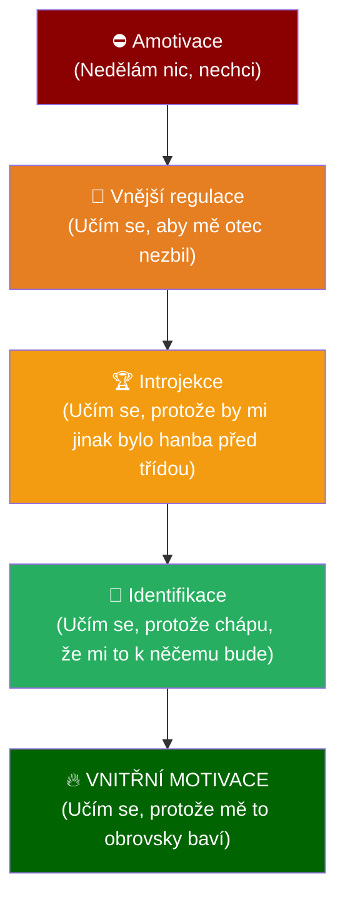
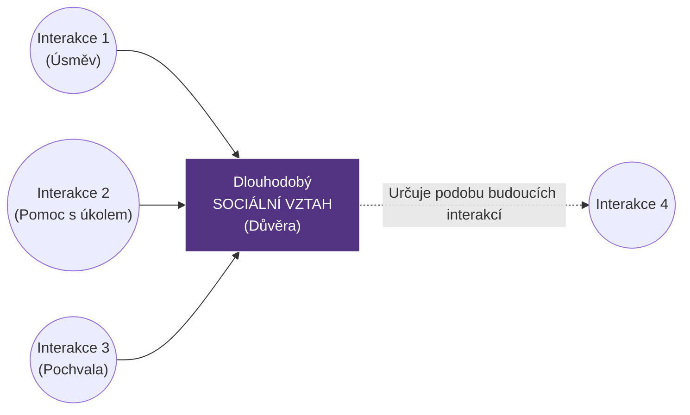

# PSY 11–12: Motivace a základy sociální psychologie

> **TL;DR / Audio Shrnutí:**
> Proč jeden žák dokáže sedět u programování tři hodiny bez přestávky a druhý nevydrží ani deset minut? Odpověď leží v **motivaci**. Je to psychologický motor. Učitel se často snaží žáky nastartovat pomocí **vnějších motivů** (známky, hrozba propadnutí, pochvala), ty ale fungují jen krátkodobě. Skutečným cílem vzdělávání je probudit **vnitřní motivaci** (chuť poznávat, radost z práce). Jakmile má žák vnitřní motiv, učí se sám. To se ale neodehrává ve vzduchoprázdnu – učíme se ve třídě plné lidí. Zde nastupuje **sociální psychologie**, která zkoumá, jak se lidé navzájem ovlivňují (**interakce**) a jaké mezi sebou budují **vztahy**. Zkušený učitel ví, že špatné vztahy ve třídě dokážou zabít i tu nejsilnější motivaci k učení.

---

## Znění státnicových otázek
- **[DOB]** **PSY 11:** Vysvětlete psychologický základ motivace, vnitřní a vnější motivy, jejich vzájemné souvislosti a využití ve výchovně-vzdělávacím procesu.
- **[DOB]** **PSY 12:** Popište význam sociální psychologie v systému psychologických věd, vysvětlete pojmy interakce a vztahy, uveďte jejich vzájemné souvislosti.

---

## Klíčové pojmy

- **Motivace** — psychický proces, který energetizuje a zaměřuje chování člověka k dosažení určitého cíle (pochází z lat. *movere* = hýbat se).
- **Motiv** — konkrétní pohnutka (důvod), proč člověk něco dělá (např. motiv žízně, motiv touhy po uznání).
- **Potřeba** — základní zdroj motivace; stav nedostatku nebo naopak nadbytku, který se člověk snaží odstranit (viz Maslowova pyramida).
- **Sociální psychologie** — disciplína, která studuje, jak je chování, prožívání a myšlení jednotlivce ovlivňováno skutečnou nebo představovanou přítomností ostatních lidí.
- **Sociální interakce** — vzájemné působení (akce a reakce) dvou a více lidí na sebe (např. učitel se zamračí -> žák přestane mluvit).
- **Sociální vztahy** — dlouhodobější, relativně stabilní vazby mezi lidmi, které vznikají opakováním interakcí (např. přátelství, nepřátelství, autorita).

---

## Detailní rozebrání problematiky

### PSY 11: Motivace (Vnitřní a vnější)

Učení bez motivace je jako jízda autem bez benzínu – můžete točit volantem jak chcete, ale nepojedete. Pokud je žák motivován, učení se zrychlí a zanechává trvalé stopy. 

**Vnitřní motivace (Motivace "Z vlastního popudu"):**
- Pramení ze samotného žáka a z činnosti samé. Žák činnost dělá, protože ho baví, zajímá ho, nebo v ní vidí hluboký smysl.
- *Příklady motivů:* Kognitivní potřeba (touha přijít věci na kloub), seberealizace, radost z vyřešeného problému.
- *Význam:* Je nejefektivnější. Žák poháněný vnitřní motivací pracuje, i když nad ním nikdo nestojí.

**Vnější motivace (Motivace "Cukr a Bič"):**
- Pramení z vnějšku. Žák nevykonává činnost pro ni samotnou, ale jako prostředek k dosažení něčeho jiného (nebo aby se něčemu vyhnul).
- *Příklady motivů:* Touha po odměně (jednička, peníze za brigádu), strach z trestu (pětka, hněv rodičů), prestiž před spolužáky.
- *Význam:* Funguje rychle, ale krátkodobě. Jakmile zmizí "bič" (učitel odejde ze třídy) nebo "cukr" (rodiče přestanou platit za jedničky), činnost okamžitě ustane.

**Vzájemné souvislosti a využití ve škole:**
Vnější a vnitřní motivace se nevylučují, v praxi se míchají. 
1. *Narušení vnitřní motivace vnějšími odměnami (Overjustification effect):* Pokud žák programuje doma zadarmo pro radost (vnitřní), a my mu za to začneme platit (vnější), jeho mozek si přeformátuje motiv: "Dělám to pro peníze." Když platit přestaneme, žák s programováním sekne.
2. *Umění učitele:* Na začátku 1. ročníku často musí použít vnější motivaci (nastavit jasná pravidla a hodnocení). Cílem je ale tyto vnější motivy pomalu **interiorizovat** (viz PSY 8) – přesvědčit žáka, že to dělá pro sebe, a probudit v něm vnitřní motor.

---

### PSY 12: Sociální psychologie (Interakce a vztahy)

Člověk je "Zóon politikon" (tvor společenský). Mimo společnost (např. vlčí děti) z něj nevyroste člověk. Sociální psychologie řeší prostor "MEZI" lidmi. Pro pedagogiku je stěžejní, protože škola je uměle vytvořený sociální skleník.

**Interakce (Akce a Reakce):**
Je to dynamický proces, který se odehrává teď a tady.
- *Verbální interakce:* Učitel položí otázku -> žák odpoví.
- *Neverbální interakce (často mocnější!):* Žák přijde k tabuli a učitel si zhluboka povzdychne. I když nic neřekl, interakce proběhla (žák dostal najevo, že učitel od něj nic nečeká).

**Sociální vztahy:**
Vznikají dlouhodobým opakováním interakcí. Pokud je každá interakce mezi mistrem a žákem konfliktní, vytvoří se napjatý, toxický vztah.
- *Symetrické vztahy:* Mezi rovnými (žák – žák).
- *Asymetrické vztahy:* Jeden má formální moc nad druhým (učitel – žák, mistr – učeň). Učitel nesmí asymetrii zneužívat k šikaně (autokratický styl), ale nesmí se jí ani vzdát (hrozí anarchie).

**Význam pro školu:**
Učitel není jen odborník na "obsah" (řezání kovů), je manažer sociálních interakcí. Pokud nezvládne řídit interakce ve třídě (dovolí posměšky), rozbijí se vztahy (klima), a v důsledku toho klesne motivace k učení na nulu.

---

## Vizualizace

### Hierarchie motivů (Posun od vnějšku dovnitř)

### Vztah mezi Interakcí a Vztahem

---

## Záludnosti a doplňující otázky

### ❓ 1. Je pětka do žákovské knížky dobrý motivační nástroj?
**Odpověď:** Pětka funguje jako vnější *negativní* motivátor (hrozba trestu). Může mít krátkodobý účinek (žák se ze strachu na příští hodinu nabifluje vzoreček). Psychologicky ale napáchá více škody než užitku. Časté pětky vyvolávají u žáka obranu (naučenou bezmocnost: "Jsem blbý, stejně to nemá cenu zkoušet"). Navíc, práce pod hrozbou trestu blokuje kreativní myšlení. Mnohem lepším nástrojem je formativní hodnocení (bodování postupu, ukázání cesty, jak to udělat lépe).

### ❓ 2. Může učitel být se svými žáky (např. ve 3. ročníku) "kamarád"?
**Odpověď:** Z hlediska sociální psychologie je vztah učitel-žák z podstaty věci *asymetrický* (učitel dává známky a rozhoduje o budoucnosti žáka). Skutečné přátelství (symetrický vztah) vyžaduje rovnocennost obou stran. Učitel by měl být k žákům přátelský, otevřený, spravedlivý a respektující (partnerský přístup), ale nesmí se s nimi stát "kamarádem", který ztratí profesionální odstup. Jakmile dojde na hodnocení, žáci zneužijí kamarádství k vynucování úlev a autorita se hroutí.

### ❓ 3. Co se děje s žákem, kterému rodiče platí 500 Kč za každou jedničku?
**Odpověď:** Dochází k vytěsnění vnitřní motivace tou vnější (tzv. korupce odměnou). Dítě přestane vidět smysl v samotném poznávání, jeho jediným cílem se stane zisk 500 Kč. To vede k podvádění (opisování taháků – účel světí prostředky). Navíc se zvyšuje jeho tolerance k odměně – za rok už mu 500 Kč stačit nebude a bude chtít 1000 Kč. Získání jedničky pro vlastní dobrý pocit pro něj ztratí jakoukoli hodnotu.
