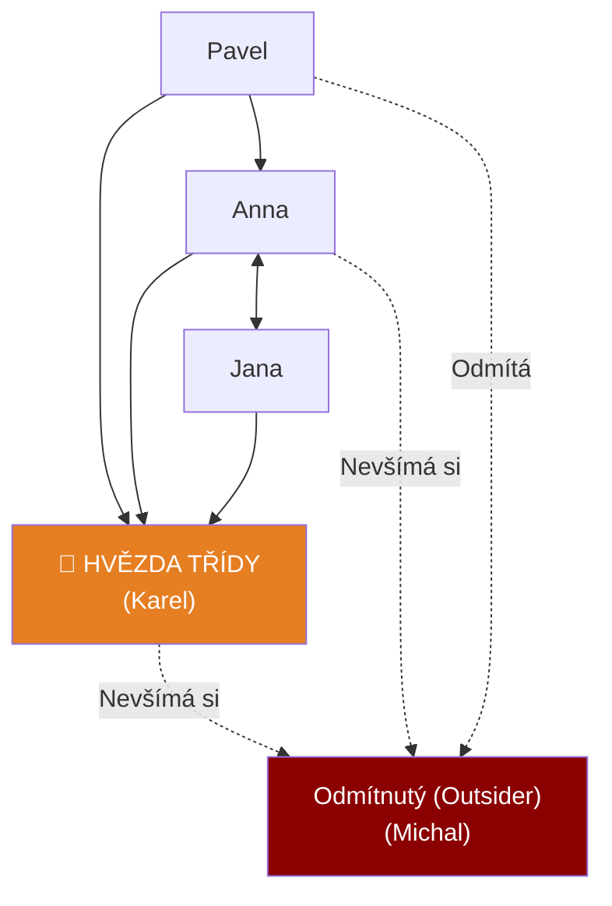

# PSY 13–14: Sociální skupina a Komunikace

> **TL;DR / Audio Shrnutí:**
> Školní třída není jen hromada náhodných lidí, je to **malá sociální skupina**. Vládne v ní vlastní hierarchie, nepsaná pravidla a role (od vůdce až po otloukánka). Učitel nesmí třídu brát jako jednolitou hmotu. Musí její klima neustále mapovat (sociometrií) a formovat. Hlavním nástrojem učitele k formování třídy je **komunikace**. Komunikace však není jen o tom, co učitel říká (*verbální*), ale hlavně o tom, jak se u toho tváří a jaký má postoj (*neverbální a paralingvistická*). Pokud žák cítí z komunikace ironii, hrozbu nebo dvojnou vazbu (učitel říká "neboj se zeptat", ale pak po otázce obrací oči v sloup), vznikají **bariéry v komunikaci** a proces učení i výchovy se hroutí.

---

## Znění státnicových otázek
- **PSY 13:** Vysvětlete pojem sociální skupina, její charakteristiky, třídění, charakterizujte školní třídu jako sociální skupinu, vysvětlete možnosti pedagoga při poznávání a formování třídní skupiny.
- **PSY 14:** Uveďte hlavní zásady komunikace učitel-žák během výchovně-vzdělávacího procesu, popište význam jednotlivých složek komunikačního procesu, naznačte možné bariéry v komunikaci a možnosti jejich odstranění.

---

## Klíčové pojmy

- **Sociální skupina** — sdružení dvou a více lidí, které spojují společné cíle, normy (pravidla), vzájemná interakce a pocit sounáležitosti (my-vědomí). 
- **Školní třída** — specifická, formálně vytvořená malá sociální skupina.
- **Sociometrie** — výzkumná metoda (autor J. L. Moreno), která zjišťuje sympatie, antipatie a pozice členů uvnitř sociální skupiny (kdo s kým chce sedět).
- **Komunikace** — proces předávání a přijímání informací, postojů a emocí mezi lidmi (komunikátor -> sdělení -> komunikant).
- **Bariéry v komunikaci (Šumy)** — překážky, které způsobují, že příjemce zprávu nepochopí tak, jak ji odesílatel myslel (fyzické i psychologické).
- **Dvojná vazba (Double bind)** — toxický jev, kdy slova říkají něco jiného než tělo nebo tón hlasu.

---

## Detailní rozebrání problematiky

### PSY 13: Sociální skupina a Školní třída

Lidé se od přírody sdružují. Dav na koncertě ale není sociální skupina – nemají společný cíl, ani hierarchii (je to jen agregát).

**Charakteristiky sociální skupiny:**
1. Společný cíl (ve třídě to je dostudovat).
2. Společné normy a pravidla (nežaluje se, o přestávce se běhá).
3. Vzájemné vztahy a struktura (vůdce, následovníci, outsideři).
4. Vědomí MY (Naše třída vs. "Tamti C-čkaři").

**Třídění skupin:**
- *Podle velikosti:* Malé (do cca 30 lidí - všichni se znají jménem, např. třída) / Velké (škola, národ).
- *Podle vzniku:* Formální (vytvořeny uměle zvenčí - např. školní třída dekretem ředitele) / Neformální (vznikají spontánně na základě sympatií - např. parta kamarádů z internátu).
- *Podle intimity:* Primární (rodina - silné citové vazby) / Sekundární (pracovní tým).

**Školní třída jako sociální skupina:**
Je to paradoxní skupina. Vznikne **formálně** (rozhodnutím ředitele), ale okamžitě se v ní začnou tvořit **neformální** vztahy a kliky.

**Možnosti pedagoga (Formování a Poznáváni):**
- *Poznávání:* Učitel musí vědět, jaké je v třídě podhoubí. Používá pozorování a **Sociometrii** (Sociometrický dotazník: "Napiš 3 lidi, se kterými bys chtěl jet na vodu"). Výsledkem je *sociogram* – graf ukazuje hvězdu třídy (všichni s ní chtějí být) i černé ovce (nikdo je nechce).
- *Formování:* Pokud učitel vidí vyčleněného žáka, musí tvořit projektové skupiny tak, aby tohoto žáka zapojil a naučil ostatní s ním pracovat. Nesmí nechat vytváření skupin na žácích ("Rozdělte se sami"), protože pak outsideři vždy zbydou.

---

### PSY 14: Komunikace (Učitel - Žák)

Říká se, že *nelze nekomunikovat*. I když učitel mlčí a založí si ruce, vysílá silnou zprávu.

**Složky komunikačního procesu:**
1. **Verbální (Slova):** Obsah toho, co říkáme. Kupodivu tvoří jen cca 10 % dopadu na posluchače!
2. **Neverbální (Tělo):** Mimika (obličej), haptika (dotek), proxemika (vzdálenost), posturologie (postoj těla). Tvoří až 50 % dopadu. Pokud učitel říká "Mám radost" se zamračeným obličejem, žák uvěří obličeji.
3. **Paralingvistická (Hlas):** Intonace, síla, frázování, pauzy. Zvýšení hlasu, ticho.

**Bariéry v komunikaci a jejich odstranění:**
- *Fyzické bariéry:* Hluk traktoru venku, velká vzdálenost v tělocvičně. (Odstranění: Změna polohy, zavření oken).
- *Sémantické bariéry:* Učitel používá příliš složitá, odborná nebo cizí slova, kterým učeň 1. ročníku nerozumí (odborný žargon). (Odstranění: Učit v jazyce, kterému cílová skupina rozumí).
- *Psychologické bariéry:* Strach, úzkost, antipatie. Pokud má žák strach z výsměchu, nebude komunikovat, i když látce nerozumí.
- *Zkreslení informací:* Dvojná vazba, sarkasmus. U dětí a mládeže sarkasmus často nefunguje, pochopí ho doslova a cítí se zrazeny.

**Hlavní zásady komunikace pro učitele:**
- *Aktivní naslouchání:* Pokud žák mluví, učitel nepřerušuje, nedělá u toho jinou práci (např. nekouká do mobilu).
- *Asertivita místo agrese:* Pokud učitele naštve chování třídy, nepoužívá „Ty-výroky“ (*"Vy jste nejhorší banda idiotů!"* -> vyvolá obranu), ale používá „Já-výroky“ (*"Zlobí mě, když nenasloucháte mým instrukcím k bezpečnosti."*).

---

## Vizualizace

### Sociogram (Výsledek sociometrie)



### Přenos informací a Vznik Bariér (Šumů)

```mermaid
graph LR
    O["UČITEL<br>(Vysílač)"] -->|Zakódování do slov| K["Komunikační kanál<br>+ Neverbální projev"]
    
    subgraph BAR [BARIÉRY ŠUMY]
        S1["Cizí slova (Žargon)"]
        S2["Hluk z ulice"]
        S3["Strach žáka"]
    end
    
    K -.-> S1
    K -.-> S2
    K -.-> S3
    
    K -->|Dekódování mozkem| P["ŽÁK<br>(Příjemce)"]
    
    P -.->|Zpětná vazba (Kývnutí)| O
    
    style O fill:#2c3e50,color:#fff
    style P fill:#006400,color:#fff
    style BAR fill:#e94560,color:#fff
```

---

## Záludnosti a doplňující otázky

### ❓ 1. Proč je ve škole tak nebezpečný Sarkasmus a Ironie ze strany učitele?
**Odpověď:** Sarkasmus je formou dvojné vazby. Učitel řekne "Teda ty jsi génius" žákovi, který právě řekl strašnou hloupost. Žák, který nemá dostatečně zralé abstraktní myšlení a EQ, zpracovává slova, ale cítí agresivní tón, což v něm vyvolá obrovský zmatek, ponížení a nedůvěru v učitele. Sarkasmus rozbíjí psychologické bezpečí, žáci pak raději mlčí, než aby riskovali další posměch. Komunikace ve třídě "umře".

### ❓ 2. Co je to tzv. "Haló efekt" při poznávání sociální skupiny učitelem?
**Odpověď:** Haló efekt je obrovská a velmi častá chyba ve vnímání. Znamená to, že se učitel nechá oslnit jedním výrazným rysem žáka a podle něj posuzuje i vše ostatní. Příklad: Žák má skvělé, čisté a nažehlené oblečení a slušně pozdraví (silný pozitivní první dojem). Učitel na základě toho předpokládá (chybně), že žák je pilný, chytrý a má perfektní zápisky, přestože reálně může být flákač. Učitel se pak k němu chová mírněji než k otrhanému, ale ve skutečnosti pilnému žákovi.

### ❓ 3. Má učitel aktivně zasahovat do neformální struktury třídy (např. rozbít silnou kamarádskou kliku), pokud narušují výuku?
**Odpověď:** Ano, musí. Pokud ve třídě vznikne neformální klika (např. parta 4 drsných hochů vzadu), kteří se pasují na "vůdce" třídy a tyranizují zbytek svými poznámkami, učitel na to musí reagovat. Nesmí to ale dělat agresi z pozice moci (to kliku jen víc semkne proti učiteli). Využívá prostorové uspořádání (rozsadí je), zadává úkoly tak, aby členové kliky museli pracovat v jiných skupinách se zbytkem třídy, čímž neformální zdi pomalu obrušuje.
