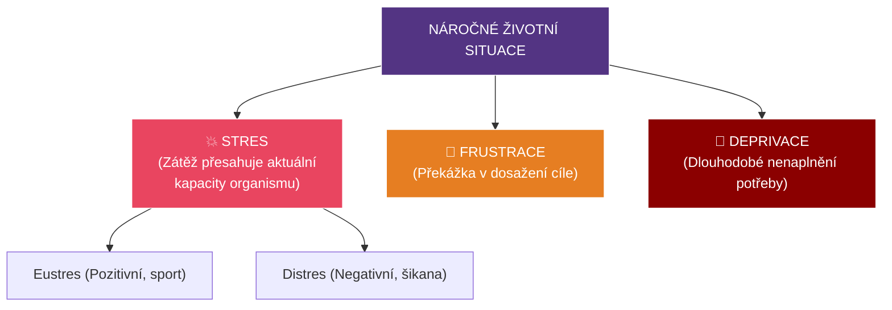
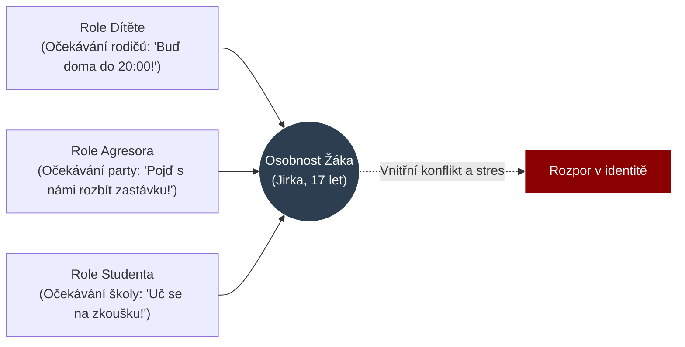

# PSY 15–16: Náročné životní situace, Stres a Sociální role

> **TL;DR / Audio Shrnutí:**
> Život žáka (i učitele) není jen klidné plutí po rybníku, občas přijde bouře. Těmto bouřím říkáme **náročné životní situace**. Tou neznámější je **stres**. Může to být krátkodobý stresor (přepadová písemka z fyziky) nebo chronický (rozvod rodičů, šikana). Pokud je stresu moc (distres), tělo začne selhávat a mozek se odmítá učit. Žáci (i dospělí) reagují na náročné situace různě – od agresivního útoku až po útěk do nemoci. Do toho všeho vstupují **sociální role**. Učitel není jen "stroj na výklad", hraje roli experta, soudce, někdy i rodiče. Stejně tak žák. Pokud se role "frajer třídy" dostane do střetu s rolí "poslušný student", vzniká vnitřní konflikt rolí.

---

## Znění státnicových otázek
- **PSY 15:** Charakterizujte druhy náročných situací, význam v životě člověka, popište metody zvládání. Objasněte stres a zaměřte se na možnosti minimalizace stresorů ve vyučování.
- **PSY 16:** Vysvětlete pojmy sociální status, sociální pozice, sociální role, individuální systém rolí. Popište role učitele a žáka ve výchovně-vzdělávacím procesu.

---

## Klíčové pojmy

- **Náročná životní situace** — stav, kdy překážky stojí v cestě k dosažení důležitého cíle, nebo situace hrozí snížením hodnoty člověka.
- **Stres** — stav nadměrné psychické a tělesné zátěže (odpověď organismu na stresor).
- **Eustres vs. Distres** — Eustres je pozitivní, motivující (tréma před zápasem). Distres je negativní, destruktivní (šikana, neřešitelné dluhy).
- **Frustrace** — pocit zklamání ze zmaření cíle (Učil jsem se na písemku do 3 ráno, a stejně mám pětku).
- **Deprivace** — dlouhodobé neuspokojování základních potřeb (Citová deprivace u dětí z dětských domovů).
- **Sociální status** — trvalejší hodnota a úcta, kterou člověku přisuzuje společnost (Status lékaře vs. status popeláře).
- **Sociální role** — očekávaný způsob chování vázaný na daný status (Od lékaře se *očekává* serióznost a mlčenlivost).

---

## Detailní rozebrání problematiky

### PSY 15: Náročné situace a Stres

Náročné situace nejsou jen zlo. Mají i pozitivní význam (resilience) – jako sval roste tím, že ho namáháme činkou, osobnost roste zvládáním přiměřených krizí. Pokud ale zátěž přesáhne kapacity jedince, hroutí se.

**Metody zvládání náročných situací (Copingové strategie):**
Lidé často používají podvědomé obranné mechanismy k ochraně vlastního ega:
1. *Agrese:* Přímá (křik, rozbití stolu), nebo nepřímá / posunutá (Naštve mě šéf -> kopnu do psa -> pes kousne dítě).
2. *Únik / Útěk:* Reálný útěk (záškoláctví před těžkou písemkou), nebo fantazijní (útěk k alkoholu, drogám, počítačovým hrám).
3. *Racionalizace:* Rozumová omluva selhání (Dostal jsem z přijímaček pětku, ale ta škola stejně za nic nestála a učitel na mě zasedl).
4. *Regrese:* Návrat na nižší vývojový stupeň (SŠ student se při těžkém konfliktu rozbrečí jako malé dítě).

**Stres a stresory ve škole:**
*Stresor* je spouštěč. Ve škole to jsou: zkoušení u tabule, šikana, hluk, nespravedlnost učitele, strach ze selhání. 
Při stresu se spouští starý biologický program **Bojuj, nebo Uteč (Fight or Flight)**: krev teče do svalů, srdce buší, mozek se přepne na pudové řešení, *kreativní abstraktní myšlení se vypne*.
- **Role učitele (Minimalizace stresorů):** Učitel nesmí používat distres jako nástroj výuky (neříkat věci jako: "Všichni propadnete, u maturity vás zničím"). Musí jasně předem sdělovat pravidla klasifikace (odstranění nejistoty) a zkoušení u tabule nahradit méně stresujícími formami (formativní hodnocení v lavici).

---

### PSY 16: Sociální status, pozice a ROLE

Sociální psychologie se na svět dívá jako na divadlo, kde každý hraje své předepsané role.

1. **Sociální pozice:** Místo, které člověk zaujímá ve skupině. (Např. pozice třídního předsedy).
2. **Sociální status:** Míra prestiže spojená s pozicí. Učitel by měl mít vysoký status odvozený z jeho odbornosti.
3. **Sociální role:** Scénář chování. 

**Individuální systém rolí (Konflikt rolí):**
Každý člověk má spoustu rolí. Žák je zároveň: *Synem* doma, *studentem* ve škole, *členem fotbalového týmu* odpoledne, a *kolemjdoucím* na ulici.
- *Konflikt rolí (Intrarolový):* Matka od žáka očekává, že bude odmlouvat, učitel očekává, že bude mlčet, a kamarádi očekávají, že udělá průšvih. Žák neví, jak se má chovat.

**Role Učitele ve vzdělávacím procesu:**
Učitel hraje mnoho dílčích rolí najednou a musí mezi nimi plynule přepínat:
- *Role experta / informátora:* Předává znalosti oboru.
- *Role facilitátora:* Provází procesem učení, radí a pomáhá.
- *Role hodnotitele (soudce):* Musí klasifikovat (zde nejčastěji vzniká konflikt s žákem).
- *Role projektanta:* Plánuje vyučování.
- *Role vzoru (modelu):* Sám žije to, co káže (viz interiorizace morálky).

**Role Žáka:**
Očekává se od něj spolupráce, plnění zadaných úkolů a podřízení se autoritě. Na střední škole se ale žák snaží získat roli *dospělého*, což naráží na omezující požadavky školy (vzniká tzv. revolta adolescentů).

---

## Vizualizace

### Klasifikace zátěžových (náročných) situací

### Konflikt rolí v osobnosti žáka SŠ

---

## Záludnosti a doplňující otázky

### ❓ 1. Dá se ze školy odstranit stres úplně? A bylo by to dobře?
**Odpověď:** Nedá a nebylo by to dobře. Škola musí žáka připravit na reálný život (a ten je plný stresu). Pokud by škola odstranila všechny nároky a žili bychom v inkubátoru (stoprocentní absence stresu), mluvíme o nudě a stagnaci, osobnost se nerozvíjí (nebuduje se rezilience). Cílem učitele není odstranit *Eustres* (např. zdravé napětí před prezentací projektu, které žáka vybičuje k výkonu), ale nesmí dopustit chronický *Distres* (pocit ohrožení), který tělo a mozek paralyzuje.

### ❓ 2. Co to znamená, když se řekne, že žák spadl do "Role třídního šaška"?
**Odpověď:** Jde o neformální sociální roli uvnitř skupiny. Často do ní spadnou žáci, kteří nemohou vyniknout ve výkonových rolích (mají např. dyslexii a zhoršený prospěch). Aby si ve třídě zajistili nějaký sociální status a pozornost, vezmou na sebe roli baviče / rebela, i za cenu poznámek a trestů od učitele. Je to vlastně copingová strategie chránící jejich zraněné ego. Pokud je učitel za tuto roli pouze trestá (dává jim další pětky), problém se zhorší. Musí jim umožnit vyniknout legální formou.

### ❓ 3. Proč se dnes tolik mluví o vyhoření (burn-out) u učitelů? S čím to z hlediska psychologie souvisí?
**Odpověď:** Souvisí to právě s náročnými situacemi, dlouhodobým distresem a *konfliktem rolí*. Na učitele jsou dnes kladeny naprosto protichůdné rolové požadavky. Rodiče očekávají volnou a hravou výchovu, ředitel vyžaduje tvrdé tabulkové výsledky u maturit, žáci chtějí zábavu. Učitel se snaží naplnit očekávání všech těchto rolí současně, což není fyzicky ani psychicky možné. Tento dlouhodobý "intrarolový konflikt" končí totálním vyčerpáním a emočním otupěním – vyhořením.
