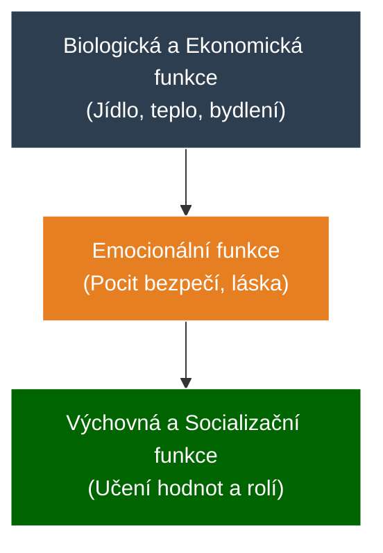

# PSY 17–18: Rodina jako základní kámen a Dysfunkce

> **TL;DR / Audio Shrnutí:**
> Dítě se nerodí s hotovou osobností. To, kým se stane, určuje ze všeho nejvíc **rodina**. Jde o první (primární) sociální skupinu, která má člověka naučit žít ve společnosti (socializace). Její úkolem je zajistit nejen jídlo (biologická funkce), ale i lásku a bezpečí (emocionální funkce). Co se stane, když rodina selže? Vzniká **dysfunkční rodina**. Pokud doma vládne alkohol, nezájem nebo naopak chorobná opičí láska, dítě si tyto deformace nese rovnou do školní lavice. Učitel takového žáka často považuje za nevychovaného grázla nebo lenocha, ale ve skutečnosti se dívá na oběť. Úkolem učitele není rodinu „opravit“ (to často ani nejde), ale musí s žákem pracovat tak, aby mu škola dodala to jediné bezpečí, které v životě má.

---

## Znění státnicových otázek
- **[DOB]** **PSY 17:** Popište rodinu jako primární sociální skupinu a její význam pro socializaci jedince, charakterizujte základní funkce rodiny.
- **[DOB]** **PSY 18:** Charakterizujte dysfunkční rodinu, uveďte některé typy dysfunkčních rodin a popište, jak se dysfunkce projeví na rozvoji dítěte, charakterizujte přístupy učitele k žákům z dysfunkčních rodin.

---

## Klíčové pojmy

- **Rodina** — základní buňka společnosti, primární a intimní sociální skupina spojená pokrevními, manželskými nebo adoptivními svazky.
- **Socializace** — celoživotní proces, při kterém se jedinec začleňuje do společnosti. Učí se její jazyk, normy, hodnoty a sociální role. Nejsilněji probíhá v rodině.
- **Funkční rodina** — plní všechny své funkce a vytváří bezpečné prostředí pro rozvoj dítěte.
- **Dysfunkční rodina** — rodina, ve které dlouhodobě dochází k patologickým jevům (konflikty, zanedbávání, týrání), které vážně narušují vývoj dítěte.
- **Deprivace v rodině** — stav, kdy rodina nezajišťuje základní potřeby (často emocionální - dítě má sice co jíst, ale nikdo ho nepohladí).

---

## Detailní rozebrání problematiky

### PSY 17: Funkce rodiny a Socializace

Rodina je "skleník", ve kterém ze semínka (biologického tvora) vyrůstá člověk (sociální tvor). 

**Základní funkce rodiny:**
1. **Biologicko-reprodukční:** Zachování lidského rodu a uspokojení základních fyziologických potřeb (jídlo, teplo, spánek).
2. **Ekonomická (materiální):** Rodina jako hospodářská jednotka. Zajištění peněz, bydlení, ošacení a financování vzdělání dětí.
3. **Emocionální:** Klíčová funkce pro psychologii! Rodina je jediným místem absolutního přijetí. (V práci jste přijímáni, jen když podáváte výkon. Matka vás miluje, i když máte pětku z matematiky).
4. **Výchovná a Socializační:** Předávání vzorců chování. Dítě se učí nápodobou (např. syn vidí, jak otec řeší konflikty křikem, a "zvnitřní" si to jako normu pro řešení problémů ve škole).

*Při socializaci se dítě učí roli muže/ženy, učí se základům komunikace a nastavování hranic.*

---

### PSY 18: Dysfunkční rodina a přístup učitele

Pokud jedna nebo více funkcí rodiny dlouhodobě selhává, mluvíme o poruše rodiny. 

**Typy rodin podle funkčnosti:**
- *Funkční:* Plní vše, zvládá krize.
- *Problémová:* Občasné krize (hádky o peníze, mírné konflikty), ale rodina se snaží situaci řešit a vývoj dítěte není fatálně ohrožen.
- *Dysfunkční:* Hluboké narušení. Rodina sama situaci nezvládá a potřebuje zásah zvenčí (OSPOD, psycholog). Dítě je vážně ohroženo.
- *A-funkční:* Úplný rozpad (kriminalita, těžké závislosti). Děti jsou často odebírány.

**Příklady dysfunkčního prostředí a dopad na žáka:**
1. **Zanedbávající rodina (Citová deprivace):** Rodiče (často workoholici nebo alkoholici) nemají na dítě čas. 
   - *Projev u žáka:* Žák je uzavřený, apatický, nebo naopak zlobí, jen aby upoutal pozornost (i negativní pozornost učitele je pro něj lepší než prázdnota doma).
2. **Hyperprotektivní rodina ("Opičí láska"):** Rodiče dělají vše za dítě, hlídají každý jeho krok (helikoptéroví rodiče).
   - *Projev u žáka:* Žák je na SŠ nesamostatný, neschopný řešit vlastní problémy. Při první horší známce se psychicky hroutí nebo přijde matka "udělat do školy pořádek".
3. **Rodina s domácím násilím / alkoholismem:**
   - *Projev u žáka:* Žák žije v permanentním stresu (spuštěný režim Fight or Flight). Má výpadky paměti, je agresivní ke slabším (přenáší model z domova), objevuje se záškoláctví a poruchy spánku.

**Přístup učitele k žákům z dysfunkčních rodin:**
- Učitel **není psychoterapeut** a nesmí si hrát na spasitele rodiny.
- **Nepedagogizovat sociální problém:** Pokud žák spí na lavici, protože rodiče doma do 3 ráno pili, učitel to nevyřeší tím, že žákovi dá pětku z aktivity nebo poznámku.
- **Konzultace s odborníky:** Učitel musí okamžitě informovat školního metodika prevence nebo výchovného poradce (a případně kontaktovat OSPOD).
- **Vytvoření bezpečného přístavu:** Škola musí pro žáka zůstat místem, kde platí jasná, spravedlivá a neměnná pravidla (to mu dává pocit jistoty, který doma nemá). Učitel dává žákovi najevo osobní zájem ("Jsem tu, když budeš potřebovat mluvit").

---

## Vizualizace

### Hierarchie funkcí rodiny (Podmíněnost)

### Přenos dysfunkce (Cyklus násilí / zanedbávání)

---

## Záludnosti a doplňující otázky

### ❓ 1. Dá se ze vzhledu žáka na střední škole poznat, že pochází z dysfunkční rodiny?
**Odpověď:** Může to být vodítko, ale je to velmi zrádné. Pokud chodí žák zanedbaný (špinavé oblečení, hlad), je deprivace zjevná (a-funkční sociálně slabá rodina). Obrovské množství dysfunkčních rodin se ale skrývá za "krásnou fasádou" (ekonomická funkce funguje na 100 %). Otec je manažer, matka právnička, žák přijede do školy ve drahém autě a má značkové oblečení, ale citová funkce je na nule (rodiče na něj nemají vůbec čas, doma vládne chlad). Zde učitel dysfunkci pozná až na základě chování žáka (apatie, deprese, sebepoškozování, drogy), nikoliv podle zevnějšku.

### ❓ 2. Co má učitel dělat, když zjistí, že je dítě doma obětí tvrdého fyzického týrání? Může si s otcem promluvit na třídních schůzkách?
**Odpověď:** Rozhodně NE! Pokud by učitel konfrontoval násilnického rodiče na schůzkách ("Vím, že ho bijete"), rodič to před učitelem popře a doma dítěti ublíží ještě více za to, že "vynáší z domu". V případě podezření na trestný čin (týrání) podléhá učitel ohlašovací povinnosti. Musí to řešit přes ředitele školy a orgány sociálně-právní ochrany dětí (OSPOD) či policii, kteří do rodiny vstoupí s právní mocí a provedou šetření.

### ❓ 3. Proč jsou pro socializaci dětí v rodině tak důležití prarodiče, když ekonomicky už rodinu netáhnou?
**Odpověď:** Prarodiče zastávají kritickou "kompenzační" emocionální funkci. Zatímco rodiče jsou často pod obrovským tlakem ekonomickým (musí splácet hypotéku a budovat kariéru) a nemají na dítě trpělivost, prarodiče už tento stres nemají. Dětem předávají tzv. "bezpodmínečnou lásku" (nemusí z nich vychovat úspěšné doktory, jen je mají rádi). Navíc předávají rodinnou historii a mezigenerační hodnoty, což dává dítěti hluboký pocit zakořenění.
