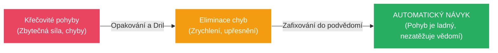
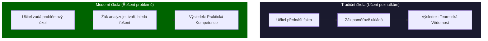

# PSY 19–22: Pedagogická psychologie, Učení a Výchova

> **TL;DR / Audio Shrnutí:**
> Proč se učíme matematiku z učebnice, ale na kole se musíme učit jezdit tím, že z něj párkrát spadneme? Zkoumáním toho, jak se lidé učí a jak je u toho formuje výchova, se zabývá **Pedagogická psychologie**. Ta nám říká, že **učení** není jen jedno (memorování básničky = *učení poznatkům*), ale má různé druhy. V odborném výcviku dominuje *senzomotorické učení* (propojení smyslů a svalů). Dnes se navíc odkláníme od pouhého biflování poznatků a jdeme k výuce **kompetencí** a řešení problémů. To vše se neodehrává ve vzduchoprázdnu, ale v rámci **procesu výchovy**, kde učitel nesmí zapomínat, že dnes zažíváme fenomén *obrácené socializace* (děti učí dospělé, např. s technologiemi). A pokud žák zlobí? Lze aplikovat techniky modifikace chování (odměny a tresty založené na behaviorismu).

---

## Znění státnicových otázek
- **[DOB]** **PSY 19:** Předmět pedagogické psychologie, pojmy: vývoj, výchova, učení, vyučování. Trendy: od osobnosti k týmu, od znalostí ke kompetencím.
- **[DOB]** **PSY 20:** Druhy učení se zaměřením na učení senzomotorické. Změny v jeho průběhu a co je jeho výsledkem.
- **[DOB]** **PSY 21:** Srovnejte učení se poznatkům s učením se řešení problému. Které psychické jevy se na nich podílejí, pojem učení ve spirále.
- **[DOB]** **PSY 22:** Proces výchovy, prostředky a metody. Obrácená socializace. Techniky modifikace chování.

---

## Klíčové pojmy

- **Pedagogická psychologie** — aplikovaná disciplína zkoumající psychologické zákonitosti výchovy a vzdělávání (co se děje v hlavě žáka, když ho učitel učí).
- **Učení** — v širším slova smyslu jakákoliv změna chování na základě zkušenosti.
- **Vyučování** — záměrné, organizované řízení učení žáků (dělá to škola).
- **Výchova** — proces záměrného formování osobnosti (morálka, postoje, charakter).
- **Senzomotorické učení** — osvojování manuálních dovedností (propojení senzorů /zraku/ a motoriky /svalů/ – typické pro odborný výcvik).
- **Obrácená socializace** — fenomén moderní doby, kdy mladší generace učí starší (např. vnímání IT technologií, sociálních sítí).
- **Modifikace chování** — aplikace behaviorálních principů k odstranění nežádoucího chování žáka (založeno na podmiňování: odměna a trest).

---

## Detailní rozebrání problematiky

### PSY 19: Předmět ped. psychologie a Trendy

**Základní pojmy v souvislostech:**
Aby proběhl zdravý *vývoj* žáka, musí probíhat *výchova* a zprostředkovaně přes školu *vyučování*. A aby mělo vyučování smysl, musí dojít k procesu *učení* (to dělá žák sám, nikdo se za něj nenaučí).

**Moderní trendy ve vzdělávání (Přesun paradigmatu):**
- *Od znalostí ke KOMPETENCÍM:* V minulosti byla škola instituce na předávání informací (encyklopedismus). Dnes máte všechny znalosti světa v kapse na smartphonu. Proto se cení *kompetence* = schopnost vyhledat, vyhodnotit a aplikovat informaci k řešení problému. (Ne biflovat letopočty, ale chápat souvislosti).
- *Od individualismu k TÝMU:* Moderní průmysl nevyžaduje osamělé vlky. Projekty tvoří týmy. Z toho vychází kooperativní výuka – učit se komunikovat a dělit si role.

---

### PSY 20 a 21: Druhy Učení

Učení není jen "čtení z knížky". Rozdělujeme ho podle toho, co se učíme:

**1. Senzomotorické učení (Práce rukama - Odborný výcvik):**
- Propojení analyzátorů (zrak, sluch) se svaly. Učíme se psát na klávesnici, jezdit na kole, svařovat.
- *Změny v průběhu:*
  1. *Fáze seznámení:* Žák svírá nářadí křečovitě, dělá zbytečné a hrubé pohyby, zapojuje svaly, které nepotřebuje (rychlá únava). Má plnou *úmyslnou pozornost* na každý centimetr pohybu.
  2. *Fáze procvičování (Dril):* Pohyb se čistí, zbytečné pohyby mizí, rychlost roste, zmetkovitost klesá.
  3. *Fáze automatizace:* Výsledkem je **Návyk / Dovednost**. Vědomá kontrola přechází do podvědomí. Žák u práce mluví a "ruce jedou samy".

**2. Učení se poznatkům (Verbo-kognitivní):**
- Biflování. Učení se vzorečků, slovíček, dějepisu.
- *Zapojené jevy:* Dominuje zde **Paměť**. Nejnižší stupeň myšlení.
- *Výsledek:* Vědomost.

**3. Učení se řešení problémů:**
- Nejvyšší forma učení. Učitel nedá žákovi hotovou odpověď ("Tady je vzorec"), ale zadá mu problém ("Jak spočítáme tlak v této trubce?"). Žák musí hledat cestu sám (heuristická metoda).
- *Zapojené jevy:* Dominuje **Abstraktní a logické Myšlení**, dedukce, tvořivost (kreativita).
- *Výsledek:* Intelektová dovednost, schopnost improvizovat.

**Učení ve spirále (Bruner):**
- Informace neprobíráme jen jednou "a dost" (linárně). K základnímu tématu se vracíme v dalších ročnících, ale na stále hlubší a složitější úrovni. (V 1. třídě učíme "Sluníčko svítí", ve fyzice na SŠ učíme termonukleární fúzi vodíku).

---

### PSY 22: Výchova, Modifikace chování a Obrácená socializace

Pokud je učení o "intelektu", výchova je o "morálce a charakteru". 

**Výchovné prostředky a metody:**
1. *Metoda přesvědčování:* Racionální argumentace (Proč bys neměl brát drogy).
2. *Metoda příkladu:* Velmi silná! Učitel se chová jako vzor.
3. *Metoda cvičení a návyku:* Nácvik zvyků (zdravení, mytí rukou, úklid pracovního místa).

**Obrácená (Prefigurativní) socializace:**
Klasicky starší generace učila mladší. Dnes, díky exponenciálnímu technologickému boomu, žijeme ve světě, kde **děti učí rodiče**. Žák SŠ musí učit svého padesátiletého mistra, jak pracovat s novým softwarovým aktualizátorem nebo jak funguje TikTok. 
- *Důsledky:* Narušuje to tradiční pojetí přirozené autority (učitel najednou neví všechno). Učitel s tím nesmí bojovat z pozice ega, ale musí se stát facilitátorem a s žáky spolupracovat.

**Techniky modifikace chování:**
Vychází z behaviorismu (Skinnerovo operantní podmiňování). Cílem je změnit problémové chování žáka pomocí vnějších stimulů (Nečekáme, až to žák pochopí, prostě to změníme).
- *Pozitivní posílení:* Žák nečekaně donese úkol -> učitel ho masivně pochválí před třídou (odměna). Pravděpodobnost, že žák přinese úkol i příště, se zvyšuje.
- *Vyhasínání (Extinkce):* Žák schválně vyrušuje vtipy, aby získal pozornost třídy. Učitel to absolutně ignoruje a zadá hned další práci. Pokud chování nepřináší žádný zisk (pozornost), postupně *vyhasne*.

---

## Vizualizace

### Křivka Senzomotorického učení (Trénink dovednosti)

### Posun v paradigmatu výuky (Učení poznatkům vs. Problémům)

---

## Záludnosti a doplňující otázky

### ❓ 1. Dá se senzomotorické učení obejít tím, že se prostě podívám na 100 hodin videí na YouTube (např. jak vyrobit židli)?
**Odpověď:** Nedá. Video zajistí *učení se poznatkům* (vím teoreticky v jakém pořadí se věci dělají). Senzomotorické učení však vyžaduje vytvoření reálných nových synaptických spojení v mozku, která ovládají jemnou motoriku rukou a zpětnou vazbu z hmatových senzorů (odpor dřeva při řezání). Ruce bez fyzického tréninku (drilu) pohyb nedokážou provést, i kdyby mozek znal teorii na jedničku.

### ❓ 2. Proč metoda modifikace chování pomocí "Trestrání" často nefunguje a je lepší "Pozitivní posilování"?
**Odpověď:** Behavioristé zjistili, že Trest pouze říká žákovi: "Tohle nedělej." (Neukazuje ale správnou cestu). Trest vyvolává strach a často vede k tomu, že se žák nežádoucímu chování nevyhne, pouze se ho naučí lépe skrývat, aby nebyl chycen. Naproti tomu Pozitivní posilování (odměna za správný krok) jasně naviguje žáka ("Tohle je správně, dělej toho víc") a buduje pozitivní vztah k činnosti. Trestání by se mělo minimalizovat jen na bezprostřední zastavení nebezpečného chování (např. agrese, ohrožení BOZP).

### ❓ 3. Je učení ve spirále ztrátou času? Proč to rovnou nevysvětlit celé?
**Odpověď:** Žáci na nižším stupni zrání nemají dostatečně vyvinuté abstraktní myšlení (viz PSY 3 nebo vývojové teorie J. Piageta) na to, aby složitý problém pojmuli v celé jeho komplexnosti. Kdyby se jim fyzikář snažil vysvětlit rovnou kvantovou teorii světla v 6. třídě ZŠ, žáci by absolutně nic nepochopili a získali by odpor k předmětu. Spirála respektuje přirozený kognitivní vývoj dítěte – nejdřív učíme světlo jako rovnou čáru s baterkou (základní model), a o pět let později tento model zahodíme a nahradíme pokročilou teorií fotonů.
