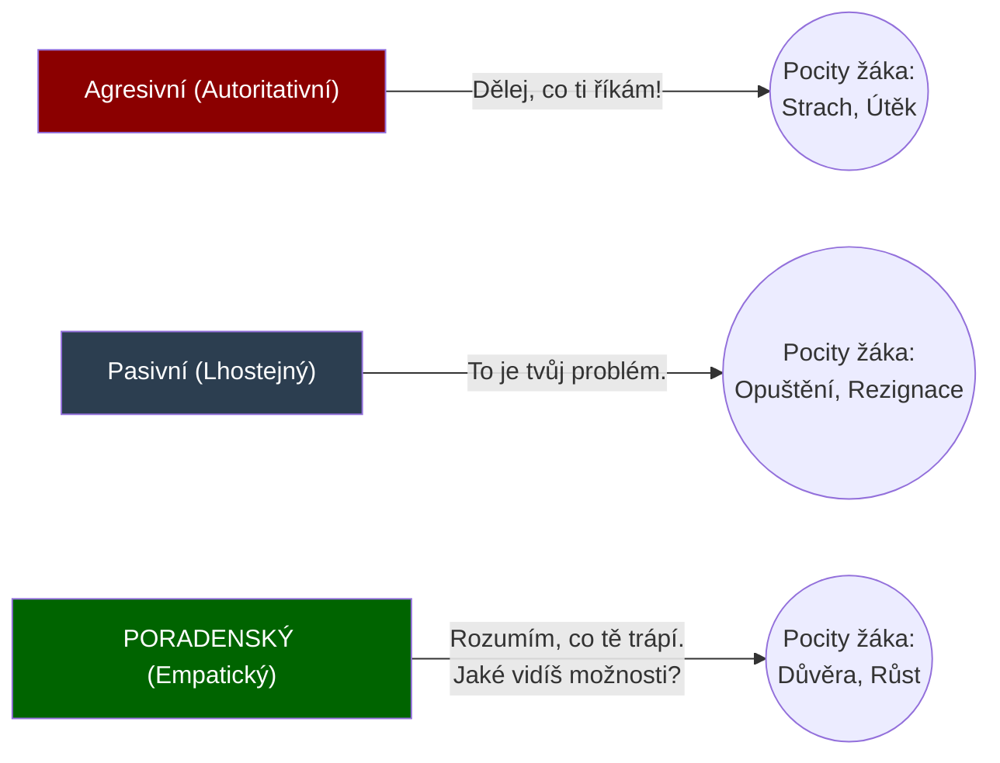
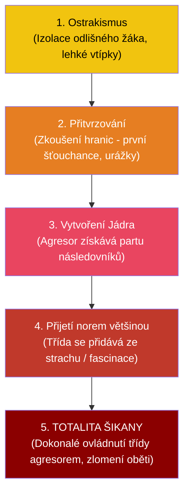

# PSY 23–25: Učitel jako poradce a Poruchy socializace (Šikana)

> **TL;DR / Audio Shrnutí:**
> Dobrý učitel se nestará jen o známky, zajímá se i o žáka samotného – funguje v roli **poradce**. Nemá za úkol žáka psychologicky léčit, ale spíše mu pomoci zorientovat se v problému a odkázat ho na odborníka. Přitom se musí vyvarovat moralizování nebo shazování žákových citů. Učitel také musí umět zvolit správnou **metodu výuky**. Pokud třída spí, použije *aktivizující metody*, které žáky vtáhnou do hry (diskuse, problémové učení). A pak je tu temná stránka školy: **Poruchy socializace**. Pokud se žák nenaučí respektovat normy, sklouzává k záškoláctví, krádežím a agresi. Vrcholem této pyramidy je **šikana** – skrytá, rakovinotvorná nemoc třídy, která má svá přesná stádia a kterou učitel nikdy nesmí řešit konfrontací oběti a agresora tváří v tvář!

---

## Znění státnicových otázek
- **[DOB]** **PSY 23:** Učitel v roli poradce, základní kvality a přístup k žákovi, možné chyby, kterých by se měl vyvarovat.
- **[DOB]** **PSY 24:** Pojem metoda výuky, z jakých činností se skládá. Souvislost mezi poznávacími procesy a motivací. Aktivizující metoda a příklady jejího využití.
- **[DOB]** **PSY 25:** Poruchy socializace (lhaní, krádeže, záškoláctví), příčiny a náprava. Agresivní poruchy chování, šikana (průběh, stádia, druhy, prevence).

---

## Klíčové pojmy

- **Učitel - Poradce** — přístup učitele (často v rámci humanistické psychologie C. R. Rogerse), který se snaží empaticky naslouchat a pomáhat žákovi při řešení osobních nebo studijních problémů.
- **Metoda výuky** — záměrná, promyšlená cesta a postup, jakým učitel vede žáky k dosažení vytyčeného výukového cíle.
- **Aktivizující metoda** — metoda, která přesouvá těžiště práce z učitele (který mluví) na žáka (který tvoří, řeší a objevuje). Spouští vnitřní motivaci.
- **Porucha socializace** — stav, kdy si jedinec neosvojil normy chování dané společnosti (nerespektuje zákony, práva druhých). Může se projevit disociálním až antisociálním chováním.
- **Šikana** — záměrné, opakované a nevyprovokované ubližování slabšímu jedinci (fyzické nebo psychické), při kterém je zjevná asymetrie sil.

---

## Detailní rozebrání problematiky

### PSY 23: Učitel v Roli Poradce

Učitel nemá kompetence ani vzdělání klinického psychologa. Jeho poradenská role spočívá v **První pomoci**.

**Základní kvality (Dle C. R. Rogerse):**
1. *Empatie:* Schopnost vcítit se do pocitů žáka (vidět svět jeho očima).
2. *Kongruence (Opravdovost):* Učitel si na nic nehraje, neskrývá se za masku "Drsného Mistra", mluví narovinu.
3. *Bezpodmínečné přijetí:* Učitel respektuje žáka jako člověka, i když s jeho chováním nesouhlasí.

**Časté chyby učitele – Čemu se vyvarovat:**
- **Moralizování:** Žák se svěří s problémem (např. krádež v afektu) a učitel ho hned začne kázat: *"Jak jsi to mohl udělat, vždyť ty jsi tak chytrý kluk!"* Žák se okamžitě uzavře.
- **Bagatelizace:** Žák je na dně, protože se rozešel s první láskou. Učitel to shodí: *"Prosím tě, takových ještě bude, soustřeď se na písemku z matiky."* Pro žáka to je v danou chvíli konec světa.
- **Dávání "zaručených" rad:** Učitel řekne: *"Udělej to takhle a bude to dobré."* Pokud to nevyjde, žák svalí vinu na učitele. Poradce má žáka *navést*, aby si na řešení přišel sám.

---

### PSY 24: Metody výuky a Aktivizace

Metoda výuky je spojovacím mostem mezi obsahem (co učím) a žákem. Skládá se z činnosti učitele (zadá problém, řídí diskuzi) a činnosti žáka (řeší, počítá, obhajuje).

**Základní metody vs. Aktivizující:**
- *Tradiční metody:* Monolog (přednáška), Vysvětlování. Žák je pasivní (poslouchá a píše). Vede k rychlé ztrátě *úmyslné pozornosti* a útlumu *poznávacích procesů*.
- *Aktivizující metody:* Zvyšují *vnitřní motivaci* (žák chce přijít věci na kloub).
  1. **Heuristická metoda (Objevování):** Učitel nedá výsledek, ale zadá sérii nápověd, přes které žák k výsledku dojde sám. (Např. E-U-R model).
  2. **Situační metoda (Případová studie):** Třída řeší reálný problém z praxe (Kazuistika). "Jste na stavbě, praskla voda, hlavní uzávěr je zarezlej, co uděláte jako první?"
  3. **Didaktická hra:** Učení hrou (Simulace).

---

### PSY 25: Poruchy socializace a Šikana

Když selže rodina (PSY 18), dítě si neosvojí morálku (PSY 10) a nastupují poruchy socializace.

**Základní poruchy:**
- *Záškoláctví:* Často útěk před stresem (šikana, strach z testu) nebo vliv party. Náprava nespočívá v trestání (to strach zvýší), ale v odhalení příčiny.
- *Krádeže / Lhaní:* U dětí do 6 let (bájení) to je fantazie, na SŠ jde o účelové lhaní (ochrana před trestem, získání prestiže).

**Šikana (Nejnebezpečnější nemoc školy):**
Není to běžná rvačka dvou rovnocenných kluků! Je to cílené, opakované ničení slabšího, ze kterého má agresor potěšení.

**Pět stádií šikany (Michal Kolář):**
1. *Zrod ostrakismu:* Objeví se neoblíbený žák (odlišnost). Třída si z něj občas udělá lehkou legraci. Pokud učitel nezakročí, posouvá se to dál.
2. *Fyzické a psychické přitvrzování:* Dojde k první fackám nebo drsnému ponižování ze strany agresora (zkoušení hranic).
3. *Vytvoření jádra:* Agresor k sobě strhne 2-3 přívržence. Šikana začíná být systematická.
4. *Většina přijímá normy agresorů:* Třída se přidává. I "hodní" žáci začnou oběť ponižovat, aby nevypadli z party, nebo ze strachu, že budou další na řadě. Zlo se stává ve třídě "normou".
5. *Totalita (Dokonalá šikana):* Oběť je zlomená a dokonce začne svou vinu brát na sebe ("Zasloužím si to"). Třída ztratila jakékoliv zbytky empatie.

**Zlaté pravidlo řešení šikany (Pro učitele):**
- **Nிகdy nekonfrontujte agresora a oběť tváří v tvář ve sborovně!** Oběť ze strachu z pomsty řekne: "Byla to jen legrace, nic se mi nestalo." Agresor se pak oběti po škole krutě pomstí za "žalování".
- Vyšetřování probíhá vždy tajně, odděleně, nejprve u nezúčastněných svědků (tzv. metoda křížového výslechu).

---

## Vizualizace

### Spektrum přístupů učitele k žákovi v problémech

### 5 Stádií vzniku Šikany (Od vtipu k totalitě)

---

## Záludnosti a doplňující otázky

### ❓ 1. Dá se využít Aktivizující metoda u každého tématu v Odborném výcviku?
**Odpověď:** Ne. Heuristika (objevování) je fantastická na rozvoj myšlení (např. při hledání chyby v zapojení kabelů), ale je naprosto smrtící a zakázaná u věcí spojených s tvrdou BOZP. Učitel nemůže nechat žáka "samostatně heuristicky objevovat", jak se zapíná soustruh nebo jak se pracuje s formátovací pilou. Kde hrozí smrt nebo zničení drahého stroje, nastupuje tvrdá direktivní metoda (Dril a Instruktáž).

### ❓ 2. Co to znamená, když se při šikaně objevuje tzv. "Nepřímá agrese", a proč je u dívek častější než u chlapců?
**Odpověď:** Chlapci častěji řeší šikanu přímou agresí (fyzické násilí, ničení věcí, vydírání). Nepřímá agrese, typická pro dívčí kolektivy, je mnohem skrytější a zákeřnější. Jde o "sociální vraždu". Zahrnuje pomlouvání za zády, záměrné vyčleňování ze skupiny ("S tebou se nebavíme"), rozšiřování lží na sociálních sítích (kyberšikana) nebo krádeže tajemství. Pro učitele je extrémně těžké ji odhalit, protože nezanechává fyzické modřiny, ale psychiku oběti zničí úplně stejně.

### ❓ 3. Proč oběť šikany v pokročilém stádiu (totalita) často brání svého agresora?
**Odpověď:** Jedná se o hluboký psychologický rozpad osobnosti oběti (podobný tzv. Stockholmskému syndromu). Oběť je vystavena tak dlouhému a intenzivnímu brainwashingu (vymývání mozku) ze strany agresora i celé třídy, že si nakonec zvnitřní pocit své vlastní bezcennosti. Uvěří, že je opravdu k ničemu, hloupá, ošklivá a že si tresty vlastně zaslouží, protože "vytáčí" úžasného agresora (který je hvězdou třídy). Odhalit a vyšetřit takovou šikanu je pro učitele už téměř nemožné a vyžaduje to externí expertní tým.
