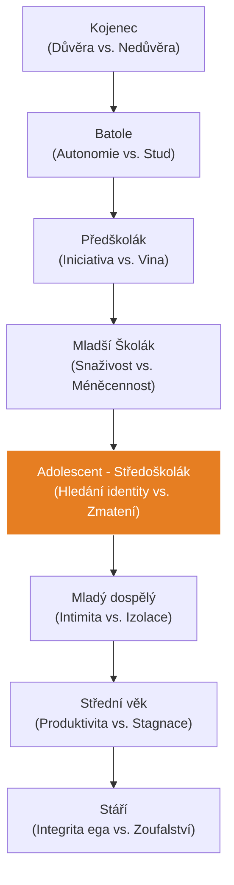
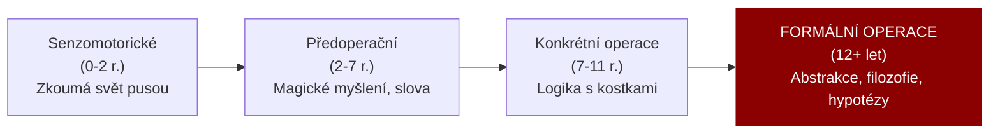

# PSY 26–30: Vývojová psychologie (Od kolébky po hrob)

> **TL;DR / Audio Shrnutí:**
> Člověk není statický kámen, celý život se mění. O tom je **Vývojová psychologie**. Zkoumá, jak ze shluku buněk vyroste člověk, který ve 2 letech bojuje o autonomii ("Já sám!"), v 6 letech je zralý na to udržet tužku a pozornost ve škole (**školní zralost**) a v 15 letech prochází divokou bouří **adolescence** (kdy hledá svou identitu a revoltuje proti rodičům). Tím ale vývoj nekončí! I dospělý člověk řeší krize (profese, rodičovství, krize středního věku) a nakonec se musí vyrovnat se stářím a vlastní smrtelností. Psychologové jako Freud, Erikson a Piaget nám dali „mapy“, jak tímto vývojem mozek, emoce a morálka procházejí. Bez této mapy nemůže učitel učit, protože 10leté dítě prostě nechápe svět stejně jako 16letý dospívající.

---

## Znění státnicových otázek
- **[DOB]** **PSY 26:** Prenatální, novorozenecké a kojenecké období (Piaget, Freud, Erikson). Klíčová témata psychického vývoje. Teorie citové vazby (attachment).
- **[DOB]** **PSY 27:** Batolecí a předškolní období. Klíčová témata tělesného a sociálního vývoje, vývoj řeči a dětské hry.
- **[DOB]** **PSY 28:** Mladší a střední školní věk. Problematika školní zralosti a připravenosti.
- **[DOB]** **PSY 29:** Dospívání (pubescence a adolescence) podle vývojových teorií. Sociální a tělesný vývoj.
- **[DOB]** **PSY 30:** Stádia dospělosti a stáří. Profesní role, krize středního věku, kvalita života (Erikson, postformální myšlení, stadia přijetí smrtelnosti dle Kübler-Rossové).

---

## Klíčové pojmy a Autoři

- **J. Piaget (Kognitivní vývoj):** Zabývá se vývojem *Myšlení*. Jak dítě chápe svět (od hmatání po abstraktní logiku).
- **S. Freud (Psychosexuální vývoj):** Zkoumá přesun *libida* (slasti) v různých obdobích života.
- **E. Erikson (Psychosociální vývoj):** Rozdělil celý život na 8 krizí (konfliktů). Pokud krizi člověk zvládne, posune se; pokud ne, nese si trauma dál.
- **L. Kohlberg (Morální vývoj):** Jak dítě chápe "dobro a zlo" (od strachu z trestu po vlastní svědomí).
- **Attachment (J. Bowlby):** Teorie citové vazby. V prvním roce života se tvoří bezpečné/nebezpečné pouto k matce, které určuje, jak bude člověk tvořit vztahy po zbytek života.
- **Školní zralost:** Biologická (tělo, mozek) a psychologická (emoce, soustředění) připravenost zvládnout požadavky 1. třídy ZŠ.

---

## Detailní rozebrání problematiky (Časová osa života)

### 1. Raná fáze (PSY 26 a 27): Kojenci, Batolata a Předškoláci
- **Prenatální až Kojenec (0–1 rok):** 
  - Tělesně roste raketovým tempem. Tvoří se mozek.
  - *Erikson:* Základní důvěra vs. Nedůvěra ke světu. Pokud matka reaguje na pláč (krmí, chová), vzniká *Bezpečný attachment*. Pokud matka chybí, vzniká deprivace.
  - *Piaget:* Senzomotorická inteligence (svět zkoumá cumláním, úchopem). Trvalost objektu (chápe, že hračka nezmizela, když se zakryje dekou).
- **Batole (1–3 roky):** 
  - Rozvoj řeči a chůze. 
  - *Erikson:* Autonomie vs. Stud. Dítě chce dělat věci samo ("Já sám"). Zkouší hranice, objevuje se období vzdoru. Pokud ho rodiče za vše trestají, vytvoří se stud.
- **Předškolák (3–6 let):** 
  - Vládne **Dětská hra**. Hra není ztráta času! Je to práce dítěte, učí se přes ni sociální role (hra na doktora, na maminku). 
  - *Piaget:* Názorné (předoperační) myšlení. Dítě věří na magii, neumí si v hlavě věci převrátit (egocentrismus – myslí si, že všichni vidí svět jako ono).

### 2. Školní fáze (PSY 28): Mladší a střední školní věk
Zlatý věk dětství (6–12 let).
- **Školní zralost (Kolem 6. roku):**
  - Dítě prochází tzv. *První strukturální proměnou* (prodlouží se nohy, ruka dosáhne přes hlavu na opačné ucho – tzv. Filipínská míra).
  - Mozek zraje k úmyslné pozornosti. Dítě udrží v ruce tužku (jemná motorika) a dokáže se soustředit na nezábavnou práci bez toho, aby po pěti minutách uteklo hrát si.
- **Psychický vývoj:** 
  - *Erikson:* Snaživost vs. Méněcennost. Žák chce získat uznání učitele a rodičů. Pokud ho za špatné známky jen bijí, získá pocit absolutní méněcennosti.
  - *Piaget:* Fáze Konkrétních operací. Dítě už umí logicky počítat, ale potřebuje k tomu jablíčka (názor). Abstraktní písmenka (x, y) nechápe.

### 3. Zlom: Dospívání (PSY 29): Pubescence a Adolescence
Doba přechodu mezi dítětem a dospělým (12–20 let). Pro střední školu a učitele OV absolutně klíčové!
- **Tělesný vývoj:** Bouřlivý hormonální růst, sekundární pohlavní znaky. Tělo je disproporční, objeví se akné, což vede k obrovské nejistotě o vlastním vzhledu.
- **Psychický vývoj:**
  - *Piaget:* Fáze Formálních (abstraktních) operací. Mozek už nepotřebuje obrázky, umí filozofovat a pochopí algebraické rovnice a hypotézy.
  - *Erikson:* Hledání identity vs. Zmatení rolí. "Kdo jsem? Kam patřím?"
- **Sociální vývoj:** Dochází k *emancipaci* (revoltě) od rodiny. Názor rodičů přestává být platný, hlavní je názor "Party" (vrstevnické skupiny).

### 4. Dospělost a Stáří (PSY 30)
Vývoj nekončí maturitou.
- **Mladá dospělost (20–30 let):** *Erikson:* Intimita vs. Izolace. Hledání trvalého partnera.
- **Střední dospělost (30–45 let):** Budování kariéry, rodiny. Kolem 40. roku přichází **Krize středního věku** (Bilancování: Jsem tam, kde jsem chtěl být? Často doprovázeno rozvody nebo změnou profese). *Kohlberg:* Postkonvenční morálka (Rozhoduji se už jen podle vlastního svědomí, ne podle zákonů).
- **Pozdní dospělost a Stáří (65+ let):** Úbytek tělesných a mentálních sil. 
  - *Erikson:* Integrita ega vs. Zoufání. (Smířil jsem se se svým životem, nebo mám pocit, že to celé bylo zbytečné?).
  - **Fáze umírání (E. Kübler-Rossová):** Když člověk zjistí blížící se smrt, projde 5 fázemi: 1. Popírání ("To není pravda"), 2. Hněv ("Proč zrovna já?!"), 3. Smlouvání ("Bože, když se vyléčím, budu pomáhat."), 4. Deprese, 5. **Smíření** (Akceptace).

---

## Vizualizace

### 8 fází vývoje osobnosti podle E. Eriksona

### Kognitivní (myšlenkový) vývoj podle Piageta

---

## Záludnosti a doplňující otázky

### ❓ 1. Co se stane, když dítě nevytvoří v prvním roce života bezpečnou vazbu (Attachment) s matkou (např. vyrůstá v ústavu s měnícími se sestrami)?
**Odpověď:** Vzniká obrovský psychologický deficit. Dítě si vytvoří tzv. úzkostný nebo vyhýbavý attachment. Následky si nese do celého života: jako adolescent nebude věřit učitelům, bude mít problém navázat trvalý milostný vztah, bude neustále žárlit nebo se naopak lidem emocionálně vyhýbat, protože podvědomě věří, že svět je nepřátelské místo, kde ho všichni nakonec opustí.

### ❓ 2. Co je to tzv. Postformální myšlení v dospělosti a proč ho Piaget neřešil?
**Odpověď:** Piaget skončil s vývojem u dospívajících (Formální abstraktní myšlení - chápání čisté logiky: 1+1=2). V reálném životě dospělého člověka ale čistá logika nefunguje (svět je plný kompromisů, emocí a nejasných řešení). Až psychologové po Piagetovi popsali tzv. *Postformální myšlení*. Je to myšlení zralého dospělého, které umí pracovat s paradoxem, s intuicí a ví, že na složitý problém (např. rozvod) neexistuje jedno jediné absolutně "správné" řešení.

### ❓ 3. Proč je adolescence označována za "nejtěžší období pro rodiče i učitele"?
**Odpověď:** Dospívající musí zvládnout dva obrovské psychologické úkoly. Zaprvé: najít odpověď na otázku "Kdo jsem?". Zadruhé: oddělit se od rodiny. Aby to dokázal, musí začít zpochybňovat všechna pravidla, která mu rodina (a škola) dala. Vytváří si vlastní morální žebříček. Pokud na tuto "revoltu" učitel (nebo rodič) zareaguje zvýšenou agresí a příkazy z pozice moci, adolescent se zcela odstřihne. Učitel se musí přesunout z role "nadřízeného velitele" do role "dospělého parťáka/facilitátora", který sice drží hranice bezpečnosti, ale respektuje názor adolescenta.
